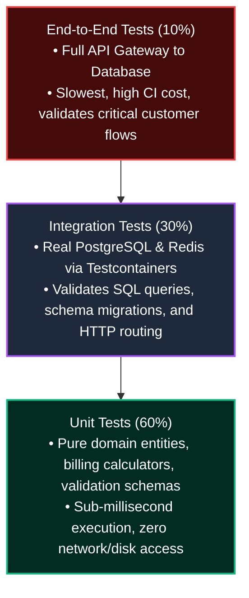
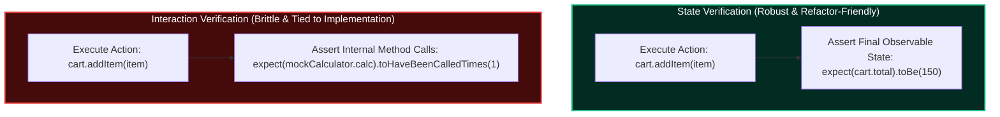
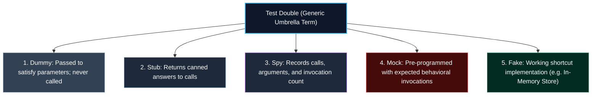
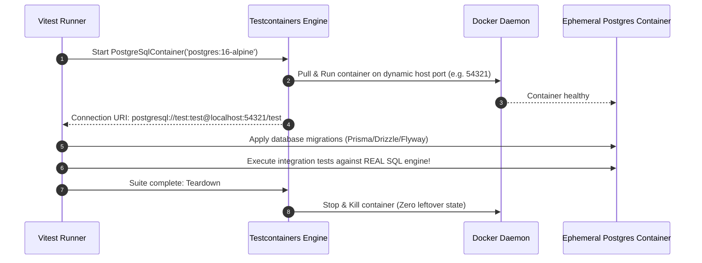
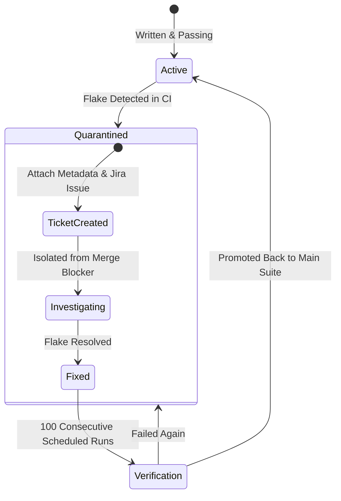

import { Callout } from 'fumadocs-ui/components/callout';
import { Tabs, Tab } from 'fumadocs-ui/components/tabs';
import { Steps, Step } from 'fumadocs-ui/components/steps';
import { Cards, Card } from 'fumadocs-ui/components/card';

Testing in distributed backend systems is often misunderstood. Teams frequently fall into one of two extremes: writing brittle unit tests that mock every internal function and pass even when production is completely broken, or relying exclusively on slow, flaky end-to-end tests that take 45 minutes to run in CI.

Professional backend engineering requires a disciplined balance: **precise unit testing for business logic**, **state verification over brittle mock interactions**, **deterministic clock injection**, **realistic integration tests using real ephemeral databases**, **flaky test quarantine governance**, and **mutation testing**.

---

## 1. The Modern Backend Testing Pyramid

The testing pyramid models the ratio of test types needed to maximize confidence while keeping test suite execution time under 3 minutes:



### Trade-Off Breakdown

| Dimension | Unit Tests | Integration Tests | End-to-End (E2E) Tests |
| :--- | :--- | :--- | :--- |
| **Execution Speed** | $\approx 1\text{ms}$ per test | $50\text{ms} - 300\text{ms}$ per test | $2\text{s} - 30\text{s}$ per test |
| **Dependencies** | None (pure in-memory logic) | Ephemeral Docker containers (DB, Redis) | Deployed staging cluster |
| **What It Catches** | Algorithmic flaws, edge cases, math bugs | SQL syntax errors, foreign key violations, transactions | Network misconfigurations, auth gateway failures |
| **Refactoring Resilience** | Low if tied to private methods; High if testing domain | **Highest** (tests contracts against real databases) | Medium (frequently flaky due to timing) |

---

## 2. State Verification vs. Interaction Verification

A foundational insight formulated by Martin Fowler (*"Mocks Aren't Stubs"*) is the distinction between **State Verification** and **Interaction Verification**:



### Why Interaction Verification Makes Tests Brittle

Consider an e-commerce order service. A test using interaction verification checks the *exact internal choreography*:

```typescript
// BRITTLE INTERACTION VERIFICATION
it('processes payment', async () => {
  await orderService.checkout(order);
  
  // Checking exact internal collaborator invocations:
  expect(mockPaymentGateway.charge).toHaveBeenCalledTimes(1);
  expect(mockLedger.recordTransaction).toHaveBeenCalledTimes(1);
  expect(mockEmailClient.sendReceipt).toHaveBeenCalledWith(order.customerEmail);
});
```

If you refactor the order service to batch ledger records or defer email delivery to an asynchronous queue worker, **this test fails immediately**, even though the public behavior and output of the service are completely correct!

### Why State Verification Provides True Refactoring Freedom

State verification asserts **what the system does**, not **how it does it**:

```typescript
// ROBUST STATE VERIFICATION
it('decrements balance and sets order to paid', async () => {
  const result = await orderService.checkout(order);

  // Assert observable state and return values:
  expect(result.status).toBe('PAID');
  expect(account.balance).toBe(50);
});
```

You can completely rewrite the internal algorithms, swap libraries, or restructure private methods; as long as the inputs yield the correct outputs and state transitions, your tests pass.

---

## 3. Test Doubles Taxonomy: Gerard Meszaros' Definitions

Developers often use the word "mock" as a catch-all term for any test double. However, the xUnit Test Patterns taxonomy defines five distinct test doubles with completely different responsibilities:



### 1. Dummy
Used purely to satisfy type systems or method signatures. It is never actually invoked.
```typescript
const dummyEmailService: EmailService = {
  sendEmail: () => { throw new Error('Should never be called'); }
};
const cart = new ShoppingCart(dummyEmailService);
```

### 2. Stub
Provides pre-canned answers to method calls made during the test.
```typescript
const exchangeRateStub = {
  getRate: (from: string, to: string) => Promise.resolve(1.25), // Fixed rate
};
```

### 3. Spy
Wraps real or stubbed implementations to record how many times a method was called and with what arguments.
```typescript
const auditLogSpy = vi.fn();
await userService.deleteUser('usr_123');
expect(auditLogSpy).toHaveBeenCalledWith('usr_123', 'USER_DELETED');
```

### 4. Mock
Pre-programmed with expectations of the calls it should receive, failing the test if unexpected calls occur. Mocks test **behavior and interactions**, not state.
```typescript
const paymentGatewayMock = {
  charge: vi.fn().mockImplementation((amount) => {
    if (amount <= 0) throw new Error('Invalid amount');
    return Promise.resolve({ success: true });
  }),
};
```

### 5. Fake
A genuine, working implementation that takes a shortcut not suitable for production (e.g. an in-memory hash map repository instead of a Postgres database).
```typescript
export class FakeUserRepository implements UserRepository {
  private users = new Map<string, User>();

  async findById(id: string): Promise<User | null> {
    return this.users.get(id) ?? null;
  }

  async save(user: User): Promise<void> {
    this.users.set(user.id, user);
  }
}
```

---

## 4. Deterministic Testing & Clock Injection

One of the most prolific sources of flaky, slow tests is testing time-dependent behavior with `sleep`:

```typescript
// TOXIC ANTI-PATTERN: Sleeping inside tests
it('expires session after 1 second', async () => {
  sessionManager.createSession('token-123');
  await new Promise((r) => setTimeout(r, 1100)); // Sluggish, non-deterministic!
  expect(sessionManager.isValid('token-123')).toBe(false);
});
```

In a CI environment under high CPU load, an `1100ms` sleep might wake up at `1080ms` (causing false test failures) or drag suite execution time out to 15 minutes.

### The Solution: Injecting a Virtual `Clock` Interface

Decouple business logic from the hardware wall clock by injecting a virtual `Clock`:

```typescript
// 1. Clock abstraction
export interface Clock {
  now(): Date;
}

// Production wall-clock
export class SystemClock implements Clock {
  now(): Date { return new Date(); }
}

// Test virtual clock with manual time advancement
export class FakeClock implements Clock {
  private currentTime: Date;

  constructor(initialTime = new Date('2026-01-01T00:00:00Z')) {
    this.currentTime = initialTime;
  }

  now(): Date { return new Date(this.currentTime.getTime()); }

  advance(ms: number): void {
    this.currentTime = new Date(this.currentTime.getTime() + ms);
  }
}
```

### Token Bucket Rate Limiter Tested in 0 Milliseconds

```typescript
// RateLimiter using Clock injection
export class TokenBucketRateLimiter {
  private tokens = 10;
  private lastRefill: number;

  constructor(private clock: Clock) {
    this.lastRefill = this.clock.now().getTime();
  }

  consume(): boolean {
    const now = this.clock.now().getTime();
    const elapsedSeconds = (now - this.lastRefill) / 1000;
    
    // Refill 1 token per second
    this.tokens = Math.min(10, this.tokens + elapsedSeconds);
    this.lastRefill = now;

    if (this.tokens >= 1) {
      this.tokens -= 1;
      return true;
    }
    return false;
  }
}

// Deterministic test running in 0.1ms:
it('refills tokens after time advances without sleeping', () => {
  const clock = new FakeClock();
  const limiter = new TokenBucketRateLimiter(clock);

  // Consume all 10 tokens
  for (let i = 0; i < 10; i++) limiter.consume();
  expect(limiter.consume()).toBe(false); // Rate limit exceeded!

  // Instantly jump 5 seconds into the future:
  clock.advance(5000);

  // Exactly 5 tokens replenished!
  expect(limiter.consume()).toBe(true);
});
```

---

## 5. Integration Testing with Real Dependencies: Testcontainers

Instead of using in-memory SQLite (which lacks PostgreSQL features like `JSONB`, `RETURNING *`, partial indexes, and advisory locks), modern backend test suites use **Testcontainers**.

Testcontainers spins up genuine Docker containers (PostgreSQL, Redis, Kafka) on random ports during test execution and automatically removes them when the process exits.



### Production Vitest + Testcontainers Implementation

```typescript
// user-repository.integration.test.ts
import { describe, it, expect, beforeAll, afterAll, beforeEach } from 'vitest';
import { PostgreSqlContainer, StartedPostgreSqlContainer } from '@testcontainers/postgresql';
import { Pool } from 'pg';

describe('UserRepository Database Integration', () => {
  let container: StartedPostgreSqlContainer;
  let pool: Pool;

  // 1. Launch real PostgreSQL container before running tests
  beforeAll(async () => {
    container = await new PostgreSqlContainer('postgres:16-alpine')
      .withDatabase('testdb')
      .withUsername('testuser')
      .withPassword('testpass')
      .start();

    pool = new Pool({ connectionString: container.getConnectionUri() });

    // 2. Run real schema migration
    await pool.query(`
      CREATE TABLE users (
        id UUID PRIMARY KEY DEFAULT gen_random_uuid(),
        email VARCHAR(255) UNIQUE NOT NULL,
        created_at TIMESTAMPTZ DEFAULT NOW()
      );
    `);
  }, 30000); // 30s timeout for initial Docker pull

  afterAll(async () => {
    await pool.end();
    await container.stop(); // Cleans up Docker container automatically
  });

  beforeEach(async () => {
    // Truncate between tests for isolation
    await pool.query('TRUNCATE TABLE users;');
  });

  it('enforces unique email constraint at the database layer', async () => {
    const email = 'alex@example.com';

    // First insert succeeds
    await pool.query('INSERT INTO users (email) VALUES ($1)', [email]);

    // Second insert with duplicate email MUST throw standard Postgres 23505 error
    await expect(
      pool.query('INSERT INTO users (email) VALUES ($1)', [email])
    ).rejects.toThrowError(/duplicate key value violates unique constraint/);
  });
});
```

---

## 6. Simulation: The TDD Red-Green-Refactor Lifecycle

Test-Driven Development (TDD) is an architectural feedback loop designed by Kent Beck. You never write production code without first writing an automated test that fails for the right reason.

<Tabs items={['Phase 1: RED (Failing Test)', 'Phase 2: GREEN (Minimal Code)', 'Phase 3: REFACTOR (Design Clean)', 'Phase 4: Verification']}>
  <Tab value="Phase 1: RED (Failing Test)">
    **Write a test defining the exact specification before writing the code:**

    ```typescript
    // test/order-discount.test.ts
    describe('calculateDiscount', () => {
      it('applies 15% discount for orders over $100 for premium members', () => {
        const order = { totalAmount: 120, isPremiumMember: true };
        const discount = calculateDiscount(order);
        expect(discount).toBe(18); // 15% of 120 = 18
      });
    });
    ```

    Run the test:
    ```
    FAIL: ReferenceError: calculateDiscount is not defined
    ```
    *The test is RED. We have confirmed the test fails when the feature does not exist.*
  </Tab>

  <Tab value="Phase 2: GREEN (Minimal Code)">
    **Write the simplest code possible to make the test pass:**

    ```typescript
    // src/order-discount.ts
    export function calculateDiscount(order: { totalAmount: number; isPremiumMember: boolean }): number {
      if (order.isPremiumMember && order.totalAmount > 100) {
        return order.totalAmount * 0.15;
      }
      return 0;
    }
    ```

    Run the test:
    ```
    PASS: test/order-discount.test.ts
    Tests: 1 passed, 1 total
    ```
    *The test is GREEN. The behavior works as specified.*
  </Tab>

  <Tab value="Phase 3: REFACTOR (Design Clean)">
    **Improve structure, remove magic numbers, and enhance typing while tests remain GREEN:**

    ```typescript
    // src/order-discount.ts
    const PREMIUM_DISCOUNT_RATE = 0.15;
    const DISCOUNT_THRESHOLD = 100;

    export interface OrderSummary {
      totalAmount: number;
      isPremiumMember: boolean;
    }

    export function calculateDiscount(order: OrderSummary): number {
      const qualifies = order.isPremiumMember && order.totalAmount > DISCOUNT_THRESHOLD;
      return qualifies ? order.totalAmount * PREMIUM_DISCOUNT_RATE : 0;
    }
    ```

    Run the test again:
    ```
    PASS: All tests still green!
    ```
    *Refactoring under green tests guarantees zero unintended regressions.*
  </Tab>

  <Tab value="Phase 4: Verification">
    **Add edge cases and boundary tests:**

    ```typescript
    it('returns 0 discount if total is exactly $100', () => {
      expect(calculateDiscount({ totalAmount: 100, isPremiumMember: true })).toBe(0);
    });

    it('returns 0 discount for non-premium members regardless of total', () => {
      expect(calculateDiscount({ totalAmount: 500, isPremiumMember: false })).toBe(0);
    });
    ```
  </Tab>
</Tabs>

---

## 7. Flaky Tests & The Quarantine Pattern

A **flaky test** is a test that passes or fails non-deterministically without any code changes (often due to race conditions, wall-clock timing assumptions, or un-isolated database state).

Flaky tests are cancerous to engineering organizations:
- Developers lose faith in the CI suite and habitually hit "Re-run Job".
- Real production regressions slip into main branches because failures are dismissed as "just that flaky test again".



### The Quarantine Lifecycle

1. **Immediate Isolation**: The moment a test exhibits flakiness, quarantine it immediately. It is moved to a quarantined test runner that runs in CI but **does not block pull request merges**.
2. **Mandatory Metadata Tagging**: Every quarantined test must include tracking metadata:
   ```typescript
   // test/payment.spec.ts
   describe.skipIf(process.env.CI_STRICT)('Payment Gateway Webhook', () => {
     /**
      * @quarantined
      * @ticket BACKEND-4921
      * @owner team-billing
      * @date 2026-03-15
      * @expiry 2026-03-29 (Will be deleted if not fixed within 14 days)
      */
     it('handles out-of-order webhook delivery', async () => { ... });
   });
   ```
3. **Scheduled Verification**: The quarantine suite runs on an isolated cron every hour. Once fixed, it must pass 100 consecutive executions before being promoted back into the primary PR gating pipeline.

---

## 8. Mutation Testing & Cyclomatic Complexity

### Why 100% Code Coverage is a Vanity Metric

Standard code coverage measures only **which lines of code were executed by the CPU**, not whether your assertions verified the correctness of that execution:

```typescript
function calculateTaxes(income: number): number {
  if (income > 50000) return income * 0.30;
  return income * 0.15;
}

// 100% LINE COVERAGE WITH ZERO REAL ASSERTIONS!
it('calculates taxes', () => {
  calculateTaxes(60000); // Executes line 2
  calculateTaxes(30000); // Executes line 3
  // Notice: NO expect() assertions! 100% coverage, 0% validation!
});
```

### Mutation Testing: The Ultimate Truth (Stryker)

**Mutation Testing** tools (e.g. Stryker Mutator) inject synthetic bugs into your source code and re-run your test suite:

```
Mutations injected into calculateTaxes:
1. Mutator flips condition: if (income <= 50000)
2. Mutator mutates math:    return income / 0.30;
3. Mutator removes branch:  return 0;

Expected Result:
Your test suite MUST FAIL when running against the mutant!
- If a test fails: The mutant was KILLED (High test quality).
- If tests still pass: The mutant SURVIVED (Missing or weak assertion!).
```

$$\text{Mutation Score} = \frac{\text{Killed Mutants}}{\text{Total Mutants}} \times 100\%$$

A test suite with 80% mutation score is exponentially more trustworthy than one with 100% naive line coverage.

### Cyclomatic Complexity ($M$)

Developed by Thomas McCabe, **Cyclomatic Complexity** measures the number of linearly independent paths through program source code:

$$M = E - N + 2P$$

Where $E$ is edges, $N$ is decision nodes, and $P$ is connected components. Practically, each `if`, `else`, `case`, `while`, and `&&` increment complexity.

| Complexity Score ($M$) | Risk Level | Minimum Tests Required | Action |
| :--- | :--- | :--- | :--- |
| **1 – 10** | Low Risk | $1 - 10$ test cases | Simple, easily testable procedure. |
| **11 – 20** | Moderate Risk | $11 - 20$ test cases | Refactor into smaller sub-functions. |
| **21 – 50** | High Risk | $21 - 50$ test cases | Untestable; high defect density. Split immediately. |
| **$> 50$** | Untestable | $> 50$ test cases | Complete architectural refactor required. |

---

## 9. Summary & Testing Principles

<Cards>
  <Card
    title="State Over Interaction"
    description="Assert observable outcomes and final system state rather than verifying internal collaborator method calls, unlocking true refactoring freedom."
  />
  <Card
    title="Inject Virtual Clocks"
    description="Never sleep in tests. Inject a Clock or TimeProvider interface to test rate limiters and cache expirations deterministically in sub-millisecond time."
  />
  <Card
    title="Testcontainers for Integration"
    description="Run genuine, ephemeral PostgreSQL and Redis Docker containers in CI to validate real SQL dialects, constraints, and ACID transactions."
  />
  <Card
    title="Mutation Testing"
    description="Measure test suite veracity using mutation testing (Stryker) to verify tests kill intentionally introduced code mutations rather than relying on vanity line coverage."
  />
</Cards>
