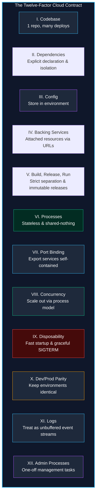
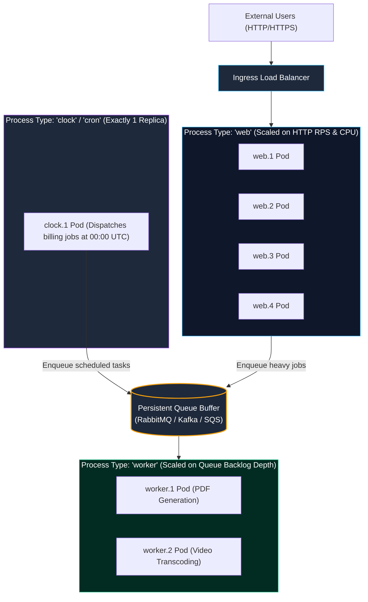
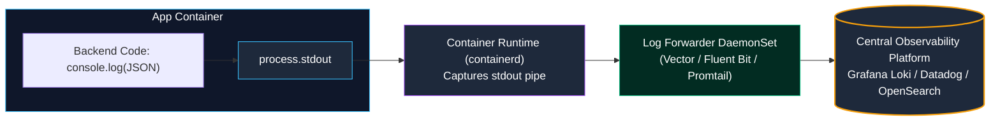
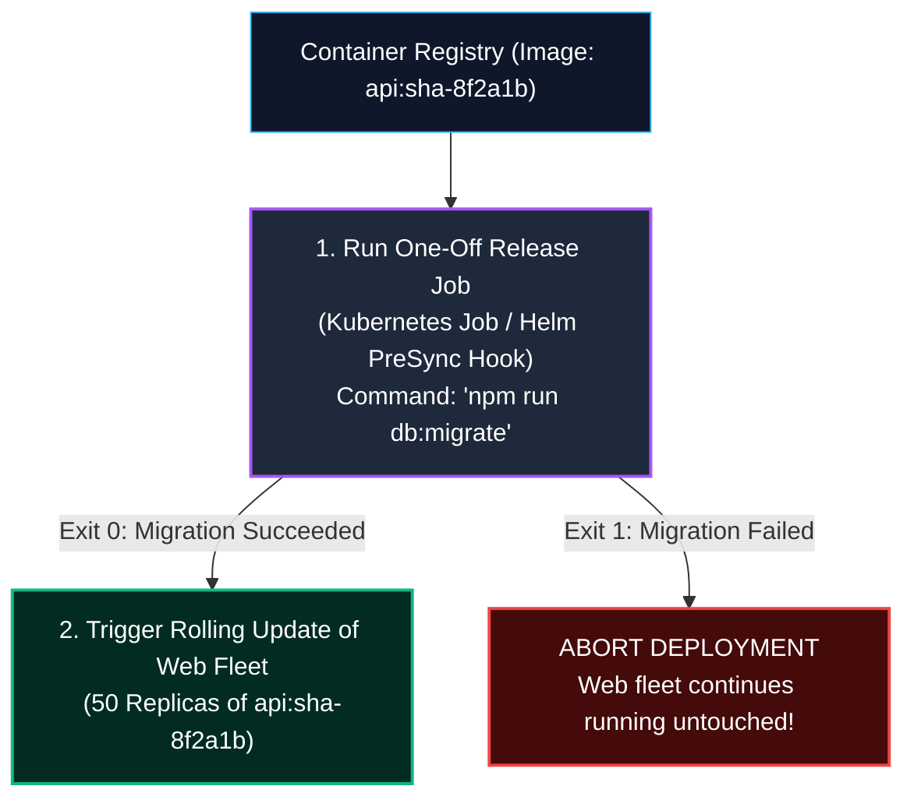
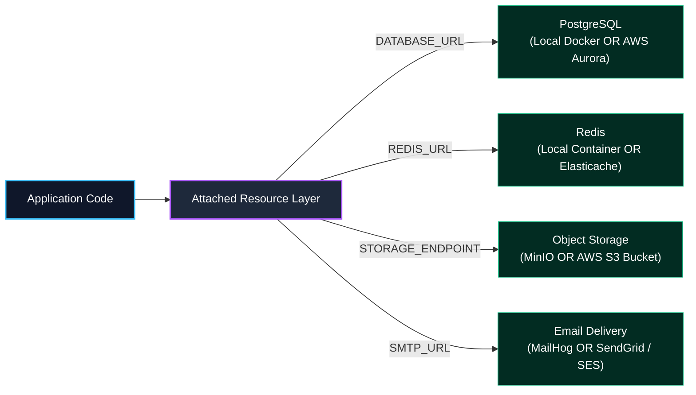

import { Callout } from 'fumadocs-ui/components/callout';
import { Tabs, Tab } from 'fumadocs-ui/components/tabs';
import { Steps, Step } from 'fumadocs-ui/components/steps';
import { Cards, Card } from 'fumadocs-ui/components/card';

Published in 2011 by Adam Wiggins and the engineering team at Heroku, **The Twelve-Factor App** methodology establishes the foundational contract between software architecture and cloud infrastructure.

Whether deploying containers to Kubernetes, orchestrating serverless tasks on AWS Lambda, or scaling fleets on Nomad, adhering to these twelve principles guarantees that applications remain **declarative**, **portable**, **horizontally scalable**, and **resilient to spontaneous node terminations**.

---

## 1. The Twelve Factors Architecture Map



---

## 2. Complete Twelve-Factor Breakdown

| Factor | Name | Principle | Anti-Pattern to Avoid |
| :--- | :--- | :--- | :--- |
| **I** | **Codebase** | One codebase tracked in version control, many deploys (dev, staging, prod). | Multiple apps sharing one repo without clear modular boundaries, or branch-per-customer codebases. |
| **II** | **Dependencies** | Explicitly declare and isolate all dependencies (`package.json`, `poetry.lock`, `go.mod`). | Relying on system-wide globally installed libraries (`curl`, `imagemagick`). |
| **III** | **Config** | Store configuration in environment variables, strictly separate from source code. | Committing `.env` or hardcoding credentials into Git repositories. |
| **IV** | **Backing Services** | Treat databases, caches, and SMTP gateways as attached resources identified by URIs. | Distinguishing between local MySQL and cloud Amazon RDS in application code. |
| **V** | **Build, Release, Run** | Strictly separate build, release, and runtime stages. Every release has a unique, immutable ID. | Editing source code directly on a live production server. |
| **VI** | **Processes** | Execute the app as one or more stateless, shared-nothing processes. | Storing in-memory session state or saving uploaded user files to the local container disk. |
| **VII** | **Port Binding** | The app is completely self-contained and exports HTTP/gRPC services by binding to a port. | Injecting PHP/Python scripts into an externally managed Apache HTTP server container. |
| **VIII** | **Concurrency** | Scale out horizontally by multiplying lightweight OS processes (web, worker, clock). | Relying on vertical thread pools that max out a single machine's RAM and CPU. |
| **IX** | **Disposability** | Fast startup (sub-second) and graceful shutdown when receiving `SIGTERM` signals. | Crashing abruptly, corrupting database transactions, or hanging when orchestrators restart pods. |
| **X** | **Dev/Prod Parity** | Keep development, staging, and production as identical as possible in time, tools, and tech. | Using SQLite locally in development but PostgreSQL in production. |
| **XI** | **Logs** | Treat logs as an unbuffered event stream written directly to `stdout`/`stderr`. | Routing logs to local disk files (`/var/log/app.log`) with custom log rotation daemons. |
| **XII** | **Admin Processes** | Run administrative and migration tasks as one-off processes in an identical environment. | Running database migrations manually via ad-hoc SSH terminal sessions. |

---

## 3. Simulation: Build, Release, Run & Disposability

The boundary between **Build**, **Release**, and **Run** guarantees repeatable, zero-downtime rollbacks:

<Tabs items={['Stage 1: Build Phase', 'Stage 2: Release Phase (Config Merge)', 'Stage 3: Run Phase (Immutable Container)', 'Stage 4: Disposability (SIGTERM Handling)']}>
  <Tab value="Stage 1: Build Phase">
    **Compiles source code into an immutable binary artifact:**

    ```
    Source Code (commit a7f92b) + package.json + lockfile
                      |
                      v (Docker build / Bun build)
    Compiled Build Artifact (SHA: sha256:88941abc...)
    ```

    The build stage compiles TypeScript, bundles assets, and packages vendor dependencies. **Zero runtime environment variables are baked in here.**
  </Tab>

  <Tab value="Stage 2: Release Phase (Config Merge)">
    **Merges the build artifact with environment-specific configuration:**

    ```
    Build Artifact (sha256:88941abc) + Production Env Vars
                      |
                      v
    Release v42: [ sha256:88941abc + DATABASE_URL=pg://prod-db... ]
    ```

    Every release is an **immutable snapshot**. If release `v42` causes errors, roll back instantly to `v41` without recompiling code!
  </Tab>

  <Tab value="Stage 3: Run Phase (Immutable Container)">
    **Executes processes in an isolated environment:**

    ```bash
    $ uvicorn app.main:app --host 0.0.0.0 --port $PORT
    # OR
    $ node dist/server.js
    ```

    The process binds to the port provided by the cloud platform environment variable `$PORT` (Factor VII: Port Binding).
  </Tab>

  <Tab value="Stage 4: Disposability (SIGTERM Handling)">
    **The orchestrator (Kubernetes / AWS ECS) replaces the pod:**

    ```mermaid
    sequenceDiagram
        autonumber
        participant K8s as Orchestrator (Kubelet)
        participant App as Backend Process
        participant DB as PostgreSQL Database

        K8s->>App: Sends SIGTERM signal (Grace period: 30s)
        Note over App: 1. Stop accepting new HTTP connections
        Note over App: 2. Wait for pending requests to finish
        App->>DB: 3. Drain and close connection pool
        App-->>K8s: Process exits cleanly with status code 0
        Note over K8s: Pod terminated cleanly with zero dropped requests!
    ```
  </Tab>
</Tabs>

---

## 4. Deep Dive: Factor VIII - Concurrency & Independent Process Scaling

Classical server architectures attempted to handle diverse workloads inside a single monolithic process using internal threading pools. For example, an application process would simultaneously accept incoming HTTP traffic, render PDF exports, and process credit card webhooks.

Twelve-Factor applications embrace the **Unix process model**. Different workloads are assigned to distinct **process types**, each scaling completely independently:



### The Architectural Benefits of Process Separation

1. **Independent Autoscaling Metrics**:
   - The `web` fleet scales dynamically based on incoming HTTP request volume or CPU utilization.
   - The `worker` fleet scales dynamically based on **queue backlog depth** (e.g. scale up when unprocessed queue items $> 500$).
2. **Failure Isolation**: If a 100MB PDF generation task causes an Out-Of-Memory (OOM) crash in a `worker` pod, the `web` processes handling user logins are completely untouched.
3. **Hardware Specialization**: In Kubernetes, `worker` pods can be scheduled onto high-memory or GPU-accelerated node pools, while lightweight `web` pods run on cost-effective commodity compute.

---

## 5. Deep Dive: Factor X - Dev/Prod Parity & The Database Trap

Historically, applications diverged widely between local development laptops and production cloud servers:

```
+-----------------------------------------------------------------------------------+
| THE THREE DEV/PROD GAPS                                                           |
+-----------------------------------------------------------------------------------+
| 1. The Time Gap:      Developer writes code -> Deployed months later.             |
| 2. The Personnel Gap: Developers write code -> Operations engineers deploy it.   |
| 3. The Tools Gap:     Local: SQLite & Memcached -> Prod: PostgreSQL & Redis Cluster|
+-----------------------------------------------------------------------------------+
```

Twelve-Factor mandates keeping the **tools gap** as close to zero as technically possible.

### Why SQLite Locally vs. PostgreSQL in Production Causes Silent Disasters

Developers are often tempted to use lightweight SQLite in local development because it requires zero installation:

```
// DANGEROUS DEV SHORTCUT
const db = process.env.NODE_ENV === 'production' 
  ? new PostgresPool(...) 
  : new SqliteDatabase('./dev.sqlite');
```

This shortcut leads directly to catastrophic production failures:

| Scenario | SQLite (Local Development) | PostgreSQL (Production) | The Production Disaster |
| :--- | :--- | :--- | :--- |
| **Concurrency Locking** | Locks the **entire database file** on writes. | Multi-Version Concurrency Control (MVCC) with row-level locks. | Code tested locally with zero concurrency deadlocks fails under 50 concurrent prod users. |
| **Type Coercion** | Dynamically typed. Inserting `"abc"` into an `INTEGER` column succeeds silently! | Strictly typed. Throws `22P02 invalid input syntax for integer`. | Forms accept bad data in staging; production crashes immediately. |
| **JSON Operations** | Basic `json_extract()` string matching. | Advanced binary `JSONB` with GIN indexing and operators (`?&`, `@>`). | Complex queries pass locally but fail with syntax errors in production. |
| **Case Sensitivity** | `LIKE` is case-insensitive for ASCII text by default. | `LIKE` is strictly case-sensitive; requires `ILIKE`. | User searches return expected records locally, but return 0 records in production! |

### Modern Parity via Docker & Testcontainers

Modern tooling eliminates all excuses for tools disparity. With Docker Compose and Testcontainers, every developer runs the exact same PostgreSQL 16 image locally that powers production RDS clusters.

---

## 6. Deep Dive: Factor XI - Logs as Unbuffered Event Streams

In traditional system administration, applications configured logging frameworks (Log4j, Winston, Python logging) to append messages to local disk files:

```bash
# ANTI-PATTERN: Application manages log files on local disk
/var/log/my-app/production.log
/var/log/my-app/production-2026-03-01.log.gz # Rotated by logrotate daemon
```

### Why Local File Logging Breaks in the Cloud

1. **Ephemeral Disks**: In Kubernetes and serverless platforms, containers are killed and replaced constantly. Any log written to local disk is permanently destroyed upon pod termination.
2. **Disk Exhaustion**: Unrotated logs fill up local container overlay filesystems, triggering eviction by the kubelet.
3. **No Centralized Search**: Troubleshooting an error across 200 autoscaled pods requires manually SSHing into 200 individual nodes.

### The Twelve-Factor Standard: `stdout` and `stderr`

A Twelve-Factor application **never routes or stores its own log files**. The application simply writes formatted log events as an unbuffered stream directly to standard output:



### Production Structured Logging (TypeScript)

Emitting logs as single-line JSON strings enables instant indexing, trace correlation, and automated filtering:

```typescript
function logEvent(level: 'INFO' | 'WARN' | 'ERROR', message: string, context?: Record<string, any>) {
  const logEntry = {
    timestamp: new Date().toISOString(),
    level,
    message,
    traceId: context?.traceId,
    spanId: context?.spanId,
    ...context,
  };
  
  // Direct unbuffered write to stdout:
  process.stdout.write(JSON.stringify(logEntry) + '\n');
}
```

---

## 7. Deep Dive: Factor XII - Admin & Migration Processes

Backend services routinely require one-off administrative and maintenance tasks:
- Running database schema migrations (e.g. `drizzle-kit migrate`, `alembic upgrade head`, `prisma migrate deploy`).
- Running data backfills or fixup scripts.
- Executing an interactive REPL / console to inspect live models.

### The Migration Anti-Pattern

A frequent disaster in Kubernetes deployments is embedding database migrations into the web application's startup script:

```dockerfile
# DISASTROUS ANTI-PATTERN IN ENTRYPOINT SCRIPT
#!/bin/sh
npm run migrate # Running migrations inside container startup
node dist/server.js
```

When Kubernetes performs a rolling update of a 50-pod deployment, **50 pods boot simultaneously and attempt to execute schema migrations concurrently**. This triggers database migration lock deadlocks, corrupted migration histories, and application startup timeouts.

### The Twelve-Factor Standard: One-Off Ephemeral Containers

Admin processes must run as **isolated one-off containers** in an environment identical to the running application (same image, same commit SHA, same environment variables).



```yaml
# In Kubernetes: Database migration declared as an isolated Job
apiVersion: batch/v1
kind: Job
metadata:
  name: db-migration-sha-8f2a1b
spec:
  template:
    spec:
      containers:
        - name: migrate
          image: ghcr.io/acme/backend:sha-8f2a1b
          command: ["npx", "drizzle-kit", "migrate"]
          envFrom:
            - secretRef:
                name: production-secrets
      restartPolicy: Never
  backoffLimit: 1
```

The migration runs to completion in its own container before the web pods ever update. If the migration fails, deployment halts safely without impacting a single user.

---

## 8. Deep Dive: Backing Services as Attached Resources

In a Twelve-Factor application, the code makes no distinction between local and third-party services:



If your primary database suffers a hardware failure, you can repoint the entire fleet to a warm standby replica simply by updating the `DATABASE_URL` environment variable and triggering a new release, **without changing a single line of source code**.

---

## 9. Production Implementation: The Graceful Shutdown Lifecycle

A cloud-native application must be **disposable** (Factor IX). When Kubernetes terminates a container during a rolling update, it sends a `SIGTERM` signal. If your app does not catch this signal, connections terminate abruptly, throwing `502 Bad Gateway` errors to active users:

```typescript
import { createServer } from 'node:http';
import { Pool } from 'pg';

const dbPool = new Pool({ connectionString: process.env.DATABASE_URL });
const server = createServer(async (req, res) => {
  try {
    const result = await dbPool.query('SELECT NOW()');
    res.writeHead(200, { 'Content-Type': 'application/json' });
    res.end(JSON.stringify({ status: 'ok', time: result.rows[0].now }));
  } catch (err) {
    res.writeHead(500);
    res.end();
  }
});

// Factor VII: Port Binding via environment variable
const PORT = parseInt(process.env.PORT || '3000', 10);
server.listen(PORT, () => {
  console.log(`Application listening on bound port :${PORT}`);
});

// Factor IX: Disposability & Graceful Shutdown
let isShuttingDown = false;

async function handleShutdown(signal: string) {
  if (isShuttingDown) return;
  isShuttingDown = true;
  console.log(`[Lifecycle] Received ${signal}. Initiating graceful drainage...`);

  // 1. Set a hard termination deadline to prevent hanging forever
  const forceKillTimeout = setTimeout(() => {
    console.error('[Lifecycle] Graceful shutdown timeout (25s) exceeded! Forcing exit.');
    process.exit(1);
  }, 25000);

  // 2. Stop accepting new connections
  server.close(async (err) => {
    if (err) {
      console.error('[Lifecycle] Error closing HTTP server:', err);
      process.exit(1);
    }
    console.log('[Lifecycle] HTTP server stopped accepting new sockets.');

    try {
      // 3. Drain and terminate database connection pools
      console.log('[Lifecycle] Closing PostgreSQL connection pools...');
      await dbPool.end();
      console.log('[Lifecycle] Database pools drained cleanly.');

      clearTimeout(forceKillTimeout);
      console.log('[Lifecycle] Graceful shutdown complete. Exiting cleanly.');
      process.exit(0);
    } catch (dbErr) {
      console.error('[Lifecycle] Error during database pool drainage:', dbErr);
      process.exit(1);
    }
  });
}

// Intercept OS termination signals sent by container orchestrators
process.on('SIGTERM', () => handleShutdown('SIGTERM'));
process.on('SIGINT', () => handleShutdown('SIGINT'));
```

---

## 10. Architecture Checklist & Key Takeaways

<Cards>
  <Card
    title="Independent Process Types"
    description="Partition web HTTP ingress from asynchronous queue workers. Scale web fleets based on request rates and worker fleets based on queue depth."
  />
  <Card
    title="Zero Tools Disparity"
    description="Never use SQLite in development and Postgres in production. Enforce 100% dev/prod parity with Docker Compose and Testcontainers."
  />
  <Card
    title="Logs to stdout"
    description="Treat logs as unbuffered event streams sent to standard output. Delegate aggregation, indexing, and storage to platform daemonsets like Vector or Fluent Bit."
  />
  <Card
    title="One-Off Migration Containers"
    description="Execute database migrations as isolated release jobs before deploying web pods, preventing race conditions and multiple pods locking the migration table."
  />
</Cards>
