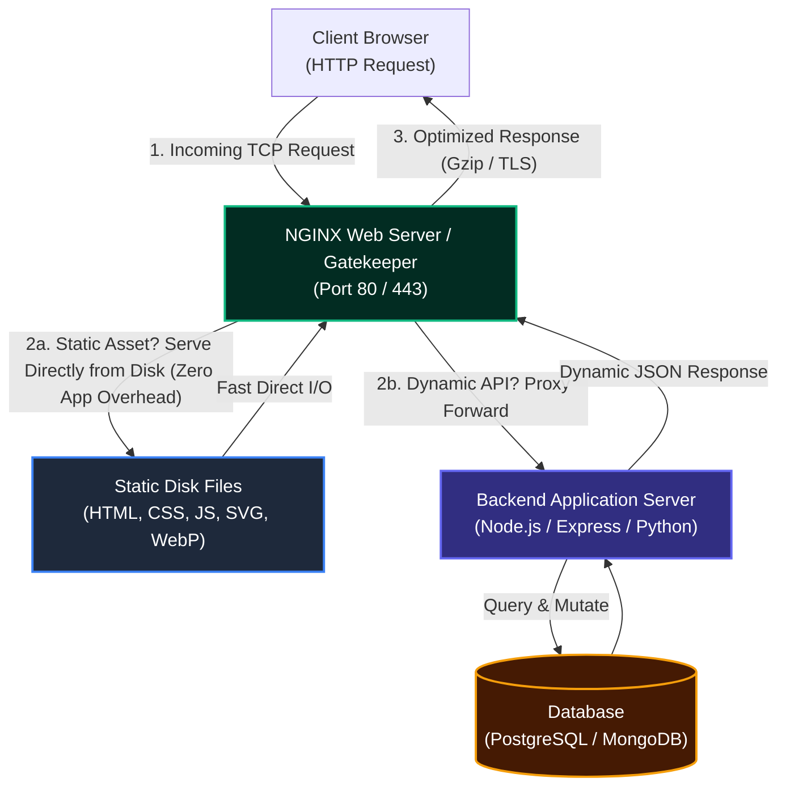
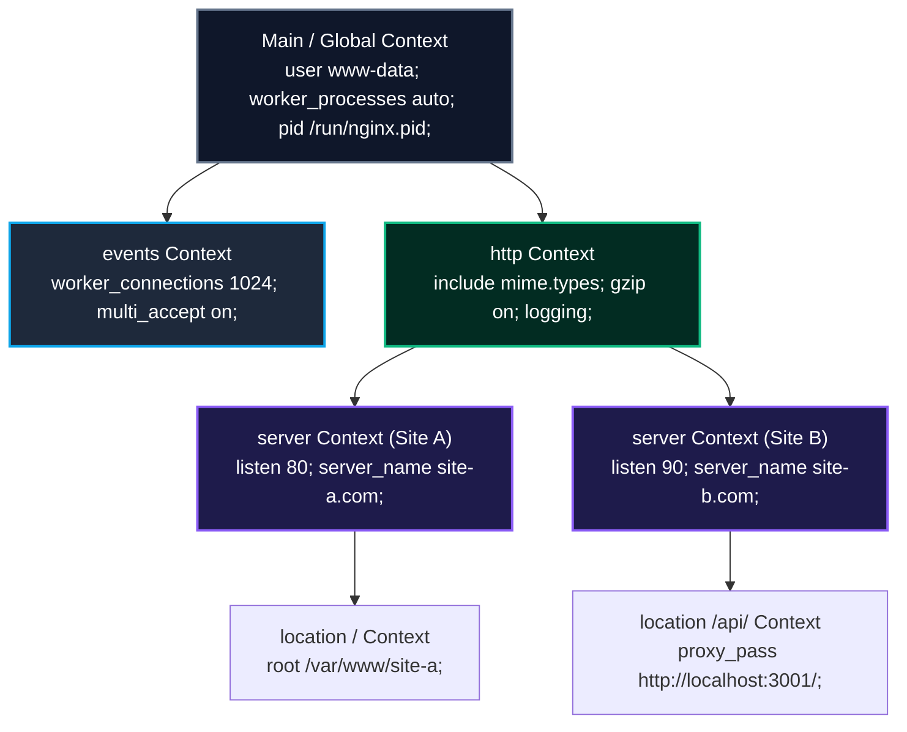
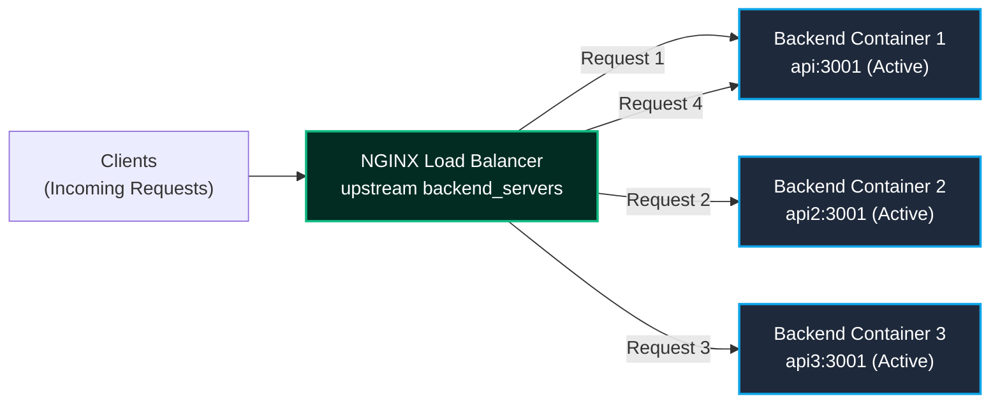
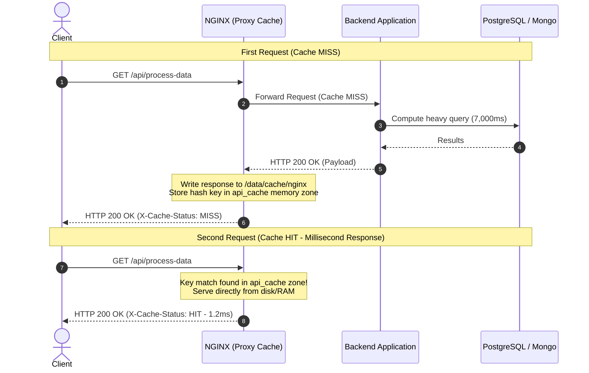
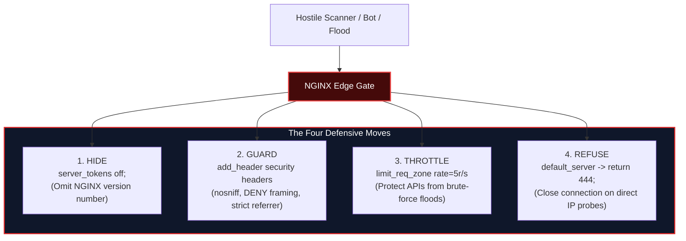

import { Callout } from 'fumadocs-ui/components/callout';
import { Tabs, Tab } from 'fumadocs-ui/components/tabs';
import { Steps, Step } from 'fumadocs-ui/components/steps';
import { Cards, Card } from 'fumadocs-ui/components/card';

When developing modern full-stack web applications, developers frequently begin by running individual services directly on their host machines: a React single-page application on port `3000`, a Node.js/Express API on port `3001`, and an administrative database UI on port `8081`. 

While opening multiple browser tabs on different localhost ports works during local development, **this architecture cannot face the public internet**. Exposing application runtimes directly forces users to memorize arbitrary port numbers, exposes internal application runtimes to direct Denial of Service (DoS) and Slowloris attacks, duplicates SSL/TLS encryption overhead across every service, and degrades performance by forcing compute runtimes to serve static image and bundle assets.

**NGINX** (pronounced *"Engine-X"*) solves this architectural crisis by serving as a high-performance, event-driven **front door**. It operates as a web server, reverse proxy, Layer 7 load balancer, HTTP cache, and security gatekeeper.

---

## 1. What a Web Server Is: The Architectural Gatekeeper

When a client browser navigates to `https://example.com`, it establishes a TCP handshake and transmits an HTTP request. The fundamental architectural question is: **should your application runtime (Node.js, Python, Go, Ruby, Java) process every single request directly?**

For low-traffic hobby sites, direct exposure might appear to work. However, the instant concurrent traffic surges, your backend application is forced to perform two conflicting responsibilities simultaneously:
1. **Managing raw OS network connections:** Managing thousands of concurrent TCP sockets, TLS negotiation handshakes, connection keep-alives, slow clients, and HTTP packet chunking.
2. **Executing business logic:** Querying databases, authenticating sessions, evaluating domain business rules, and rendering data.



### The Two-Path Routing Decision

NGINX evaluates every incoming request against a deterministic two-path decision tree:
1. **Static Files (HTML, CSS, JavaScript, Images, Media):** Returned straight from the host filesystem into the socket via OS kernel zero-copy system calls (`sendfile`). The application runtime is never awakened, conserving CPU cycles and memory.
2. **Dynamic Processing (APIs, Mutations, Auth):** Forwarded internally across a private network boundary to the application runtime running behind NGINX.

<Callout type="info" title="The Host at the Restaurant Door Analogy">
Think of NGINX as the host standing at the restaurant entrance. If a customer arrives asking for a printed menu or a glass of tap water, the host provides it immediately from the front counter (**static files**). If the customer orders a customized three-course steak dinner (**dynamic API processing**), the host routes the order back to the kitchen (**backend application runtime**). The kitchen staff never manages the front queue, never answers the door, and never wastes time handing out menus.
</Callout>

### Field Realities: What Engineers Misunderstand
* **Myth:** *"NGINX is just an Apache replacement."* Apache historically allocated one OS thread or process per connection (`prefork`/`worker`), which collapsed under the C10K problem (10,000 concurrent connections). NGINX was designed from scratch around an asynchronous, non-blocking, event-driven loop (`epoll` on Linux, `kqueue` on BSD/macOS), allowing a single worker process to handle tens of thousands of concurrent connections on negligible CPU and RAM.
* **Myth:** *"My Node.js backend can serve my React build files."* While `express.static()` works, Node.js single-threaded event loop must read files into V8 heap memory and stream them chunk by chunk, blocking compute cycles needed for API requests. Serving static assets through NGINX is 5x–10x faster and frees the Node process.

---

## 2. Installing NGINX & Creating Your First Server Block

### Installation and Systemd Management on Linux

On an Ubuntu/Debian Linux VPS:

```bash
# 1. Update package manager indexes and install NGINX
sudo apt update && sudo apt install nginx -y

# 2. Verify installed version and build configuration
nginx -v
nginx -V

# 3. Verify service daemon status
sudo systemctl status nginx
```

`systemctl` provides full lifecycle control over the NGINX daemon:
* `sudo systemctl start nginx` / `stop nginx`: Starts or halts the master process and worker processes.
* `sudo systemctl status nginx`: Displays live operational state, process IDs, and memory utilization.
* `sudo systemctl reload nginx`: **Gracefully reloads configuration** without terminating active worker connections.
* `sudo systemctl enable nginx` / `disable nginx`: Configures whether NGINX automatically initializes on OS boot.

### The Architecture of `nginx.conf`

The main configuration file lives at `/etc/nginx/nginx.conf` and is organized into nested **contexts**:



### The `sites-available` vs `sites-enabled` Pattern

Instead of dumping dozens of domain definitions directly into `/etc/nginx/nginx.conf`, production systems utilize dynamic symlinks:
* `/etc/nginx/sites-available/`: The staging library storing all server block configurations. Files here are **inactive** until explicitly enabled.
* `/etc/nginx/sites-enabled/`: The active configuration directory included by `nginx.conf` via `include /etc/nginx/sites-enabled/*;`.

To enable a site, construct a symbolic link:
```bash
sudo ln -s /etc/nginx/sites-available/first-site /etc/nginx/sites-enabled/
```
To disable a site, simply delete the symlink in `sites-enabled/` (`sudo rm /etc/nginx/sites-enabled/first-site`). The source file remains safe in `sites-available/`.

### Building a Static Server Block on Port 90

<Steps>
### Step 1: Create Website Files
```bash
sudo mkdir -p /var/www/first-site
sudo chown -R $USER:$USER /var/www/first-site

cat << 'EOF' > /var/www/first-site/index.html
<!DOCTYPE html>
<html>
<head><title>First NGINX Site</title></head>
<body>
  <h1>Delivered Directly by NGINX on Port 90</h1>
  <p>Static file served from /var/www/first-site/index.html without touching an application runtime.</p>
</body>
</html>
EOF
```

### Step 2: Author the Server Block
Create `/etc/nginx/sites-available/first-site`:

```nginx
server {
    listen 90;
    server_name localhost;

    location / {
        root /var/www/first-site;
        index index.html index.htm;
        try_files $uri $uri/ =404;
    }
}
```

<Callout type="tip" title="The L·S·L·R Mnemonic">
Remember the core four directives required for any static server block:
* **L** - `listen` (The network port or interface to bind)
* **S** - `server_name` (The hostname, domain, or IP matching the request)
* **L** - `location` (The URI path prefix scope)
* **R** - `root` (The filesystem directory where files reside)
</Callout>

### Step 3: Symlink, Test, and Reload
```bash
# Enable the configuration via symlink
sudo ln -s /etc/nginx/sites-available/first-site /etc/nginx/sites-enabled/

# The mandatory test ritual: verify syntax BEFORE reloading
sudo nginx -t

# Gracefully apply without dropping traffic
sudo systemctl reload nginx
```
Visiting `http://YOUR_VPS_IP:90` renders the page instantly.
</Steps>

---

## 3. The Reverse Proxy: One Unified Entry Point for Full-Stack Stacks

### Forward Proxy vs. Reverse Proxy

| Dimension | Forward Proxy | Reverse Proxy |
| :--- | :--- | :--- |
| **Protects / Represents** | The **Client** (Browser / Internal Corporate User) | The **Server** (Application Backends / Microservices) |
| **Location** | Sits in front of clients on the client network | Sits in front of servers on the host/cloud edge |
| **Visibility** | Servers cannot see client true identity (IP) | Clients cannot see backend server IPs or ports |
| **Core Functions** | Content filtering, anonymity, corporate caching | SSL termination, Layer 7 routing, load balancing, defense |

```
Forward Proxy:
[ Client A ] ---\
[ Client B ] ----> [ Forward Proxy ] === (Public Internet) ===> [ Destination Web Server ]
[ Client C ] ---/

Reverse Proxy:
                                                                 /---> [ React SPA (:3000) ]
[ Client A ] === (Public Internet) ===> [ NGINX Reverse Proxy ] ------> [ Node API (:3001) ]
                                            (Port 80 / 443)      \---> [ Mongo Express (:8081) ]
```

### The Multi-Container Production Problem

Consider a standard full-stack Dockerized application stack:
* **Frontend:** React Single Page App running inside a container on port `3000`
* **API Backend:** Node.js / Express REST API running on port `3001`
* **Admin Tooling:** Mongo Express web interface on port `8081`
* **Database:** MongoDB on internal port `27017`

Exposing ports `3000`, `3001`, and `8081` directly across the public internet produces major security and UX flaws:
1. Cross-Origin Resource Sharing (CORS) preflight requests occur on every API mutation because frontend and backend live on different origins.
2. Users must specify port numbers (`example.com:8081`).
3. Administrative consoles are exposed to automated bot brute-force attacks on raw ports.

### The Unified Reverse Proxy Solution

With NGINX listening on standard port `80` (and `443`), all services hide behind a single origin:

```nginx
# /etc/nginx/sites-available/docker-demo

server {
    listen 80;
    server_name localhost;

    # 1. Frontend UI: React SPA
    location / {
        proxy_pass http://localhost:3000;
        proxy_http_version 1.1;
        proxy_set_header Upgrade $http_upgrade;
        proxy_set_header Connection 'upgrade';
        proxy_set_header Host $host;
        proxy_cache_bypass $http_upgrade;
    }

    # 2. REST API: Node.js / Express
    location /api/ {
        # CRITICAL: Trailing slash strips '/api/' before forwarding to Node
        proxy_pass http://localhost:3001/;
        proxy_set_header Host $host;
        proxy_set_header X-Real-IP $remote_addr;
        proxy_set_header X-Forwarded-For $proxy_add_x_forwarded_for;
        proxy_set_header X-Forwarded-Proto $scheme;
    }

    # 3. Database Admin GUI: Mongo Express
    location /mongo/ {
        proxy_pass http://localhost:8081/;
        proxy_set_header Host $host;
        proxy_set_header X-Real-IP $remote_addr;
        proxy_set_header X-Forwarded-For $proxy_add_x_forwarded_for;
    }
}
```

<Callout type="warning" title="The Critical Trailing Slash Gotcha">
Notice the difference:
* `proxy_pass http://localhost:3001/;` (with trailing slash): When a request arrives for `/api/users`, NGINX strips the `/api/` prefix matching the location block and forwards `/users` to the Node.js application.
* `proxy_pass http://localhost:3001;` (WITHOUT trailing slash): NGINX preserves the entire original URI, forwarding `/api/users` directly to Node.js. If your Express app defines `app.get('/users', ...)`, omitting the trailing slash will result in an immediate **404 Not Found**!
</Callout>

<Callout type="info" title="Sub-path Configuration for Web Apps (Mongo Express)">
When proxying third-party web apps (like Mongo Express, Grafana, or pgAdmin) to a sub-path like `/mongo/`, the application must be told its base path so it renders HTML asset links correctly (`/mongo/public/style.css` instead of `/public/style.css`). In Docker Compose, set the environment variable:
```yaml
environment:
  ME_CONFIG_SITE_BASEURL: "/mongo/"
```
</Callout>

---

## 4. Layer 7 Load Balancing: Upstream Clusters & High Availability

Relying on a single backend instance creates two fatal weaknesses:
1. **Vertical Scalability Wall:** A single process is bound to finite CPU cores and memory.
2. **Zero Redundancy (Single Point of Failure):** If an uncaught exception crashes the single backend process, the entire application drops offline.



### Docker Compose Multi-Instance Simulation

To demonstrate horizontal scaling, we deploy three identical Node API containers attached to the same Docker bridge network, passing an `API_NAME` environment variable so responses explicitly announce which instance answered:

```yaml
version: '3.8'

services:
  nginx:
    image: nginx:1.27-alpine
    ports:
      - "80:80"
    volumes:
      - ./nginx/default.conf:/etc/nginx/conf.d/default.conf:ro
    depends_on:
      - api
      - api2
      - api3

  api:
    build: ./backend
    environment:
      - PORT=3001
      - API_NAME=api-alpha

  api2:
    build: ./backend
    environment:
      - PORT=3001
      - API_NAME=api-beta

  api3:
    build: ./backend
    environment:
      - PORT=3001
      - API_NAME=api-gamma
```

### The `upstream` Directive & Balancing Algorithms

In NGINX, an `upstream` block declares a pool of backend servers. NGINX resolves Docker container service names (`api`, `api2`, `api3`) through internal Docker DNS:

```nginx
# Define the pool of backend instances
upstream backend_servers {
    # 1. Round Robin (Default): Sequential distribution
    server api:3001;
    server api2:3001;
    server api3:3001;

    # 2. Least Connections (uncomment to activate):
    # least_conn;

    # 3. Weighted Balancing (uncomment to activate):
    # server api:3001 weight=3;   # Receives 3x the traffic of others
    # server api2:3001 weight=1;
    # server api3:3001 backup;    # Idle reserve; only receives traffic if others fail
}

server {
    listen 80;

    location /api/ {
        proxy_pass http://backend_servers/;
        proxy_set_header Host $host;
        proxy_set_header X-Real-IP $remote_addr;
    }
}
```

### The Four Core Distribution Strategies (Mnemonic: R·L·W·B)

| Strategy | Directive | How It Works | Best Used For |
| :--- | :--- | :--- | :--- |
| **Round Robin** | *(Default)* | Requests are dealt sequentially: Server 1 $\rightarrow$ Server 2 $\rightarrow$ Server 3 $\rightarrow$ Server 1. | Homogeneous servers with equal CPU/RAM and uniform request latencies. |
| **Least Connections** | `least_conn;` | Directs incoming requests to the backend with the smallest number of active connections. | Workloads with variable request duration (e.g., fast user lookups mixed with slow file exports). |
| **Weighted** | `weight=N;` | Distributes proportional shares (e.g., `weight=3` vs `weight=1` routes 75% to the primary node). | Heterogeneous clusters where one node has significantly higher CPU/memory capacity. |
| **Backup** | `backup;` | Marks a server as standby reserve. Receives 0 traffic during normal operation. | Failover disaster recovery. Traffic only routes to backup if all primary instances fail health checks. |

### The Production Failure Drill: Zero-Downtime Resilience
When container `api2` is forcefully stopped during production traffic:
```bash
docker stop docker-demo-api2-1
```
NGINX detects the TCP connection timeout or failure, marks `api2` as temporarily down, and transparently routes all requests to `api` and `api3`. Clients experience **zero 502 Bad Gateway errors**. When `docker start docker-demo-api2-1` runs, NGINX automatically re-admits the container back into the rotation.

---

## 5. HTTP Proxy Caching: Microcaching & Dynamic Bypass

Without caching at the edge proxy, every client request executes the full system circuit:
$$\text{Client} \longrightarrow \text{NGINX} \longrightarrow \text{Node API} \longrightarrow \text{Database Query} \longrightarrow \text{Compute JSON} \longrightarrow \text{Client}$$

If 5,000 users simultaneously request the exact same product catalog endpoint, executing 5,000 identical database queries wastes CPU and database I/O. **Edge caching stores the generated HTTP response in memory and disk on NGINX**, serving subsequent requests in $< 2\text{ms}$ directly from NGINX.



### The Three-Directive Caching Rule

To implement HTTP proxy caching in NGINX, remember: **Define the zone, Use the zone, Time the zone**:

```nginx
# 1. DEFINE THE ZONE (Must live in the 'http' context)
# Syntax: proxy_cache_path <path> keys_zone=<name>:<memory_size> max_size=<disk_cap> inactive=<eviction_time> use_temp_path=off;
proxy_cache_path /data/cache/nginx 
                 levels=1:2 
                 keys_zone=api_cache:10m 
                 max_size=1g 
                 inactive=30m 
                 use_temp_path=off;

server {
    listen 80;

    # Expose cache hit status in response headers for developer visibility
    add_header X-Cache-Status $upstream_cache_status always;

    # 2. USE THE ZONE & 3. TIME THE ZONE on specific endpoints
    location = /api/process-data {
        proxy_pass http://backend_servers;
        
        # USE the memory zone defined above
        proxy_cache api_cache;
        
        # TIME the validity: Cache 200 OK responses for 10 minutes
        proxy_cache_valid 200 10m;
        proxy_cache_valid 404 1m;
        
        # Concurrency safety: if 100 requests arrive simultaneously for a stale key,
        # let only 1 request hit the backend while 99 wait for the cache to populate
        proxy_cache_use_stale error timeout updating http_500 http_502 http_503;
        proxy_cache_lock on;
    }

    # CRITICAL: Dynamic data MUST bypass the cache
    location /api/ {
        proxy_pass http://backend_servers;
        # NO proxy_cache directive here: always fresh from database
    }
}
```

<Callout type="warning" title="The 'Sara' Bug: The Stale Data Invalidation Trap">
In the lab course, after enabling caching across `/api/`, a new user named *"Sara"* was created via `POST /api/users`. When refreshing the user table, Sara was **missing**! Why? Because `/api/users` was returning a cached `200 OK` response from 2 minutes earlier. 

**Rule of Thumb:**
* **Never blanket-cache whole API trees.**
* Separate dynamic endpoints from cacheable endpoints using exact match (`location = /api/heavy-report`) or cache bypass rules:
```nginx
proxy_cache_bypass $http_authorization $cookie_session;
proxy_no_cache $http_authorization $cookie_session;
```
</Callout>

---

## 6. Gzip Compression: Wire Optimization

### Payload Transfer Economics

In high-throughput web applications, large JSON responses (e.g., analytical datasets, geo-coordinates, tabular reports) can exceed **9,000 KB (9 MB)**. Over mobile or constrained networks, transmitting 9 MB takes several seconds.

Because JSON, HTML, CSS, and JavaScript are plain text with high character repetition, **gzip compression reduces payload sizes by 75% to 85%** with near-zero CPU cost. In the lab demo, a 9,000 KB payload compresses down to **1,600 KB**:

```
Before Compression: [============ 9,000 KB Plain JSON ============] (3.8s transfer)
After Compression:  [=== 1,600 KB Gzip ===] (0.5s transfer) -> Browser unzips instantly
```

### HTTP Content Negotiation Protocol

Compression works via standard HTTP headers:
1. **Client Request:** Browser announces supported algorithms:
   `Accept-Encoding: gzip, deflate, br, zstd`
2. **Server Response:** NGINX compresses the body and marks the response:
   `Content-Encoding: gzip`
3. **Transparent Decompression:** The browser engine unzips the payload in C++ memory before passing it to JavaScript. The React app receives ordinary JSON with zero client-side code modification.

### Configuration & CPU Trade-Offs

```nginx
# Placed in http context or server block
gzip on;

# Do not compress payloads under 1,000 bytes (compression overhead exceeds savings)
gzip_min_length 1000;

# Explicitly declare compressible text MIME types (NEVER include images/video!)
gzip_types 
    text/plain 
    text/css 
    application/json 
    application/javascript 
    text/xml 
    application/xml 
    application/xml+rss 
    text/javascript 
    image/svg+xml;

# Compression level: 1 (fastest, lowest CPU) to 9 (maximum compression, highest CPU)
# Level 5 is the industry sweet spot between CPU efficiency and byte reduction
gzip_comp_level 5;

# Ensure intermediate proxies cache both compressed and uncompressed variants
gzip_vary on;

# Do not compress for legacy clients that claim to support gzip but fail
gzip_disable "msie6";
```

<Callout type="warning" title="The Media Compression Anti-Pattern">
**Never include PNG, JPEG, WebP, AVIF, MP4, or ZIP in `gzip_types`!** 
Image and video formats are already heavily compressed using entropy-coding algorithms. Passing them through gzip burns server CPU cycles and frequently results in an output file that is *larger* than the original!
</Callout>

---

## 7. Edge Hardening: The Four-Move Defensive Posture

Edge security in NGINX operates on the **Hide · Guard · Throttle · Refuse** doctrine:



### 1. Hide: Version Disclosure Prevention
By default, NGINX sends `Server: nginx/1.24.0 (Ubuntu)`. If an exploit is discovered for a specific minor version, automated scanners locate targets using this banner.
```nginx
# Strip version numbers from error pages and Server header
server_tokens off;
```
Now the header reads simply `Server: nginx`.

### 2. Guard: HTTP Security Headers
NGINX sitting in front of your applications is the ideal location to inject global browser security constraints:

```nginx
# 1. Prevent MIME-sniffing: forces browser to respect Content-Type header
add_header X-Content-Type-Options "nosniff" always;

# 2. Prevent Clickjacking: forbids embedding your site in iframes
add_header X-Frame-Options "DENY" always;

# 3. Privacy: limit referrer leakage across origins
add_header Referrer-Policy "strict-origin-when-cross-origin" always;

# 4. Hardware sandbox: disable unneeded device APIs
add_header Permissions-Policy "geolocation=(), microphone=(), camera=()" always;

# 5. Content Security Policy (CSP): restrict execution origins
# WARNING: Test carefully! If you load Google Fonts, CDNs, or Stripe, you must whitelist them
# add_header Content-Security-Policy "default-src 'self'; script-src 'self'; style-src 'self' https://cdn.jsdelivr.net;" always;
```

### 3. Throttle: Rate Limiting Abuse Protection
To prevent credential stuffing, scraping, and Layer 7 HTTP floods, configure a leaky bucket rate limit zone:

```nginx
# In http context:
# Track client IPs using $binary_remote_addr (uses only 4 bytes per IP in memory)
# Allocate 10MB memory zone (holds ~160,000 unique IP addresses)
# Rate: 5 requests per second per IP
limit_req_zone $binary_remote_addr zone=api_rate_limit:10m rate=5r/s;

server {
    listen 80;

    location /api/ {
        # Enforce rate limit with a burst buffer of 10 requests without artificial delay
        limit_req zone=api_rate_limit burst=10 nodelay;
        limit_req_status 429;

        proxy_pass http://backend_servers/;
    }
}
```

### 4. Refuse: Rejecting Direct IP Access (Return 444)
Malicious automated bots constantly scan IPv4 ranges port-scanning raw IP addresses without providing a domain `Host` header. Legitimate users arrive via your registered domain name (`example.com`).

We implement a catch-all `default_server` that drops suspicious connections immediately using NGINX non-standard code **444** (closes the TCP socket without sending any response headers or body):

```nginx
# Refuse direct HTTP IP access
server {
    listen 80 default_server;
    listen [::]:80 default_server;
    server_name _;
    return 444;
}

# Refuse direct HTTPS IP access (Must also handle port 443!)
server {
    listen 443 ssl default_server;
    listen [::]:443 ssl default_server;
    server_name _;
    
    # Dummy self-signed cert required by SSL handshake before termination
    ssl_certificate     /etc/ssl/certs/ssl-cert-snakeoil.pem;
    ssl_certificate_key /etc/ssl/private/ssl-cert-snakeoil.key;

    return 444;
}
```

---

## 8. HTTPS & SSL Termination with Let's Encrypt Certbot

### The SSL Termination Paradigm

In an SSL termination architecture, the compute-heavy asymmetric cryptography handshake (TLS 1.3) terminates at NGINX on public port `443`. Between NGINX and the internal containers, traffic flows over the private, isolated Docker network using fast, plain HTTP:

```
[ Public Internet ] === (Encrypted HTTPS / TLS 1.3) ===> [ NGINX (:443) ] ---> (Plain HTTP) ---> [ Node API Container ]
```
**Benefits:**
* Single centralized location for certificate renewal.
* Application backends require zero certificate configuration or Node `https` module overhead.
* Internal microservices communicate with low latency.

### Deployment Method A: Certbot on Host VPS

```bash
# 1. Ensure DNS A records point your domain and www to your VPS public IP:
#    example.com       -> 203.0.113.10
#    www.example.com   -> 203.0.113.10

# 2. Install Certbot and the NGINX automation plugin
sudo apt install certbot python3-certbot-nginx -y

# 3. Execute automated certificate provisioning
sudo certbot --nginx -d example.com -d www.example.com
```
Certbot automatically validates domain ownership via ACME HTTP-01 challenge, provisions free Let's Encrypt certificates, injects `ssl_certificate` paths into `/etc/nginx/sites-available/`, and configures an automatic HTTP $\rightarrow$ HTTPS 301 redirect.

### Deployment Method B: Containerized NGINX with Docker Compose

When NGINX itself runs inside Docker, Certbot runs on the host and mounts certificates read-only (`ro`) into the container:

```yaml
# docker-compose.yml
services:
  nginx:
    image: nginx:1.27-alpine
    ports:
      - "80:80"
      - "443:443"
    volumes:
      - ./nginx/default.conf:/etc/nginx/conf.d/default.conf:ro
      - /etc/letsencrypt:/etc/letsencrypt:ro
      - /data/cache/nginx:/data/cache/nginx
```

The containerized `default.conf` implements clean port 80 redirection:

```nginx
# Port 80: Permanent Redirect to HTTPS
server {
    listen 80;
    server_name example.com www.example.com;
    return 301 https://$host$request_uri;
}

# Port 443: Hardened HTTPS Server
server {
    listen 443 ssl http2;
    server_name example.com www.example.com;

    # Certificate paths mounted from host /etc/letsencrypt
    ssl_certificate     /etc/letsencrypt/live/example.com/fullchain.pem;
    ssl_certificate_key /etc/letsencrypt/live/example.com/privkey.pem;

    # Production TLS protocols and cipher suites
    ssl_protocols TLSv1.2 TLSv1.3;
    ssl_prefer_server_ciphers on;
    ssl_ciphers ECDHE-ECDSA-AES128-GCM-SHA256:ECDHE-RSA-AES128-GCM-SHA256:ECDHE-ECDSA-AES256-GCM-SHA384:ECDHE-RSA-AES256-GCM-SHA384;
    ssl_session_timeout 1d;
    ssl_session_cache shared:SSL:10m;
    ssl_session_tickets off;

    # HSTS: Force browsers to remember HTTPS for 1 year
    add_header Strict-Transport-Security "max-age=31536000; includeSubDomains" always;

    location / {
        proxy_pass http://web:3000;
        proxy_set_header Host $host;
        proxy_set_header X-Forwarded-Proto https;
    }

    location /api/ {
        proxy_pass http://backend_servers/;
        proxy_set_header Host $host;
        proxy_set_header X-Forwarded-Proto https;
    }
}
```

---

## 9. The Production Verification Rhythm: Edit · Test · Apply · Verify

The difference between professional systems engineering and amateur downtime is a strict verification habit.


### The Ritual

```bash
# Step 1: Edit configuration
vim /etc/nginx/sites-available/production-stack

# Step 2: TEST BEFORE TOUCHING THE DAEMON
# Host:
sudo nginx -t
# Inside Docker:
docker exec -it production-nginx-1 nginx -t

# Output MUST read:
# nginx: the configuration file /etc/nginx/nginx.conf syntax is ok
# nginx: configuration file /etc/nginx/nginx.conf test is successful

# Step 3: APPLY WITH RELOAD (Never restart during active traffic!)
sudo systemctl reload nginx
# Or in Docker:
docker exec -it production-nginx-1 nginx -s reload

# Step 4: VERIFY WITH CURL
curl -I https://example.com/api/health
```

<Callout type="info" title="Reload vs Restart: Why It Matters">
* **`reload`:** Master process re-reads configuration from disk, launches new worker processes running the new config, and signals old worker processes to gracefully finish active connections before shutting down. **Zero dropped requests.**
* **`restart`:** Master process forcibly kills all worker processes and immediately shuts down the listening socket, aborting all active customer connections mid-flight.
</Callout>

---

## 10. Master Reference Cheat Sheet

| Directive / Concept | Scope Context | Core Architectural Purpose |
| :--- | :--- | :--- |
| `worker_processes auto;` | `main` | Sets worker threads equal to CPU cores for non-blocking I/O multiplexing. |
| `events { worker_connections 1024; }` | `main` | Maximum simultaneous open network sockets per worker process. |
| `proxy_pass http://<target>;` | `location` | Forwards matching HTTP requests to internal application upstream. |
| `upstream <name> { ... }` | `http` | Declares a pool of backend servers for load balancing. |
| `least_conn;` | `upstream` | Directs incoming requests to the backend with the fewest active connections. |
| `proxy_cache_path ...` | `http` | Allocates filesystem directory and shared memory zone for cached responses. |
| `proxy_cache <zone>;` | `location` | Enables proxy caching for the scoped route. |
| `proxy_cache_valid 200 10m;` | `location` | Instructs NGINX to retain successful 200 responses in cache for 10 minutes. |
| `gzip on;` | `http`, `server` | Compresses outbound text payloads (HTML, CSS, JSON, JS). |
| `gzip_min_length 1000;` | `http`, `server` | Skips compression for payloads smaller than 1 KB. |
| `server_tokens off;` | `http`, `server` | Hides NGINX version number from HTTP `Server` headers. |
| `limit_req_zone ... rate=5r/s;` | `http` | Configures per-client IP token bucket rate limiting memory zone. |
| `return 444;` | `server` | Drops malicious or raw IP connections immediately without responding. |
| `return 301 https://$host$request_uri;` | `server` | Permanently redirects port 80 HTTP traffic to port 443 HTTPS. |
| `nginx -t` | CLI | Syntax and configuration validation check before reloading. |
| `systemctl reload nginx` | CLI | Graceful zero-downtime configuration reload. |

---

## 11. Frequently Encountered Pitfalls & Triage

<Callout type="error" title="1. My API returns 404 on every request through NGINX">
**Cause:** Mismatched trailing slash on `proxy_pass`.
* Config: `location /api/ { proxy_pass http://localhost:3001; }` (no trailing slash).
* Request to `/api/users` sends `/api/users` to Express. If Express expects `/users`, it fails with 404.
* **Fix:** Add the trailing slash: `proxy_pass http://localhost:3001/;`.
</Callout>

<Callout type="error" title="2. Content-Security-Policy breaks my site layout">
**Cause:** Overly aggressive `Content-Security-Policy default-src 'self'`.
* If your application loads fonts from Google, icons from a CDN, or images from AWS S3, a strict `'self'` policy causes the browser to block all external assets.
* **Fix:** Audit third-party script and font domains before locking down CSP, or use `report-only` mode during staging verification.
</Callout>

<Callout type="error" title="3. Freshly created database rows do not appear on the frontend">
**Cause:** Accidental caching of dynamic mutation or collection endpoints.
* **Fix:** Isolate caching to explicitly idempotent, expensive query routes using exact match locations (`location = /api/v1/analytics/report`) and leave general API locations uncached.
</Callout>

<Callout type="error" title="4. Port 80 is already bound when starting Docker NGINX">
**Cause:** Host-level NGINX was previously installed via `apt` and is currently running as a systemd service.
* **Fix:** Stop and permanently disable the host daemon before running Dockerized NGINX:
```bash
sudo systemctl stop nginx
sudo systemctl disable nginx
```
</Callout>
