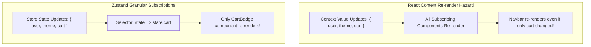
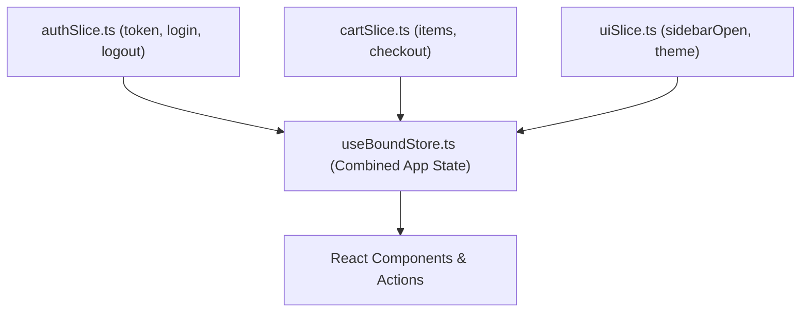

import { Callout } from 'fumadocs-ui/components/callout';
import { Tabs, Tab } from 'fumadocs-ui/components/tabs';
import { Steps, Step } from 'fumadocs-ui/components/steps';

As applications grow beyond simple component trees, managing state across deeply nested branches becomes a primary architectural challenge. 

While React provides built-in tools like `useState`, `useReducer`, and the `Context API`, they are not designed for high-frequency or global client state. **Zustand** is a lightweight (under 2KB), fast, and unopinionated state management solution that provides store subscriptions based on simplified Flux principles without boilerplates or context wrapping.

---

## 1. Why Zustand? (Context API vs. Redux vs. Zustand)

Before adopting any state library, understand why React's built-in tools struggle with global state:



| Dimension | React Context API | Redux Toolkit (RTK) | Zustand (v5) |
| :--- | :--- | :--- | :--- |
| **Boilerplate** | Low | High (slices, reducers, extraReducers, dispatch) | Minimal (a single hook) |
| **Bundle Size** | 0 KB (Built-in) | ~11 KB+ | **~1.5 KB** |
| **Provider Required?** | Yes (`<Context.Provider>`) | Yes (`<Provider store={store}>`) | **No Provider Needed** |
| **Selective Re-renders** | No (all consumers re-render) | Yes (via `useSelector`) | **Yes (via selector functions)** |
| **Non-React Access** | Impossible (requires hook context) | Yes (`store.getState()`) | **Yes (`useStore.getState()`)** |
| **Primary Use Case** | Low-frequency data (Theme, Auth user) | Massive enterprise legacy apps | **Modern Client UI State** |

<Callout type="warn" title="Rule of Separation: Client State vs Server State">
Never store remote API data (users lists, blog posts, database records) in Zustand! That is **Server State**, which belongs in **TanStack Query** (covered in Lesson 11). Use Zustand exclusively for **Client State** (modals, selected table rows, active filters, wizard drafts, audio players, theme settings).
</Callout>

---

## 2. Level 1: Beginner Fundamentals

### Step 1: Installation
```bash
npm install zustand
```

### Step 2: Creating Your First Store
A Zustand store is created using the `create()` function. It provides a `set` callback used to apply partial state updates:

```tsx title="src/stores/useCounterStore.ts"
import { create } from 'zustand';

interface CounterState {
  count: number;
  increment: () => void;
  decrement: () => void;
  reset: () => void;
}

export const useCounterStore = create<CounterState>((set) => ({
  count: 0,
  increment: () => set((state) => ({ count: state.count + 1 })),
  decrement: () => set((state) => ({ count: state.count - 1 })),
  reset: () => set({ count: 0 }),
}));
```

### Step 3: Consuming State in Components
Because Zustand creates a custom React hook, you can call it directly in any component without wrapping your app in a Provider:

```tsx title="src/components/Counter.tsx"
import { useCounterStore } from '../stores/useCounterStore';

export function Counter() {
  // Subscribe to state values
  const count = useCounterStore((state) => state.count);
  
  // Extract actions
  const increment = useCounterStore((state) => state.increment);
  const decrement = useCounterStore((state) => state.decrement);
  const reset = useCounterStore((state) => state.reset);

  return (
    <div className="card">
      <h2>Count: {count}</h2>
      <div className="flex gap-2">
        <button onClick={decrement}>-1</button>
        <button onClick={increment}>+1</button>
        <button onClick={reset}>Reset</button>
      </div>
    </div>
  );
}
```

---

## 3. Level 2: Intermediate Patterns & TypeScript

### The TypeScript Currying Pattern: `create<T>()(...)`
In TypeScript applications with middleware, TypeScript can suffer from type inference collapse. Always use the **curried syntax** `create<T>()(...)` with an empty pair of parentheses:

```ts
// ❌ Deprecated / Type inference issues with middleware
const useStore = create<MyState>((set) => ({ ... }));

// ✅ Recommended Zustand 5 TypeScript Pattern
const useStore = create<MyState>()((set, get) => ({ ... }));
```

### Reading State with `get()` and Async Actions
Actions inside Zustand can be asynchronous, and you can inspect the current state at any point using `get()`:

```tsx title="src/stores/useUserPreferencesStore.ts"
import { create } from 'zustand';

interface PreferencesState {
  theme: 'light' | 'dark' | 'system';
  fontSize: number;
  autoSave: boolean;
  setTheme: (theme: 'light' | 'dark' | 'system') => void;
  toggleAutoSave: () => void;
  syncPreferencesWithCloud: () => Promise<void>;
}

export const usePreferencesStore = create<PreferencesState>()((set, get) => ({
  theme: 'system',
  fontSize: 16,
  autoSave: true,

  setTheme: (theme) => set({ theme }),

  // Toggle state using current snapshot from get()
  toggleAutoSave: () => {
    const current = get().autoSave;
    set({ autoSave: !current });
  },

  // Async flows live directly within store actions
  syncPreferencesWithCloud: async () => {
    const { theme, fontSize, autoSave } = get();
    await fetch('/api/user/preferences', {
      method: 'POST',
      headers: { 'Content-Type': 'application/json' },
      body: JSON.stringify({ theme, fontSize, autoSave }),
    });
  },
}));
```

---

## 4. The Critical Zustand 5 Rule: `useShallow`

In **Zustand 5**, the equality checking algorithm was updated to use **`Object.is`** by default to ensure 100% compliance with React 19's `useSyncExternalStore`.

<Callout type="error" title="Critical Zustand 5 Warning: Object Literal Selectors">
If your selector returns a newly generated object or array:
```tsx
// ⚠️ DANGER: Returns a new object reference on EVERY render!
// This causes an INFINITE RE-RENDER LOOP in Zustand 5!
const { count, step } = useStore((state) => ({ 
  count: state.count, 
  step: state.step 
}));
```
</Callout>

You have two solutions to select multiple values safely:

<Tabs items={['Solution A: Granular Selectors (Recommended)', 'Solution B: useShallow']}>
  <Tab value="Solution A: Granular Selectors (Recommended)">
    Call the hook multiple times. Since selectors are atomic, each subscription tracks only its primitive value:

    ```tsx
    // Zero overhead, no shallow comparison needed
    const count = useStore((state) => state.count);
    const step = useStore((state) => state.step);
    const increment = useStore((state) => state.increment);
    ```
  </Tab>

  <Tab value="Solution B: useShallow">
    When you want to destructure multiple values from one selector, wrap the selector in **`useShallow`** from `zustand/react/shallow`:

    ```tsx
    import { useShallow } from 'zustand/react/shallow';

    export function ScoreBoard() {
      // ✅ useShallow performs shallow equality check on properties
      const { wins, losses } = useGameStore(
        useShallow((state) => ({
          wins: state.wins,
          losses: state.losses,
        }))
      );

      return <div>Record: {wins}W - {losses}L</div>;
    }
    ```
  </Tab>
</Tabs>

---

## 5. Level 3: Middlewares (Persist & DevTools)

Zustand features an extensible middleware system that wraps store creation.

### 1. `persist`: Automatic LocalStorage Syncing
The `persist` middleware transparently serializes state to `localStorage` (or `sessionStorage`) and re-hydrates it upon app launch:

```tsx title="src/stores/useAuthSessionStore.ts"
import { create } from 'zustand';
import { persist, createJSONStorage } from 'zustand/middleware';

interface AuthSessionState {
  token: string | null;
  username: string | null;
  setSession: (token: string, username: string) => void;
  clearSession: () => void;
}

export const useAuthSessionStore = create<AuthSessionState>()(
  persist(
    (set) => ({
      token: null,
      username: null,
      setSession: (token, username) => set({ token, username }),
      clearSession: () => set({ token: null, username: null }),
    }),
    {
      name: 'auth-session-storage', // Key in localStorage
      storage: createJSONStorage(() => localStorage),
      // Optional: selectively persist only certain fields
      partialize: (state) => ({ token: state.token }),
    }
  )
);
```

### 2. Combining `devtools` & `persist`
To debug your state actions in Redux DevTools alongside persistence, nest the middlewares:

```tsx title="src/stores/useCartStore.ts"
import { create } from 'zustand';
import { devtools, persist } from 'zustand/middleware';

interface CartItem {
  id: string;
  name: string;
  price: number;
  quantity: number;
}

interface CartState {
  items: CartItem[];
  addItem: (item: CartItem) => void;
  removeItem: (id: string) => void;
}

export const useCartStore = create<CartState>()(
  devtools(
    persist(
      (set) => ({
        items: [],
        addItem: (newItem) =>
          set(
            (state) => ({ items: [...state.items, newItem] }),
            false,
            'cart/addItem' // Action name in Redux DevTools
          ),
        removeItem: (id) =>
          set(
            (state) => ({ items: state.items.filter((item) => item.id !== id) }),
            false,
            'cart/removeItem'
          ),
      }),
      { name: 'shopping-cart' }
    ),
    { name: 'Cart Store' }
  )
);
```

---

## 6. Level 4: The Slice Pattern for Enterprise Stores

When an application grows into dozens of features, putting all state into one giant file creates an unmaintainable monolith. The **Slice Pattern** divides the store into decoupled domain slices typed with `StateCreator`.



<Steps>
  <Step title="Define Domain Slice Types & Creators">
    Each slice uses `StateCreator<CombinedState, [], [], SliceState>`:

    ```ts title="src/stores/slices/createAuthSlice.ts"
    import { StateCreator } from 'zustand';
    import { RootStoreState } from '../useBoundStore';

    export interface AuthSlice {
      userId: string | null;
      login: (userId: string) => void;
      logout: () => void;
    }

    export const createAuthSlice: StateCreator<
      RootStoreState,
      [],
      [],
      AuthSlice
    > = (set) => ({
      userId: null,
      login: (userId) => set({ userId }),
      logout: () => set({ userId: null }),
    });
    ```

    ```ts title="src/stores/slices/createUiSlice.ts"
    import { StateCreator } from 'zustand';
    import { RootStoreState } from '../useBoundStore';

    export interface UiSlice {
      isSidebarOpen: boolean;
      toggleSidebar: () => void;
    }

    export const createUiSlice: StateCreator<
      RootStoreState,
      [],
      [],
      UiSlice
    > = (set) => ({
      isSidebarOpen: false,
      toggleSidebar: () => set((state) => ({ isSidebarOpen: !state.isSidebarOpen })),
    });
    ```
  </Step>

  <Step title="Combine Slices into the Root Store">
    Combine all slice interfaces and spread their creator functions:

    ```ts title="src/stores/useBoundStore.ts"
    import { create } from 'zustand';
    import { AuthSlice, createAuthSlice } from './slices/createAuthSlice';
    import { UiSlice, createUiSlice } from './slices/createUiSlice';

    // Combined state interface
    export type RootStoreState = AuthSlice & UiSlice;

    export const useBoundStore = create<RootStoreState>()((...a) => ({
      ...createAuthSlice(...a),
      ...createUiSlice(...a),
    }));
    ```
  </Step>
</Steps>

---

## 7. Level 5: Outside-React Access & Hydration

### Reading & Updating State Outside Components
Because Zustand stores exist independently of the React component tree, you can read and mutate state inside **Axios/Fetch interceptors**, WebSockets, or utility files without hooks:

```ts title="src/api/httpClient.ts"
import axios from 'axios';
import { useAuthSessionStore } from '../stores/useAuthSessionStore';

export const apiClient = axios.create({
  baseURL: 'https://api.example.com',
});

// Attach Authorization Bearer token to every request outside React
apiClient.interceptors.request.use((config) => {
  const token = useAuthSessionStore.getState().token;
  if (token) {
    config.headers.Authorization = `Bearer ${token}`;
  }
  return config;
});

// Auto-logout on HTTP 401 Unauthorized
apiClient.interceptors.response.use(
  (response) => response,
  (error) => {
    if (error.response?.status === 401) {
      useAuthSessionStore.getState().clearSession();
      window.location.href = '/login';
    }
    return Promise.reject(error);
  }
);
```

### SSR & Next.js Hydration Mismatch Safety
When using `persist` with `localStorage`, the server renders the initial HTML with default values (e.g. `null`), while the client hydrates with stored local storage values, triggering React hydration mismatch warnings.

Resolve this with a simple custom hydration wrapper hook:

```tsx title="src/hooks/useHydratedStore.ts"
import { useState, useEffect } from 'react';

export function useHydratedStore<T, F>(
  store: (callback: (state: T) => unknown) => unknown,
  callback: (state: T) => F
) {
  const result = store(callback) as F;
  const [hydrated, setHydrated] = useState(false);

  useEffect(() => {
    setHydrated(true);
  }, []);

  return hydrated ? result : undefined;
}
```

---

## 8. Summary Checklist & Anti-Patterns

* **DO** use atomic selectors (`useStore(s => s.prop)`) or `useShallow` to prevent unneeded re-renders.
* **DO** use the currying syntax `create<State>()(...)` in TypeScript.
* **DO** keep API response caching out of Zustand; delegate network caching to TanStack Query.
* **DON'T** mutate state directly (`state.cart.items.push(x)`). Always return a new object with spread operators or use the `immer` middleware.
* **DON'T** wrap your root app in a context Provider for Zustand. It runs directly as a standalone observable store.
