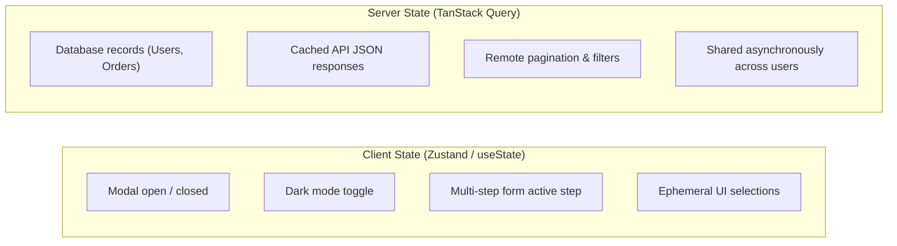
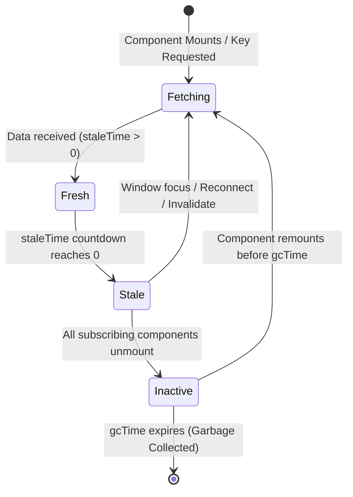

import { Callout } from 'fumadocs-ui/components/callout';
import { Tabs, Tab } from 'fumadocs-ui/components/tabs';
import { Steps, Step } from 'fumadocs-ui/components/steps';

In modern web development, the single most common architectural bug is treating **Server State** (data fetched over HTTP/REST/GraphQL) as if it were local **Client State**.

Before libraries like **TanStack Query (formerly React Query)**, developers forced API responses into `useState` and `useEffect` or global stores like Redux and Zustand. TanStack Query is a battle-tested asynchronous state synchronization engine that handles caching, request deduplication, background revalidation, and mutation lifecycles without manual boilerplate.

---

## 1. Paradigm Shift: Client State vs. Server State

Understanding this boundary is the foundation of modern React architecture:



| Dimension | Client State (Zustand / useState) | Server State (TanStack Query) |
| :--- | :--- | :--- |
| **Ownership** | Owned completely by browser memory | Persisted remotely in a server database |
| **Freshness** | Synchronous, always accurate locally | Asynchronous; immediately potentially stale |
| **Concurrency** | Only the local user updates it | Multiple users modify data concurrently on the backend |
| **Lifecycle** | Destroyed on page unload or component unmount | Requires smart caching, garbage collection, and invalidation |

---

## 2. Why the Old `useEffect` + `fetch` Approach Fails

Consider the traditional data-fetching pattern taught to beginners:

```tsx
// ❌ Anti-pattern: Fragile, boilerplate-heavy, race condition prone
function PostList() {
  const [posts, setPosts] = useState([]);
  const [loading, setLoading] = useState(true);
  const [error, setError] = useState<string | null>(null);

  useEffect(() => {
    let ignore = false;
    setLoading(true);

    fetch('/api/posts')
      .then((res) => {
        if (!res.ok) throw new Error('Failed to fetch');
        return res.json();
      })
      .then((data) => {
        if (!ignore) setPosts(data);
      })
      .catch((err) => {
        if (!ignore) setError(err.message);
      })
      .finally(() => {
        if (!ignore) setLoading(false);
      });

    return () => { ignore = true; }; // Cleanup for race conditions
  }, []);

  if (loading) return <div>Loading...</div>;
  if (error) return <div>Error: {error}</div>;
  return <ul>{posts.map(p => <li key={p.id}>{p.title}</li>)}</ul>;
}
```

### The 4 Major Flaws of `useEffect` Fetching:
1. **No Caching or Instant Navigation:** Every time the component mounts, a loading spinner flashes, even if the user viewed that same data 2 seconds ago.
2. **Request Duplication:** If three different components on the screen need the current user's profile, three separate HTTP calls are sent to `/api/me`.
3. **No Automatic Background Revalidation:** Stale data remains indefinitely unless manually refreshed.
4. **Massive Boilerplate:** Every single component repeats identical boilerplate for loading, error, abort controllers, and retry logic.

---

## 3. Level 1: Beginner Fundamentals & Setup

### Step 1: Installation
Install TanStack Query core and the official DevTools:

```bash
npm install @tanstack/react-query @tanstack/react-query-devtools
```

### Step 2: Providing the `QueryClient`
Wrap your application root with `QueryClientProvider`. Always instantiate `QueryClient` using `useState` or module scope to prevent instance re-creation during React re-renders:

```tsx title="src/main.tsx"
import React, { useState } from 'react';
import ReactDOM from 'react-dom/client';
import { QueryClient, QueryClientProvider } from '@tanstack/react-query';
import { ReactQueryDevtools } from '@tanstack/react-query-devtools';
import App from './App';

export function Root() {
  // Creating inside useState ensures the cache survives component re-renders
  const [queryClient] = useState(
    () =>
      new QueryClient({
        defaultOptions: {
          queries: {
            staleTime: 1000 * 60 * 2, // 2 minutes: data considered fresh
            gcTime: 1000 * 60 * 10,   // 10 minutes: keep unused cache in memory
            refetchOnWindowFocus: true, // auto-refresh when user returns to tab
            retry: 2,                  // retry failed requests twice
          },
        },
      })
  );

  return (
    <QueryClientProvider client={queryClient}>
      <App />
      <ReactQueryDevtools initialIsOpen={false} />
    </QueryClientProvider>
  );
}

ReactDOM.createRoot(document.getElementById('root')!).render(<Root />);
```

### Step 3: Your First Query with `useQuery`
In TanStack Query v5, all queries use a clean **single-object configuration**:

```tsx title="src/components/PostList.tsx"
import { useQuery } from '@tanstack/react-query';

interface Post {
  id: number;
  title: string;
  body: string;
}

async function fetchPosts(): Promise<Post[]> {
  const res = await fetch('https://jsonplaceholder.typicode.com/posts');
  if (!res.ok) {
    throw new Error('Failed to load posts from server');
  }
  return res.json();
}

export function PostList() {
  const { data, isPending, isError, error } = useQuery({
    queryKey: ['posts'],
    queryFn: fetchPosts,
  });

  if (isPending) {
    return <div className="spinner">Loading posts...</div>;
  }

  if (isError) {
    return <div className="error-alert">Error: {error.message}</div>;
  }

  return (
    <ul className="space-y-2">
      {data.map((post) => (
        <li key={post.id} className="p-3 border rounded">
          <h3 className="font-bold">{post.title}</h3>
          <p className="text-gray-600">{post.body}</p>
        </li>
      ))}
    </ul>
  );
}
```

<Callout type="tip" title="isPending vs isLoading in v5">
In TanStack Query v5, **`isPending`** is `true` whenever there is no cached data yet and the first fetch is in flight. **`isLoading`** is specifically `isPending && isFetching`. Always use `isPending` for your primary initial loading spinner.
</Callout>

---

## 4. Level 2: The Cache Lifecycle & Query Keys

### The 5 States of Cached Data



* **`staleTime`**: The duration (in ms) during which fetched data is considered "fresh". While fresh, mounting new components displays cached data **without firing network requests**.
* **`gcTime` (Garbage Collection Time)**: The duration (in ms) that inactive, unmounted query data remains preserved in browser memory. If a user returns to the page before `gcTime` expires, the UI displays cached data instantly while refreshing in the background.

### Query Keys as Cache Coordinates
Query keys **must be arrays**. TanStack Query serializes keys deterministically (objects inside keys are order-independent):

```tsx
// Simple scalar key
queryKey: ['todos']

// Hierarchical key with variable
queryKey: ['todos', todoId]

// Parameterized key with query parameters/filters
queryKey: ['todos', { status: 'completed', page: 2 }]
```

### Parameterized & Dependent Queries
When query `B` depends on the output of query `A`, use the `enabled` boolean flag:

```tsx title="src/components/UserProfile.tsx"
import { useQuery } from '@tanstack/react-query';

export function UserProfile({ username }: { username: string }) {
  // Query 1: Fetch user details
  const userQuery = useQuery({
    queryKey: ['user', username],
    queryFn: () => fetch(`/api/users/${username}`).then((r) => r.json()),
  });

  const userId = userQuery.data?.id;

  // Query 2: Dependent query! Only runs once userId exists
  const projectsQuery = useQuery({
    queryKey: ['projects', userId],
    queryFn: () => fetch(`/api/users/${userId}/projects`).then((r) => r.json()),
    enabled: Boolean(userId), // Paused until user query resolves
  });

  if (userQuery.isPending) return <div>Loading user profile...</div>;
  if (projectsQuery.isPending && userId) return <div>Loading user projects...</div>;

  return (
    <div>
      <h1>{userQuery.data.name}</h1>
      <p>Projects: {projectsQuery.data?.length ?? 0}</p>
    </div>
  );
}
```

---

## 5. Level 3: Mutations & Cache Invalidation

Queries read data; **Mutations** create, update, or delete server data (POST, PUT, DELETE, PATCH).

### Creating Data with `useMutation`
Unlike `useQuery`, `useMutation` does not execute automatically on component mount. You trigger it imperatively via `mutate()`:

```tsx title="src/components/CreatePostForm.tsx"
import { useMutation, useQueryClient } from '@tanstack/react-query';
import { useState } from 'react';

interface NewPost {
  title: string;
  body: string;
}

export function CreatePostForm() {
  const [title, setTitle] = useState('');
  const [body, setBody] = useState('');
  const queryClient = useQueryClient();

  const createPostMutation = useMutation({
    mutationFn: async (newPost: NewPost) => {
      const res = await fetch('https://jsonplaceholder.typicode.com/posts', {
        method: 'POST',
        headers: { 'Content-Type': 'application/json' },
        body: JSON.stringify(newPost),
      });
      if (!res.ok) throw new Error('Could not create post');
      return res.json();
    },
    // When mutation succeeds, invalidate the cached 'posts' query!
    onSuccess: () => {
      queryClient.invalidateQueries({ queryKey: ['posts'] });
      setTitle('');
      setBody('');
    },
  });

  const handleSubmit = (e: React.FormEvent) => {
    e.preventDefault();
    createPostMutation.mutate({ title, body });
  };

  return (
    <form onSubmit={handleSubmit} className="p-4 border rounded">
      <input
        type="text"
        placeholder="Title"
        value={title}
        onChange={(e) => setTitle(e.target.value)}
        disabled={createPostMutation.isPending}
      />
      <textarea
        placeholder="Body"
        value={body}
        onChange={(e) => setBody(e.target.value)}
        disabled={createPostMutation.isPending}
      />
      <button type="submit" disabled={createPostMutation.isPending}>
        {createPostMutation.isPending ? 'Publishing...' : 'Create Post'}
      </button>

      {createPostMutation.isError && (
        <p className="text-red-500">{createPostMutation.error.message}</p>
      )}
    </form>
  );
}
```

### The Golden Rule: Invalidation Over Manual Cache Updates
Never try to manually append newly created items to cache arrays using `setQueryData` unless necessary for an optimistic update. Simply calling:

```ts
queryClient.invalidateQueries({ queryKey: ['posts'] });
```
marks the query as stale, triggering an automatic silent refetch that guarantees 100% data consistency with the backend database.

---

## 6. Level 4: Enterprise Query Key Factories & `queryOptions`

In large enterprise applications with hundreds of endpoints, hardcoding raw string arrays like `['posts', id]` leads to typos, cache mismatch, and refactoring nightmares.

The **Query Key Factory** pattern organizes keys and reusable query options into structured modules:

```ts title="src/api/queries/postQueries.ts"
import { queryOptions } from '@tanstack/react-query';

// 1. Hierarchical Query Key Factory
export const postKeys = {
  all: ['posts'] as const,
  lists: () => [...postKeys.all, 'list'] as const,
  list: (filters: { tag?: string; search?: string }) =>
    [...postKeys.lists(), filters] as const,
  details: () => [...postKeys.all, 'detail'] as const,
  detail: (id: number) => [...postKeys.details(), id] as const,
};

// 2. Reusable queryOptions definition
export const postQueries = {
  list: (filters: { tag?: string; search?: string } = {}) =>
    queryOptions({
      queryKey: postKeys.list(filters),
      queryFn: async () => {
        const params = new URLSearchParams(filters as Record<string, string>);
        const res = await fetch(`/api/posts?${params}`);
        if (!res.ok) throw new Error('Failed to fetch filtered posts');
        return res.json();
      },
      staleTime: 1000 * 60 * 3, // 3 minutes
    }),

  detail: (id: number) =>
    queryOptions({
      queryKey: postKeys.detail(id),
      queryFn: async () => {
        const res = await fetch(`/api/posts/${id}`);
        if (!res.ok) throw new Error(`Post #${id} not found`);
        return res.json();
      },
    }),
};
```

Using it inside your components is clean, typo-safe, and self-documenting:

```tsx
// In component:
const { data: posts } = useQuery(postQueries.list({ tag: 'react' }));
const { data: post } = useQuery(postQueries.detail(42));

// In mutation invalidation:
queryClient.invalidateQueries({ queryKey: postKeys.lists() }); // Invalidates all post lists!
```

---

## 7. Level 5: Expert Production Patterns

### 1. Optimistic Updates with Rollback
An **Optimistic Update** updates the client UI *before* the server responds (e.g. toggling a "Like" button or marking a checkbox). If the network request fails, the state automatically rolls back to the previous snapshot.

```tsx title="src/hooks/useToggleTodo.ts"
import { useMutation, useQueryClient } from '@tanstack/react-query';

interface Todo {
  id: number;
  text: string;
  completed: boolean;
}

export function useToggleTodo() {
  const queryClient = useQueryClient();

  return useMutation({
    mutationFn: async (todo: Todo) => {
      const res = await fetch(`/api/todos/${todo.id}`, {
        method: 'PATCH',
        headers: { 'Content-Type': 'application/json' },
        body: JSON.stringify({ completed: !todo.completed }),
      });
      if (!res.ok) throw new Error('Toggle failed');
      return res.json();
    },

    // Step 1: When mutate is called, cancel in-flight queries & snapshot previous data
    onMutate: async (toggledTodo) => {
      await queryClient.cancelQueries({ queryKey: ['todos'] });
      const previousTodos = queryClient.getQueryData<Todo[]>(['todos']);

      // Optimistically update the cache immediately
      queryClient.setQueryData<Todo[]>(['todos'], (old = []) =>
        old.map((item) =>
          item.id === toggledTodo.id ? { ...item, completed: !item.completed } : item
        )
      );

      // Return context with rollback snapshot
      return { previousTodos };
    },

    // Step 2: If the request fails, rollback using previous snapshot
    onError: (err, newTodo, context) => {
      if (context?.previousTodos) {
        queryClient.setQueryData(['todos'], context.previousTodos);
      }
    },

    // Step 3: Always refetch authoritative server state after completion
    onSettled: () => {
      queryClient.invalidateQueries({ queryKey: ['todos'] });
    },
  });
}
```

### 2. Infinite Scrolling with `useInfiniteQuery`
For social feeds, timeline logs, and e-commerce catalogs:

```tsx title="src/components/InfiniteFeed.tsx"
import { useInfiniteQuery } from '@tanstack/react-query';

interface FeedResponse {
  items: { id: number; title: string }[];
  nextCursor?: number;
}

export function InfiniteFeed() {
  const {
    data,
    fetchNextPage,
    hasNextPage,
    isFetchingNextPage,
    isPending,
  } = useInfiniteQuery({
    queryKey: ['feed'],
    queryFn: async ({ pageParam = 0 }) => {
      const res = await fetch(`/api/feed?cursor=${pageParam}`);
      return res.json() as Promise<FeedResponse>;
    },
    initialPageParam: 0,
    getNextPageParam: (lastPage) => lastPage.nextCursor,
  });

  if (isPending) return <div>Loading feed...</div>;

  return (
    <div>
      {data.pages.map((page, i) => (
        <div key={i} className="space-y-2">
          {page.items.map((item) => (
            <div key={item.id} className="p-3 border rounded">{item.title}</div>
          ))}
        </div>
      ))}

      <button
        onClick={() => fetchNextPage()}
        disabled={!hasNextPage || isFetchingNextPage}
        className="mt-4 px-4 py-2 bg-blue-600 text-white rounded"
      >
        {isFetchingNextPage
          ? 'Loading more...'
          : hasNextPage
          ? 'Load More'
          : 'End of feed'}
      </button>
    </div>
  );
}
```

### 3. React 19 & Suspense Integration (`useSuspenseQuery`)
With React 19, you can fetch data declaratively using React `<Suspense>` and `<ErrorBoundary>`, eliminating `if (isPending)` checks inside component render logic:

```tsx title="src/components/UserProfileSuspense.tsx"
import { useSuspenseQuery } from '@tanstack/react-query';
import { Suspense } from 'react';

function UserContent({ id }: { id: number }) {
  // data is GUARANTEED to exist (no null check needed!)
  const { data: user } = useSuspenseQuery({
    queryKey: ['user', id],
    queryFn: () => fetch(`/api/users/${id}`).then((r) => r.json()),
  });

  return <h1>Welcome back, {user.name}</h1>;
}

export function UserDashboard({ id }: { id: number }) {
  return (
    <Suspense fallback={<div className="skeleton">Loading profile...</div>}>
      <UserContent id={id} />
    </Suspense>
  );
}
```

---

## 8. Summary Checklist & Anti-Patterns

* **DO** use `staleTime` (e.g., 1–5 minutes) to avoid redundant network requests during frequent component re-mounts.
* **DO** structure query keys with Query Key Factories (`postKeys.detail(id)`).
* **DO** use `useState(() => new QueryClient())` at your app root so client-side re-renders don't wipe the cache.
* **DON'T** store fetched data in Zustand or Redux. TanStack Query *is* your server state store.
* **DON'T** omit variables used in your query function from the `queryKey`. If `id` changes, the query key must include `id` to trigger a new fetch.
* **DON'T** throw away `error` messages. TanStack Query automatically records the thrown `Error` for UI alerting.
