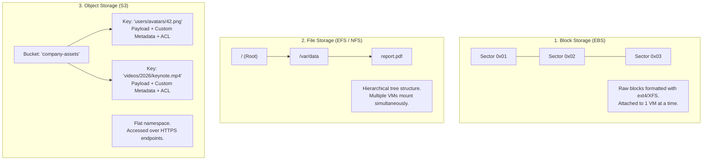
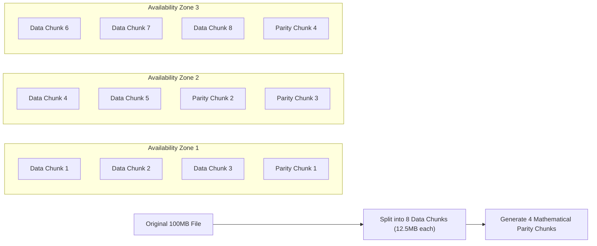
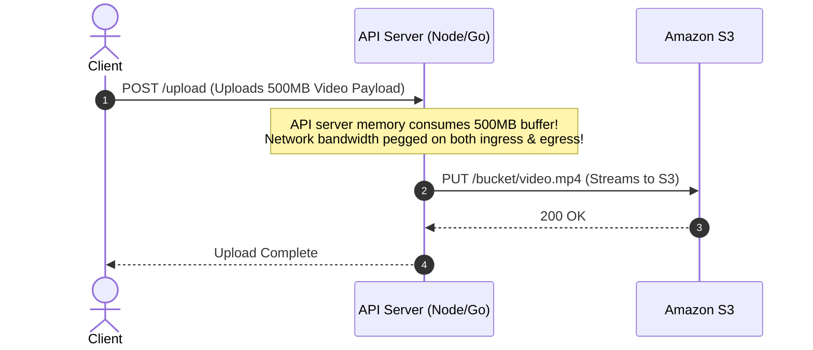
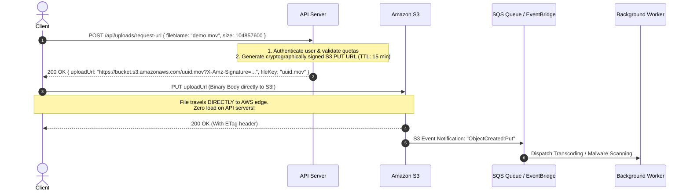
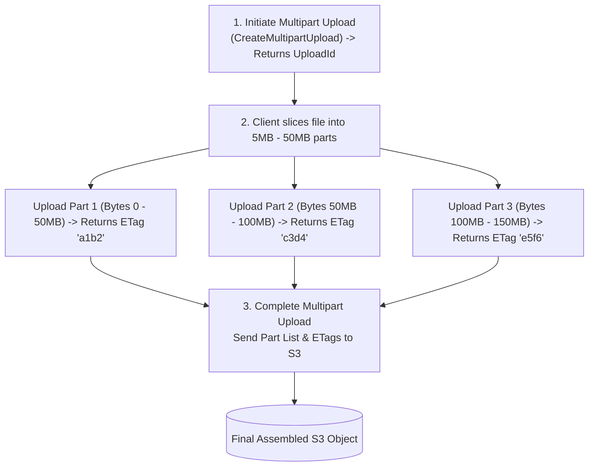
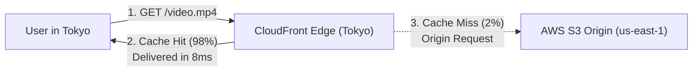

import { Tabs, Tab } from 'fumadocs-ui/components/tabs';
import { Callout } from 'fumadocs-ui/components/callout';
import { Steps, Step } from 'fumadocs-ui/components/steps';

When junior developers need to store profile pictures or user uploads, they often save them to local disk: `fs.writeFileSync('/var/uploads/' + file.name)`. 

Within months, the architecture crumbles:
1. When your backend scales horizontally from 1 container to 10 pods, uploads saved on Pod A return `404 Not Found` when requested from Pod B.
2. When Kubernetes restarts a pod, the ephemeral disk is wiped clean.
3. If an attacker uploads a 4GB video directly through your API server, the node runs out of RAM, blocking all incoming HTTP traffic.

Object storage (AWS S3, Cloudflare R2, MinIO, Google Cloud Storage) solves these problems with globally distributed, durable, virtually infinite storage accessible over HTTP.

---

## 1. Storage Paradigms: Block vs. File vs. Object

Understanding storage begins with categorizing how bytes are addressed and accessed by operating systems.

```
+-----------------------------------------------------------------------------------------+
| Attribute            | Block Storage (AWS EBS) | File Storage (AWS EFS) | Object Storage (AWS S3)  |
+-----------------------------------------------------------------------------------------+
| Addressing Unit      | Raw Blocks (512B/4KB)   | Files & Folders (POSIX)| Flat Keys (Unique Strings)|
| Access Protocol      | SCSI, iSCSI, NVMe-oF    | NFS, SMB, CIFS         | HTTP / REST (GET, PUT)   |
| Latency              | Sub-millisecond (Fastest)| 1 - 5 ms              | 20 - 100 ms (High)       |
| Shared Access        | Single instance (usually)| Multi-instance shared  | Billions of clients via Web|
| Metadata             | None (OS creates inode) | POSIX permissions/time | Custom JSON key-value tags|
| Scale Limit          | Terabytes per volume    | Petabytes              | Exabytes (Infinite)      |
| Typical Cost / GB/mo | $0.08 - $0.12           | $0.30                  | $0.015 - $0.023 (Cheapest)|
+-----------------------------------------------------------------------------------------+
```



---

## 2. Eleven 9s of Durability & Strong Consistency

AWS S3 advertises **99.999999999% (11 9s) of Durability**. 

What does this mean mathematically?
> If you store **10,000,000 objects** in S3, you can expect to lose an average of **one single object once every 10,000 years**.

### Why Not Just 3-Way Replication?
Storing 3 complete copies of every gigabyte across 3 data centers requires $300\%$ storage overhead ($3\times$ cost) and still leaves data vulnerable if two storage drives fail during a flood or power failure in the third center.

Instead, modern object storage uses **Erasure Coding** (such as Reed-Solomon encoding):



In an $8 + 4$ Reed-Solomon scheme:
- The file is broken into 8 data chunks plus 4 parity chunks (Total = 12 chunks).
- Storage overhead is only $50\%$ (compared to $200\%$ overhead for 3-way mirroring).
- **Mathematical Property**: **Any 8 of the 12 chunks** are mathematically sufficient to reconstruct the original 100MB file.
- Up to **4 entire drives or an entire data center failure** can occur simultaneously with zero data loss.

### Strong Read-After-Write Consistency

Historically, distributed object stores operated under an **eventual consistency** model: after writing or deleting an object, immediate reads might temporarily return stale versions.

> **Modern S3 Standard**: Amazon S3 delivers **strong read-after-write consistency** for `PUT` and `DELETE` requests of objects in all AWS regions.
- Immediately after a successful `PUT` of a new or overwritten object, any subsequent `GET` or `HEAD` request immediately sees the latest object data.
- Read operations immediately reflect updates without lag, eliminating the need for client-side caching hacks or delay loops.

---

## 3. The Pre-Signed URLs Pattern: Eliminating API Bottlenecks

### The Anti-Pattern: Routing Uploads Through Your API Server



Routing large uploads through your web application servers wastes expensive CPU, ties up backend connection threads for minutes on slow client mobile connections, and multiplies cloud egress costs.

### The Production Pattern: Direct Upload via Pre-Signed URLs



---

## 4. Cross-Origin Resource Sharing (CORS) Configuration

When web browsers upload files directly to an S3 bucket via `fetch()` or `XMLHttpRequest`, the browser issues a cross-origin preflight `OPTIONS` request.

If S3 does not send matching CORS headers, the browser will block the upload. Furthermore, **the browser's JavaScript must be able to read the `ETag` header** returned by S3 to coordinate multipart assembly.

### Production `cors.json`

```json
[
  {
    "AllowedHeaders": [
      "*"
    ],
    "AllowedMethods": [
      "GET",
      "PUT",
      "POST",
      "DELETE",
      "HEAD"
    ],
    "AllowedOrigins": [
      "https://app.example.com",
      "https://staging.example.com"
    ],
    "ExposeHeaders": [
      "ETag",
      "x-amz-server-side-encryption",
      "x-amz-request-id",
      "x-amz-id-2"
    ],
    "MaxAgeSeconds": 3600
  }
]
```

<Callout type="warn" title="Why ETag MUST Be in ExposeHeaders">
By default, browsers restrict access to response headers on cross-origin requests. If `ETag` is omitted from `ExposeHeaders`, `response.headers.get('ETag')` in browser JavaScript returns `null`. This breaks multipart uploads because you cannot send the completed list of Part ETags to S3!
</Callout>

Apply CORS to your bucket via AWS CLI:
```bash
aws s3api put-bucket-cors \
  --bucket production-user-assets \
  --cors-configuration file://cors.json
```

---

## 5. Multipart Uploads & The Incomplete Uploads Financial Trap

Attempting to upload a 5GB file using a single HTTP `PUT` request is fragile. If the mobile connection drops at 99.8%, the entire upload fails and the client must restart from byte zero.

AWS S3 provides the **Multipart Upload API** for objects larger than 100MB (and requires it for objects over 5GB):



### The Incomplete Multipart Uploads Financial Trap

When a multipart upload is initiated, AWS S3 creates an internal staging state for parts as they arrive.

```
Upload Initiated (UploadId: 98124)
  ├── Part 1 uploaded (50MB stored in S3 staging)
  ├── Part 2 uploaded (50MB stored in S3 staging)
  └── User closes browser tab! (Upload never completed or aborted)
```

<Callout type="error" title="The Hidden Cloud Storage Cost Leak">
- **Hidden Chunks**: Orphaned parts from incomplete uploads **do not appear** in normal `ListObjectsV2` calls or in the AWS S3 Console bucket file list!
- **Billing Trap**: Even though invisible as bucket objects, **AWS bills you the standard S3 storage rate per gigabyte for every orphaned part indefinitely**!
- In large organizations with thousands of failed or abandoned uploads, companies accumulate tens of terabytes of invisible orphaned parts, bleeding thousands of dollars every month.
</Callout>

### Production Fix: Automatic Lifecycle Abort Rule

Configure an S3 Lifecycle Rule to automatically delete incomplete multipart parts after 7 days:

```json
{
  "Rules": [
    {
      "ID": "AbortIncompleteMultipartUploadsAfter7Days",
      "Status": "Enabled",
      "Filter": {},
      "AbortIncompleteMultipartUpload": {
        "DaysAfterInitiation": 7
      }
    }
  ]
}
```

Apply this rule immediately with the AWS CLI:
```bash
aws s3api put-bucket-lifecycle-configuration \
  --bucket production-user-assets \
  --lifecycle-configuration file://lifecycle.json
```

---

## 6. Interactive Simulation: Multipart Upload Lifecycle

<Tabs items={['Step 1: Initiate Multipart Session', 'Step 2: Concurrent Part Uploads', 'Step 3: Network Drop & Targeted Retry', 'Step 4: Assembly & Finalization']}>
  <Tab value="Step 1: Initiate Multipart Session">
```text
[CLIENT REQUEST: Initiate Session via Backend API]
POST /api/uploads/multipart/start
{ "fileName": "raw_footage.mp4", "fileSize": 157286400, "mimeType": "video/mp4" }

[BACKEND S3 CALL]
CreateMultipartUploadCommand -> returns UploadId: "VXBsb2FkIElEIGV4YW1wbGU"

[BACKEND TO CLIENT]
HTTP 200 OK
{
  "key": "videos/2026/raw_footage.mp4",
  "uploadId": "VXBsb2FkIElEIGV4YW1wbGU",
  "partSize": 52428800
}
```
Client divides the 150MB file into 3 parts of 50MB each.
  </Tab>

  <Tab value="Step 2: Concurrent Part Uploads">
```text
[CLIENT DISPATCH: 3 Parallel Threads to S3 Presigned URLs]
Thread 1 -> PUT /videos/raw_footage.mp4?partNumber=1&uploadId=VXBsb2Fk... (0 - 50MB)
Thread 2 -> PUT /videos/raw_footage.mp4?partNumber=2&uploadId=VXBsb2Fk... (50MB - 100MB)
Thread 3 -> PUT /videos/raw_footage.mp4?partNumber=3&uploadId=VXBsb2Fk... (100MB - 150MB)

[S3 RESPONSES]
Part 1 -> HTTP 200 OK | ETag: "1b2cf535f27731c974343645a3985328"
Part 3 -> HTTP 200 OK | ETag: "ee969e163d7343b4e7e4e4bc666be4fa"
Part 2 -> FAILED (TCP Connection Reset - Cellular Blip)
```
  </Tab>

  <Tab value="Step 3: Network Drop & Targeted Retry">
```text
[ERROR HANDLING: Targeted Part Retry]
Notice: Parts 1 and 3 are ALREADY stored safely in S3 staging storage!
Zero bytes from Part 1 or Part 3 will be re-sent.

Client Thread 2 restarts:
PUT /videos/raw_footage.mp4?partNumber=2&uploadId=VXBsb2Fk... (50MB - 100MB)

[S3 RESPONSE]
Part 2 -> HTTP 200 OK | ETag: "5d41402abc4b2a76b9719d911017c592"

All parts successfully uploaded! Total network waste: exactly 0MB of good data.
```
  </Tab>

  <Tab value="Step 4: Assembly & Finalization">
```text
[CLIENT REQUEST: Complete Multipart Upload via Backend]
POST /api/uploads/multipart/complete
{
  "key": "videos/raw_footage.mp4",
  "uploadId": "VXBsb2FkIElEIGV4YW1wbGU",
  "parts": [
    { "PartNumber": 1, "ETag": "\"1b2cf535f27731c974343645a3985328\"" },
    { "PartNumber": 2, "ETag": "\"5d41402abc4b2a76b9719d911017c592\"" },
    { "PartNumber": 3, "ETag": "\"ee969e163d7343b4e7e4e4bc666be4fa\"" }
  ]
}

[S3 ENGINE ACTION]
1. Verifies hashes and part numbers.
2. Performs internal metadata pointer merge (instantaneous; zero bytes copied).
3. Makes assembled object available immediately under strong consistency.
```
  </Tab>
</Tabs>

---

## 7. Production Node.js / TypeScript Multipart Upload Orchestrator

Here is the complete, production-grade TypeScript service orchestrating Multipart Uploads using `@aws-sdk/client-s3` and `@aws-sdk/s3-request-presigner`:

```typescript
import {
  S3Client,
  CreateMultipartUploadCommand,
  UploadPartCommand,
  CompleteMultipartUploadCommand,
  AbortMultipartUploadCommand,
  PutObjectCommand,
  GetObjectCommand,
  type CompletedPart,
} from "@aws-sdk/client-s3";
import { getSignedUrl } from "@aws-sdk/s3-request-presigner";
import { randomUUID } from "node:crypto";

export interface PartUploadRequest {
  key: string;
  uploadId: string;
  partNumber: number;
}

export interface CompleteUploadRequest {
  key: string;
  uploadId: string;
  parts: { partNumber: number; eTag: string }[];
}

export class S3MultipartService {
  private readonly s3: S3Client;
  private readonly bucketName: string;

  constructor() {
    this.bucketName = process.env.S3_BUCKET_NAME || "production-user-assets";
    this.s3 = new S3Client({
      region: process.env.AWS_REGION || "us-east-1",
      credentials: {
        accessKeyId: process.env.AWS_ACCESS_KEY_ID!,
        secretAccessKey: process.env.AWS_SECRET_ACCESS_KEY!,
      },
    });
  }

  /**
   * STEP 1: Initiates a multipart upload session.
   * Returns the generated object Key and S3 UploadId.
   */
  async startMultipartUpload(
    userId: string,
    fileName: string,
    mimeType: string
  ): Promise<{ key: string; uploadId: string }> {
    const fileId = randomUUID();
    const cleanFileName = fileName.replace(/[^a-zA-Z0-9.-]/g, "_");
    const key = `uploads/${userId}/${fileId}-${cleanFileName}`;

    const command = new CreateMultipartUploadCommand({
      Bucket: this.bucketName,
      Key: key,
      ContentType: mimeType,
      Metadata: {
        "uploaded-by": userId,
        "initiated-at": new Date().toISOString(),
      },
    });

    const response = await this.s3.send(command);

    if (!response.UploadId) {
      throw new Error("S3 failed to generate an UploadId");
    }

    return { key, uploadId: response.UploadId };
  }

  /**
   * STEP 2: Generates a time-limited presigned URL for a specific part chunk.
   * Part numbers must be integers between 1 and 10,000.
   */
  async getPresignedPartUrl(
    params: PartUploadRequest,
    expiresInSeconds = 1800 // 30 minutes
  ): Promise<{ partNumber: number; presignedUrl: string }> {
    const command = new UploadPartCommand({
      Bucket: this.bucketName,
      Key: params.key,
      UploadId: params.uploadId,
      PartNumber: params.partNumber,
    });

    const presignedUrl = await getSignedUrl(this.s3, command, {
      expiresIn: expiresInSeconds,
    });

    return { partNumber: params.partNumber, presignedUrl };
  }

  /**
   * STEP 3: Assembles all uploaded chunks into the final object.
   * Parts MUST be sorted by PartNumber in ascending order.
   */
  async completeMultipartUpload(
    params: CompleteUploadRequest
  ): Promise<{ location?: string; eTag?: string }> {
    // Sort parts strictly in ascending numeric order
    const sortedParts: CompletedPart[] = params.parts
      .sort((a, b) => a.partNumber - b.partNumber)
      .map((p) => ({
        PartNumber: p.partNumber,
        ETag: p.eTag,
      }));

    const command = new CompleteMultipartUploadCommand({
      Bucket: this.bucketName,
      Key: params.key,
      UploadId: params.uploadId,
      MultipartUpload: {
        Parts: sortedParts,
      },
    });

    const response = await this.s3.send(command);

    return {
      location: response.Location,
      eTag: response.ETag,
    };
  }

  /**
   * Aborts an incomplete upload and immediately releases staged part storage.
   */
  async abortMultipartUpload(key: string, uploadId: string): Promise<void> {
    const command = new AbortMultipartUploadCommand({
      Bucket: this.bucketName,
      Key: key,
      UploadId: uploadId,
    });

    await this.s3.send(command);
  }
}
```

---

## 8. Video Streaming: HTTP Range Requests & CDN Delivery

Serving a 2GB 4K video directly from S3 to thousands of users causes two problems:
1. High S3 egress bandwidth costs ($0.09 per GB).
2. Poor playback UX: browsers cannot scrub forward without downloading the entire preceding file.

### 1. HTTP Byte-Range Requests (`206 Partial Content`)
When an HTML5 `<video>` player begins playback, it requests the first 2 megabytes to inspect video metadata (the MP4 `moov` atom):

```http
GET /videos/keynote.mp4 HTTP/1.1
Host: cdn.mycompany.com
Range: bytes=0-2097151

HTTP/1.1 206 Partial Content
Content-Range: bytes 0-2097151/2147483648
Content-Length: 2097152
[2MB of binary audio/video stream]
```

When the user scrubs forward to minute 45:00, the browser requests:
```http
GET /videos/keynote.mp4 HTTP/1.1
Range: bytes=1048576000-1050673151
```
S3 responds instantly with only the requested slice.

### 2. Edge Acceleration via CloudFront CDN & OAC



- **Origin Access Control (OAC)**: Blocks all public access to the S3 bucket. S3 allows access only to requests signed by your CloudFront distribution identity.
- **Cost Reduction**: Bandwidth out from S3 to CloudFront is **$0.00 (free)**. CloudFront edge egress is significantly cheaper and offers global caching with sub-20ms latency.

---

## Key Architecture Takeaways

1. **Never buffer large files through web servers**: Use Pre-Signed URLs so clients stream payloads directly to Object Storage.
2. **Always enable the Incomplete Multipart Uploads lifecycle rule**: Automatically abort failed multipart sessions after 7 days to eliminate silent recurring storage bills.
3. **Expose ETag in CORS configuration**: Without `ETag` in `ExposeHeaders`, client browsers cannot read part hashes, breaking multipart upload finalization.
4. **Strong Read-After-Write consistency is native**: Once an upload returns 200 OK, any subsequent read immediately sees the updated object.
5. **Use Multipart Uploads for files over 100MB**: Parallel chunks maximize upstream bandwidth and make uploads resilient against network drops.
6. **Protect origins with CloudFront OAC**: Deliver large video files and public assets through a CDN edge cache with HTTP Range request support.
