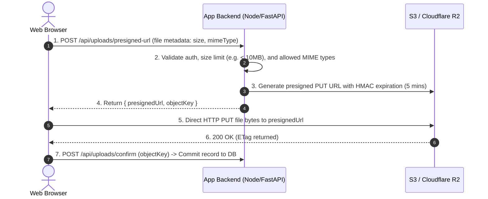

import { Callout } from 'fumadocs-ui/components/callout';
import { Cards, Card } from 'fumadocs-ui/components/card';
import { Steps, Step } from 'fumadocs-ui/components/steps';

Modern web systems rarely store binary assets (images, PDFs, video files) directly in relational databases or local server disks. Ephemeral cloud instances and serverless functions lose local state on redeployment.

Instead, scalable architectures utilize **Cloud Object Storage** (AWS S3, Cloudflare R2, Google Cloud Storage) combined with **Presigned Upload URLs**.

---

## Direct Client Upload Architecture (Presigned URLs)

Routing multi-megabyte file uploads through your application server wastes server memory, ties up HTTP worker threads, and multiplies ingress/egress bandwidth costs.

The industry-standard solution is **Direct-to-Object-Storage Uploads**:



---

## Implementation Example: Presigned S3 Uploads

```typescript
import { S3Client, PutObjectCommand } from '@aws-sdk/client-s3';
import { getSignedUrl } from '@aws-sdk/s3-request-presigner';

const s3 = new S3Client({ region: process.env.AWS_REGION });

export async function createUploadUrl(userId: string, filename: string, contentType: string) {
  // Enforce randomized key to prevent directory traversal or overwrites
  const objectKey = `users/${userId}/${crypto.randomUUID()}-${filename}`;

  const command = new PutObjectCommand({
    Bucket: process.env.S3_BUCKET_NAME,
    Key: objectKey,
    ContentType: contentType,
  });

  // URL expires in 300 seconds (5 minutes)
  const presignedUrl = await getSignedUrl(s3, command, { expiresIn: 300 });

  return { presignedUrl, objectKey };
}
```

---

## Security Best Practices for File Storage

<Steps>
<Step>
### Never Trust User-Provided Filenames
Always generate random UUIDs for stored keys (`crypto.randomUUID()`). An attacker could upload `../../etc/passwd` or overwrite critical existing assets.
</Step>

<Step>
### Verify Magic Bytes (File Signatures)
Do not rely exclusively on the `Content-Type` header sent by the browser. If inspecting files on the backend, verify the initial binary "magic numbers" (e.g., `89 50 4E 47` for PNG) using libraries like `file-type`.
</Step>

<Step>
### Isolate Public vs. Private Buckets
Keep user invoices, tax records, and private documents in private buckets accessible only via signed download URLs or authenticated proxies. Serve public assets (avatars, banners) through a CDN (Cloudflare or AWS CloudFront) with aggressive edge caching.
</Step>
</Steps>

---

## Lessons in This Track

<Cards>
  <Card
    title="01. Object Storage & S3 Architectures"
    href="/docs/full-stack-development/storage-and-files/01-object-storage-and-s3-architectures"
    description="Block vs File vs Object Storage, Eleven 9s durability and erasure coding, Pre-Signed URLs, Multipart uploads for large files (>100MB), and HTTP Range video streaming with CDNs."
  />
</Cards>
