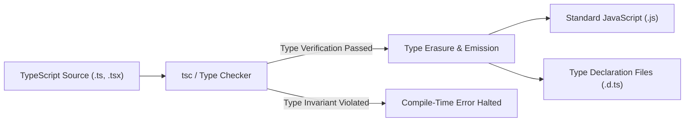

import { Cards, Card } from 'fumadocs-ui/components/card';
import { Callout } from 'fumadocs-ui/components/callout';

Welcome to the **TypeScript Curriculum**.

TypeScript brings compile-time static type safety to JavaScript, enabling engineers to refactor with confidence, document data contracts directly in code, and eliminate entire categories of production bugs (`Cannot read properties of undefined`).

All type annotations are erased at build time, resulting in pure JavaScript with zero runtime overhead.

---

## Curriculum Lessons

<Cards>
  <Card
    title="01. TypeScript Foundations & Primitive Types"
    href="/docs/full-stack-development/typescript/01-foundations-and-types"
    description="Compiler setup, type inference, primitives, and top/bottom types (unknown vs any vs never vs void)."
  />
  <Card
    title="02. Objects, Interfaces & Function Signatures"
    href="/docs/full-stack-development/typescript/02-objects-interfaces-and-functions"
    description="Structural typing, interface vs type alias, declaration merging, optional/readonly modifiers, and function overloads."
  />
  <Card
    title="03. Unions, Narrowing & Exhaustiveness"
    href="/docs/full-stack-development/typescript/03-unions-narrowing-and-exhaustiveness"
    description="Unions (|), intersections (&), discriminated unions, custom type guards (is), and exhaustive checking with never."
  />
  <Card
    title="04. Generics & Generic Constraints"
    href="/docs/full-stack-development/typescript/04-generics-and-constraints"
    description="Generic functions/classes, extends constraints, const type parameters (<const T>), and default type arguments."
  />
  <Card
    title="05. Essential Built-in Utility Types"
    href="/docs/full-stack-development/typescript/05-utility-types"
    description="Deep dive into Partial, Required, Readonly, Record, Pick, Omit, Exclude, Extract, ReturnType, and Awaited."
  />
  <Card
    title="06. Modern TS 5+ & Type-Level Programming"
    href="/docs/full-stack-development/typescript/06-modern-ts-and-type-level"
    description="The satisfies operator, template literal types, mapped types with key remapping, conditional types, infer, and branded types."
  />
  <Card
    title="07. tsconfig & Enterprise Architecture"
    href="/docs/full-stack-development/typescript/07-tsconfig-and-project-architecture"
    description="Production tsconfig setup, strict mode, noUncheckedIndexedAccess, declaration files (.d.ts), and bundler integration."
  />
  <Card
    title="08. Classes & Object-Oriented Programming"
    href="/docs/full-stack-development/typescript/08-classes-and-object-oriented-programming"
    description="Master TypeScript classes, access modifiers (public, private, protected), parameter properties, abstract classes, interface contracts, and Stage 3 decorators."
  />
  <Card
    title="TypeScript Glossary & Quick Reference"
    href="/docs/full-stack-development/typescript/glossary"
    description="Comprehensive quick-reference cheatsheet of type-level operators (keyof, typeof, indexed access), utilities, and syntax."
  />
</Cards>

---

## The TypeScript Architecture & Type Erasure

TypeScript works as a static analysis overlay on top of standard JavaScript:

<Callout type="tip" title="Structural Subtyping (Duck Typing)">
TypeScript operates on **shapes**, not declared names. If an object possesses all the properties required by a type contract, TypeScript accepts it without requiring an explicit `implements` keyword.
</Callout>
