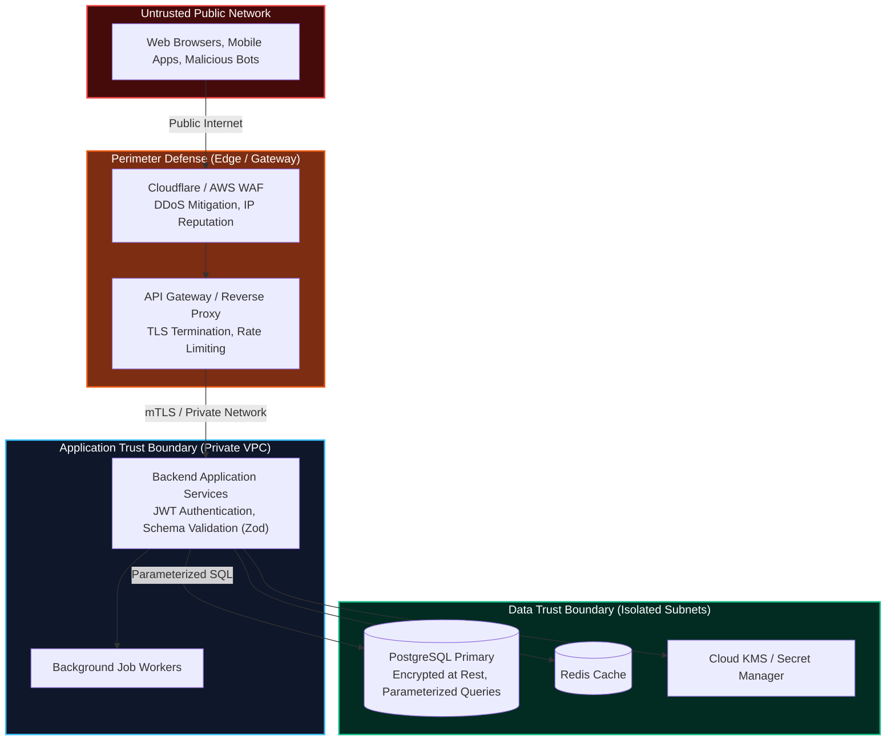

import { Callout } from 'fumadocs-ui/components/callout';
import { Tabs, Tab } from 'fumadocs-ui/components/tabs';
import { Steps, Step } from 'fumadocs-ui/components/steps';

Building high-throughput backend systems without rigorous security architecture is like constructing a bank vault out of paper. In a connected world, every publicly accessible API endpoint is probed thousands of times an hour by automated vulnerability scanners and malicious actors.

Securing a backend requires understanding **Trust Boundaries**, assuming zero trust across external network inputs, and applying **Defense-in-Depth** across every tier of the stack.

---

## 1. Threat Modeling & Trust Boundaries

A **Trust Boundary** is any perimeter in your system where data passes between entities with different privilege levels:



### The First Rule of Backend Security
**Never trust any data originating from outside the application process memory.**

This includes:
- HTTP headers (such as `Host`, `User-Agent`, `Referer`, and spoofable client IPs in `X-Forwarded-For`)
- URL query strings and route parameters
- Cookie values and headers
- JSON and multipart request bodies
- Webhooks from third-party partners (always verify HMAC signatures)
- Files uploaded by users (validate MIME magic bytes, never trust client-provided file extensions)

Every input crossing a trust boundary must be validated, sanitized, and type-checked before processing.

---

## 2. Injection Attacks & Modern Defenses

Injection occurs when untrusted input is concatenated directly into an interpreter or command string, causing the interpreter to execute data as executable syntax.

### 1. SQL Injection (SQLi)
The most infamous vulnerability in web history. When SQL strings are concatenated, user inputs break out of data literals into query control syntax.

```typescript
// ❌ CATASTROPHIC ANTI-PATTERN: String Concatenation
// An attacker inputs: ' OR '1'='1' --
const query = `SELECT * FROM users WHERE email = '${req.body.email}' AND password = '${req.body.password}'`;
// Resulting SQL executes as:
// SELECT * FROM users WHERE email = '' OR '1'='1' --' AND password = '...'
// Returns all users and logs the attacker in as admin!

// ✅ ENTERPRISE STANDARD: Parameterized / Prepared Statements
// The database driver compiles the Abstract Syntax Tree (AST) FIRST.
// User inputs are passed strictly as literal values, never as executable code.
const query = 'SELECT id, email, password_hash FROM users WHERE email = $1';
const result = await db.query(query, [req.body.email]);
```

### 2. NoSQL Operator Injection (MongoDB)
If your backend accepts raw JSON without schema validation, attackers can inject MongoDB query operators to bypass authentication or extract sensitive records:

```typescript
// Express route without Zod validation
app.post('/api/login', async (req, res) => {
  // If attacker sends: { "username": "admin", "password": { "$ne": null } }
  // MongoDB executes: findOne({ username: 'admin', password: { $ne: null } })
  // Password matches because password IS NOT null! Attacker logs in!
  const user = await db.collection('users').findOne({
    username: req.body.username,
    password: req.body.password, // Vulnerable!
  });
});

// ✅ DEFENSE: Validate with Zod to enforce primitive strings only
import { z } from 'zod';

const LoginSchema = z.object({
  username: z.string().trim().min(3),
  password: z.string().min(8), // Rejects objects like { $ne: null }
});

app.post('/api/login', async (req, res) => {
  const result = LoginSchema.safeParse(req.body);
  if (!result.success) {
    return res.status(400).json({ error: 'Invalid payload structure' });
  }
  // Safely proceed with primitive string values
  const { username, password } = result.data;
  // ...
});
```

### 3. OS Command Injection
Executing system shells with user-supplied arguments allows arbitrary remote code execution (RCE):

```typescript
import { exec, execFile } from 'child_process';

// ❌ VULNERABLE: exec() spawns a shell (/bin/sh or cmd.exe)
// Attacker input: "report.pdf; rm -rf /" or "report.pdf & calc.exe"
exec(`generate-pdf --file ${userInput}`, (err, stdout) => { /* ... */ });

// ✅ SAFE: execFile() passes arguments directly to executable without shell expansion
execFile('generate-pdf', ['--file', userInput], (err, stdout) => { /* ... */ });
```

---

## 3. Simulation of Working: SQL Injection Exploit vs. Parameterized AST

Compare what occurs at the compiler level inside a PostgreSQL database engine when processing a raw concatenated string versus a parameterized query:

<Tabs items={['Stage 1: Malicious Payload Received', 'Stage 2: Raw Concatenation (Data Becomes Code)', 'Stage 3: Parameterized Query (Compiler AST Separation)', 'Stage 4: Attack Neutralized & Logged']}>
  <Tab value="Stage 1: Malicious Payload Received">
```text
[INBOUND_REQUEST] POST /api/v1/auth/login HTTP/1.1
Content-Type: application/json
Host: api.bank.internal

{
  "email": "victim@bank.com' OR 1=1; DROP TABLE users; --",
  "password": "random_password"
}
```
*An attacker sends an SQL injection string crafted to break out of SQL string literals and execute destructive DDL commands.*
  </Tab>

  <Tab value="Stage 2: Raw Concatenation (Data Becomes Code)">
```text
[VULNERABLE_CODE] db.query(`SELECT * FROM users WHERE email = '${req.body.email}'`);

[POSTGRES:LEXER] Parsing raw concatenated SQL string:
SELECT * FROM users WHERE email = 'victim@bank.com' OR 1=1; DROP TABLE users; --'

[POSTGRES:AST] Abstract Syntax Tree generated:
  ├── Query 1: SELECT
  │    └── Filter: Boolean OR
  │         ├── email = 'victim@bank.com'
  │         └── 1 = 1 (TRUE -> Evaluates to entire table!)
  └── Query 2: DROP TABLE users (DESTRUCTIVE EXECUTION!)

[RESULT] Catastrophic data breach and permanent database drop!
```
*Because the query is a concatenated string, the SQL parser interprets quotes as syntax tokens, creating a multi-statement AST that executes the attacker's commands.*
  </Tab>

  <Tab value="Stage 3: Parameterized Query (Compiler AST Separation)">
```text
[SECURE_CODE] db.query("SELECT * FROM users WHERE email = $1", [req.body.email]);

[POSTGRES:PREPARE] Parser compiles query structure BEFORE reading input:
AST Structure:
  └── Query: SELECT
       └── Target: users
       └── Filter: BinaryOp (email EQUALS Parameter($1))

[POSTGRES:BIND] Input bound strictly as LITERAL TEXT VALUE into $1:
Parameter $1 value: "victim@bank.com' OR 1=1; DROP TABLE users; --"

[EXECUTION] PostgreSQL executes lookup:
SELECT * FROM users WHERE email = 'victim@bank.com\' OR 1=1; DROP TABLE users; --';
```
*With prepared statements, the AST structure is fixed before parameter binding. Quotes inside parameter `$1` are treated purely as literal string characters.*
  </Tab>

  <Tab value="Stage 4: Attack Neutralized & Logged">
```text
[POSTGRES:RESULT] Query returned 0 rows (No user has that literal email address).
[APP:AUTH] Authentication failed (HTTP 401 Unauthorized).
[SECURITY:SIEM] High-entropy SQL payload detected in login input parameter.
               Attacker IP 198.51.100.42 flagged for 24-hour rate limit ban.
[SYSTEM] Database integrity completely unharmed!
```
*The attack is completely neutralized, returning 0 rows with zero risk to database state.*
  </Tab>
</Tabs>

---

## 4. BOLA / IDOR: Broken Object Level Authorization

According to OWASP, **BOLA (Broken Object Level Authorization)**—historically called **IDOR (Insecure Direct Object Reference)**—is the **#1 most prevalent and dangerous API vulnerability**.

BOLA occurs when an API endpoint takes an object identifier (e.g. `order_id` or `user_id`) from the client URL, but fails to verify that the authenticated user actually owns that object.

```
       AUTHENTICATION vs. OBJECT-LEVEL AUTHORIZATION
       +-------------------------------------------------------+
       | GET /api/v1/invoices/99214                            |
       | Authorization: Bearer <Valid_Token_For_User_A>        |
       +-------------------------------------------------------+
                                  |
                                  v
       [Check 1: Authentication] Is user signed in? YES (User A)
       [Check 2: RBAC Role]      Does user have 'customer' role? YES
       [Check 3: BOLA Check]     Does Invoice 99214 belong to User A?
                                  |
                                  +---> NO! Invoice belongs to User B!
                                  |
                                  v
       VULNERABLE BACKEND: Returns User B's financial invoice! (BOLA)
       SECURE BACKEND:     Rejects with HTTP 403 Forbidden / 404 Not Found!
```

### Implementing Object-Level Ownership Checks

Never write queries that look up resources solely by primary key without scoping to the current tenant:

```typescript
// ❌ VULNERABLE TO BOLA (IDOR)
app.get('/api/v1/documents/:id', async (req, res) => {
  // Attacker simply iterates /documents/1, /documents/2, /documents/3...
  const doc = await db.documents.findUnique({
    where: { id: req.params.id },
  });
  if (!doc) return res.status(404).json({ error: 'Not found' });
  return res.json(doc);
});

// ✅ SECURE: Scope Resource Lookup by Authenticated User / Tenant
app.get('/api/v1/documents/:id', authenticateUser, async (req, res) => {
  const currentUserId = req.user.id;
  const currentOrgId = req.user.organizationId;

  const doc = await db.documents.findFirst({
    where: {
      id: req.params.id,
      // Mandatory ownership filter: User must own the document or share organization
      organizationId: currentOrgId,
    },
  });

  if (!doc) {
    // Return 404 rather than 403 to prevent horizontal resource enumeration
    return res.status(404).json({ error: 'Document not found' });
  }

  return res.json(doc);
});
```

---

## 5. SSRF: Server-Side Request Forgery

**SSRF (Server-Side Request Forgery)** occurs when a backend server accepts a URL from a client and fetches it without validating the target destination.

In cloud environments (AWS, GCP, Azure), this is devastating: attackers point the backend at internal cloud metadata services to steal IAM credentials:

```
Attacker sends:
POST /api/v1/import-avatar
{
  "avatarUrl": "http://169.254.169.254/latest/meta-data/iam/security-credentials/ec2-role"
}

Vulnerable Backend fetches the URL and returns the response:
The server leaks AWS root IAM access keys directly to the attacker!
```

### Defending Against SSRF

1. **Block Private & Link-Local IP Ranges**: Ensure your HTTP client rejects addresses in private ranges:
   - `169.254.0.0/16` (Cloud link-local metadata)
   - `127.0.0.0/8` (Localhost)
   - `10.0.0.0/8`, `172.16.0.0/12`, `192.168.0.0/16` (Private RFC 1918 subnets)
   - `::1` (IPv6 loopback) and `fe80::/10` (IPv6 link-local)
2. **Resolve DNS Before Connecting (DNS Rebinding Defense)**: Attackers use DNS rebinding (e.g., a domain that resolves to a public IP on first check, but resolves to `169.254.169.254` on socket connect). Resolve the hostname and validate the resolved IP before opening a socket.
3. **Use IMDSv2 in AWS**: Require token-backed session headers for instance metadata requests, neutralizing simple SSRF requests that cannot set custom headers:
   ```bash
   # IMDSv2 requires a session token acquired via PUT with a TTL header:
   TOKEN=$(curl -s -X PUT "http://169.254.169.254/latest/api/token" -H "X-aws-ec2-metadata-token-ttl-seconds: 21600")
   curl -H "X-aws-ec2-metadata-token: $TOKEN" http://169.254.169.254/latest/meta-data/
   ```

```typescript
import dns from 'dns/promises';
import ipaddr from 'ipaddr.js';

async function validateExternalUrl(inputUrl: string): Promise<URL> {
  const parsed = new URL(inputUrl);

  // 1. Only allow HTTP and HTTPS protocols
  if (parsed.protocol !== 'http:' && parsed.protocol !== 'https:') {
    throw new Error('Disallowed protocol: Only HTTP(S) supported');
  }

  // 2. Resolve DNS to physical IP
  const addresses = await dns.lookup(parsed.hostname, { all: true });

  for (const { address } of addresses) {
    const addr = ipaddr.parse(address);
    const range = addr.range();

    // 3. Block loopback, private, linkLocal, and cloud metadata IPs
    const forbiddenRanges = ['loopback', 'private', 'linkLocal', 'carrierGradeNat'];
    if (forbiddenRanges.includes(range) || address === '169.254.169.254') {
      throw new Error(`SSRF Blocked: Address ${address} is in forbidden range ${range}`);
    }
  }

  return parsed;
}
```

---

## 6. HTTP Security Headers with Helmet

Every production web framework must return modern security headers to instruct web browsers to block cross-site scripting (XSS), clickjacking, and MIME-sniffing:

```typescript
import express from 'express';
import helmet from 'helmet';

const app = express();

// Configure comprehensive HTTP Security Headers
app.use(
  helmet({
    // Content-Security-Policy: Restricts sources of executable scripts
    contentSecurityPolicy: {
      directives: {
        defaultSrc: ["'self'"],
        scriptSrc: ["'self'", 'https://cdn.trusted.com'],
        styleSrc: ["'self'", "'unsafe-inline'"],
        imgSrc: ["'self'", 'data:', 'https://images.example.com'],
        connectSrc: ["'self'", 'https://api.example.com'],
        frameAncestors: ["'none'"], // Prevents Clickjacking (X-Frame-Options: DENY)
      },
    },
    // Enforce HTTPS exclusively for 1 year
    strictTransportSecurity: {
      maxAge: 31536000,
      includeSubDomains: true,
      preload: true,
    },
    // Block browser MIME-type sniffing
    noSniff: true,
    // Protect referrer leakage
    referrerPolicy: { policy: 'strict-origin-when-cross-origin' },
  })
);
```

---

## 7. Security Implementation Checklist

<Steps>
  <Step>
    ### Use Parameterized Queries Exclusively
    Never concatenate strings into SQL queries. Use ORMs (Prisma, Drizzle) or parameterized SQL placeholders (`$1`, `?`).
  </Step>
  <Step>
    ### Enforce Strict Schema Validation (Zod)
    Validate every incoming request body, query parameter, and route param to prevent NoSQL operator injection and type confusion.
  </Step>
  <Step>
    ### Protect Against BOLA / IDOR
    Always scope database lookups by the authenticated `userId` or `organizationId` from session tokens, never by raw URL IDs alone. Return `404 Not Found` for unowned objects to prevent enumeration.
  </Step>
  <Step>
    ### Block SSRF & Protect Cloud Metadata
    Enforce IMDSv2 in AWS. Validate external URLs, resolve DNS before socket creation, and block requests directed at private CIDRs (`127.0.0.1`, `169.254.169.254`, `10.0.0.0/8`).
  </Step>
  <Step>
    ### Configure Production Security Headers
    Install Helmet to configure Content-Security-Policy, HSTS, X-Content-Type-Options, and frame restrictions.
  </Step>
</Steps>
