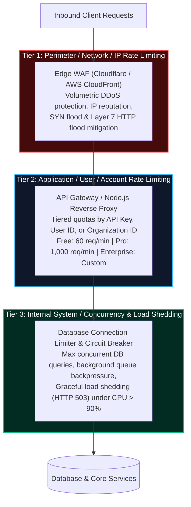
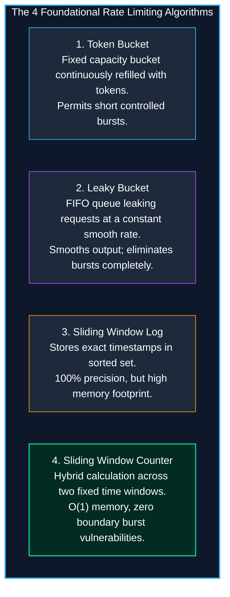

import { Callout } from 'fumadocs-ui/components/callout';
import { Tabs, Tab } from 'fumadocs-ui/components/tabs';
import { Steps, Step } from 'fumadocs-ui/components/steps';

Every exposed backend service possesses finite hardware capacity. CPU cores can only compute so many bcrypt hashes per second, database connection pools have hard limits, and outbound network interfaces saturate under heavy egress.

Without defensive traffic policing, malicious actors can take down applications through volumetric **Denial of Service (DoS)**, brute-force credential stuffing attacks, or automated inventory scraping. Implementing resilient rate limiting and traffic shaping is the definitive defense against resource exhaustion.

---

## 1. Multi-Tier Defense Architecture

Rate limiting cannot be solved with a single middleware guard at the application layer. Enterprise architectures employ a **Multi-Tier Defense-in-Depth** model:



### The Limitations of Pure IP-Based Rate Limiting

While IP-based rate limiting is common, relying solely on client IP addresses exposes two major vulnerabilities:

1. **The Shared IP Problem (NAT & Corporate VPNs):** Thousands of employees at a corporate headquarters or university campus often share a single egress NAT gateway IP. If your server rate-limits that IP address, one aggressive user can lock out every employee in the company.
2. **Mobile Carrier Gateways (Carrier-Grade NAT / CGNAT):** Mobile phone operators route millions of cell phones through dynamic pools of shared public IP addresses.
3. **Distributed Botnet Rotation:** Modern attackers leverage distributed residential proxy networks (such as BrightData or Tor) to cycle through millions of unique IP addresses, issuing only 1 request per IP every few minutes.

<Callout type="info" title="The Tiering Solution: Identity-First Limiting">
For unauthenticated public routes (`/login`, `/register`, `/forgot-password`), combine IP address with fingerprinting (User-Agent, TLS JA3 hash). Once a user is authenticated, **always rate limit by authenticated Principal (`userId` or `apiKeyId`)** instead of client IP.
</Callout>

---

## 2. Rate Limiting Algorithms: Mechanics & Trade-Offs

Choosing the correct rate limiting algorithm depends on the nature of your workload and the performance budget of your cache tier.



### 1. Token Bucket
- **How it works:** A bucket has maximum capacity $B$ and is continuously refilled with tokens at rate $r$ (tokens per second). When a request arrives, it attempts to consume 1 token. If tokens are available, the request proceeds; if empty, the request is rejected with `429 Too Many Requests`.
- **Best for:** APIs that want to allow short bursts of legitimate traffic (e.g., initial page loads making 15 parallel API calls) while enforcing a strict sustained average. Used by AWS and Stripe.

### 2. Leaky Bucket
- **How it works:** Requests enter a First-In, First-Out (FIFO) queue of fixed capacity. Requests leak out of the bucket and are processed at a steady, fixed rate. If incoming requests arrive faster than the leak rate and the buffer fills up, new requests overflow and are dropped.
- **Best for:** Downstream services that require an absolutely smooth, predictable stream of writes (e.g., streaming data to a legacy third-party system).

### 3. Sliding Window Log
- **How it works:** Every request timestamp is recorded in a Redis Sorted Set (`ZSET`). When a request arrives, the server removes all elements older than $\text{currentTime} - \text{windowSize}$, counts the remaining items, and approves or denies the request.
- **Pros & Cons:** 100% mathematically exact; never allows boundary bursts. However, storing every timestamp in memory consumes significant RAM: 10,000 requests per minute require 10,000 Redis elements.

### 4. Sliding Window Counter (The Production Standard)
Combines the low memory overhead of fixed windows with the smoothness of sliding window logs. It approximates request counts by blending the previous window's counter with the current window's counter:

$$\text{Estimated Requests} = \text{Count}_{\text{current}} + \text{Count}_{\text{previous}} \times \left(1 - \frac{\text{ElapsedTimeInCurrentWindow}}{\text{WindowSize}}\right)$$

```
        SLIDING WINDOW COUNTER INTERPOLATION
        +-----------------------------------+-----------------------------------+
        | Previous Window (12:00 - 12:01)   | Current Window (12:01 - 12:02)    |
        | Count: 80 requests                | Count: 30 requests (at 12:01:18)  |
        +-----------------------------------+-----------------------------------+
                                            |<--- 30% into window (18s / 60s) ->|
                                            
        Remaining weight of previous window: 100% - 30% = 70%
        Estimated count = 30 + (80 * 0.70) = 30 + 56 = 86 requests.
        If limit is 100 req/min -> Request is APPROVED (86 <= 100).
```

### Comparison Matrix

| Dimension | Token Bucket | Leaky Bucket | Sliding Window Log | Sliding Window Counter |
| :--- | :--- | :--- | :--- | :--- |
| **Memory Footprint** | $O(1)$ (Tokens + Timestamp) | $O(N)$ (Queue buffer size) | $O(N)$ (All timestamps in window) | **$O(1)$ (2 counter integers)** |
| **CPU Overhead** | Extremely low | Low | High ($ZREMRANGEBYSCORE$) | **Extremely low** |
| **Burst Handling** | Permits controlled bursts up to bucket capacity | Completely smooths out; buffers or drops bursts | Rejects bursts exceeding window limit | Rejects bursts exceeding window limit |
| **Boundary Burst Flaw?** | No | No | No | **No (Solves Fixed Window flaw)** |
| **Typical Use Case** | Cloud APIs (Stripe, AWS) | Job queues, batch data pipelines | Low-volume high-security endpoints | **High-volume API gateways** |

---

## 3. Production Redis Lua Atomic Rate Limiter in TypeScript

Why is a **Redis Lua script** mandatory for production rate limiting?

If you implement rate limiting in separate Node.js commands:
```typescript
// ❌ RACE CONDITION ANTI-PATTERN:
const count = await redis.get(key);
if (count > limit) return 429;
await redis.incr(key); // A concurrent request could execute between get and incr!
```
Under concurrent load (e.g. 50 parallel requests within 2 milliseconds), multiple requests read `count = 99` simultaneously and all succeed, bypassing the rate limit!

By executing the logic inside a **Redis Lua script**, Redis guarantees **ACID atomicity**: the script executes uninterrupted on the single-threaded engine, preventing all race conditions without the latency penalty of distributed locks.

### The Atomic Sliding Window Lua Script

Save this script as `sliding_window.lua` or execute it directly via `eval`:

```lua
-- Keys:
-- KEYS[1]: Current window key (e.g., rate:usr_42:1712345640)
-- KEYS[2]: Previous window key (e.g., rate:usr_42:1712345580)
-- Arguments:
-- ARGV[1]: Max limit allowed
-- ARGV[2]: Window size in seconds
-- ARGV[3]: Current time in seconds
-- ARGV[4]: Current window start time in seconds

local current_key = KEYS[1]
local prev_key = KEYS[2]
local limit = tonumber(ARGV[1])
local window_size = tonumber(ARGV[2])
local current_time = tonumber(ARGV[3])
local window_start = tonumber(ARGV[4])

-- 1. Fetch counters
local current_count = tonumber(redis.call('get', current_key) or '0')
local prev_count = tonumber(redis.call('get', prev_key) or '0')

-- 2. Calculate time elapsed in current window
local time_elapsed = current_time - window_start
local weight = (window_size - time_elapsed) / window_size
if weight < 0 then weight = 0 end

-- 3. Calculate estimated total requests
local estimated_count = math.floor(current_count + (prev_count * weight))

-- 4. Check if limit exceeded
if estimated_count >= limit then
  local retry_after = math.ceil(window_size - time_elapsed)
  return { 0, limit, 0, retry_after } -- [0 = blocked, limit, remaining = 0, retry_after]
end

-- 5. Increment current window counter and set expiration (2x window size for safety)
current_count = redis.call('incr', current_key)
if current_count == 1 then
  redis.call('expire', current_key, window_size * 2)
end

local remaining = limit - (estimated_count + 1)
if remaining < 0 then remaining = 0 end

return { 1, limit, remaining, 0 } -- [1 = allowed, limit, remaining, retry_after = 0]
```

### Complete TypeScript Express Rate Limiting Middleware

```typescript
import { Request, Response, NextFunction } from 'express';
import Redis from 'ioredis';

const redis = new Redis(process.env.REDIS_URL || 'redis://localhost:6379');

// Define Lua script
const LUA_SLIDING_WINDOW = `
  local current_key = KEYS[1]
  local prev_key = KEYS[2]
  local limit = tonumber(ARGV[1])
  local window_size = tonumber(ARGV[2])
  local current_time = tonumber(ARGV[3])
  local window_start = tonumber(ARGV[4])

  local current_count = tonumber(redis.call('get', current_key) or '0')
  local prev_count = tonumber(redis.call('get', prev_key) or '0')

  local time_elapsed = current_time - window_start
  local weight = (window_size - time_elapsed) / window_size
  if weight < 0 then weight = 0 end

  local estimated_count = math.floor(current_count + (prev_count * weight))

  if estimated_count >= limit then
    local retry_after = math.ceil(window_size - time_elapsed)
    return { 0, limit, 0, retry_after }
  end

  current_count = redis.call('incr', current_key)
  if current_count == 1 then
    redis.call('expire', current_key, window_size * 2)
  end

  local remaining = limit - (estimated_count + 1)
  if remaining < 0 then remaining = 0 end

  return { 1, limit, remaining, 0 }
`;

export interface RateLimitOptions {
  windowSeconds: number;
  maxRequests: number;
  keyGenerator?: (req: Request) => string;
}

export function createRateLimiter(options: RateLimitOptions) {
  const {
    windowSeconds,
    maxRequests,
    keyGenerator = (req: Request) => req.ip || '127.0.0.1',
  } = options;

  return async (req: Request, res: Response, next: NextFunction): Promise<void> => {
    try {
      const clientIdentifier = keyGenerator(req);
      const nowSeconds = Math.floor(Date.now() / 1000);
      
      // Calculate start of current window and previous window
      const currentWindowStart = Math.floor(nowSeconds / windowSeconds) * windowSeconds;
      const prevWindowStart = currentWindowStart - windowSeconds;

      const currentKey = `ratelimit:${clientIdentifier}:${currentWindowStart}`;
      const prevKey = `ratelimit:${clientIdentifier}:${prevWindowStart}`;

      // Execute atomic Redis Lua script
      const result = (await redis.eval(
        LUA_SLIDING_WINDOW,
        2,
        currentKey,
        prevKey,
        maxRequests,
        windowSeconds,
        nowSeconds,
        currentWindowStart
      )) as [number, number, number, number];

      const [allowed, limit, remaining, retryAfter] = result;

      // Always set standard rate limit diagnostic headers
      res.setHeader('X-RateLimit-Limit', limit.toString());
      res.setHeader('X-RateLimit-Remaining', remaining.toString());
      res.setHeader('X-RateLimit-Reset', (currentWindowStart + windowSeconds).toString());

      if (allowed === 0) {
        // Enforce Retry-After header in seconds
        res.setHeader('Retry-After', retryAfter.toString());

        res.status(429).json({
          type: 'https://api.example.com/errors/rate-limit-exceeded',
          title: 'Too Many Requests',
          status: 429,
          detail: `Rate limit of ${limit} requests per ${windowSeconds}s exceeded. Try again in ${retryAfter} seconds.`,
          retryAfterSeconds: retryAfter,
          instance: req.originalUrl,
        });
        return;
      }

      next();
    } catch (error) {
      // Fail-open strategy: If Redis is temporarily unreachable, log an alert
      // but do not block legitimate users from accessing the application
      console.error('[RATE_LIMIT_ERROR] Failed to contact Redis:', error);
      next();
    }
  };
}
```

### Route-Specific Tiering Example

Attach specific rate limiters based on endpoint sensitivity:

```typescript
import express from 'express';

const app = express();

// Tier A: Strict rate limiter for sensitive authentication endpoints
const authLimiter = createRateLimiter({
  windowSeconds: 60,
  maxRequests: 5, // Max 5 login attempts per minute per IP
  keyGenerator: (req) => `auth:${req.ip}`,
});

// Tier B: Standard authenticated user API tier
const apiLimiter = createRateLimiter({
  windowSeconds: 60,
  maxRequests: 120, // 120 req/min for signed-in users
  keyGenerator: (req) => {
    const user = (req as any).user;
    return user ? `user:${user.id}` : `ip:${req.ip}`;
  },
});

app.post('/api/v1/auth/login', authLimiter, (req, res) => {
  // Login handler...
});

app.get('/api/v1/products', apiLimiter, (req, res) => {
  // Product list handler...
});
```

---

## 4. DoS Defense & Rate Limiting Checklist

<Steps>
  <Step>
    ### Implement Multi-Tier Defense
    Defend at the edge using WAF for volumetric Layer 7 attacks, at the API Gateway for principal-based tiering, and at the database layer via connection pool limits.
  </Step>
  <Step>
    ### Choose the Right Algorithm
    Use **Sliding Window Counter** for standard public APIs to guarantee $O(1)$ memory consumption and eliminate fixed-window boundary spikes. Use **Token Bucket** when controlled bursts are required.
  </Step>
  <Step>
    ### Enforce Atomicity via Redis Lua Scripts
    Never read and increment rate limits in separate application queries. Use atomic Redis Lua scripts to eliminate race conditions under concurrent spikes.
  </Step>
  <Step>
    ### Return Standard HTTP Rate Limit Headers
    Always supply `X-RateLimit-Limit`, `X-RateLimit-Remaining`, `X-RateLimit-Reset`, and HTTP `429 Too Many Requests` accompanied by the `Retry-After` header.
  </Step>
  <Step>
    ### Adopt Fail-Open Architecture for Redis Downtime
    If Redis experiences a network partition, catch the exception and log an alert to Sentry/Datadog while letting traffic proceed rather than taking down the entire service.
  </Step>
</Steps>
