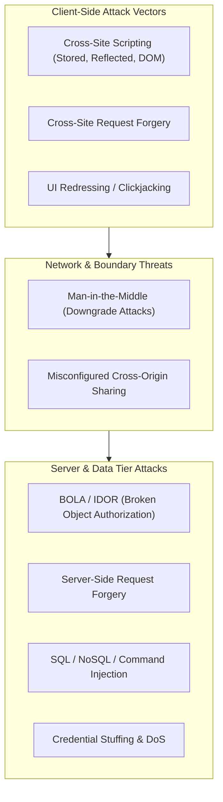

import { Callout } from 'fumadocs-ui/components/callout';
import { Cards, Card } from 'fumadocs-ui/components/card';
import { Steps, Step } from 'fumadocs-ui/components/steps';

Production web security operates under a zero-trust model: **never trust input originating from the client, never trust third-party scripts implicitly, and assume attacker visibility into all public network traffic.**

This guide details the core defensive controls required to protect full-stack web applications across both client and server tiers.

---

## The Threat Landscape: OWASP Top 10

Full-stack applications face attacks across browser DOM runtimes, network boundaries, and server execution environments:



---

## Core Defensive Controls

### 1. Cross-Site Scripting (XSS) Prevention
- **Framework Auto-Escaping:** Modern frameworks like React escape interpolated values in JSX by default. Avoid `dangerouslySetInnerHTML`.
- **Content Security Policy (CSP):** Restrict script execution sources via HTTP headers with cryptographic nonces:
  ```http
  Content-Security-Policy: default-src 'self'; script-src 'self' 'nonce-random123' 'strict-dynamic'; object-src 'none'; base-uri 'none';
  ```
- **Context-Aware Sanitization:** When user-submitted HTML is required (e.g., rich text editors), sanitize exclusively on the server using hardened engines such as `DOMPurify` (with JSDOM) or `sanitize-html`.

### 2. Cross-Site Request Forgery (CSRF)
- **SameSite Cookies:** Set `SameSite=Lax` or `SameSite=Strict` on session cookies.
- **CSRF Tokens:** For state-changing requests (`POST`, `PUT`, `DELETE`), validate an HMAC-signed Double-Submit Cookie or Synchronizer Token in request headers (`X-CSRF-Token`).
- **Server Actions CSRF Protection:** Modern Next.js Server Actions automatically check incoming `Origin` and `Host` headers to prevent unauthorized cross-origin execution.

### 3. Cross-Origin Resource Sharing (CORS) Demystified
<Callout type="warn" title="CORS Is Not Server Security">
CORS is a browser mechanism that **protects users from malicious origins reading private intranet or session data**. It does not prevent attackers from sending requests using `curl`, Python, or Postman. Never rely on CORS as authorization.
</Callout>

```typescript
// Explicit origin allowlisting in Node.js / Express
const allowedOrigins = new Set([
  'https://app.example.com',
  'https://admin.example.com',
]);

function corsMiddleware(req, res, next) {
  const origin = req.headers.origin;
  if (origin && allowedOrigins.has(origin)) {
    res.setHeader('Access-Control-Allow-Origin', origin);
    res.setHeader('Access-Control-Allow-Credentials', 'true');
    res.setHeader('Access-Control-Allow-Methods', 'GET, POST, PUT, DELETE, OPTIONS');
    res.setHeader('Access-Control-Allow-Headers', 'Content-Type, Authorization, X-CSRF-Token');
  }
  if (req.method === 'OPTIONS') {
    return res.status(204).end();
  }
  next();
}
```

### 4. Hardened Security Headers
Every production web service should serve the standard suite of defensive headers:

| Header | Production Recommended Value | Purpose |
| :--- | :--- | :--- |
| `Strict-Transport-Security` | `max-age=63072000; includeSubDomains; preload` | Forces HTTPS and prevents SSL stripping |
| `X-Content-Type-Options` | `nosniff` | Prevents MIME-type confusion attacks |
| `X-Frame-Options` | `DENY` | Prevents framing and clickjacking |
| `Referrer-Policy` | `strict-origin-when-cross-origin` | Protects sensitive URL params from leaking |
| `Permissions-Policy` | `camera=(), microphone=(), geolocation=()` | Restricts hardware browser APIs |

---

## Defensive Engineering Checklist

<Steps>
<Step>
### Enforce Strict Boundary Validation
Use Zod or Pydantic on every API route and Server Action to parse incoming requests. Reject unexpected fields to eliminate mass-assignment vulnerabilities.
</Step>

<Step>
### Authorize at the Data Layer (Prevent IDOR / BOLA)
Never trust user-supplied IDs like `/api/orders/:id`. Always verify that `order.userId === currentUser.id` in database query clauses before returning or modifying records. Return `404 Not Found` for missing or unowned entities.
</Step>

<Step>
### Rate Limit Sensitive Endpoints
Apply IP-based and user-based token bucket or sliding window rate limiting on authentication routes (`/api/login`, `/api/reset-password`) using Redis Lua scripts or Cloudflare WAF to prevent brute-force credential stuffing.
</Step>
</Steps>

---

## Lessons in This Track

<Cards>
  <Card
    title="01. Trust Boundaries & Injection Attacks"
    href="/docs/full-stack-development/web-security/01-trust-boundaries-and-injection-attacks"
    description="Threat modeling across trust boundaries, SQL injection with AST separation, NoSQL operator injection, OS command injection, BOLA/IDOR authorization, and SSRF cloud metadata protection."
  />
  <Card
    title="02. XSS, CSRF & CORS Defenses"
    href="/docs/full-stack-development/web-security/02-xss-csrf-and-cors-defenses"
    description="Stored, Reflected, and DOM-based XSS walkthroughs, DOMPurify HTML sanitization, CSP Level 3 nonces, CSRF Double-Submit Cookie middleware, and deep-dive CORS preflight engineering."
  />
  <Card
    title="03. Rate Limiting & DoS Defense"
    href="/docs/full-stack-development/web-security/03-rate-limiting-and-dos-defense"
    description="Multi-tier defense architecture, Token Bucket vs. Leaky Bucket vs. Sliding Window algorithms, and production Redis Lua atomic rate-limiting middleware in TypeScript with standard 429 headers."
  />
</Cards>
