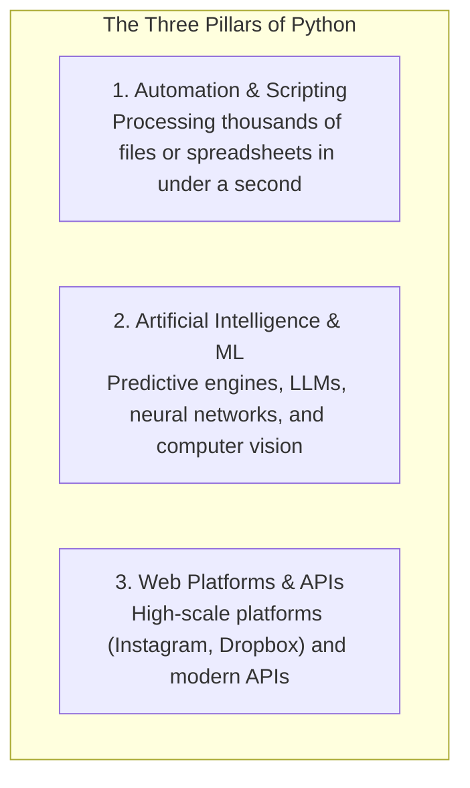

import { Callout } from 'fumadocs-ui/components/callout';
import { Tabs, Tab } from 'fumadocs-ui/components/tabs';
import { Steps, Step } from 'fumadocs-ui/components/steps';

Python is one of the most popular programming languages on the planet. Every single day, engineers and researchers use it to accomplish extraordinary things across three distinct pillars:



> *"You're not too old or too young, and Python is super easy to learn. You can write your first Python program in literally seconds."*  
> — Mosh Hamedani

---

## What You Will Build

Learning syntax without context is dry and forgettable. To keep our sights set on real software engineering, this curriculum guides you toward building substantive software across three practical domains:

1. **The Storefront Application**: A clean web application with a catalog and administrative management (built with modern Python web tooling).
2. **The Recommender Engine**: A machine-learning script that analyzes user profiles and predicts media preferences (like Spotify or YouTube).
3. **The Automator**: A high-speed CLI tool that parses, extracts, and summarizes thousands of files in constant memory.

---

## Two Installations: The Interpreter and the IDE

Two tools stand between you and your first running program:
1. **The Language Interpreter**: The engine that knows how to read and execute Python instructions.
2. **An IDE or Code Editor**: Where you comfortably write, inspect, and debug your code.

<Callout type="info" title="What is the Python Interpreter?">
Computers do not speak English, and silicon CPUs do not understand Python directly. The **interpreter** is a specialized native executable (`python` or `python.exe`) that translates your human-readable Python code into machine instructions that the computer's CPU can execute.
</Callout>

### Step 1: Install Modern Python & The `uv` Toolchain

Historically, Python developers wrestled with complex installations and PATH errors. Today, the modern standard is **`uv`** (by Astral) — an ultra-fast Rust-native tool that automatically manages Python versions, virtual environments, and packages in milliseconds.

<Tabs items={['macOS / Linux', 'Windows (PowerShell)', 'Traditional python.org']}>
<Tab value="macOS / Linux">
```bash
# Install uv
curl -LsSf https://astral.sh/uv/install.sh | sh

# Install Python 3.12+ automatically
uv python install 3.12

# Verify installation
uv run python --version
```
</Tab>
<Tab value="Windows (PowerShell)">
```powershell
# Install uv via standalone installer
powershell -ExecutionPolicy ByPass -c "irm https://astral.sh/uv/install.ps1 | iex"

# Install Python 3.12+ automatically
uv python install 3.12

# Verify installation
uv run python --version
```
</Tab>
<Tab value="Traditional python.org">
1. Head to **[python.org/downloads](https://python.org/downloads)** and download Python 3.12+.
2. **Crucial on Windows**: During installation, tick the checkbox labelled **"Add python.exe to PATH"**. If you miss this checkbox, your terminal will not be able to find the Python interpreter when you type `python`.
</Tab>
</Tabs>

### Step 2: Choose Your Editor (IDE)

A code editor is to an engineer what Microsoft Word is to a writer. An **Integrated Development Environment (IDE)** is a code editor on steroids: it includes syntax highlighting, code completion, a built-in terminal, and interactive debuggers.

- **VS Code** (Free, lightweight, industry standard): Install the official *Python* and *Ruff* extensions.
- **PyCharm Community** (Free, dedicated Python IDE from JetBrains): Excellent out-of-the-box refactoring and interpreter management.
- **Cursor / Zed**: Modern AI-first editors.

---

## Creating Your First Project Directory

Open your terminal and create a folder for your practice code:

```bash
mkdir hello_python
cd hello_python
```

Create a new file named `app.py`:

```bash
# On Linux/macOS
touch app.py

# On Windows PowerShell
New-Item app.py
```

<Callout type="note" title="Why .py?">
By convention, every Python source file carries the <code>.py</code> extension. This tells your operating system and code editor that the file contains Python source code.
</Callout>

---

## Core Definitions to Remember

| Term | Meaning |
| :--- | :--- |
| **Interpreter** | The program that translates Python instructions into binary machine instructions the CPU can execute. |
| **IDE** | Integrated Development Environment — an editor with integrated tooling (terminal, debugger, linters) to make writing code ergonomic. |
| **`.py`** | The standard file extension for Python source files. |
| **`PATH`** | An operating system environment variable listing the directories where executable programs live. |

With your environment ready, proceed to **[02. Your First Program & Execution Model](/docs/learn-python/01-fundamentals/02-first-program-and-execution)**!
