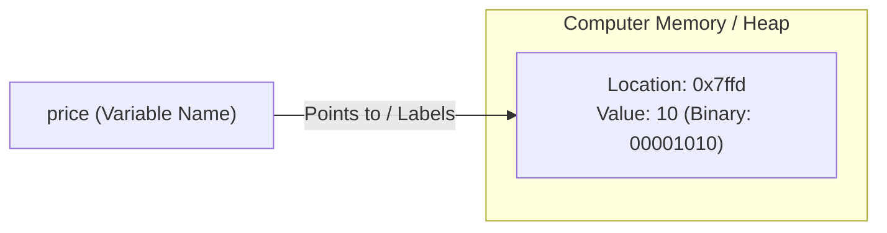

import { Callout } from 'fumadocs-ui/components/callout';
import { Accordion, Accordions } from 'fumadocs-ui/components/accordion';

Variables are one of the most fundamental concepts in computer programming. They are not unique to Python; they exist in virtually every programming language in the world.

A variable **temporarily stores data in the computer's memory (RAM)** while your program runs.

Type the following lines into `app.py`:

```python
price = 10
print(price)
```

Run the program:

```text
10
```

---

## Mental Model: A Box with a Label

When the Python interpreter executes the line `price = 10`, three specific things happen:



1. **Memory Allocation**: Python reserves a small chunk of space in the computer's RAM.
2. **Value Storing**: It places the value `10` inside that memory location.
3. **Label Attachment**: It binds the name `price` as a label pointing to that location.

### Why Are There No Quotes Around `price` in `print()`?

Notice that we wrote `print(price)` without quotes:
- If you write `print("price")` with quotes, Python prints the literal string characters `price`.
- If you write `print(price)` without quotes, Python looks up the variable label in memory, retrieves the stored value (`10`), and prints the value.

---

## Under the Hood: Decimal to Binary

Before the number `10` lands in RAM, it undergoes a transformation. Humans count in decimal (base 10, using digits 0 through 9). However, physical computer memory consists of microscopic transistors that can only be ON (1) or OFF (0).

When Python stores `10`, it converts the decimal number into binary bits:

> **Decimal `10` → Binary `1010` (base 2)**

It then writes those electrical bits into RAM. When you print `price`, Python reads the bits from memory, converts them back to human-readable decimal `10`, and displays it.

---

## Reassignment: Last Assignment Wins

Watch what happens when you reassign a variable:

```python
price = 10
price = 20
print(price)
```

Run the program:

```text
20
```

Remember our cardinal rule: **code executes line by line, from the top**.
1. Line 1: `price` is bound to `10`.
2. Line 2: `price` is rebound to `20`.
3. Line 3: `print(price)` prints `20`. The last assignment always wins.

---

## The Four Core Data Types

In Python, every value has a specific **type**. In these early stages, four core data types form the backbone of nearly all programs:

| Type | What It Holds | Example | Notes |
| :--- | :--- | :--- | :--- |
| **`int`** | Whole integers (positive or negative, no decimal point) | `price = 10` | Short for "integer". Can be arbitrarily large in Python. |
| **`float`** | Real numbers with a fractional decimal point | `rating = 4.9` | Short for "floating-point number". |
| **`str`** | Text (a sequence of characters) | `name = "Mosh"` | Short for "string". Defined using single or double quotes. |
| **`bool`** | Binary truth values (yes / no) | `is_published = True` | Short for "boolean". Must be capitalized: `True` or `False`. |

### Case Sensitivity & Naming Conventions

Python is strictly **case-sensitive**:
- `True` and `False` are valid booleans. Lowercase `true` or `false` will produce a `NameError` because Python treats them as undefined variable names.
- Variable names should always be **lowercase**, with multiple words separated by an underscore (`snake_case`):

```python
# ✅ Pythonic snake_case
user_age = 25
is_logged_in = False

# ❌ Non-pythonic (avoid in Python)
userAge = 25
IsLoggedIn = False
```

---

## Hands-On Exercise 02

Imagine a hospital check-in system that records a new patient with the following details:
- **Name**: John Smith
- **Age**: 20 years old
- **Status**: He is a **new** patient (has never visited before).

In `app.py`, define three variables with appropriate names and data types to represent this patient.

<Accordions>
<Accordion title="Reveal Solution & Explanation">

```python
# app.py
full_name = "John Smith"
age = 20
is_new = True

print("Patient:", full_name)
print("Age:", age)
print("New Patient?", is_new)
```

Output:

```text
Patient: John Smith
Age: 20
New Patient? True
```

**Why this solution is idiomatic:**
- `full_name` (or `name`): A descriptive string (`str`).
- `age`: An integer (`int`) since age in whole years does not need decimal points.
- `is_new`: A boolean (`bool`) with value `True`, which is the ideal data type for two-state flags (yes/no, active/inactive).

</Accordion>
</Accordions>

---

## Summary Reference

- **Variable**: A named label bound to a value in computer memory.
- **`int`**: Whole numbers (`42`).
- **`float`**: Numbers with decimals (`3.14`).
- **`str`**: Text wrapped in quotes (`"hello"`).
- **`bool`**: Capitalized `True` or `False`.
- **`snake_case`**: The official naming standard for Python variables.

Next, learn how to interact with the user and diagnose errors in **[04. Receiving Input & Type Conversion](/docs/learn-python/01-fundamentals/04-receiving-input-and-type-conversion)**!
