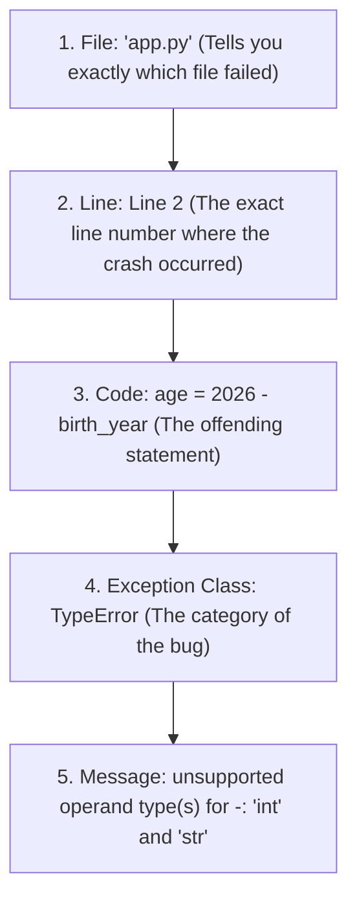

import { Callout } from 'fumadocs-ui/components/callout';
import { Accordion, Accordions } from 'fumadocs-ui/components/accordion';

You can print messages to the screen; now let's teach your program to **listen**.

To interact with a human user, Python provides the built-in `input()` function. Type the following into `app.py`:

```python
name = input("What is your name? ")
print("Hi " + name)
```

Run the program:

```text
What is your name? Mosh
Hi Mosh
```

*(Note: In the terminal above, `Mosh` is the text typed by the user before pressing Enter).*

---

## Functions Are Buttons on a Remote

Think back to the television remote control analogy:
- A remote has buttons for power, volume, and input sources.
- Python ships with built-in buttons for common tasks: `print()` to display output, `input()` to receive input.
- Whenever you attach parentheses `()` after a function name, you are **calling** the function — you are pressing the button.

### What Happens Behind the Scenes:
1. `input("What is your name? ")` prints the prompt text on the terminal screen and **pauses execution**.
2. The interpreter waits for the user to type on the keyboard and press <kbd>Enter</kbd>.
3. Once Enter is pressed, `input()` **returns** whatever text the user typed.
4. The returned value is stored in our variable `name`.
5. `"Hi " + name` combines (**concatenates**) the two strings together into a single greeting.

<Callout type="tip" title="Polish Detail: The Trailing Space">
Notice the deliberate space after the question mark: <code>input("What is your name? ")</code>. Without that space, the user's cursor would immediately touch the question mark (<code>What is your name?Mosh</code>). Small polish details like this make software feel professional.
</Callout>

---

## Hands-On Exercise 03

Extend `app.py` so that it asks **two** questions:
1. The user's name.
2. The user's favorite color.

Then print a sentence like: `Mosh likes blue`.

<Accordions>
<Accordion title="Reveal Solution & Explanation">

```python
# app.py
name = input("What is your name? ")
favorite_color = input("What is your favorite color? ")

print(name + " likes " + favorite_color)
```

Terminal execution:

```text
What is your name? Mosh
What is your favorite color? blue
Mosh likes blue
```

Notice how we added spaces around `" likes "` so the words do not collide.

</Accordion>
</Accordions>

---

## Type Conversion & Reading Error Maps

Now let's write a program that asks for the user's birth year and calculates their approximate age:

```python
birth_year = input("Birth year: ")
age = 2026 - birth_year
print(age)
```

Run the program, type `1995`, and press <kbd>Enter</kbd>:

```text
Traceback (most recent call last):
  File "app.py", line 2, in <module>
    age = 2026 - birth_year
TypeError: unsupported operand type(s) for -: 'int' and 'str'
```

### The 5-Point Anatomy of a Traceback

Many beginners panic when they see red error text in their terminal. In software engineering, **an error traceback is not a failure — it is a diagnostic map.**



Reading the map:
1. **File**: `app.py` (In large software projects with hundreds of files, this pinpoints the file).
2. **Line**: Line 2.
3. **Code**: The interpreter reprints the exact line that caused the crash.
4. **Exception Type**: `TypeError` — we tried to perform an operation on incompatible types.
5. **Message**: `unsupported operand type(s) for -: 'int' and 'str'`. You cannot subtract a string (`str`) from an integer (`int`).

---

## Why Did It Break?

Whenever a user types into a terminal, `input()` **ALWAYS returns a string (`str`)**, even if the user typed numbers!

So in line 1, `birth_year` did not receive the integer `1995`. It received the four-character text string `"1995"`.

At runtime, line 2 evaluated to:

> `age = 2026 - "1995"`

In Python, you cannot perform mathematical subtraction between a number and a piece of text.

---

## The Solution: Conversion Functions

Python provides built-in conversion functions to cast values between data types:

| Function | Converts To | Example | Output |
| :--- | :--- | :--- | :--- |
| `int(x)` | Integer | `int("1995")` | `1995` (number) |
| `float(x)` | Floating-point | `float("19.99")` | `19.99` |
| `str(x)` | String | `str(100)` | `"100"` |
| `bool(x)` | Boolean | `bool(1)` | `True` |

Let's fix our program by wrapping `birth_year` in `int()`:

```python
birth_year = input("Birth year: ")
age = 2026 - int(birth_year)
print(age)
```

Run it again:

```text
Birth year: 1995
31
```

It works cleanly!

### Inspecting Types with `type()`

To inspect what data type a variable holds at any moment, pass it to Python's built-in `type()` function:

```python
birth_year = input("Birth year: ")
print(type(birth_year))  # Before conversion

converted_year = int(birth_year)
print(type(converted_year))  # After conversion
```

Output:

```text
Birth year: 1995
<class 'str'>
<class 'int'>
```

---

## Hands-On Exercise 04

Write a weight converter program:
1. Ask the user for their weight in pounds (`lbs`).
2. Convert that weight into kilograms (`1 lb ≈ 0.45 kg`).
3. Print the resulting weight in kilograms on the terminal.

<Accordions>
<Accordion title="Reveal Solution & Explanation">

```python
# app.py
weight_lbs = input("Weight in lbs: ")

# input() returns a string! Convert to float before multiplication:
weight_kg = float(weight_lbs) * 0.45

print("Weight in kg:", weight_kg)
```

Terminal output:

```text
Weight in lbs: 160
Weight in kg: 72.0
```

**Why `float()` instead of `int()`?**  
Weights often have fractional values (e.g., `160.5` lbs). Using `float()` allows your program to handle both whole numbers and decimals without crashing.

</Accordion>
</Accordions>

---

## Summary Reference

- **`input("...")`**: Halts execution, presents prompt, returns input as a `str`.
- **Traceback**: Diagnostic guide listing file, line number, exception type, and message.
- **Conversion Functions**: `int()`, `float()`, `str()`, `bool()`.
- **`type(x)`**: Returns the class/type of object `x`.

Next, dive deep into strings, indexing, and slicing in **[05. Strings: Quotes, Indexing & Slicing](/docs/learn-python/01-fundamentals/05-strings-quotes-indexes-slices)**!
