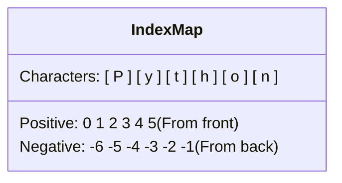

import { Callout } from 'fumadocs-ui/components/callout';
import { Accordion, Accordions } from 'fumadocs-ui/components/accordion';

Text data is ubiquitous in programming. Whether processing user emails, scraping website HTML, or parsing server log files, understanding how Python treats strings is essential.

In this lesson, we cover quote selection rules, multi-line strings, and the square-bracket syntax (`[]`) used for indexing and slicing.

---

## Choosing Quotes Deliberately

Python allows strings to be enclosed in either single quotes (`'...'`) or double quotes (`"..."`). While both are identical to the interpreter, you must choose deliberately when your string text contains quotation marks or apostrophes:

```python
# 1. Standard single or double quotes
course = 'Python for Beginners'

# 2. Apostrophe inside -> Use double quotes outside
course = "Python's Course for Beginners"

# 3. Inner double quotes -> Use single quotes outside
course = 'Python for "Beginners"'
```

<Callout type="warn" title="Syntax Error Trap">
If you write <code>course = 'Python's Course'</code>, Python interprets the second apostrophe as the end of the string. The remaining text (<code>s Course'</code>) becomes invalid syntax, causing a <code>SyntaxError: invalid syntax</code> crash!
</Callout>

---

## Triple Quotes for Multi-Line Strings

When you need a string that spans multiple lines — such as an email body, documentation block, or HTML template — use **triple quotes** (`'''...'''` or `"""..."""`):

```python
message = '''
Hi John,

This is our first notification email to you.

Best regards,
The Engineering Team
'''

print(message)
```

Output:

```text
Hi John,

This is our first notification email to you.

Best regards,
The Engineering Team
```

Triple quotes preserve all line breaks, indentation, and spaces exactly as you typed them.

---

## The Bidirectional Index Map

Strings in Python are ordered sequences of individual characters. You can retrieve any character at a specific position using **square brackets `[]`**.

Crucially, **Python indexing is zero-based** (the first character is at index `0`), and Python uniquely supports **negative indexing** (counting backwards from the end of the string).

### Character Index Map: `"Python"`



| Character | Positive Index (From Front) | Negative Index (From Back) |
| :---: | :---: | :---: |
| **`P`** | `0` | `-6` |
| **`y`** | `1` | `-5` |
| **`t`** | `2` | `-4` |
| **`h`** | `3` | `-3` |
| **`o`** | `4` | `-2` |
| **`n`** | `5` | `-1` |

Let's test this in Python:

```python
course = "Python for Beginners"

print(course[0])   # 'P' - The first character
print(course[-1])  # 's' - The last character
print(course[-2])  # 'r' - The second-to-last character
```

Output:

```text
P
s
r
```

---

## Slicing: Extracting Substrings

While single brackets retrieve one character, **slicing** extracts a range of characters:

```text
string[start:end]
```

<Callout type="tip" title="The Golden Rule of Slicing">
In a slice <code>string[start:end]</code>, the <strong>start index is INCLUDED</strong>, but the <strong>end index is EXCLUDED</strong>.
</Callout>

```python
course = "Python for Beginners"

# 1. From index 0 up to (but not including) index 3
print(course[0:3])

# 2. From index 1 all the way to the end (omitting end defaults to end of string)
print(course[1:])

# 3. From the beginning up to index 5 (omitting start defaults to 0)
print(course[:5])

# 4. Omitting both start and end creates a full clone
print(course[:])
```

Output:

```text
Pyt
ython for Beginners
Pytho
Python for Beginners
```

### Slice Step Syntax: `[start:end:step]`

Python also supports an optional third parameter: the `step`:

```python
numbers = "0123456789"

# Every second character
print(numbers[::2])  # '02468'

# Reverse a string effortlessly with step -1!
print(numbers[::-1])  # '9876543210'
```

---

## Hands-On Exercise 05

Without running the code, predict what the terminal will display when this program runs:

```python
name = "Jennifer"
print(name[1:-1])
```

<Accordions>
<Accordion title="Reveal Solution & Explanation">

Output:

```text
ennife
```

**Step-by-step breakdown:**
1. The string is `"Jennifer"`.
2. The index map of `"Jennifer"`:
   - Index `0`: `'J'`
   - Index `1`: `'e'`
   - Index `-1`: `'r'` (the last character)
3. The slice is `[1:-1]`.
4. Remember the rule: **Start is included, end is excluded!**
5. It starts at index 1 (`'e'`), continues through `'n'`, `'n'`, `'i'`, `'f'`, `'e'`, and **stops before index -1 (`'r'`)**.
6. The resulting slice is `"ennife"`.

</Accordion>
</Accordions>

---

## Summary Reference

- **Quotes**: Single `'...'` and double `"..."` can nest each other.
- **Triple Quotes**: `'''...'''` spans multiple lines and preserves whitespace.
- **`s[0]`**: First character.
- **`s[-1]`**: Last character.
- **`s[start:end]`**: Substring from `start` (inclusive) to `end` (exclusive).
- **`s[:]`**: Full copy of string `s`.
- **`s[::-1]`**: Reverses string `s`.

Next, discover the power of modern formatted strings and string methods in **[06. Formatted Strings & Methods](/docs/learn-python/01-fundamentals/06-formatted-strings-and-string-methods)**!
