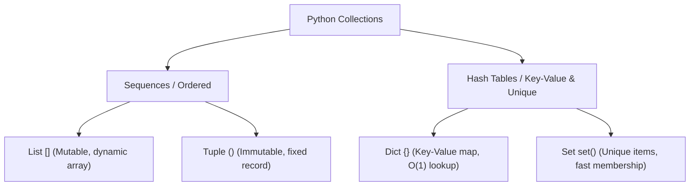

import { Callout } from 'fumadocs-ui/components/callout';
import { Tabs, Tab } from 'fumadocs-ui/components/tabs';

So far, our variables have held individual values (`10`, `"Mosh"`, `True`). But real software needs to manage groups of items: lists of shopping cart products, sets of active IP addresses, or database user records.

Python provides four built-in collection types:



---

## 1. Lists: Dynamic, Mutable Sequences

A **list** is an ordered, changeable sequence of items wrapped in square brackets `[]`:

```python
names = ["Alice", "Bob", "Charlie"]

print(names[0])   # 'Alice'
print(names[-1])  # 'Charlie'

# Lists are MUTABLE: you can modify them in place!
names[0] = "Alicia"
print(names)
```

Output:

```text
Alice
Charlie
['Alicia', 'Bob', 'Charlie']
```

### Common List Methods

```python
numbers = [1, 2, 3, 4]

numbers.append(5)        # Add to the end -> [1, 2, 3, 4, 5]
numbers.insert(0, 0)     # Insert at index 0 -> [0, 1, 2, 3, 4, 5]
last = numbers.pop()     # Remove and return the last item (5)
numbers.remove(2)        # Remove the first occurrence of value 2
print(numbers)
```

Output:

```text
[0, 1, 3, 4]
```

---

## 2. Tuples: Immutable Records

A **tuple** looks like a list, but is defined with parentheses `()`. The critical difference: **tuples are immutable** (they cannot be changed after creation).

```python
point = (10, 20)

print(point[0])

# ❌ ATTEMPTING TO MUTATE A TUPLE:
point[0] = 15
```

Terminal output:

```text
10
Traceback (most recent call last):
  File "app.py", line 6, in <module>
    point[0] = 15
TypeError: 'tuple' object does not support item assignment
```

### Elegant Tuple Unpacking

Tuples allow you to unpack multiple values into variables in a single, clean line:

```python
coordinates = (4, 9, 12)
x, y, z = coordinates

print(f"X: {x}, Y: {y}, Z: {z}")
```

Output:

```text
X: 4, Y: 9, Z: 12
```

---

## 3. Dictionaries: High-Speed Key-Value Maps

A **dictionary** (`dict`) stores relationships between **keys** and **values** using curly braces `{}`:

```python
customer = {
    "name": "John Smith",
    "age": 30,
    "is_verified": True
}

print(customer["name"])
```

Output:

```text
John Smith
```

### Safe Lookups with `.get()`

If you query a key that doesn't exist using square brackets, Python throws a `KeyError`. To avoid crashes, use `.get()` with an optional default fallback:

```python
# customer["birthdate"]  <- Crashes with KeyError!

# ✅ Safe access:
birthdate = customer.get("birthdate", "Jan 1, 1990")
print(birthdate)
```

Output:

```text
Jan 1, 1990
```

<Callout type="info" title="Under the Hood: O(1) Hash Map Speed">
Behind the scenes, Python dictionaries are implemented using **hash tables**. Looking up a key in a dictionary containing 10,000,000 entries takes almost the exact same fraction of a microsecond as looking up a key in a dictionary of 5 entries ($O(1)$ constant time complexity)!
</Callout>

---

## 4. Sets: Unique Collections & Set Theory

A **set** is an unordered collection of **unique** elements. Duplicate entries are automatically eliminated:

```python
numbers = [1, 2, 2, 3, 4, 4, 4, 5]
unique_numbers = set(numbers)

print(unique_numbers)
```

Output:

```text
{1, 2, 3, 4, 5}
```

### Mathematical Set Operations

```python
frontend_devs = {"Alice", "Bob", "Charlie"}
backend_devs = {"Bob", "David", "Eve"}

# 1. Intersection (&): Developers who know BOTH frontend and backend
fullstack = frontend_devs & backend_devs
print("Fullstack:", fullstack)

# 2. Union (|): All developers combined
all_devs = frontend_devs | backend_devs
print("All devs:", all_devs)

# 3. Difference (-): Frontend developers who do NOT do backend
pure_frontend = frontend_devs - backend_devs
print("Pure frontend:", pure_frontend)
```

Output:

```text
Fullstack: {'Bob'}
All devs: {'Alice', 'Bob', 'Charlie', 'David', 'Eve'}
Pure frontend: {'Alice', 'Charlie'}
```

---

## Comparison Matrix

| Collection | Syntax | Ordered? | Mutable? | Allows Duplicates? | Primary Use Case |
| :--- | :--- | :---: | :---: | :---: | :--- |
| **List** | `[1, 2, 3]` | Yes | **Yes** | Yes | Ordered sequences, shopping carts, stacks. |
| **Tuple** | `(1, 2, 3)` | Yes | **No** | Yes | Immutable coordinates, database row records. |
| **Dict** | `{"k": "v"}` | Yes (3.7+) | **Yes** | Keys: No, Vals: Yes | Fast lookups, JSON data, configurations. |
| **Set** | `{1, 2, 3}` | No | **Yes** | **No** | De-duplication, membership tests, Venn math. |

Next, let's learn how to direct program logic in **[08. Control Flow & Pattern Matching](/docs/learn-python/01-fundamentals/08-control-flow-and-pattern-matching)**!
