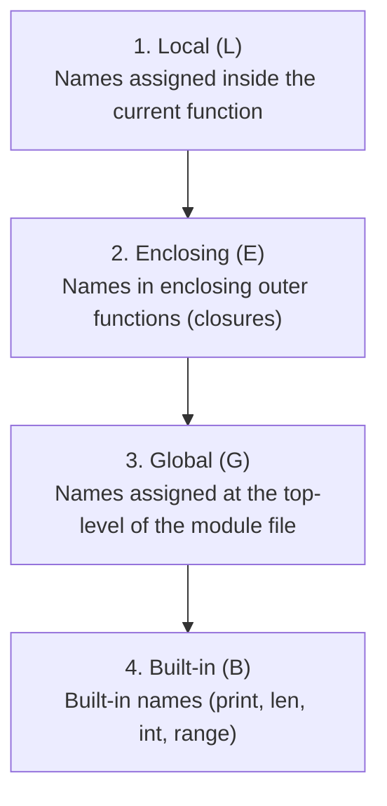

import { Callout } from 'fumadocs-ui/components/callout';
import { Tabs, Tab } from 'fumadocs-ui/components/tabs';

As your programs expand beyond a few lines, repeating code becomes a major source of bugs. Functions allow you to break your program into small, named, reusable blocks of logic.

---

## 1. Defining & Calling Functions

Use the `def` keyword to define a function, followed by its name, parentheses for parameters, and a colon:

```python
def greet_user(first_name, last_name):
    print(f"Hello, {first_name} {last_name}!")
    print("Welcome aboard.")

greet_user("John", "Smith")
```

Output:

```text
Hello, John Smith!
Welcome aboard.
```

### Parameters vs Arguments
- **Parameter**: The variable placeholder declared in the function definition (`first_name`, `last_name`).
- **Argument**: The actual value passed into the function during a call (`"John"`, `"Smith"`).

---

## 2. Return Values & `None`

Functions can compute and pass data back to the caller using the `return` statement:

```python
def square(number):
    return number * number

result = square(4)
print("Square:", result)
```

Output:

```text
Square: 16
```

<Callout type="note" title="Default Return: None">
If a Python function finishes execution without hitting an explicit <code>return</code> statement, it automatically returns <code>None</code>. In Python, <code>None</code> is a special object representing the absence of a value.
</Callout>

---

## 3. Positional vs. Keyword Arguments

When invoking a function, you can supply arguments positionally or explicitly by name:

```python
def calculate_price(price, tax=0.05, discount=0.0):
    return (price * (1 + tax)) - discount

# 1. Positional arguments (matched strictly by order)
print(calculate_price(100, 0.08, 10))

# 2. Keyword arguments (explicit, order doesn't matter)
print(calculate_price(price=100, discount=10, tax=0.08))
```

Output:

```text
98.0
98.0
```

---

## 4. The Infamous Mutable Default Argument Trap

Consider this seemingly innocent function:

```python
# ❌ DANGEROUS BUG: Default list evaluated once at definition!
def add_item(item, basket=[]):
    basket.append(item)
    return basket

print(add_item("Apple"))
print(add_item("Banana"))
```

Run this code:

```text
['Apple']
['Apple', 'Banana']
```

Notice what happened: the second call preserved `"Apple"` from the first call!

<Callout type="error" title="Why Did This Happen?">
In Python, default function arguments are <strong>evaluated only once when the function is defined</strong>, not every time it is called. That means the list <code>[]</code> is shared across all function calls that omit the second argument!
</Callout>

### The Idiomatic Fix: Use `None` as the Sentinel

```python
# ✅ IDIOMATIC PATTERN: Sentinel None
def add_item(item, basket=None):
    if basket is None:
        basket = []  # A fresh new list is created on every call
    basket.append(item)
    return basket

print(add_item("Apple"))
print(add_item("Banana"))
```

Output:

```text
['Apple']
['Banana']
```

---

## 5. Variable Scoping: The LEGB Rule

When Python encounters a variable name inside a function, it searches for it in four hierarchical scopes:



If the name is not found in any of these four tiers, Python raises a `NameError`.

---

## 6. Modern Python 3.12+ Type Annotations

Modern Python allows you to specify type annotations directly in your function signatures. This provides rich IDE autocompletion and enables static type checking with tools like `mypy` or `pyright`:

```python
def compute_inventory(
    items: list[str],
    prices: dict[str, float],
    tax_rate: float = 0.08
) -> float:
    total: float = sum(prices.get(item, 0.0) for item in items)
    return total * (1.0 + tax_rate)

receipt = compute_inventory(["pen", "notebook"], {"pen": 1.5, "notebook": 4.0})
print(f"Total: ${receipt:.2f}")
```

Output:

```text
Total: $5.94
```

---

## Summary Reference

- **`def func(arg):`**: Defines a function.
- **`return`**: Returns a value; returns `None` if omitted.
- **Keyword arguments**: Increase call-site readability (`func(rate=0.05)`).
- **Default arguments**: Never use mutable containers (`[]`, `{}`); always use `None` as a sentinel.
- **LEGB Scope**: Local → Enclosing → Global → Built-in.

Next, consolidate your foundational skills with the complete **[Quick Reference Cheat Sheet](/docs/learn-python/01-fundamentals/quick-reference)**!
