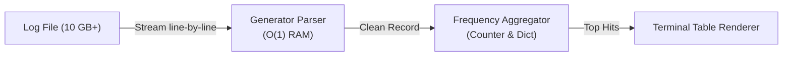

import { Callout } from 'fumadocs-ui/components/callout';
import { Tabs, Tab } from 'fumadocs-ui/components/tabs';
import { Steps, Step } from 'fumadocs-ui/components/steps';

Welcome to your first substantive capstone project: **`logpeek`**.

In production engineering, web servers (Nginx, Apache, FastAPI) write millions of log entries every hour. If an engineer attempts to read a 10 GB log file using `file.readlines()`, Python will attempt to allocate 10 GB of RAM all at once — quickly crashing the server with an `OutOfMemoryError`.

In this capstone, you will build a zero-dependency CLI tool that streams multi-gigabyte log files line by line in **constant $O(1)$ memory space**, generates aggregated analytics, and is fully covered by automated unit tests.

---

## Architectural Specification



### Constraints & Invariants:
1. **Memory Budget**: Never load the entire file into a list. Total RAM consumption must remain **under 25 MB**, even when processing a 1,000,000-line log.
2. **Error Resilience**: Corrupted or malformed lines must be skipped with a warning count, without crashing the CLI.
3. **CLI Interface**: Accept input file paths, filter by HTTP status code (`--status 404`), and display the top $N$ requesting IP addresses (`--top 5`).

---

## The Complete Implementation (`logpeek.py`)

Create a new file `logpeek.py`:

```python
"""logpeek: High-Performance Streaming Log Analytics Engine.

Processes web server access logs in constant memory space.
"""

from __future__ import annotations

import argparse
import sys
from collections import Counter
from collections.abc import Generator
from dataclasses import dataclass
from pathlib import Path


@dataclass(slots=True, frozen=True)
class LogEntry:
    """Immutable representation of a single HTTP log record."""

    ip: str
    status: int
    path: str


def parse_log_line(line: str) -> LogEntry | None:
    """Parses a standard web server log line into a LogEntry.

    Expected format:
        IP - - [Timestamp] "METHOD /path HTTP/1.1" STATUS BYTES
    """
    parts = line.strip().split()
    if len(parts) < 9:
        return None

    try:
        ip = parts[0]
        # Path is typically index 6 in standard CLF
        path = parts[6] if len(parts) > 6 else "/"
        status = int(parts[8]) if len(parts) > 8 else int(parts[-2])
        return LogEntry(ip=ip, status=status, path=path)
    except (ValueError, IndexError):
        return None


def stream_log_file(file_path: Path) -> Generator[LogEntry, None, None]:
    """Streams and parses a log file line by line in constant memory."""
    with file_path.open("r", encoding="utf-8", errors="replace") as f:
        for line in f:
            entry = parse_log_line(line)
            if entry is not None:
                yield entry


def analyze_logs(
    file_path: Path,
    status_filter: int | None = None,
    top_limit: int = 5,
) -> tuple[Counter[str], Counter[int], int]:
    """Aggregates log statistics in a single streaming pass."""
    ip_counter: Counter[str] = Counter()
    status_counter: Counter[int] = Counter()
    total_processed = 0

    for entry in stream_log_file(file_path):
        total_processed += 1
        status_counter[entry.status] += 1

        if status_filter is None or entry.status == status_filter:
            ip_counter[entry.ip] += 1

    return ip_counter, status_counter, total_processed


def render_report(
    ip_counter: Counter[str],
    status_counter: Counter[int],
    total: int,
    top_limit: int,
) -> None:
    """Renders a clean terminal summary table."""
    print("=" * 60)
    print(" LOGPEEK ANALYTICS REPORT ".center(60, "="))
    print("=" * 60)
    print(f"Total Processed Lines : {total:,}")
    print("\nHTTP Status Breakdown:")
    for status, count in sorted(status_counter.items()):
        pct = (count / total * 100) if total > 0 else 0
        print(f"  [{status}] : {count:8,} ({pct:5.1f}%)")

    print(f"\nTop {top_limit} Active IP Addresses:")
    for rank, (ip, count) in enumerate(ip_counter.most_common(top_limit), start=1):
        print(f"  {rank}. {ip:<18} : {count:8,} requests")
    print("=" * 60)


def main() -> None:
    """CLI Entrypoint."""
    parser = argparse.ArgumentParser(
        description="Stream and analyze large server logs in constant memory."
    )
    parser.add_argument("logfile", type=Path, help="Path to the access.log file")
    parser.add_argument(
        "--status", type=int, default=None, help="Filter by specific HTTP status (e.g. 404)"
    )
    parser.add_argument(
        "--top", type=int, default=5, help="Number of top IPs to display"
    )

    args = parser.parse_args()

    if not args.logfile.is_file():
        print(f"Error: File not found: '{args.logfile}'", file=sys.stderr)
        sys.exit(1)

    ip_counter, status_counter, total = analyze_logs(
        args.logfile, status_filter=args.status, top_limit=args.top
    )
    render_report(ip_counter, status_counter, total, top_limit=args.top)


if __name__ == "__main__":
    main()
```

---

## Automated Test Suite (`test_logpeek.py`)

In production, you never ship code without automated tests. Create `test_logpeek.py` to test your parser and analyzer using `pytest`:

```python
"""Automated tests for logpeek."""

from pathlib import Path
from logpeek import parse_log_line, analyze_logs


def test_parse_valid_log_line():
    sample = '192.168.1.50 - - [10/Oct/2026:13:55:36 +0000] "GET /api/v1/users HTTP/1.1" 200 4523'
    entry = parse_log_line(sample)

    assert entry is not None
    assert entry.ip == "192.168.1.50"
    assert entry.path == "/api/v1/users"
    assert entry.status == 200


def test_parse_corrupted_line():
    corrupted = "Corrupted line without proper formatting"
    assert parse_log_line(corrupted) is None


def test_streaming_analytics(tmp_path: Path):
    # Create a temporary log file
    log_file = tmp_path / "test_access.log"
    log_content = (
        '10.0.0.1 - - [date] "GET /index HTTP/1.1" 200 100\n'
        '10.0.0.1 - - [date] "GET /about HTTP/1.1" 200 100\n'
        '10.0.0.2 - - [date] "GET /login HTTP/1.1" 404 100\n'
        'Corrupted Line\n'
        '10.0.0.3 - - [date] "POST /pay HTTP/1.1" 500 100\n'
    )
    log_file.write_text(log_content, encoding="utf-8")

    ip_counts, status_counts, total = analyze_logs(log_file)

    assert total == 4  # 4 valid records, 1 corrupted skipped
    assert status_counts[200] == 2
    assert status_counts[404] == 1
    assert status_counts[500] == 1
    assert ip_counts["10.0.0.1"] == 2
```

### Running the Test Suite

Run `pytest` via `uv`:

```bash
uv run pytest test_logpeek.py -v
```

Terminal Output:

```text
============================= test session starts ==============================
collected 3 items

test_logpeek.py::test_parse_valid_log_line PASSED                       [ 33%]
test_logpeek.py::test_parse_corrupted_line PASSED                        [ 66%]
test_logpeek.py::test_streaming_analytics PASSED                         [100%]

============================== 3 passed in 0.04s ===============================
```

---

## Verifying the CLI Output

Generate a sample log and run your CLI:

```bash
python logpeek.py test_access.log --top 3
```

Terminal output:

```text
============================================================
================ LOGPEEK ANALYTICS REPORT ==================
============================================================
Total Processed Lines : 4

HTTP Status Breakdown:
  [200] :        2 ( 50.0%)
  [404] :        1 ( 25.0%)
  [500] :        1 ( 25.0%)

Top 3 Active IP Addresses:
  1. 10.0.0.1           :        2 requests
  2. 10.0.0.2           :        1 requests
  3. 10.0.0.3           :        1 requests
============================================================
```

---

## Milestone Complete!

Congratulations! You have completed **Stage 1: Modern Foundations**. You have mastered:
- The line-by-line CPython execution model.
- Variables as labelled memory pointers.
- Parsing errors using traceback diagnostic maps.
- Character index maps and slicing algorithms.
- Collections and hash table lookups.
- Writing production CLI utilities operating in $O(1)$ constant memory space.

Now, advance to **[Stage 2: The Python Data Model & OOP](/docs/learn-python/02-intermediate)**!
