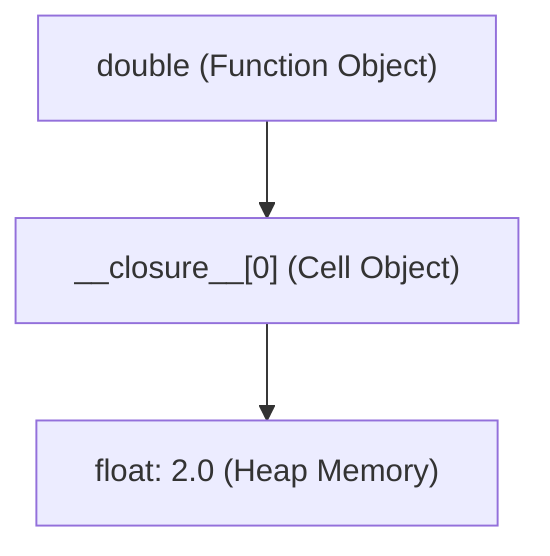

import { Callout } from 'fumadocs-ui/components/callout';
import { Tabs, Tab } from 'fumadocs-ui/components/tabs';
import { Accordion, Accordions } from 'fumadocs-ui/components/accordion';

In Python, functions are not merely blocks of syntax — **functions are first-class objects**.

This means a function has the exact same status as any integer, string, or list:
1. It can be assigned to a variable.
2. It can be passed as an argument to another function.
3. It can be returned from another function.
4. It can be stored inside lists or dictionaries.

---

## 1. Functions as First-Class Citizens

```python
def shout(text: str) -> str:
    return text.upper() + "!"

# 1. Assign to a variable
say_loudly = shout
print(say_loudly("hello"))

# 2. Pass as an argument (Higher-Order Function)
def apply_transformer(words: list[str], transform) -> list[str]:
    return [transform(w) for w in words]

results = apply_transformer(["apple", "banana"], shout)
print(results)
```

Output:

```text
HELLO!
['APPLE!', 'BANANA!']
```

---

## 2. Inner Functions & The Architecture of a Closure

A **closure** is a function that remembers and accesses variables from its enclosing lexical scope, **even after that outer scope has completely finished executing**.

```python
def make_multiplier(factor: float):
    # 'factor' lives in the outer enclosing scope
    def multiplier(number: float) -> float:
        return number * factor
    return multiplier

double = make_multiplier(2.0)
triple = make_multiplier(3.0)

print(double(10))
print(triple(10))
```

Output:

```text
20.0
30.0
```

### What Happened in Memory?

When `make_multiplier(2.0)` finished and returned, its stack frame was popped. How could `double(10)` still access `factor = 2.0`?



Python created a **cell object** on the heap to store `factor`. You can inspect this closure cell directly:

```python
print(double.__closure__)
print(double.__closure__[0].cell_contents)
```

Output:

```text
(<cell at 0x...: float object at 0x...>,)
2.0
```

---

## 3. Stateful Closures with `nonlocal`

Normally, reassigning a variable inside an inner function treats it as a local variable. The `nonlocal` keyword allows an inner function to mutate a variable in its enclosing parent scope:

```python
def make_counter(start: int = 0):
    count = start

    def increment() -> int:
        nonlocal count  # Declares that 'count' belongs to the parent scope
        count += 1
        return count

    return increment

counter = make_counter(10)
print(counter())
print(counter())
print(counter())
```

Output:

```text
11
12
13
```

---

## 4. The Infamous Late-Binding Closure Trap

This is one of the most common pitfalls in Python exams and job interviews:

```python
# ❌ DANGEROUS BUG: Late-binding loop
multipliers = []
for i in range(4):
    multipliers.append(lambda x: x * i)

# What will these print?
print([m(2) for m in multipliers])
```

Run this code:

```text
[6, 6, 6, 6]
```

Every single function multiplied by `3` ($2 \times 3 = 6$), instead of `0, 1, 2, 3`!

<Callout type="error" title="Why Did This Happen?">
Python closures bind to <strong>variable names, not values</strong>. The lambdas did not store the value of <code>i</code> when the loop ran; they stored a reference to the single variable <code>i</code>. When the loop finished, <code>i</code> was <code>3</code>. When the functions were later executed, they all looked up <code>i</code> and found <code>3</code>!
</Callout>

### The Idiomatic Fix: Default Parameter Binding

```python
# ✅ IDIOMATIC FIX: Bind current value as default argument
multipliers = []
for i in range(4):
    multipliers.append(lambda x, i=i: x * i)

print([m(2) for m in multipliers])
```

Output:

```text
[0, 2, 4, 6]
```

Because default argument values are evaluated when the function is defined, each function locks in its own current copy of `i`.

---

## Hands-On Exercise

Create a `make_moving_average()` closure that remembers all past values fed to it and returns the updated moving average on each call.

<Accordions>
<Accordion title="Reveal Solution & Explanation">

```python
def make_moving_average():
    total = 0.0
    count = 0

    def compute_average(new_val: float) -> float:
        nonlocal total, count
        total += new_val
        count += 1
        return total / count

    return compute_average

avg = make_moving_average()

print("Average 1:", avg(10))  # 10.0
print("Average 2:", avg(20))  # 15.0
print("Average 3:", avg(30))  # 20.0
```

Output:

```text
Average 1: 10.0
Average 2: 15.0
Average 3: 20.0
```

</Accordion>
</Accordions>

---

## Summary Reference

- **First-class functions**: Functions can be passed, returned, and stored like any value.
- **Closure**: A function bundling its code with references to surrounding state (lexical scope).
- **`__closure__`**: CPython tuple of cell objects containing closed-over variables.
- **`nonlocal`**: Allows rebinding of names in outer enclosing scopes without global variables.
- **Late binding trap**: Variables in closures resolve at call time, not definition time; use default arguments (`lambda x, i=i: ...`) to freeze loop states.
