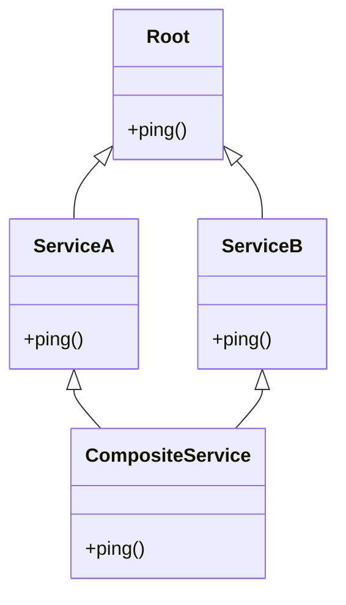

import { Callout } from 'fumadocs-ui/components/callout';
import { Tabs, Tab } from 'fumadocs-ui/components/tabs';
import { Accordion, Accordions } from 'fumadocs-ui/components/accordion';

Object-Oriented Programming (OOP) in Python is clean, explicit, and dynamic. While many languages support only single inheritance, Python provides full **multiple inheritance** — managed by a mathematically sound algorithm called **C3 Linearization**.

---

## 1. Class State vs. Instance State

A common point of confusion is the distinction between **instance attributes** and **class attributes**:

```python
class Employee:
    # Class attribute: Shared across ALL instances
    company_name: str = "Acme Corp"
    employee_count: int = 0

    def __init__(self, name: str, salary: float):
        # Instance attributes: Unique to THIS specific instance
        self.name = name
        self.salary = salary
        Employee.employee_count += 1

    @classmethod
    def from_string(cls, data_str: str) -> "Employee":
        """Alternative constructor / factory method."""
        name, salary_str = data_str.split("-")
        return cls(name=name, salary=float(salary_str))

    @staticmethod
    def is_valid_salary(salary: float) -> bool:
        """Utility method that requires no access to class or instance state."""
        return salary >= 30_000

e1 = Employee("Alice", 85_000)
e2 = Employee.from_string("Bob-92000")

print(f"Total Employees: {Employee.employee_count}")
print(f"{e1.name} works at {e1.company_name}")
print(f"Valid salary check: {Employee.is_valid_salary(50_000)}")
```

Output:

```text
Total Employees: 2
Alice works at Acme Corp
Valid salary check: True
```

---

## 2. Multiple Inheritance & The Diamond Problem

What happens when two parent classes inherit from the same base class, and a child class inherits from both?



In languages like C++, this "Diamond Pattern" can cause ambiguity: which version of `ping()` should `CompositeService` execute?

Python solves this deterministically using **C3 Linearization** to compute a strict, monotonic **Method Resolution Order (MRO)**.

---

## 3. Cooperative Multiple Inheritance with `super()`

Many developers mistakenly believe that `super()` calls the immediate parent class. In Python, **`super()` calls the next class in the MRO chain**, allowing cooperative multiple inheritance:

```python
class Base:
    def __init__(self):
        print("Base __init__")

class LoggingMixin(Base):
    def __init__(self):
        print("LoggingMixin: Initializing logger")
        super().__init__()  # Calls the NEXT class in the MRO

class MetricMixin(Base):
    def __init__(self):
        print("MetricMixin: Initializing metrics")
        super().__init__()  # Calls the NEXT class in the MRO

class PaymentGateway(LoggingMixin, MetricMixin):
    def __init__(self):
        print("PaymentGateway: Starting initialization")
        super().__init__()

gateway = PaymentGateway()
```

Output:

```text
PaymentGateway: Starting initialization
LoggingMixin: Initializing logger
MetricMixin: Initializing metrics
Base __init__
```

### Inspecting the MRO

You can inspect the exact linearization sequence at runtime using `.mro()`:

```python
print([cls.__name__ for cls in PaymentGateway.mro()])
```

Output:

```text
['PaymentGateway', 'LoggingMixin', 'MetricMixin', 'Base', 'object']
```

Notice how `super()` in `LoggingMixin` stepped over to `MetricMixin`! This cooperative chaining is what makes reusable mixins work seamlessly in Python.

---

## 4. Enforcing Contracts: Abstract Base Classes (`abc`)

When designing frameworks, you often want to define interfaces that subclasses *must* implement:

```python
from abc import ABC, abstractmethod

class Repository(ABC):
    @abstractmethod
    def get(self, entity_id: int) -> dict:
        """Fetch record by ID."""
        pass

    @abstractmethod
    def save(self, entity: dict) -> None:
        """Persist record."""
        pass

class SQLRepository(Repository):
    def get(self, entity_id: int) -> dict:
        return {"id": entity_id, "source": "postgres"}

    # Forgot to implement save()!

# Attempting to instantiate an incomplete subclass:
try:
    repo = SQLRepository()
except TypeError as err:
    print("Caught instantiation error:", err)
```

Output:

```text
Caught instantiation error: Can't instantiate abstract class SQLRepository without an implementation for abstract method 'save'
```

---

## Summary Reference

- **Class attributes**: Declared at the class level; shared across all instances.
- **`@classmethod`**: Receives `cls` as the first argument; ideal for alternative factory constructors.
- **`@staticmethod`**: Bound to the class namespace, but receives neither `self` nor `cls`.
- **C3 MRO**: Deterministic method resolution order algorithm; viewable with `cls.mro()`.
- **`super()`**: Invokes the next method in the MRO chain, enabling cooperative multiple inheritance.
- **`abc.ABC`**: Abstract base classes that enforce required methods at instantiation time.
