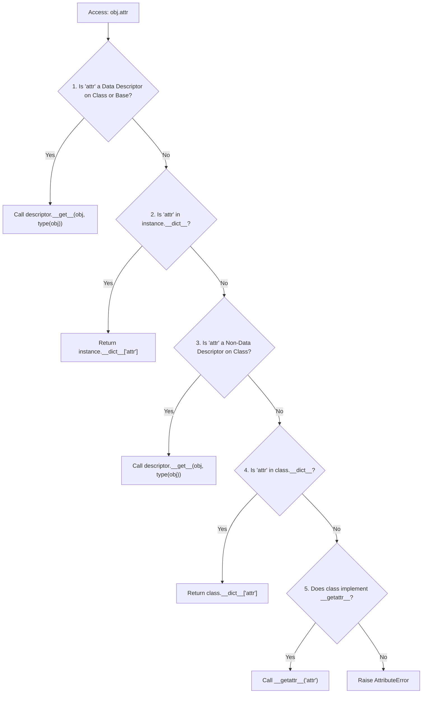

import { Callout } from 'fumadocs-ui/components/callout';
import { Tabs, Tab } from 'fumadocs-ui/components/tabs';
import { Accordion, Accordions } from 'fumadocs-ui/components/accordion';

Have you ever wondered how `@property`, `@classmethod`, `@staticmethod`, or ORM fields in Django and SQLAlchemy actually work?

They are not special compiler hacks. They are all powered by a single, unified protocol: **The Descriptor Protocol**.

---

## 1. What is a Descriptor?

A **descriptor** is any Python object that defines at least one of the following special methods:
- `__get__(self, instance, owner)`: Invoked when the attribute is accessed (`val = obj.attr`).
- `__set__(self, instance, value)`: Invoked when the attribute is assigned (`obj.attr = val`).
- `__delete__(self, instance)`: Invoked when the attribute is deleted (`del obj.attr`).
- `__set_name__(self, owner, name)`: Invoked at class creation to learn its own attribute name!

---

## 2. Building a Reusable Validating Descriptor

Instead of writing identical `@property` getter/setter logic for 10 different numeric fields, you can define a single, reusable descriptor:

```python
class PositiveNumber:
    def __set_name__(self, owner, name):
        """Automatically called when the class is defined."""
        self.public_name = name
        self.private_name = f"_{name}"

    def __get__(self, instance, owner):
        if instance is None:
            return self  # Accessed on the class itself (e.g. OrderItem.price)
        return getattr(instance, self.private_name, 0.0)

    def __set__(self, instance, value: float):
        if not isinstance(value, (int, float)) or value <= 0:
            raise ValueError(f"'{self.public_name}' must be positive, got {value}")
        setattr(instance, self.private_name, float(value))

class OrderItem:
    # Descriptors MUST be defined as CLASS attributes!
    price = PositiveNumber()
    quantity = PositiveNumber()

    def __init__(self, name: str, price: float, quantity: int):
        self.name = name
        self.price = price        # Automatically triggers price.__set__()
        self.quantity = quantity  # Automatically triggers quantity.__set__()

item = OrderItem("Mechanical Keyboard", 120.0, 2)
print(f"Item: {item.name}, Price: ${item.price}, Qty: {item.quantity}")

# Test invalid input:
try:
    item.price = -50.0
except ValueError as err:
    print("Caught validation error:", err)
```

Output:

```text
Item: Mechanical Keyboard, Price: $120.0, Qty: 2.0
Caught validation error: 'price' must be positive, got -50.0
```

Notice how `__set_name__` automatically captured the name `"price"` and `"quantity"` without us having to pass them as string arguments!

---

## 3. Data Descriptors vs. Non-Data Descriptors

Python classifies descriptors into two critical categories:

| Category | Defined Methods | Lookup Precedence | Example |
| :--- | :--- | :--- | :--- |
| **Data Descriptor** | Defines `__set__` and/or `__delete__` | **Beats** instance `__dict__` | `@property` (with setter), ORM fields |
| **Non-Data Descriptor** | Defines only `__get__` | **Loses** to instance `__dict__` | Ordinary functions/methods, `@classmethod` |

---

## 4. The Grand Hierarchy: Attribute Lookup Precedence

When you write `obj.attribute`, CPython resolves the attribute in this exact order:



Because a **Data Descriptor** sits at Step 1, assigning to `self.__dict__["price"]` cannot bypass it if `price` is a data descriptor.

---

## Summary Reference

- **Descriptor**: An object placed on a class that controls attribute access via `__get__`, `__set__`, and `__delete__`.
- **`__set_name__(owner, name)`**: Captures the attribute variable name at class definition time (PEP 487).
- **Data Descriptors**: Define `__set__` and take priority over the instance dictionary `__dict__`.
- **Non-Data Descriptors**: Define only `__get__`; shadowed by instance variables of the same name.
