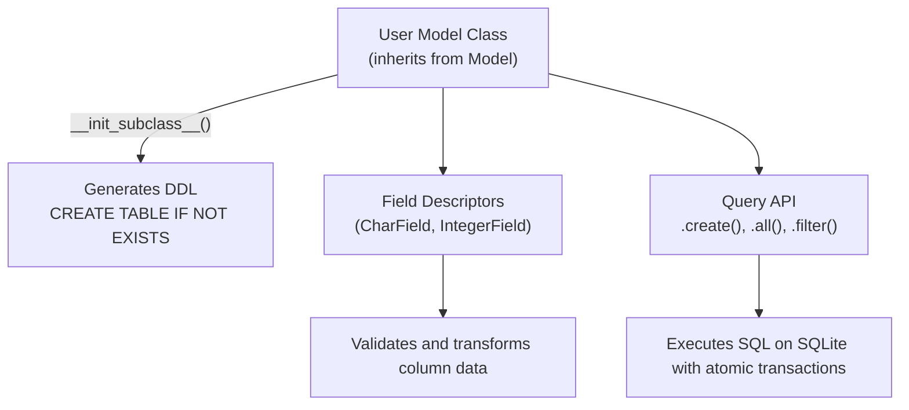

import { Callout } from 'fumadocs-ui/components/callout';
import { Tabs, Tab } from 'fumadocs-ui/components/tabs';
import { Steps, Step } from 'fumadocs-ui/components/steps';

In this capstone, you will synthesize everything learned in Stage 2 (Dunder protocols, descriptors, class customization, and context managers) to build **`active-lite`**: a declarative, type-safe SQLite Object-Relational Mapper (ORM) from scratch.

---

## Architectural Blueprint



---

## The Complete Implementation (`activelite.py`)

Create `activelite.py`:

```python
"""active-lite: Declarative Mini-ORM & Schema Engine."""

from __future__ import annotations

import sqlite3
from typing import Any, TypeVar

# Type variable for Model subclasses
T = TypeVar("T", bound="Model")


class Field:
    """Base Column Descriptor."""

    def __init__(self, sql_type: str, required: bool = True):
        self.sql_type = sql_type
        self.required = required
        self.name: str = ""

    def __set_name__(self, owner: type, name: str):
        self.name = name

    def __get__(self, instance: Any, owner: type) -> Any:
        if instance is None:
            return self
        return instance.__dict__.get(self.name)

    def __set__(self, instance: Any, value: Any) -> None:
        if value is None and self.required:
            raise ValueError(f"Field '{self.name}' is required and cannot be None")
        instance.__dict__[self.name] = value


class CharField(Field):
    def __init__(self, max_length: int = 255, required: bool = True):
        super().__init__("TEXT", required)
        self.max_length = max_length

    def __set__(self, instance: Any, value: Any) -> None:
        if value is not None:
            if not isinstance(value, str):
                raise TypeError(f"Field '{self.name}' must be str, got {type(value)}")
            if len(value) > self.max_length:
                raise ValueError(
                    f"'{self.name}' exceeds max length of {self.max_length}"
                )
        super().__set__(instance, value)


class IntegerField(Field):
    def __init__(self, required: bool = True):
        super().__init__("INTEGER", required)

    def __set__(self, instance: Any, value: Any) -> None:
        if value is not None and not isinstance(value, int):
            raise TypeError(f"Field '{self.name}' must be int, got {type(value)}")
        super().__set__(instance, value)


class Database:
    """Connection manager with atomic transaction support."""

    def __init__(self, db_path: str = ":memory:"):
        self.conn = sqlite3.connect(db_path)
        self.conn.row_factory = sqlite3.Row

    def execute(self, sql: str, params: tuple = ()) -> sqlite3.Cursor:
        return self.conn.execute(sql, params)

    def commit(self) -> None:
        self.conn.commit()

    def rollback(self) -> None:
        self.conn.rollback()

    def transaction(self):
        class _Tx:
            def __init__(self, db: Database):
                self.db = db

            def __enter__(self):
                return self.db

            def __exit__(self, exc_type, exc_val, exc_tb):
                if exc_type is not None:
                    self.db.rollback()
                    return False
                self.db.commit()
                return True

        return _Tx(self)


class Model:
    """Declarative Base Model."""

    db: Database | None = None
    _table_name: str = ""
    _fields: dict[str, Field] = {}

    def __init_subclass__(cls, table_name: str | None = None, **kwargs):
        super().__init_subclass__(**kwargs)
        cls._table_name = table_name or cls.__name__.lower() + "s"
        cls._fields = {
            name: attr for name, attr in cls.__dict__.items() if isinstance(attr, Field)
        }

    def __init__(self, **kwargs):
        for name, field in self._fields.items():
            setattr(self, name, kwargs.get(name))

    @classmethod
    def create_table(cls) -> None:
        if cls.db is None:
            raise RuntimeError("Database connection not assigned to Model.db")
        columns = ["id INTEGER PRIMARY KEY AUTOINCREMENT"]
        for name, field in cls._fields.items():
            req = "NOT NULL" if field.required else ""
            columns.append(f"{name} {field.sql_type} {req}")
        sql = f"CREATE TABLE IF NOT EXISTS {cls._table_name} ({', '.join(columns)});"
        cls.db.execute(sql)
        cls.db.commit()

    @classmethod
    def create(cls: type[T], **kwargs) -> T:
        if cls.db is None:
            raise RuntimeError("Database connection not assigned")
        instance = cls(**kwargs)
        field_names = list(cls._fields.keys())
        placeholders = ", ".join("?" for _ in field_names)
        columns = ", ".join(field_names)
        values = tuple(getattr(instance, name) for name in field_names)

        sql = f"INSERT INTO {cls._table_name} ({columns}) VALUES ({placeholders});"
        cursor = cls.db.execute(sql, values)
        cls.db.commit()
        instance.__dict__["id"] = cursor.lastrowid
        return instance

    @classmethod
    def all(cls: type[T]) -> list[T]:
        if cls.db is None:
            raise RuntimeError("Database connection not assigned")
        cursor = cls.db.execute(f"SELECT * FROM {cls._table_name};")
        rows = cursor.fetchall()
        results = []
        for row in rows:
            data = dict(row)
            row_id = data.pop("id")
            inst = cls(**data)
            inst.__dict__["id"] = row_id
            results.append(inst)
        return results

    def __repr__(self) -> str:
        attrs = ", ".join(f"{k}={getattr(self, k)!r}" for k in self._fields)
        record_id = getattr(self, "id", None)
        return f"{self.__class__.__name__}(id={record_id}, {attrs})"
```

---

## Automated Test Suite (`test_activelite.py`)

Create `test_activelite.py`:

```python
"""Automated pytest test suite for active-lite ORM."""

import pytest
from activelite import Database, Model, CharField, IntegerField


class User(Model):
    name = CharField(max_length=50)
    age = IntegerField()


@pytest.fixture
def test_db():
    db = Database(":memory:")
    User.db = db
    User.create_table()
    return db


def test_user_creation_and_retrieval(test_db):
    u1 = User.create(name="Alice", age=28)
    u2 = User.create(name="Bob", age=34)

    assert u1.id == 1
    assert u2.id == 2

    all_users = User.all()
    assert len(all_users) == 2
    assert all_users[0].name == "Alice"
    assert all_users[1].age == 34


def test_validation_constraints(test_db):
    # Test max_length constraint
    with pytest.raises(ValueError, match="exceeds max length"):
        User.create(name="A" * 60, age=20)

    # Test type validation
    with pytest.raises(TypeError, match="must be int"):
        User.create(name="Charlie", age="twenty")


def test_transaction_rollback(test_db):
    try:
        with test_db.transaction():
            User.create(name="Dave", age=40)
            raise RuntimeError("Mid-transaction database crash!")
    except RuntimeError:
        pass

    # Verify Dave was rolled back and never committed
    assert len(User.all()) == 0
```

### Running the Test Suite

```bash
uv run pytest test_activelite.py -v
```

Terminal Output:

```text
============================= test session starts ==============================
collected 3 items

test_activelite.py::test_user_creation_and_retrieval PASSED              [ 33%]
test_activelite.py::test_validation_constraints PASSED                  [ 66%]
test_activelite.py::test_transaction_rollback PASSED                    [100%]

============================== 3 passed in 0.05s ===============================
```

---

## Milestone Complete!

Congratulations! You have completed **Stage 2: The Python Data Model & OOP**. You now understand:
- The dunder protocols powering standard operators.
- Closures, scopes, and memory cell objects.
- Writing production decorators with `ParamSpec`.
- Lazy generator pipelines that operate in $O(1)$ memory.
- Dynamic schema reflection using descriptors and `__init_subclass__`.

Now, level up to **[Stage 3: Concurrency, Architecture & Metaprogramming](/docs/learn-python/03-advanced)**!
