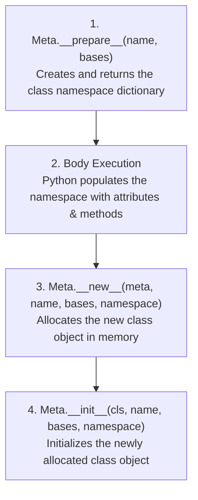

import { Callout } from 'fumadocs-ui/components/callout';
import { Tabs, Tab } from 'fumadocs-ui/components/tabs';
import { Accordion, Accordions } from 'fumadocs-ui/components/accordion';

In Python, everything is an object. Numbers are objects. Functions are objects. Modules are objects.

And classes? **Classes are objects too.**

If an object is an instance of a class, what is a class an instance of?
The answer is: **`type`**.

---

## 1. `type` as a Class Factory

Most developers know `type(x)` as a function to inspect an object's type. But when called with three arguments, `type(name, bases, dict)` **dynamically creates a new class at runtime**:

<Tabs items={['Standard Class Statement', 'Dynamic type() Construction']}>
<Tab value="Standard Class Statement">
```python
class Robot:
    category = "Machine"
    def speak(self):
        return "Beep boop!"
```
</Tab>
<Tab value="Dynamic type() Construction">
```python
# 1. Class name
# 2. Base classes tuple
# 3. Attribute/method dictionary
Robot = type(
    "Robot",
    (object,),
    {
        "category": "Machine",
        "speak": lambda self: "Beep boop!"
    }
)
```
</Tab>
</Tabs>

Both snippets produce identical class objects in memory!

```python
r = Robot()
print(r.category)
print(r.speak())
print("Type of Robot class:", type(Robot))
```

Output:

```text
Machine
Beep boop!
Type of Robot class: <class 'type'>
```

---

## 2. The Metaclass Lifecycle

A **metaclass** is simply a class whose instances are classes.
When Python executes a `class MyClass(metaclass=Meta):` statement, it follows this 4-step lifecycle:



### Implementing a Custom Metaclass: Enforcing Method Standards

Let's create a metaclass that enforces that all subclasses must define lowercase attribute names:

```python
class EnforceLowercaseMeta(type):
    def __new__(mcs, name, bases, namespace):
        for attr_name in namespace:
            if not attr_name.startswith("__") and not attr_name.islower():
                raise TypeError(
                    f"Class '{name}' violates convention: attribute '{attr_name}' must be lowercase!"
                )
        return super().__new__(mcs, name, bases, namespace)

# Valid class:
class GoodConfig(metaclass=EnforceLowercaseMeta):
    timeout = 30
    retries = 3

# Invalid class:
try:
    class BadConfig(metaclass=EnforceLowercaseMeta):
        MAX_RETRIES = 5  # Uppercase!
except TypeError as err:
    print("Caught compile-time error:", err)
```

Output:

```text
Caught compile-time error: Class 'BadConfig' violates convention: attribute 'MAX_RETRIES' must be lowercase!
```

---

## 3. Metaclass vs. `__init_subclass__`

In modern Python (Python 3.6+), **90% of traditional metaclass use cases can be handled much more cleanly with `__init_subclass__`**:

| Criterion | `__init_subclass__` (PEP 487) | Full Metaclass (`type`) |
| :--- | :--- | :--- |
| **Complexity** | Low — standard method on regular class | High — requires understanding `type` |
| **Inheritance mixing** | Seamless cooperative inheritance | Prone to metaclass conflict errors |
| **Custom namespace** | No (cannot intercept `__prepare__`) | **Yes** (controls namespace before body runs) |
| **Intercepting Instantiation** | No | **Yes** (via `__call__` on metaclass) |

---

## Summary Reference

- **`type`**: The default metaclass of all Python classes.
- **Dynamic creation**: `type(name, bases, dict)` creates a class programmatically.
- **Metaclass**: Subclasses `type` to control class creation (`__new__`, `__init__`, `__prepare__`).
- **Rule of thumb**: Prefer `__init_subclass__` unless you need custom namespace creation or class instantiation interception (`__call__`).
