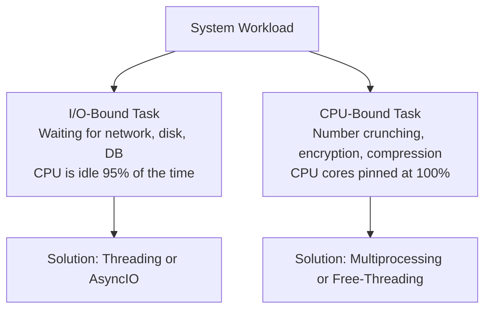

import { Callout } from 'fumadocs-ui/components/callout';
import { Tabs, Tab } from 'fumadocs-ui/components/tabs';

When building high-throughput systems, concurrency is essential. But choosing the wrong concurrency model in Python can actually make your program **slower** than running on a single thread.

To choose correctly, you must distinguish between **I/O-Bound** and **CPU-Bound** tasks.

---

## 1. The Fundamental Distinction: I/O-Bound vs. CPU-Bound



---

## 2. The Traditional Threading Model & The GIL

Python threads are true native OS threads. However, CPython has historically been governed by the **Global Interpreter Lock (GIL)** — a mutual exclusion lock that prevents multiple native threads from executing Python bytecode simultaneously.

### Why Does the GIL Exist?
CPython's internal memory management relies heavily on **reference counting**. Without the GIL, every single pointer assignment across threads would require expensive atomic instructions to prevent race conditions. The GIL was implemented to ensure thread-safety with zero overhead on single-threaded code.

### When Threading Works: I/O Operations
When a Python thread initiates an I/O operation (e.g., waiting for an HTTP response or reading from disk), **CPython explicitly releases the GIL**:

```python
from concurrent.futures import ThreadPoolExecutor
import time

def fetch_url(url_id: int):
    # Simulates an I/O network wait
    time.sleep(1.0)
    return f"Response from URL {url_id}"

# 10 network requests run concurrently on 10 threads!
start = time.perf_counter()
with ThreadPoolExecutor(max_workers=10) as executor:
    results = list(executor.map(fetch_url, range(10)))

elapsed = time.perf_counter() - start
print(f"Fetched 10 URLs in {elapsed:.2f} seconds (Sequential would take 10.0s)")
```

Output:

```text
Fetched 10 URLs in 1.02 seconds (Sequential would take 10.0s)
```

---

## 3. Multiprocessing: Bypassing the GIL for CPU Work

For CPU-bound tasks (e.g. calculating cryptographic hashes or processing images), multiple threads will compete for the GIL on a single core. To use all CPU cores, use **`multiprocessing`**:

```python
from concurrent.futures import ProcessPoolExecutor
import time

def cpu_heavy_hash(n: int) -> int:
    """CPU-bound mathematical calculation."""
    return sum(i * i for i in range(n))

if __name__ == "__main__":
    workloads = [10_000_000] * 4

    start = time.perf_counter()
    with ProcessPoolExecutor() as executor:
        results = list(executor.map(cpu_heavy_hash, workloads))
    
    elapsed = time.perf_counter() - start
    print(f"Processed 4 CPU tasks across cores in {elapsed:.2f}s")
```

Output:

```text
Processed 4 CPU tasks across cores in 0.85s
```

### The Hidden Cost of Multiprocessing: IPC & `pickle`
Processes do not share memory. Every object passed to a worker process must be serialized (**pickled**), transmitted across OS pipes, and deserialized in the worker process. For massive datasets, serialization overhead can easily outweigh the CPU speedup!

---

## Concurrency Comparison Matrix

| Model | Mechanism | Best For | Main Bottleneck |
| :--- | :--- | :--- | :--- |
| **`threading`** | Native OS threads with GIL | Network I/O, synchronous APIs | Cannot parallelize Python bytecode on multi-core CPU |
| **`multiprocessing`** | Separate OS processes | Heavy CPU batch computing | Memory overhead, slow IPC serialization (`pickle`) |
| **`asyncio`** | Single-threaded cooperative event loop | 100k+ concurrent network connections | Any blocking CPU call stalls the entire event loop |
| **Free-Threading (3.13+)** | Native OS threads with `--disable-gil` | Parallel multi-threaded CPU algorithms | Experimental build, C-extension compatibility |
