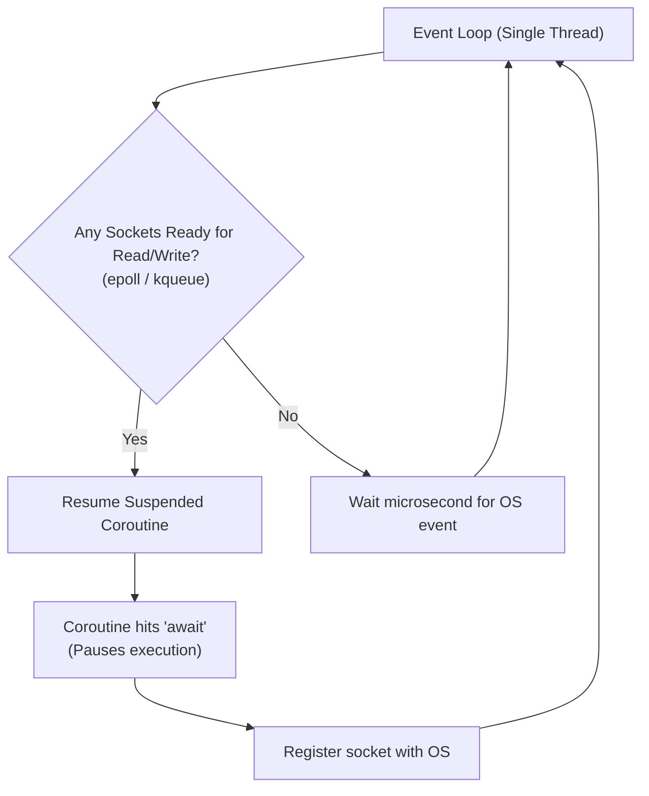

import { Callout } from 'fumadocs-ui/components/callout';
import { Tabs, Tab } from 'fumadocs-ui/components/tabs';
import { Accordion, Accordions } from 'fumadocs-ui/components/accordion';

Why do modern web frameworks like **FastAPI** rely on `asyncio` instead of traditional multi-threading?

Because creating an operating system thread incurs a memory stack cost (often 2–8 MB per thread). If you try to maintain 50,000 simultaneous connections using threads, your server will exhaust its RAM before handling a single request.

With **`asyncio`**, a **single thread** can effortlessly coordinate 100,000+ connections using cooperative multitasking.

---

## 1. How the Event Loop Works

At the heart of `asyncio` sits the **Event Loop**. It uses OS-level I/O multiplexing primitives (`epoll` on Linux, `kqueue` on macOS, and `IOCP` on Windows):



1. A coroutine executes until it hits an `await` statement on an I/O operation.
2. The coroutine **voluntarily yields control** back to the event loop.
3. The event loop registers the underlying network socket with the operating system kernel.
4. Instead of sitting idle waiting for bytes, the single thread immediately picks up another ready task.
5. When the OS signals that data has arrived, the event loop wakes up the suspended coroutine and resumes it!

---

## 2. Coroutines: `async def` and `await`

When you define a function with `async def`, calling it **does not execute its body**; it returns a **coroutine object**:

```python
import asyncio

async def fetch_data(source_id: int) -> dict:
    print(f"[Task {source_id}] Starting network fetch...")
    # 'await' cooperatively yields control to the event loop:
    await asyncio.sleep(1.0)
    print(f"[Task {source_id}] Data received!")
    return {"id": source_id, "status": "active"}

async def main():
    print("Initiating requests...")
    # Run two coroutines concurrently:
    t1 = asyncio.create_task(fetch_data(1))
    t2 = asyncio.create_task(fetch_data(2))

    res1 = await t1
    res2 = await t2
    print("Results:", res1, res2)

# Start the event loop:
asyncio.run(main())
```

Output:

```text
Initiating requests...
[Task 1] Starting network fetch...
[Task 2] Starting network fetch...
[Task 1] Data received!
[Task 2] Data received!
Results: {'id': 1, 'status': 'active'} {'id': 2, 'status': 'active'}
```

Notice that both Task 1 and Task 2 started at the same instant! Total execution time was 1.0s, not 2.0s.

---

## 3. The Cardinal Rule of AsyncIO

<Callout type="error" title="Never Block the Event Loop!">
Because AsyncIO runs on a <strong>single thread</strong>, if any function executes a long blocking CPU loop or calls synchronous I/O (such as <code>time.sleep()</code>, <code>requests.get()</code>, or standard file operations), <strong>the entire event loop freezes</strong>. No other coroutine can run until that blocking call returns!
</Callout>

### Offloading Blocking Code with `asyncio.to_thread`

If you must call a legacy synchronous blocking library, offload it to a background thread pool:

```python
import asyncio
import time

def legacy_blocking_io(name: str):
    time.sleep(1.5)  # Blocking OS call!
    return f"Processed {name}"

async def main():
    # Safely offloads the blocking function to a background worker thread:
    result = await asyncio.to_thread(legacy_blocking_io, "Image_01.png")
    print(result)

asyncio.run(main())
```

Output:

```text
Processed Image_01.png
```

---

## Summary Reference

- **Event Loop**: Single-threaded multiplexer checking OS socket events.
- **Coroutine**: A function defined with `async def` that pauses at `await` expressions.
- **`asyncio.run()`**: Standard entrypoint to initialize and manage the event loop.
- **`asyncio.create_task()`**: Schedules a coroutine to run concurrently on the loop.
- **`asyncio.to_thread()`**: Offloads blocking synchronous code safely to worker threads.
