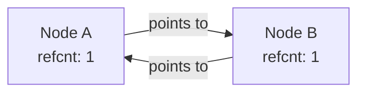

import { Callout } from 'fumadocs-ui/components/callout';
import { Tabs, Tab } from 'fumadocs-ui/components/tabs';
import { Accordion, Accordions } from 'fumadocs-ui/components/accordion';

Unlike low-level languages like C or Rust where developers manually allocate and free heap buffers, Python automates memory management.

However, writing high-throughput backend services without understanding Python's **Garbage Collector (GC)** inevitably leads to memory bloat, latency spikes, and silent leaks.

---

## 1. Pillar 1: Reference Counting (Immediate Reclamation)

In CPython, every object contains a header field named `ob_refcnt`.

Whenever a new variable points to an object, its reference count increments. Whenever a variable goes out of scope or is reassigned, its reference count decrements.

```python
import sys

# 1. Create object (refcount = 1)
data = ["alpha", "beta"]
print("Initial refcount:", sys.getrefcount(data) - 1)  # -1 because getrefcount itself adds a temporary ref

# 2. Add an alias (refcount increments to 2)
alias = data
print("After alias:", sys.getrefcount(data) - 1)

# 3. Delete alias (refcount decrements to 1)
del alias
print("After deleting alias:", sys.getrefcount(data) - 1)
```

Output:

```text
Initial refcount: 1
After alias: 2
After deleting alias: 1
```

When an object's reference count drops to **zero**, CPython immediately reclaims its memory block back to the allocator. No waiting for background sweeps!

---

## 2. The Reference Cycle Problem

Reference counting has one fatal flaw: **circular references**.



```python
class Node:
    def __init__(self, name: str):
        self.name = name
        self.link = None

# Create circular reference:
a = Node("A")
b = Node("B")
a.link = b
b.link = a

# Delete the variable names:
del a
del b
```

Notice what happened: `Node A` points to `Node B`, and `Node B` points to `Node A`. Even though neither object is accessible by any variable in our program, **their reference counts never drop to zero**!

Pure reference counting would leave these objects in memory forever, leaking RAM.

---

## 3. Pillar 2: The Generational Cyclic Garbage Collector

To solve this, CPython includes a secondary **Cyclic Garbage Collector** (`gc` module).

The GC tracks container objects (lists, dicts, custom instances) using a doubly linked list. It operates on the **Weak Generational Hypothesis**: *most objects die shortly after creation*.

Objects are categorized into three generations:
- **Generation 0**: Newly created objects. Scanned frequently.
- **Generation 1**: Objects that survive a Gen 0 sweep.
- **Generation 2**: Long-lived objects (configurations, singletons). Scanned rarely.

```python
import gc

print("GC Thresholds (Gen0, Gen1, Gen2):", gc.get_threshold())

# Manually trigger a full cycle collection:
unreachable = gc.collect()
print(f"Collected {unreachable} cyclic objects from memory.")
```

Output:

```text
GC Thresholds (Gen0, Gen1, Gen2): (700, 10, 10)
Collected 4 cyclic objects from memory.
```

---

## 4. Hunting Memory Leaks with `tracemalloc`

Python ships with a powerful native memory profiler: **`tracemalloc`**. It tracks the exact file and line number responsible for every heap allocation:

```python
import tracemalloc

# Start tracking allocations
tracemalloc.start()

# Code to profile
leak = [str(x) * 100 for x in range(100_000)]

# Take snapshot
snapshot = tracemalloc.take_snapshot()
top_stats = snapshot.statistics("lineno")

print("Top 3 Memory Allocations:")
for stat in top_stats[:3]:
    print(stat)
```

Output:

```text
Top 3 Memory Allocations:
app.py:7: size=10.2 MiB, count=100000, average=107 B
```

`tracemalloc` pinpoints the exact line where memory consumption ballooned.

---

## Summary Reference

- **Reference Counting**: Main memory mechanism; frees objects immediately when refcount reaches zero.
- **Circular References**: Occur when objects reference each other; requires the cyclic GC.
- **Generational GC (`gc`)**: Sweeps generations 0, 1, and 2 based on allocation thresholds.
- **`tracemalloc`**: Standard library profiler for diagnosing heap growth down to the line number.
