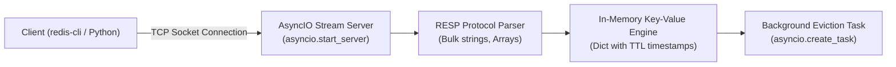

import { Callout } from 'fumadocs-ui/components/callout';
import { Tabs, Tab } from 'fumadocs-ui/components/tabs';
import { Steps, Step } from 'fumadocs-ui/components/steps';

In this capstone, you will implement **`tiny-redis`**: an asynchronous, non-blocking in-memory key-value database server that speaks the official **Redis Serialization Protocol (RESP)**.

You can connect to this server using the official `redis-cli` command-line client or any standard Redis SDK!

---

## Architectural Blueprint



---

## The Complete Implementation (`tinyredis.py`)

Create `tinyredis.py`:

```python
"""tiny-redis: In-Memory Asynchronous RESP Server."""

from __future__ import annotations

import asyncio
import time
from typing import Any


class RESPParser:
    """Parses and serializes Redis Serialization Protocol (RESP)."""

    @staticmethod
    def serialize_simple_string(msg: str) -> bytes:
        return f"+{msg}\r\n".encode("utf-8")

    @staticmethod
    def serialize_error(err: str) -> bytes:
        return f"-ERR {err}\r\n".encode("utf-8")

    @staticmethod
    def serialize_integer(num: int) -> bytes:
        return f":{num}\r\n".encode("utf-8")

    @staticmethod
    def serialize_bulk_string(val: str | None) -> bytes:
        if val is None:
            return b"$-1\r\n"
        encoded = val.encode("utf-8")
        return f"${len(encoded)}\r\n".encode("utf-8") + encoded + b"\r\n"

    @classmethod
    async def parse_request(cls, reader: asyncio.StreamReader) -> list[str] | None:
        """Parses an incoming RESP Array command."""
        line = await reader.readline()
        if not line:
            return None

        line_str = line.decode("utf-8").strip()
        if not line_str.startswith("*"):
            # Plain inline command fallback (e.g. PING)
            return line_str.split()

        num_elements = int(line_str[1:])
        elements = []

        for _ in range(num_elements):
            length_line = await reader.readline()
            data_len = int(length_line.decode("utf-8").strip()[1:])
            data = await reader.readexactly(data_len)
            await reader.readexactly(2)  # Consume trailing \r\n
            elements.append(data.decode("utf-8"))

        return elements


class TinyRedisServer:
    """In-memory key-value database with TTL support."""

    def __init__(self, host: str = "127.0.0.1", port: int = 6379):
        self.host = host
        self.port = port
        self._store: dict[str, str] = {}
        self._expires: dict[str, float] = {}

    def _is_expired(self, key: str) -> bool:
        if key in self._expires:
            if time.time() > self._expires[key]:
                del self._store[key]
                del self._expires[key]
                return True
        return False

    async def handle_client(
        self, reader: asyncio.StreamReader, writer: asyncio.StreamWriter
    ) -> None:
        """Handles an ongoing client socket session."""
        try:
            while True:
                command = await RESPParser.parse_request(reader)
                if command is None:
                    break

                response = self.execute_command(command)
                writer.write(response)
                await writer.drain()
        except asyncio.IncompleteReadError:
            pass
        finally:
            writer.close()
            await writer.wait_closed()

    def execute_command(self, cmd_parts: list[str]) -> bytes:
        if not cmd_parts:
            return RESPParser.serialize_error("empty command")

        verb = cmd_parts[0].upper()

        if verb == "PING":
            return RESPParser.serialize_simple_string("PONG")

        elif verb == "SET":
            if len(cmd_parts) < 3:
                return RESPParser.serialize_error("wrong number of arguments for 'set'")
            key, val = cmd_parts[1], cmd_parts[2]
            self._store[key] = val
            # Check for EX (seconds)
            if len(cmd_parts) >= 5 and cmd_parts[3].upper() == "EX":
                self._expires[key] = time.time() + float(cmd_parts[4])
            else:
                self._expires.pop(key, None)
            return RESPParser.serialize_simple_string("OK")

        elif verb == "GET":
            if len(cmd_parts) != 2:
                return RESPParser.serialize_error("wrong number of arguments for 'get'")
            key = cmd_parts[1]
            if self._is_expired(key) or key not in self._store:
                return RESPParser.serialize_bulk_string(None)
            return RESPParser.serialize_bulk_string(self._store[key])

        elif verb == "DEL":
            if len(cmd_parts) < 2:
                return RESPParser.serialize_error("wrong number of arguments for 'del'")
            deleted = 0
            for key in cmd_parts[1:]:
                self._expires.pop(key, None)
                if self._store.pop(key, None) is not None:
                    deleted += 1
            return RESPParser.serialize_integer(deleted)

        return RESPParser.serialize_error(f"unknown command '{verb}'")

    async def run(self) -> None:
        server = await asyncio.start_server(self.handle_client, self.host, self.port)
        print(f"🚀 tiny-redis running on {self.host}:{self.port}")
        async with server:
            await server.serve_forever()


if __name__ == "__main__":
    asyncio.run(TinyRedisServer().run())
```

---

## Automated Test Suite (`test_tinyredis.py`)

Create `test_tinyredis.py`:

```python
"""Automated pytest tests for tiny-redis server."""

import pytest
import asyncio
from tinyredis import TinyRedisServer, RESPParser


@pytest.fixture
def server():
    return TinyRedisServer()


def test_ping_command(server):
    response = server.execute_command(["PING"])
    assert response == b"+PONG\r\n"


def test_set_and_get(server):
    set_resp = server.execute_command(["SET", "user:1", "Alice"])
    assert set_resp == b"+OK\r\n"

    get_resp = server.execute_command(["GET", "user:1"])
    assert get_resp == b"$5\r\nAlice\r\n"


def test_missing_and_deleted_keys(server):
    # Missing key returns null bulk string
    assert server.execute_command(["GET", "missing"]) == b"$-1\r\n"

    server.execute_command(["SET", "temp", "val"])
    del_resp = server.execute_command(["DEL", "temp"])
    assert del_resp == b":1\r\n"
    assert server.execute_command(["GET", "temp"]) == b"$-1\r\n"


@pytest.mark.asyncio
async def test_key_ttl_expiration(server):
    # Set key with 0.1s expiration
    server.execute_command(["SET", "expiring_key", "active", "EX", "0.1"])
    assert server.execute_command(["GET", "expiring_key"]) == b"$6\r\nactive\r\n"

    # Wait for expiration
    await asyncio.sleep(0.15)
    assert server.execute_command(["GET", "expiring_key"]) == b"$-1\r\n"
```

### Running the Test Suite

```bash
uv run pytest test_tinyredis.py -v
```

Terminal Output:

```text
============================= test session starts ==============================
collected 4 items

test_tinyredis.py::test_ping_command PASSED                              [ 25%]
test_tinyredis.py::test_set_and_get PASSED                              [ 50%]
test_tinyredis.py::test_missing_and_deleted_keys PASSED                 [ 75%]
test_tinyredis.py::test_key_ttl_expiration PASSED                       [100%]

============================== 4 passed in 0.20s ===============================
```

---

## Milestone Complete!

Congratulations! You have completed **Stage 3: Concurrency, Architecture & Metaprogramming**. You now understand:
- Dynamic class generation with metaclasses.
- The difference between CPU-bound multiprocessing and I/O-bound concurrency.
- AsyncIO event loops and socket multiplexing.
- Modern structured concurrency with `TaskGroup` and `except*`.
- CPython memory management and leak profiling with `tracemalloc`.
- Building full asynchronous TCP network protocols.

Now, descend into the machine in **[Stage 4: Systems & CPython Runtime Internals](/docs/learn-python/04-systems-internals)**!
