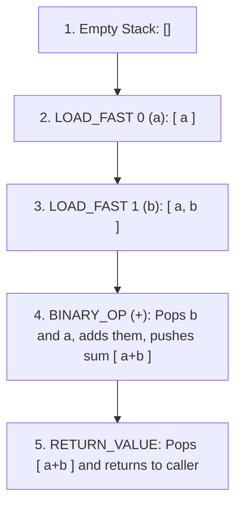

import { Callout } from 'fumadocs-ui/components/callout';
import { Tabs, Tab } from 'fumadocs-ui/components/tabs';
import { Accordion, Accordions } from 'fumadocs-ui/components/accordion';

CPython is an emulation of a computer processor implemented entirely in software: a **Virtual Machine (VM)**.

Unlike physical x86 or ARM CPUs which are register-based, **CPython is a Stack Machine**. Instructions push operands onto a virtual evaluation stack, and operators pop them off to compute results.

---

## 1. Disassembling Python with `dis.dis()`

You can view the exact bytecode instructions generated for any Python function using the standard **`dis`** module:

```python
import dis

def add_numbers(a: int, b: int) -> int:
    return a + b

dis.dis(add_numbers)
```

Output:

```text
  1           0 RESUME                   0

  2           2 LOAD_FAST                0 (a)
              4 LOAD_FAST                1 (b)
              6 BINARY_OP                0 (+)
             10 RETURN_VALUE
```

### Deconstructing the Stack Operations:



---

## 2. Inside `ceval.c`: The Central Evaluation Loop

At the center of CPython sits a massive C source file: `Python/ceval.c`. Inside it lives the core function:

```c
// Simplified excerpt from Python/ceval.c
PyObject* _PyEval_EvalFrameDefault(PyThreadState *tstate, InterpreterFrame *frame) {
    for (;;) {
        opcode = NEXTOP();
        switch (opcode) {
            case LOAD_FAST:
                PUSH(GETLOCAL(oparg));
                DISPATCH();
            case BINARY_OP:
                right = POP();
                left = TOP();
                SET_TOP(PyNumber_Add(left, right));
                DISPATCH();
            case RETURN_VALUE:
                return POP();
        }
    }
}
```

The virtual machine runs in an infinite loop: fetching the next bytecode instruction, jumping to the corresponding C handler via a switch statement, manipulating the stack, and advancing the program counter.

---

## 3. The Faster CPython Revolution: PEP 659 & The 3.13 JIT

In recent releases, the CPython core team has radically modernized this execution model:

### Tier 1: Specializing Adaptive Interpreter (Python 3.11+, PEP 659)
Historically, generic instructions like `BINARY_OP` had to dynamically check at runtime whether operands were integers, floats, strings, or custom classes with `__add__`.
In modern CPython, instructions **monitor runtime types**. If a loop consistently adds integers, the generic `BINARY_OP` morphs in place into a specialized instruction: `BINARY_OP_ADD_INT`, skipping dynamic method lookups completely!

### Tier 2: The Copy-and-Patch JIT Compiler (Python 3.13+, PEP 744)
Python 3.13 introduces an experimental **Copy-and-Patch Just-In-Time (JIT) Compiler**:
1. High-frequency loops are recorded as **Tier 2 micro-ops (`uops`) execution traces**.
2. Pre-compiled native machine code templates ("stencils", built using LLVM during CPython compilation) are copied into executable memory.
3. The runtime patches memory addresses and immediate constants directly into the machine code.
4. The CPU then executes **raw native machine instructions** directly on the silicon!

---

## Summary Reference

- **Stack Machine**: CPython uses an evaluation stack (`PUSH` and `POP`) rather than hardware CPU registers.
- **`dis.dis(fn)`**: Disassembles functions into readable bytecode instructions.
- **`ceval.c`**: The central evaluation loop in CPython source code.
- **PEP 659 (Adaptive Specialization)**: Dynamically replaces generic opcodes with type-specialized fast paths.
- **PEP 744 (Copy-and-Patch JIT)**: Compiles frequent uop execution traces into native machine code.
