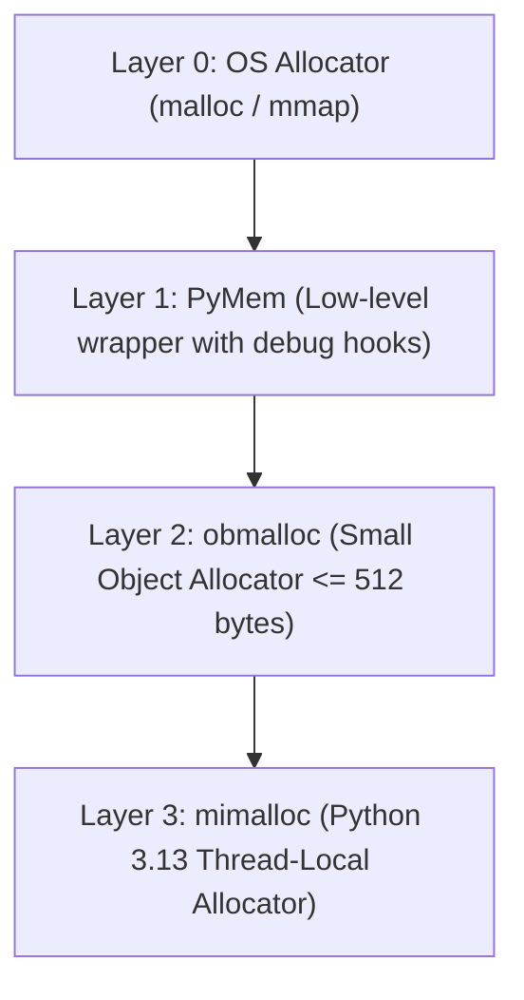
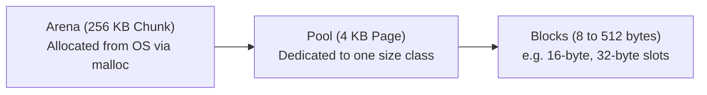

import { Callout } from 'fumadocs-ui/components/callout';
import { Tabs, Tab } from 'fumadocs-ui/components/tabs';

In CPython, every variable you assign points to a C structure defined in the CPython source code.

Understanding this C-level struct layout and Python's custom **`obmalloc` memory allocator** demystifies why Python objects have memory overhead and how the runtime achieves fast small-object allocation.

---

## 1. Anatomy of a `PyObject` (`Include/object.h`)

Every Python object begins with a standardized C header defined by `PyObject`:

```c
// Simplified excerpt from Include/object.h
struct _object {
    _PyObject_HEAD_EXTRA  // Doubly-linked list pointers for GC tracking
    Py_ssize_t ob_refcnt; // 64-bit integer reference count
    PyTypeObject *ob_type;// Pointer to the object's type descriptor
};
```

For variable-length collections (like strings, lists, tuples), CPython uses **`PyVarObject`**, which appends a length field:

```c
struct _varobject {
    PyObject ob_base;
    Py_ssize_t ob_size;   // Number of items in collection
};
```

### Why Does an Integer Take 28 Bytes in Python?

In C, an integer takes 4 or 8 bytes. In Python:

```python
import sys

x = 42
print("Size of integer 42 in RAM:", sys.getsizeof(x), "bytes")
```

Output:

```text
Size of integer 42 in RAM: 28 bytes
```

Where did 28 bytes come from?
- `ob_refcnt`: 8 bytes
- `ob_type`: 8 bytes
- `ob_size`: 8 bytes (since Python integers have arbitrary precision)
- Numeric digits array: 4 bytes
- Total: **28 bytes**!

---

## 2. The Multi-Tier Memory Allocator (`obmalloc`)

Making an operating system system call (`malloc` / `free`) for every tiny integer or string would introduce crippling overhead. CPython implements a multi-tier memory hierarchy:



### How `obmalloc` Manages Small Allocations:

For allocations of **512 bytes or less**, CPython bypasses the OS allocator using a three-tiered spatial structure:



1. **Arenas (256 KB)**: Large memory chunks requested from the OS via `malloc()`.
2. **Pools (4 KB)**: An arena is carved into 4 KB subdivisions called pools. Each pool is dedicated to a specific **size class** (e.g., 32-byte objects).
3. **Blocks (8 to 512 bytes)**: A pool is partitioned into equal-sized slots called blocks. Allocating a 32-byte object simply grabs a free block pointer from a singly linked list in $O(1)$ time!

---

## 3. Python 3.13 & Microsoft `mimalloc`

In Python 3.13, CPython integrated Microsoft's high-performance **`mimalloc`** allocator.

`mimalloc` provides thread-local free lists and decentralized heap management, eliminating the global lock contention that would otherwise cripple **free-threaded Python builds (PEP 703)** when hundreds of threads allocate objects concurrently.

---

## Summary Reference

- **`PyObject`**: The base C struct header of every Python object containing `ob_refcnt` and `ob_type`.
- **`obmalloc`**: CPython's dedicated allocator for objects $\le 512$ bytes.
- **Hierarchy**: Arenas (256 KB) → Pools (4 KB) → Blocks (8–512 B).
- **`mimalloc`**: Modern allocator integrated in Python 3.13 to enable scalable multi-threaded allocations without lock contention.
