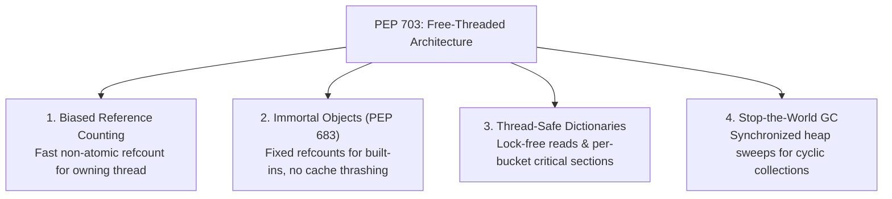

import { Callout } from 'fumadocs-ui/components/callout';
import { Tabs, Tab } from 'fumadocs-ui/components/tabs';
import { Accordion, Accordions } from 'fumadocs-ui/components/accordion';

For more than thirty years, the **Global Interpreter Lock (GIL)** was widely considered an permanent feature of CPython. Removing it without causing a 50% slowdown on single-threaded code or destabilizing the C extension ecosystem was deemed impossible.

With **PEP 703** in Python 3.13, CPython achieved the impossible: an experimental **free-threaded build** that completely disables the GIL (`python3.13t`).

---

## 1. How Python Conquered the No-GIL Challenge

Disabling the GIL is not as simple as removing a `pthread_mutex_lock`. Without a lock, concurrent threads would corrupt reference counts and mutate dictionaries simultaneously.

PEP 703 implemented four revolutionary systems innovations:



---

## 2. Deep Dive: Biased Reference Counting (BRC)

Most objects in Python are only accessed by a single thread. Using atomic CPU instructions (`LOCK XADD`) for every refcount change would slow down single-threaded code by 30–40%.

Under **Biased Reference Counting (BRC)**:
- Each object records its **owning thread ID** in its header.
- When the owning thread increments or decrements the refcount, it uses **ordinary, unsynchronized fast instructions**.
- If a secondary foreign thread references the object, the object is marked as "shared", and operations fall back to atomic operations or deferred free lists.

---

## 3. Immortal Objects (PEP 683)

In traditional CPython, even read-only singletons like `None`, `True`, and small integers (`1`, `2`) had their reference counts constantly modified.
On modern multi-core processors, when Core 1 writes to `None->ob_refcnt`, it forces Core 2, Core 3, and Core 4 to invalidate their L1/L2 hardware CPU caches!

**Immortal Objects** solve this:
- Core built-ins have a special high-bit marker set in their reference count.
- The macros `Py_INCREF` and `Py_DECREF` **no-op** for immortal objects.
- Reference counts for `None` or `"__init__"` are never written to, keeping CPU caches completely warm across all cores!

---

## 4. Subinterpreters: Per-Interpreter GIL (PEP 684 & 734)

An alternative multi-core architecture introduced in Python 3.12 is **Subinterpreters**:

Instead of sharing one GIL across all threads, a single OS process can host **multiple isolated interpreters**, each with its own private GIL!

```python
# Conceptual Subinterpreters API (Python 3.12+ / concurrent.interpreters)
import _interpreters as interpreters
import time

# Spawns a fully isolated interpreter with its own GIL:
interp = interpreters.create()

interpreters.run_string(
    interp,
    "print('Hello from an independent GIL on another CPU core!')"
)
```

Subinterpreters communicate via memory channels or buffers, avoiding both the IPC serialization cost of `multiprocessing` and the memory corruption risks of raw shared threading.

---

## 5. Testing Free-Threaded Python 3.13 Today

You can install and run the experimental free-threaded binary using `uv`:

```bash
# Install the free-threaded Python 3.13t binary
uv python install 3.13t

# Run your script with the GIL completely disabled:
uv run --python 3.13t app.py
```

Inside your script, you can verify whether the GIL is disabled:

```python
import sys

# Returns False on free-threaded builds!
print("GIL Active?", sys._is_gil_enabled())
```

---

## Summary Reference

- **PEP 703**: The specification making the GIL optional in CPython.
- **Biased Reference Counting**: Fast non-atomic refcounts for owning threads; atomic for shared.
- **Immortal Objects (PEP 683)**: Prevents CPU cache invalidation for universal singletons.
- **Subinterpreters (PEP 734)**: Multiple interpreters with isolated GILs in a single OS process.
- **`python3.13t`**: The official free-threaded executable binary.
