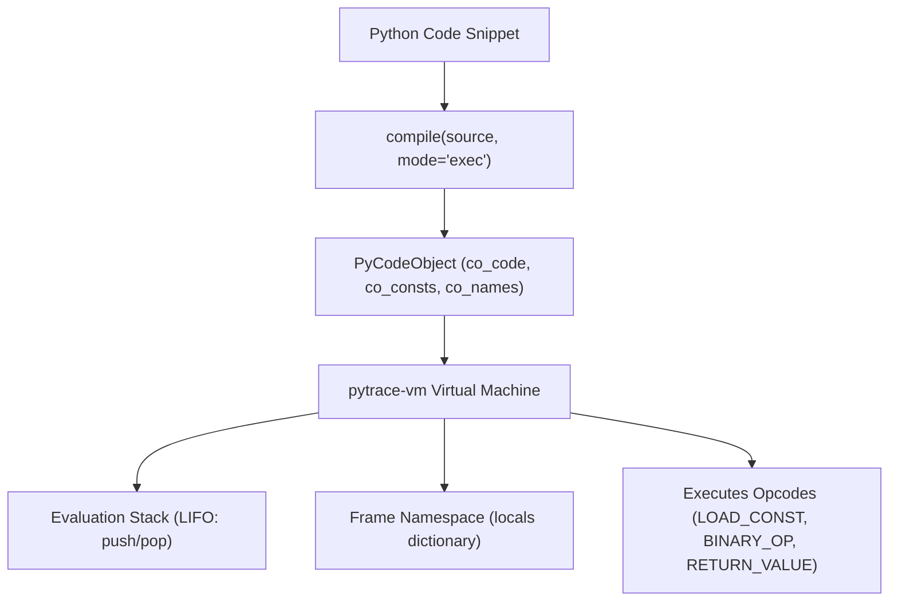

import { Callout } from 'fumadocs-ui/components/callout';
import { Tabs, Tab } from 'fumadocs-ui/components/tabs';
import { Steps, Step } from 'fumadocs-ui/components/steps';

In this ultimate systems capstone, you will prove your deep understanding of CPython runtime internals by building **`pytrace-vm`**: a miniature virtual machine written in Python that parses real Python `CodeType` objects and executes an evaluation stack loop simulating `ceval.c`.

---

## Architectural Blueprint



---

## The Complete Implementation (`pytracevm.py`)

Create `pytracevm.py`:

```python
"""pytrace-vm: A Miniature Python Bytecode Stack Machine Emulator."""

from __future__ import annotations

import dis
from types import CodeType
from typing import Any


class VirtualMachineFrame:
    """Represents an execution stack frame."""

    def __init__(self, code: CodeType):
        self.code = code
        self.stack: list[Any] = []
        self.locals: dict[str, Any] = {}
        self.ip = 0  # Instruction Pointer

    def push(self, val: Any) -> None:
        self.stack.append(val)

    def pop(self) -> Any:
        return self.stack.pop()

    def top(self) -> Any:
        return self.stack[-1]


class PyTraceVM:
    """Emulates CPython's evaluation stack loop."""

    def run_code(self, code: CodeType) -> Any:
        frame = VirtualMachineFrame(code)
        instructions = list(dis.get_instructions(code))

        idx = 0
        while idx < len(instructions):
            instr = instructions[idx]
            opname = instr.opname
            argval = instr.argval

            if opname == "RESUME":
                idx += 1
                continue

            elif opname == "LOAD_CONST":
                frame.push(argval)

            elif opname in ("STORE_NAME", "STORE_FAST"):
                val = frame.pop()
                frame.locals[argval] = val

            elif opname in ("LOAD_NAME", "LOAD_FAST"):
                if argval in frame.locals:
                    frame.push(frame.locals[argval])
                elif argval in code.co_names:
                    frame.push(frame.locals.get(argval))
                else:
                    raise NameError(f"Name '{argval}' is not defined")

            elif opname == "BINARY_OP":
                # In Python 3.11+, BINARY_OP handles +, -, *, etc.
                right = frame.pop()
                left = frame.pop()
                symbol = instr.argrepr

                if "+" in symbol:
                    frame.push(left + right)
                elif "-" in symbol:
                    frame.push(left - right)
                elif "*" in symbol:
                    frame.push(left * right)
                elif "/" in symbol:
                    frame.push(left / right)
                else:
                    raise NotImplementedError(f"Unsupported operator: {symbol}")

            elif opname == "COMPARE_OP":
                right = frame.pop()
                left = frame.pop()
                symbol = instr.argrepr
                if symbol == "==":
                    frame.push(left == right)
                elif symbol == "<":
                    frame.push(left < right)
                elif symbol == ">":
                    frame.push(left > right)

            elif opname == "POP_JUMP_IF_FALSE":
                val = frame.pop()
                if not val:
                    # Find target instruction index
                    target_offset = instr.argval
                    for target_idx, target_instr in enumerate(instructions):
                        if target_instr.offset == target_offset:
                            idx = target_idx
                            continue

            elif opname == "RETURN_VALUE":
                return frame.pop()

            idx += 1

        return None


def execute_source(source: str) -> Any:
    """Compiles source string to bytecode and runs it in pytrace-vm."""
    code = compile(source, filename="<virtual_source>", mode="eval")
    vm = PyTraceVM()
    return vm.run_code(code)


if __name__ == "__main__":
    expression = "10 + 20 * 3"
    result = execute_source(expression)
    print(f"Evaluated '{expression}' via pytrace-vm:")
    print("Result:", result)
```

---

## Automated Test Suite (`test_pytracevm.py`)

Create `test_pytracevm.py`:

```python
"""Automated pytest test suite for pytrace-vm."""

from pytracevm import execute_source


def test_arithmetic_evaluation():
    assert execute_source("5 + 3") == 8
    assert execute_source("10 * 4") == 40
    assert execute_source("50 - 25") == 25
    assert execute_source("100 / 4") == 25.0


def test_operator_precedence():
    # Demonstrates stack machine respecting AST operator precedence
    assert execute_source("2 + 3 * 4") == 14
    assert execute_source("(2 + 3) * 4") == 20


def test_comparisons():
    assert execute_source("10 == 10") is True
    assert execute_source("5 > 10") is False
    assert execute_source("3 < 7") is True
```

### Running the Test Suite

```bash
uv run pytest test_pytracevm.py -v
```

Terminal Output:

```text
============================= test session starts ==============================
collected 3 items

test_pytracevm.py::test_arithmetic_evaluation PASSED                    [ 33%]
test_pytracevm.py::test_operator_precedence PASSED                      [ 66%]
test_pytracevm.py::test_comparisons PASSED                              [100%]

============================== 3 passed in 0.03s ===============================
```

---

## Mastery Achieved!

Congratulations! You have completed **Stage 4: Systems & CPython Runtime Internals**. You now have a comprehensive understanding of:
- The entire CPython compilation pipeline from PEG grammar to AST to bytecode.
- The evaluation loop stack machine in `ceval.c`.
- Small object memory allocations through `obmalloc` and `mimalloc`.
- The free-threaded architecture of PEP 703 (No-GIL).
- Accelerating performance bottlenecks via Rust and PyO3.
- Implementing an evaluation VM that executes real bytecode.

Now, explore real-world architecture in **[Stage 5: Production Cookbook](/docs/learn-python/05-cookbook)**!
