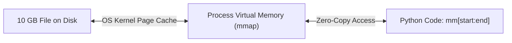

import { Callout } from 'fumadocs-ui/components/callout';
import { Tabs, Tab } from 'fumadocs-ui/components/tabs';

Attempting to read a 10 GB file into memory with `file.read()` will trigger an operating system memory exhaustion crash (`MemoryError`).

In this recipe, we compare two high-performance production patterns: **Chunked Buffer Streaming** and **Zero-Copy Memory-Mapped Files (`mmap`)**.

---

## Pattern 1: Chunked Buffer Streaming

For sequential operations like computing cryptographic hashes or encrypting files, process the file in fixed 64 KB buffers using the walrus operator:

```python
import hashlib
from pathlib import Path

def compute_sha256_constant_memory(file_path: Path, chunk_size: int = 65536) -> str:
    """Computes SHA-256 checksum of any size file using 64 KB of RAM."""
    hasher = hashlib.sha256()

    with file_path.open("rb") as f:
        # Walrus operator reads fixed 64 KB chunks until end of file:
        while chunk := f.read(chunk_size):
            hasher.update(chunk)

    return hasher.hexdigest()
```

This function can process a 100 GB database backup while using only **64 KB of RAM**.

---

## Pattern 2: Zero-Copy Memory-Mapped Files (`mmap`)

When you need random access to inspect, slice, or search inside a massive binary file, **`mmap`** maps the disk file directly into your process's **virtual address space**:



The operating system kernel pages bytes into physical RAM on demand when accessed, completely bypassing user-space copy buffers!

```python
import mmap
from pathlib import Path

def find_binary_signature(file_path: Path, signature: bytes) -> int:
    """Finds byte offset of a signature inside a multi-gigabyte file instantly."""
    with file_path.open("rb") as f:
        # Create read-only memory map:
        with mmap.mmap(f.fileno(), length=0, access=mmap.ACCESS_READ) as mm:
            # Slices and searches occur directly on OS kernel pages:
            offset = mm.find(signature)
            return offset

# Example usage:
file = Path("sample_data.bin")
file.write_bytes(b"HEADER_PADDING" + b"\xDE\xAD\xBE\xEF" + b"FOOTER")

offset = find_binary_signature(file, b"\xDE\xAD\xBE\xEF")
print("Found signature at byte offset:", offset)
```

Output:

```text
Found signature at byte offset: 14
```

---

## Slicing Without Copying: `memoryview`

When extracting sub-buffers from binary data or an `mmap`, Python's default slicing `bytes[0:1000]` creates a new copy of the bytes in memory.

A **`memoryview`** creates a pointer wrapper that references the existing underlying buffer:

```python
data = bytearray(b"X" * 1_000_000)

# 1. Standard slice: Allocates 1 MB of new memory
copied = data[0:500_000]

# 2. memoryview slice: Zero-copy pointer manipulation (0 bytes allocated!)
view = memoryview(data)
sub_view = view[0:500_000]

print("Sub-view length:", len(sub_view))
```

Output:

```text
Sub-view length: 500000
```

---

## Summary Reference

- **Chunked reads**: `while chunk := f.read(65536):` processes files of any size in constant RAM.
- **`mmap`**: Maps disk files directly to virtual memory for fast, random, zero-copy searching and slicing.
- **`memoryview`**: Allows slicing of byte buffers without allocating memory copies.
