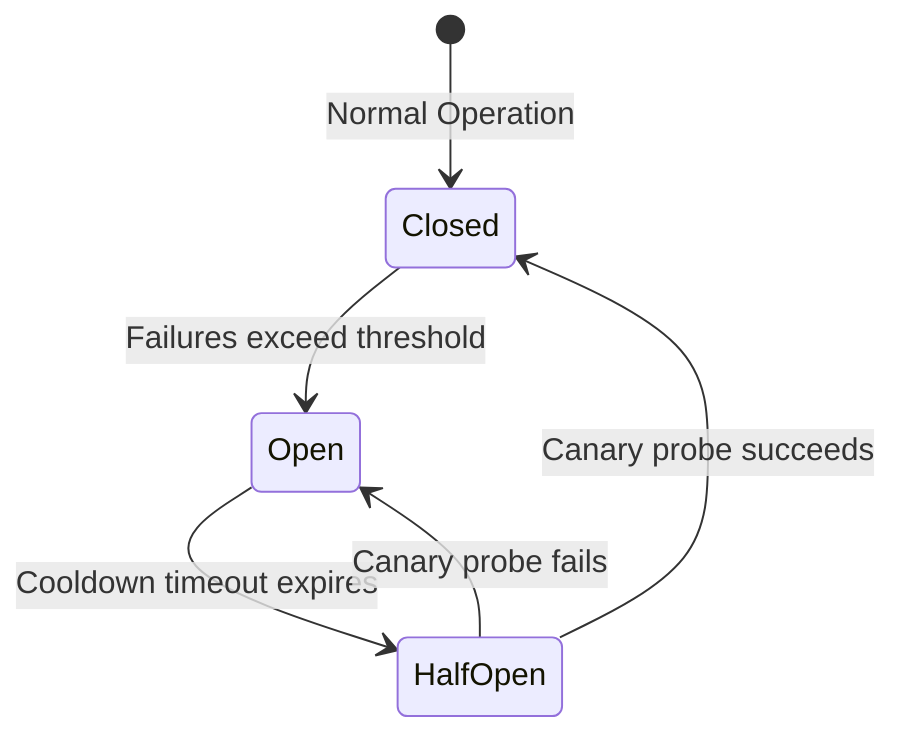

import { Callout } from 'fumadocs-ui/components/callout';
import { Tabs, Tab } from 'fumadocs-ui/components/tabs';

In distributed microservices, network connections are fundamentally unreliable. Transient timeouts, dropped TCP packets, and HTTP 503 errors are everyday realities.

However, naive retry loops (e.g. retrying every 1 second) create the **Thundering Herd Problem**: when an upstream database recovers, thousands of clients retry at the exact same millisecond, immediately crashing the service again!

---

## 1. Exponential Backoff with Full Jitter

The industry standard algorithm (formalized by AWS Architecture) calculates backoff delay using randomized jitter:

```text
sleep = random_uniform(0, min(max_cap, base * 2 ^ attempt))
```

```python
import asyncio
import random
from collections.abc import Callable
from typing import TypeVar

T = TypeVar("T")

async def retry_with_jitter[T](
    coro_func: Callable[[], asyncio.Future[T]],
    max_attempts: int = 5,
    base_delay: float = 0.5,
    max_delay: float = 10.0
) -> T:
    """Retries an async operation using exponential backoff with full jitter."""
    for attempt in range(1, max_attempts + 1):
        try:
            return await coro_func()
        except (ConnectionError, TimeoutError) as err:
            if attempt == max_attempts:
                print(f"[!] Max attempts ({max_attempts}) reached. Failing.")
                raise

            # Calculate jittered sleep time:
            calculated_backoff = min(max_delay, base_delay * (2 ** (attempt - 1)))
            sleep_time = random.uniform(0, calculated_backoff)

            print(
                f"[Attempt {attempt}/{max_attempts}] Error: {err}. "
                f"Retrying in {sleep_time:.2f}s (Jittered backoff)..."
            )
            await asyncio.sleep(sleep_time)

    raise RuntimeError("Unreachable")
```

---

## 2. The Circuit Breaker Pattern

When a remote service is down hard, retrying every request is wasteful and slows down user response times. A **Circuit Breaker** detects persistent failures and fails fast immediately:



```python
import time

class CircuitBreakerOpenError(Exception):
    """Raised when the circuit breaker rejects requests."""
    pass

class CircuitBreaker:
    def __init__(self, failure_threshold: int = 3, recovery_time: float = 5.0):
        self.failure_threshold = failure_threshold
        self.recovery_time = recovery_time
        self.failure_count = 0
        self.state = "CLOSED"
        self.last_state_change = time.time()

    def can_execute(self) -> bool:
        if self.state == "OPEN":
            if time.time() - self.last_state_change > self.recovery_time:
                self.state = "HALF-OPEN"
                return True
            return False
        return True

    def record_success(self):
        self.failure_count = 0
        self.state = "CLOSED"

    def record_failure(self):
        self.failure_count += 1
        if self.failure_count >= self.failure_threshold:
            self.state = "OPEN"
            self.last_state_change = time.time()
            print("[CIRCUIT BREAKER] Tripped to OPEN state! Failing fast.")
```

---

## Key Best Practices

- **Never retry non-idempotent operations blindly**: Only retry operations where repeating the call is safe (e.g. `GET`, idempotent `PUT`), never duplicate payment transactions!
- **Always add jitter**: Randomization breaks up lockstep synchronization across multiple microservice clients.
- **Fail Fast with Circuit Breakers**: Protect your application from hanging when dependencies suffer outages.
