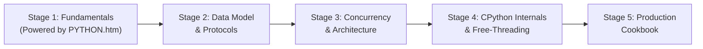

import { Callout } from 'fumadocs-ui/components/callout';
import { Tabs, Tab } from 'fumadocs-ui/components/tabs';

Python is one of the most powerful and versatile programming languages in the world. Every day, engineers use it across three major industry pillars:

1. **Automation & Scripting**: Eliminating repetitive manual toil, parsing thousands of documents or spreadsheets in seconds, and orchestrating cloud infrastructure.
2. **Artificial Intelligence & Machine Learning**: Building large language model pipelines, vector search engines, autonomous agents, and predictive recommendation systems.
3. **Web Applications & High-Throughput APIs**: Building scalable web services and platforms (from Instagram and Dropbox to modern FastAPI microservices).

This curriculum is engineered to guide you from your very first line of code all the way to understanding **CPython virtual machine bytecode**, **free-threaded parallelism (PEP 703)**, and **custom memory allocators**, while strictly adhering to modern **Python 3.12 and 3.13+** standards.

---

## Curriculum Tracks

The curriculum is structured into five progressive tracks:



### 1. Stage 1: Modern Foundations

**[Open Stage 1: Fundamentals →](/docs/learn-python/01-fundamentals)**

Built upon the crystal-clear editorial teaching format of **`PYTHON.htm`**:
- **Execution Model**: How the interpreter reads line by line from the top.
- **Object Memory Model**: Variables as sticky labels, not static boxes. Identity (`is`) vs Equality (`==`).
- **Traceback Anatomy**: Reading error maps starting on day one.
- **String Precision**: Visual index maps, bidirectional indexing ($0$ and $-1$), and slicing rules.
- **Modern Syntax**: Formatted strings (`f"..."`), pattern matching (`match/case`), and the walrus operator (`:=`).
- **Stage 1 Capstone**: `logpeek` — High-throughput streaming log analytics CLI ($O(1)$ memory).
- **Quick Reference**: Comprehensive cheat sheet grouping all core operations.

### 2. Stage 2: The Python Data Model & OOP

**[Open Stage 2: Intermediate →](/docs/learn-python/02-intermediate)**

- **The Dunder Protocol Matrix**: `__repr__`, `__len__`, `__getitem__`, `__iter__`.
- **First-Class Functions**: Closures, lexical scope cells, and parametric decorators (`ParamSpec`).
- **Generators & Iteration**: `yield`, `yield from`, and lazy streaming pipelines.
- **Idiomatic OOP**: Method Resolution Order (C3 Linearization) and cooperative `super()`.
- **Descriptors & Properties**: Attribute lookup precedence and data vs non-data descriptors.
- **Stage 2 Capstone**: `active-lite` — Declarative mini-ORM with SQLite and transaction context managers.

### 3. Stage 3: Concurrency, Architecture & Metaprogramming

**[Open Stage 3: Advanced →](/docs/learn-python/03-advanced)**

- **Metaclasses & Class Factories**: `type()`, `__init_subclass__`, and schema validation engines.
- **Concurrency Matrix**: OS Threads vs Multiprocessing vs AsyncIO cooperative multitasking.
- **Modern AsyncIO**: The event loop, socket selectors, structured concurrency with `TaskGroup` and `except*` (PEP 654).
- **Memory Profiling**: Reference counting, cyclic garbage collection (`gc`), and `tracemalloc`.
- **Stage 3 Capstone**: `tiny-redis` — In-memory non-blocking RESP server & async crawler.

### 4. Stage 4: Systems & CPython Internals

**[Open Stage 4: Systems & Internals →](/docs/learn-python/04-systems-internals)**

- **CPython Pipeline**: Source code → PEG Parser → AST → Symbol Table → Bytecode.
- **Evaluation Stack Machine**: How `ceval.c` evaluates opcodes, specialized instructions (PEP 659), and JIT (PEP 744).
- **Memory Architecture**: `PyObject`, Arenas, Pools, Blocks (`obmalloc`), and `mimalloc` in Python 3.13.
- **The Free-Threaded Future**: Eliminating the GIL (`--disable-gil` PEP 703) and Subinterpreters (PEP 734).
- **Native Extensions**: Accelerating critical hot paths in Rust via **PyO3** and `maturin`.
- **Stage 4 Capstone**: `pytrace-vm` — Miniature bytecode disassembler and stack evaluator.

### 5. Stage 5: Production Cookbook

**[Open Stage 5: Cookbook →](/docs/learn-python/05-cookbook)**

Battle-tested, copy-pasteable production recipes:
- Enterprise CLI tools with subcommands and UNIX signal handling.
- Resilient HTTP clients with exponential jittered backoff and circuit breaking.
- High-performance SQLite pooling with WAL mode.
- Ultra-fast JSON and binary parsing benchmarks (`orjson`, `msgspec`).
- Memory-mapped zero-copy file streaming (`mmap`).

---

## Specialized Applied Tracks

Beyond core language mastery, explore applied engineering domains without sequential stage constraints:

### Python for AI & Machine Learning

**[Open Specialized Track: Python for AI →](/docs/learn-python/python-for-ai)**

Bridge Python systems engineering with modern generative AI and deep learning:
- **Vectorized Computing with NumPy**: Contiguous memory layouts, SIMD broadcasting, and high-speed linear algebra.
- **Tensors & Autograd (PyTorch)**: Computational graphs, reverse-mode autodiff, and training neural networks from first principles.
- **Embeddings & Vector Search**: BPE tokenization, high-dimensional vector spaces, and building an in-memory vector database.
- **LLM APIs & Streaming**: Async generators, resilient retry loops with exponential backoff, and Pydantic v2 structured schemas.
- **RAG Architecture**: Recursive boundary chunking, hybrid dense/sparse search, and augmented prompt synthesis.
- **Autonomous AI Agents**: Function calling schemas, the ReAct loop, tool execution engines, and memory management.
- **Applied Capstone**: Production Research & RAG Agent with dynamic tool dispatch and validated output reports.

---

## Modern Python Toolchain: `uv` & `ruff`

In modern Python engineering, legacy fragmented tools (`pip`, `virtualenv`, `poetry`, `flake8`, `black`) have been replaced by ultra-fast, Rust-powered developer tooling:

<Tabs items={['uv (Project & Dependencies)', 'ruff (Lint & Format)', 'pyproject.toml']}>
<Tab value="uv (Project & Dependencies)">
```bash
# Install uv (cross-platform single binary)
curl -LsSf https://astral.sh/uv/install.sh | sh

# Initialize a modern Python 3.12+ project
uv init my-project
cd my-project

# Add dependencies with instant resolution
uv add pytest rich

# Run your project in an isolated managed virtual environment
uv run app.py
```
</Tab>

<Tab value="ruff (Lint & Format)">
```bash
# Check code against 40+ linter rule sets in milliseconds
uv run ruff check .

# Automatically fix lint violations and organize imports
uv run ruff check --fix .

# Format code with the ultra-fast Black-compatible formatter
uv run ruff format .
```
</Tab>

<Tab value="pyproject.toml">
```toml
[project]
name = "cs-cookbook-python"
version = "0.1.0"
description = "Modern Python Master Curriculum Examples"
readme = "README.md"
requires-python = ">=3.12"
dependencies = [
    "pytest>=8.0.0",
    "rich>=13.0.0",
]

[tool.ruff]
line-length = 88
target-version = "py312"

[tool.ruff.lint]
select = ["E", "F", "I", "UP", "B", "SIM"]
```
</Tab>
</Tabs>

---

## The Golden Rule

> *"Don't try to memorize anything in this curriculum — that's what the cheat sheets and documentation are for. Focus on building the **mental model** of what the computer and interpreter are actually doing under the hood. Within a few weeks of writing code every day, it will all become muscle memory."*

Jump right in: start with **[01. Why Python & Modern Setup](/docs/learn-python/01-fundamentals/01-why-python-and-setup)**.
