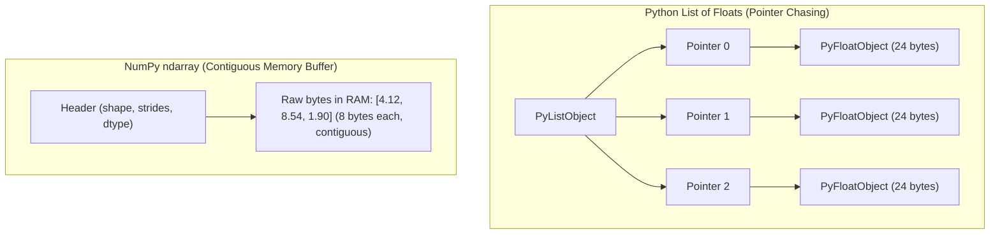
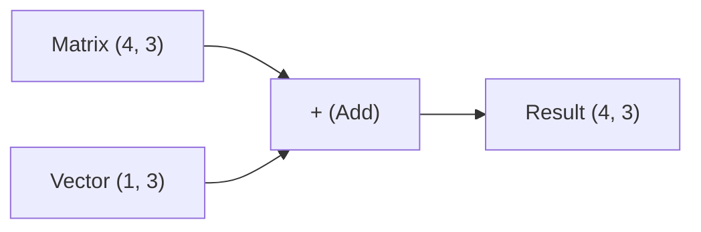

import { Callout } from 'fumadocs-ui/components/callout';
import { Tabs, Tab } from 'fumadocs-ui/components/tabs';

Modern machine learning models and large language models process billions of floating-point numbers per second. If you attempt to process these numbers using standard Python `for` loops and lists, your application will crawl at a fraction of modern hardware speeds.

To build performant AI systems, you must think in **vectorized arrays**.

---

## 1. The Cost of Pure Python: Why Loops Are Slow

Every standard Python integer or float is not a raw 64-bit value in CPU cache. It is a full **CPython heap object** (`PyObject` or `PyFloatObject`), requiring:
- 16 to 28 bytes of memory overhead per scalar.
- Pointer dereferencing for every access.
- Dynamic type checks on every addition or multiplication.



### Benchmark: Python Loop vs. Vectorized NumPy

```python
import time
import numpy as np

N = 5_000_000

# 1. Pure Python approach
py_list_a = [float(i) for i in range(N)]
py_list_b = [float(i) for i in range(N)]

t0 = time.perf_counter()
py_result = [a * b for a, b in zip(py_list_a, py_list_b)]
t_py = time.perf_counter() - t0

# 2. NumPy vectorized approach
np_a = np.arange(N, dtype=np.float64)
np_b = np.arange(N, dtype=np.float64)

t0 = time.perf_counter()
np_result = np_a * np_b
t_np = time.perf_counter() - t0

print(f"Python list loop:  {t_py:.4f}s")
print(f"NumPy vectorized:  {t_np:.4f}s ({t_py / t_np:.1f}x faster)")
```

NumPy is typically **50x to 100x faster** because the calculation executes inside compiled C code utilizing CPU **SIMD (Single Instruction, Multiple Data)** vector registers (AVX-512, Neon).

---

## 2. Memory Layout: Strides & Shape

An `ndarray` consists of two things:
1. **Raw contiguous byte buffer** in RAM.
2. **Metadata**: Data type (`dtype`), dimensions (`shape`), and byte-stepping increments (`strides`).

```python
import numpy as np

# Create a 2D array of 32-bit floats (4 bytes per element)
matrix = np.array([[10.0, 20.0, 30.0],
                   [40.0, 50.0, 60.0]], dtype=np.float32)

print("Shape:  ", matrix.shape)    # (2, 3) -> 2 rows, 3 columns
print("Strides:", matrix.strides)  # (12, 4) -> 12 bytes to move down a row, 4 bytes to move to next column
print("Dtype:  ", matrix.dtype)    # float32
```

Transposing a matrix (`matrix.T`) does not copy the underlying memory; it merely swaps the shapes and strides metadata! This makes transformations essentially instantaneous:

```python
transposed = matrix.T
print("Transposed Shape:  ", transposed.shape)    # (3, 2)
print("Transposed Strides:", transposed.strides)  # (4, 12)
```

---

## 3. Broadcasting: Aligning Dimensions Without Allocation

Broadcasting allows arithmetic operations on arrays of differing shapes without creating redundant copies of data in memory:



### The Two Broadcasting Rules:
1. Compare dimensions element-wise, starting from the **rightmost (trailing) dimension** and moving left.
2. Two dimensions are compatible if:
   - They are **equal**, or
   - One of them is **1**.

```python
import numpy as np

# A batch of 4 token embeddings, each of dimension 3
embeddings = np.array([
    [1.0, 2.0, 3.0],
    [4.0, 5.0, 6.0],
    [7.0, 8.0, 9.0],
    [2.0, 4.0, 6.0]
])  # Shape: (4, 3)

# A single bias vector for each dimension
bias = np.array([0.5, -0.5, 0.1])  # Shape: (3,)

# Broadcasting expands bias across all 4 rows without memory duplication
biased_embeddings = embeddings + bias
print(biased_embeddings)
```

---

## 4. Matrix Multiplication: The Core of Neural Networks

In deep learning, every linear layer computes:

$$\mathbf{Y} = \mathbf{X} \mathbf{W} + \mathbf{b}$$

In Python, use the `@` infix operator for matrix multiplication:

```python
import numpy as np

# Input batch: 2 sample queries, embedding dimension 4
X = np.array([
    [0.1, 0.8, -0.3, 0.4],
    [-0.5, 0.2, 0.9, 0.1]
])  # Shape: (2, 4)

# Weight projection matrix: mapping 4 dimensions to 3 output features
W = np.array([
    [0.2, -0.1, 0.5],
    [0.4, 0.3, -0.2],
    [-0.1, 0.7, 0.1],
    [0.8, 0.0, -0.4]
])  # Shape: (4, 3)

# Bias vector
b = np.array([0.05, -0.02, 0.01])  # Shape: (3,)

# Forward pass calculation
Y = X @ W + b
print("Output shape:", Y.shape)  # (2, 3)
print("Output activations:\n", Y)
```

---

## 5. Building Vectorized Cosine Similarity

Cosine similarity evaluates semantic closeness between two vectors $\mathbf{u}$ and $\mathbf{v}$:

$$\text{similarity}(\mathbf{u}, \mathbf{v}) = \frac{\mathbf{u} \cdot \mathbf{v}}{\|\mathbf{u}\|_2 \|\mathbf{v}\|_2}$$

Here is a vectorized implementation that computes the similarity between a **single query vector** and a **batch of 100,000 document vectors** simultaneously:

```python
import numpy as np

def batch_cosine_similarity(query: np.ndarray, documents: np.ndarray) -> np.ndarray:
    """
    Computes cosine similarity between a single 1D query vector and a 2D batch of documents.
    
    Args:
        query: 1D array of shape (D,)
        documents: 2D array of shape (N, D)
        
    Returns:
        1D array of similarity scores of shape (N,), values in range [-1.0, 1.0]
    """
    # 1. Compute dot products: (N, D) @ (D,) -> (N,)
    dot_products = documents @ query
    
    # 2. Compute L2 norms (Euclidean lengths)
    query_norm = np.linalg.norm(query)
    doc_norms = np.linalg.norm(documents, axis=1)  # Along each row
    
    # 3. Prevent division by zero with small epsilon
    denominator = doc_norms * (query_norm + 1e-12)
    
    return dot_products / denominator

# Demonstration
np.random.seed(42)
query_vec = np.random.randn(768).astype(np.float32)
doc_corpus = np.random.randn(10_000, 768).astype(np.float32)

scores = batch_cosine_similarity(query_vec, doc_corpus)
top_5_indices = np.argsort(scores)[::-1][:5]

print("Top 5 matching document indices:", top_5_indices)
print("Top 5 similarity scores:        ", scores[top_5_indices])
```

---

## 6. Views vs. Copies: Avoiding Silent Bugs

When indexing NumPy arrays, understanding when you are working on a **view** (sharing memory) versus a **copy** is critical:

| Operation | Result | Modifying result affects original? |
| :--- | :--- | :--- |
| `arr[0:5]` (Basic slice) | **View** (zero-copy) | **Yes** (mutates original) |
| `arr[arr > 0]` (Boolean mask) | **Copy** (allocates new buffer) | **No** |
| `arr[[0, 2, 4]]` (Fancy indexing) | **Copy** (allocates new buffer) | **No** |
| `arr.reshape(...)` | **View** (when contiguous) | **Yes** |
| `arr.copy()` | **Copy** (explicitly cloned) | **No** |

```python
original = np.array([1, 2, 3, 4, 5])
slice_view = original[0:2]

slice_view[0] = 999
print("Original modified through slice view:", original[0])  # Prints 999!
```

<Callout type="warn" title="AI Engineering Rule">
Always use `.copy()` when you extract an array slice that will be mutated or passed asynchronously across worker processes, preventing accidental memory race conditions.
</Callout>
