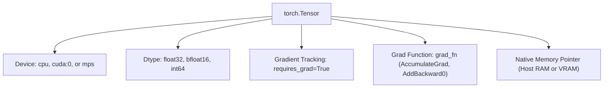
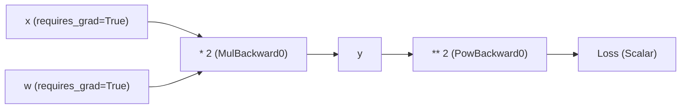

import { Callout } from 'fumadocs-ui/components/callout';
import { Tabs, Tab } from 'fumadocs-ui/components/tabs';

While NumPy provides the fundamental abstractions for multi-dimensional arrays, modern deep learning requires two critical capabilities NumPy lacks:
1. **Seamless Hardware Acceleration** (NVIDIA CUDA, Apple MPS, AMD ROCm).
2. **Automatic Differentiation (`autograd`)** to calculate partial derivatives (gradients) across complex computation graphs.

**PyTorch** provides both through its core primitive: the **Tensor**.

---

## 1. Tensors vs. NumPy Arrays

A PyTorch `Tensor` is syntactically nearly identical to a NumPy `ndarray`, but it carries device information and tracking metadata:



### Device-Agnostic Setup in Python

Always write device-agnostic code that detects available hardware:

```python
import torch

def get_compute_device() -> torch.device:
    """Detects best available hardware acceleration."""
    if torch.cuda.is_available():
        return torch.device("cuda")
    elif hasattr(torch.backends, "mps") and torch.backends.mps.is_available():
        return torch.device("mps")  # Apple Silicon GPU
    return torch.device("cpu")

device = get_compute_device()
print(f"Executing tensors on: {device}")

# Move tensor to device
x = torch.randn(1024, 1024, dtype=torch.float32, device=device)
y = torch.randn(1024, 1024, dtype=torch.float32, device=device)

# Native GPU matrix multiplication
z = x @ y
print("Result shape:", z.shape)
```

---

## 2. Computational Graphs & Reverse-Mode Autograd

To train neural networks, we must compute how changing each weight affects the final loss:

$$\frac{\partial \mathcal{L}}{\partial \mathbf{W}}$$

PyTorch builds a **Dynamic Computation Graph (DAG)** during the forward pass. Every operation on a tensor with `requires_grad=True` records its mathematical derivative function in `.grad_fn`.



### Hands-on Autograd Demonstration

```python
import torch

# 1. Create leaf tensors with gradient tracking enabled
x = torch.tensor(3.0, requires_grad=True)
w = torch.tensor(2.0, requires_grad=True)
b = torch.tensor(1.5, requires_grad=True)

# 2. Forward pass: y = w * x + b
y = w * x + b  # 2.0 * 3.0 + 1.5 = 7.5

# 3. Calculate scalar loss: L = (y - 10)^2
loss = (y - 10.0) ** 2  # (7.5 - 10.0)^2 = (-2.5)^2 = 6.25

print("Loss value:   ", loss.item())
print("Loss grad_fn: ", loss.grad_fn)  # <PowBackward0 object>

# 4. Backward pass: Reverse-mode autodiff via the chain rule
loss.backward()

# 5. Inspect gradients: dLoss/dw, dLoss/dx, dLoss/db
# Analytical derivative: dLoss/dw = 2 * (w*x + b - 10) * x = 2 * (-2.5) * 3 = -15.0
print("dLoss / dw:", w.grad.item())  # -15.0
print("dLoss / dx:", x.grad.item())  # -10.0
print("dLoss / db:", b.grad.item())  # -5.0
```

---

## 3. The Gradient Accumulation Gotcha

By default, calling `.backward()` does **not** overwrite `.grad`; it **accumulates (adds)** to it:

$$\mathbf{w}.\text{grad} \leftarrow \mathbf{w}.\text{grad} + \frac{\partial \mathcal{L}}{\partial \mathbf{w}}$$

If you do not clear gradients between iterations in a training loop, your gradients will continuously grow, causing training to explode!

```python
# In standard training loops, always zero gradients before computing the backward pass:
# optimizer.zero_grad(set_to_none=True)

# Alternatively on individual tensors:
w.grad = None  # More memory-efficient than w.grad.zero_()
```

---

## 4. Disabling Autograd During Inference

When running models in production for evaluation, search, or generation, building the computation graph wastes CPU and GPU VRAM:

```python
import torch

# 1. Temporarily disable autograd with context manager
with torch.no_grad():
    prediction = model(input_tokens)

# 2. Or detach a specific tensor from the computational graph
untracked_embedding = raw_embedding.detach().cpu().numpy()
```

---

## 5. Building a Neural Network from Scratch

Here is a complete, minimal neural network implemented with PyTorch's `nn.Module` to predict a non-linear relationship:

```python
import torch
import torch.nn as nn
import torch.optim as optim

# 1. Define model architecture
class RegressionNet(nn.Module):
    def __init__(self, input_dim: int, hidden_dim: int, output_dim: int):
        super().__init__()
        self.layer1 = nn.Linear(input_dim, hidden_dim)
        self.activation = nn.ReLU()
        self.layer2 = nn.Linear(hidden_dim, output_dim)
        
    def forward(self, x: torch.Tensor) -> torch.Tensor:
        h = self.activation(self.layer1(x))
        out = self.layer2(h)
        return out

# 2. Generate synthetic training data: y = 3 * x1 - 2 * x2 + 1.5 + noise
torch.manual_seed(42)
X_train = torch.randn(200, 2)
y_train = 3.0 * X_train[:, 0:1] - 2.0 * X_train[:, 1:2] + 1.5 + 0.1 * torch.randn(200, 1)

# 3. Instantiate model, loss function, and optimizer
model = RegressionNet(input_dim=2, hidden_dim=16, output_dim=1)
criterion = nn.MSELoss()
optimizer = optim.Adam(model.parameters(), lr=0.05)

# 4. Training loop
for epoch in range(100):
    # Forward pass
    predictions = model(X_train)
    loss = criterion(predictions, y_train)
    
    # Backward pass & optimization
    optimizer.zero_grad(set_to_none=True)
    loss.backward()
    optimizer.step()
    
    if (epoch + 1) % 20 == 0:
        print(f"Epoch [{epoch + 1}/100], Loss: {loss.item():.4f}")

# 5. Evaluation inference
model.eval()
with torch.no_grad():
    sample_input = torch.tensor([[1.0, 2.0]])
    # Expected: 3*(1) - 2*(2) + 1.5 = 0.5
    pred = model(sample_input)
    print(f"Prediction for [1.0, 2.0]: {pred.item():.4f} (Expected ~0.5)")
```

<Callout type="info" title="Takeaway for AI Engineers">
Understanding `autograd` and tensor memory layout prepares you for debugging LLM fine-tuning scripts, parameter-efficient training (LoRA/QLoRA), and custom loss functions.
</Callout>
