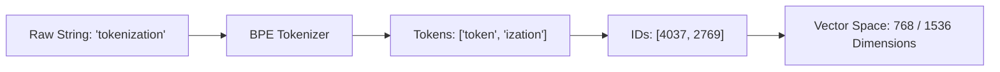

import { Callout } from 'fumadocs-ui/components/callout';
import { Tabs, Tab } from 'fumadocs-ui/components/tabs';

Language models do not understand text strings directly. Before any reasoning, search, or generation happens, human text is split into numeric tokens and projected into a continuous, high-dimensional coordinate space $\mathbb{R}^D$ known as **embeddings**.

---

## 1. Tokenization: From Characters to Numbers

Language models process text as a sequence of integer IDs called **tokens**. Modern models use subword tokenization algorithms like **Byte-Pair Encoding (BPE)**:



### Why Words Aren't One Token
- A vocabulary of every English word would require millions of entries and could never handle new words, code identifiers, or spelling errors.
- Subword tokenization breaks rare words into common fragments (`"unbelievable"` $\rightarrow$ `"un"`, `"believ"`, `"able"`).
- On average in English, **1 token $\approx$ 0.75 words** or **4 characters**.

---

## 2. The Geometry of Semantic Vectors

An embedding is a vector of floating-point numbers (typically 384, 768, 1536, or 3072 dimensions) where:
- Words/sentences with similar meanings have high cosine similarity.
- Directions in space represent semantic relationships (e.g. $\vec{v}_{\text{King}} - \vec{v}_{\text{Man}} + \vec{v}_{\text{Woman}} \approx \vec{v}_{\text{Queen}}$).

```
"Python programming language" -> [ 0.042, -0.198,  0.881, ..., -0.012 ]
"Writing software in Python"  -> [ 0.039, -0.185,  0.865, ..., -0.015 ]  (High similarity: 0.96)
"Recipe for chocolate cake"   -> [-0.512,  0.721, -0.094, ...,  0.312 ]  (Low similarity: 0.12)
```

---

## 3. Distance Metrics: Cosine vs. L2 vs. Dot Product

Choosing the correct similarity metric depends on whether your embeddings are **unit-normalized** ($\|\mathbf{v}\|_2 = 1$):

| Metric | Formula | Best Used For | Notes |
| :--- | :--- | :--- | :--- |
| **Cosine Similarity** | $\frac{\mathbf{u} \cdot \mathbf{v}}{\|\mathbf{u}\| \|\mathbf{v}\|}$ | Semantic text similarity | Invariant to vector length |
| **Dot Product (IP)** | $\mathbf{u} \cdot \mathbf{v}$ | Normalized embeddings | If $\|\mathbf{u}\| = \|\mathbf{v}\| = 1$, Dot Product $\equiv$ Cosine |
| **Euclidean (L2)** | $\sqrt{\sum (u_i - v_i)^2}$ | Clustering, spatial data | Sensitive to vector magnitude |

<Callout type="tip" title="Optimization Insight">
Most production vector databases (Pinecone, Qdrant, Milvus, Chroma) prefer **inner product (dot product)** because if vectors are pre-normalized upon insertion, computing similarity requires only a single BLAS matrix multiplication: no square roots or division!
</Callout>

---

## 4. Building an In-Memory Vector Database in Python

Let's build a self-contained, typed vector database with metadata filtering and top-k search in pure Python and NumPy:

```python
from dataclasses import dataclass, field
from typing import Any, Dict, List, Optional
import numpy as np

@dataclass
class DocumentRecord:
    id: str
    text: str
    metadata: Dict[str, Any]
    vector: np.ndarray

class InMemoryVectorDB:
    def __init__(self, dimension: int):
        self.dimension = dimension
        self.records: List[DocumentRecord] = []
        # Pre-allocated matrix for fast vectorized BLAS operations
        self._matrix: Optional[np.ndarray] = None
        self._dirty = False

    def insert(self, doc_id: str, text: str, vector: list[float] | np.ndarray, metadata: Optional[Dict[str, Any]] = None) -> None:
        vec = np.asarray(vector, dtype=np.float32)
        if vec.shape != (self.dimension,):
            raise ValueError(f"Vector dimension mismatch: expected {self.dimension}, got {vec.shape}")
        
        # Normalize vector to unit length (L2 norm = 1.0)
        norm = np.linalg.norm(vec)
        if norm > 0:
            vec = vec / norm
            
        record = DocumentRecord(
            id=doc_id,
            text=text,
            metadata=metadata or {},
            vector=vec
        )
        self.records.append(record)
        self._dirty = True

    def _sync_matrix(self) -> None:
        """Stacks records into a contiguous 2D NumPy array (N, D)."""
        if self._dirty or self._matrix is None:
            if not self.records:
                self._matrix = np.empty((0, self.dimension), dtype=np.float32)
            else:
                self._matrix = np.vstack([rec.vector for rec in self.records])
            self._dirty = False

    def search(
        self,
        query_vector: list[float] | np.ndarray,
        top_k: int = 5,
        filter_fn: Optional[callable] = None
    ) -> List[tuple[DocumentRecord, float]]:
        self._sync_matrix()
        
        if len(self.records) == 0:
            return []

        # 1. Normalize query
        q = np.asarray(query_vector, dtype=np.float32)
        norm = np.linalg.norm(q)
        if norm > 0:
            q = q / norm

        # 2. Compute all cosine similarities in a single C-level dot product
        similarities = self._matrix @ q  # Shape: (N,)

        # 3. Apply optional metadata filters
        candidate_indices = []
        for idx, rec in enumerate(self.records):
            if filter_fn is None or filter_fn(rec.metadata):
                candidate_indices.append(idx)

        if not candidate_indices:
            return []

        candidate_indices = np.array(candidate_indices)
        filtered_scores = similarities[candidate_indices]

        # 4. Efficient Top-K using argpartition (O(N) instead of O(N log N))
        k = min(top_k, len(candidate_indices))
        if k < len(candidate_indices):
            partitioned = np.argpartition(-filtered_scores, k - 1)[:k]
            # Sort only the top k
            sorted_top_k = partitioned[np.argsort(-filtered_scores[partitioned])]
        else:
            sorted_top_k = np.argsort(-filtered_scores)

        results = []
        for rank in sorted_top_k:
            original_idx = candidate_indices[rank]
            score = float(similarities[original_idx])
            results.append((self.records[original_idx], score))

        return results
```

### Testing the Vector DB

```python
# Create database with dimension 4 (for demonstration)
db = InMemoryVectorDB(dimension=4)

db.insert("1", "Python async event loop internals", [0.9, 0.2, 0.1, 0.0], {"category": "python"})
db.insert("2", "Building Web APIs with FastAPI",    [0.85, 0.3, 0.2, 0.1], {"category": "python"})
db.insert("3", "Making sourdough bread at home",    [-0.2, 0.9, 0.8, -0.1], {"category": "cooking"})
db.insert("4", "Deploying models to Kubernetes",    [0.7, 0.1, 0.4, 0.5], {"category": "devops"})

# Query for python development
query = [0.88, 0.25, 0.15, 0.05]
matches = db.search(query, top_k=2, filter_fn=lambda m: m.get("category") == "python")

for doc, score in matches:
    print(f"[{score:.4f}] {doc.text} (Category: {doc.metadata['category']})")
```

---

## 5. Approximate Nearest Neighbors (ANN) & Indexing

When databases store millions or billions of vectors, calculating exact dot products across every document ($O(N)$ brute-force) becomes too slow.

Production vector databases use **Approximate Nearest Neighbor (ANN)** indexing algorithms:
- **HNSW (Hierarchical Navigable Small World)**: Builds a multi-layer graph where high layers allow long-range hops and lower layers perform fine-grained search ($O(\log N)$ search time).
- **IVFFlat (Inverted File Flat)**: Clusters vectors into Voronoi cells using k-means, querying only the nearest cluster centroids.
- **Product Quantization (PQ)**: Compresses floating-point vectors into compact codes for drastic RAM savings.
