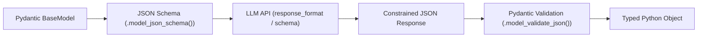

import { Callout } from 'fumadocs-ui/components/callout';
import { Tabs, Tab } from 'fumadocs-ui/components/tabs';

In modern AI engineering, language models are rarely isolated scripts. They power backend microservices, real-time user interfaces, and automated extraction pipelines.

Building reliable LLM services requires three non-negotiables:
1. **Asynchronous Streaming**: Reducing Time-To-First-Token (TTFT) for user responsiveness.
2. **Deterministic Structured Outputs**: Enforcing machine-readable data structures via Pydantic schemas instead of hoping for valid JSON.
3. **Resilient Rate-Limit Handling**: Gracefully recovering from HTTP 429 and transient provider downtime.

---

## 1. Async Streaming with Python Generators

When generating large responses, waiting for the entire completion blocks the client for seconds. Using Python's `async for` over Server-Sent Events (SSE) streams tokens immediately as they are sampled:

```python
import asyncio
import os
import httpx

async def stream_chat_completion(prompt: str, model: str = "gpt-4o-mini"):
    """
    Streams tokens from a modern OpenAI-compatible API endpoint using httpx.
    """
    api_key = os.getenv("OPENAI_API_KEY", "mock-token")
    url = "https://api.openai.com/v1/chat/completions"
    
    headers = {
        "Authorization": f"Bearer {api_key}",
        "Content-Type": "application/json"
    }
    
    payload = {
        "model": model,
        "messages": [{"role": "user", "content": prompt}],
        "stream": True,
        "temperature": 0.2
    }
    
    async with httpx.AsyncClient(timeout=30.0) as client:
        async with client.stream("POST", url, headers=headers, json=payload) as response:
            if response.status_code != 200:
                error_body = await response.aread()
                raise RuntimeError(f"API Error {response.status_code}: {error_body.decode()}")

            async for line in response.aiter_lines():
                if not line or not line.startswith("data: "):
                    continue
                data_str = line[len("data: "):].strip()
                if data_str == "[DONE]":
                    break
                
                # Parse chunk JSON
                try:
                    import json
                    chunk = json.loads(data_str)
                    delta = chunk["choices"][0]["delta"]
                    if "content" in delta and delta["content"]:
                        yield delta["content"]
                except Exception:
                    continue

# Usage example
async def main():
    print("Streaming output: ", end="", flush=True)
    async for token in stream_chat_completion("Explain the Python GIL in 2 concise sentences."):
        print(token, end="", flush=True)
    print("\n[Stream Complete]")

# asyncio.run(main())
```

---

## 2. Guaranteed Structured Outputs with Pydantic v2

Never rely on raw string parsing or regular expressions to parse model outputs. Modern LLMs support **Structured Outputs** (JSON Schema constraints directly enforced during decoding).

In Python, define your target output structure using **Pydantic v2**:



### Implementing Structured Extraction

```python
from enum import Enum
from typing import List, Optional
from pydantic import BaseModel, Field, field_validator

class SentimentEnum(str, Enum):
    POSITIVE = "positive"
    NEUTRAL = "neutral"
    NEGATIVE = "negative"

class ExtractedEntity(BaseModel):
    name: str = Field(description="The proper name of the entity or product")
    category: str = Field(description="Entity type, e.g., company, technology, person")
    confidence: float = Field(ge=0.0, le=1.0, description="Confidence score from 0.0 to 1.0")

class CustomerFeedbackAnalysis(BaseModel):
    sentiment: SentimentEnum
    urgency_score: int = Field(ge=1, le=5, description="1 is low priority, 5 is critical outage")
    key_points: List[str] = Field(min_length=1, description="Bulleted summary of feedback")
    entities_mentioned: List[ExtractedEntity]
    suggested_reply: Optional[str] = None

    @field_validator("key_points")
    def points_must_be_substantive(cls, v):
        for point in v:
            if len(point.strip()) < 5:
                raise ValueError("Key points must be at least 5 characters long")
        return v

# Inspect the auto-generated JSON schema that gets passed to the LLM API
print(CustomerFeedbackAnalysis.model_json_schema())
```

### Feeding Schema to the LLM and Validating

```python
import json
from pydantic import ValidationError

def parse_llm_json(raw_llm_response: str) -> CustomerFeedbackAnalysis:
    """Safely parses and validates LLM output against the schema."""
    try:
        # Pydantic v2 validates JSON string directly in high-performance C/Rust
        validated_data = CustomerFeedbackAnalysis.model_validate_json(raw_llm_response)
        return validated_data
    except ValidationError as e:
        print("Schema validation failed! Model output was invalid:")
        print(e.errors())
        raise
```

---

## 3. Resilient API Execution with Jittered Exponential Backoff

LLM APIs frequently return `HTTP 429 Too Many Requests` when token-per-minute (TPM) or request-per-minute (RPM) quotas are reached.

A robust Python caller must implement **Full Jitter Exponential Backoff**:

```python
import asyncio
import random
import time
from typing import Any, Callable, Coroutine

async def call_with_backoff(
    async_fn: Callable[[], Coroutine[Any, Any, Any]],
    max_retries: int = 5,
    base_delay: float = 1.0,
    max_delay: float = 30.0
) -> Any:
    """
    Executes an async API call with randomized exponential backoff (full jitter).
    Prevents the 'thundering herd' problem against rate-limited endpoints.
    """
    for attempt in range(max_retries):
        try:
            return await async_fn()
        except Exception as exc:
            # Check if error is transient rate limit or network issue
            if attempt == max_retries - 1:
                raise exc
            
            # Calculate backoff: min(max_delay, base_delay * 2^attempt)
            exponential_delay = min(max_delay, base_delay * (2 ** attempt))
            # Apply full jitter: random uniform between 0 and exponential_delay
            jittered_sleep = random.uniform(0.5, 1.0) * exponential_delay
            
            print(f"[Attempt {attempt + 1}] Request failed: {exc}. Retrying in {jittered_sleep:.2f}s...")
            await asyncio.sleep(jittered_sleep)

    raise RuntimeError("Unreachable")
```

---

## 4. Context Budgeting & Token Window Management

Language models have finite context windows. To avoid silent truncation or expensive overflow errors:

```python
def estimate_token_count(text: str) -> int:
    """Rule of thumb estimate: 1 token ~ 4 characters in English."""
    return len(text) // 4

def truncate_to_context_budget(history: list[dict], max_tokens: int = 4000) -> list[dict]:
    """Retains the system prompt and the most recent messages that fit the budget."""
    if not history:
        return []
    
    system_msg = history[0] if history[0]["role"] == "system" else None
    remaining_messages = history[1:] if system_msg else history[:]
    
    budget = max_tokens
    if system_msg:
        budget -= estimate_token_count(system_msg["content"])
        
    kept_messages = []
    # Accumulate backwards from newest to oldest
    for msg in reversed(remaining_messages):
        cost = estimate_token_count(msg["content"])
        if budget - cost >= 0:
            kept_messages.append(msg)
            budget -= cost
        else:
            break
            
    kept_messages.reverse()
    return ([system_msg] if system_msg else []) + kept_messages
```
