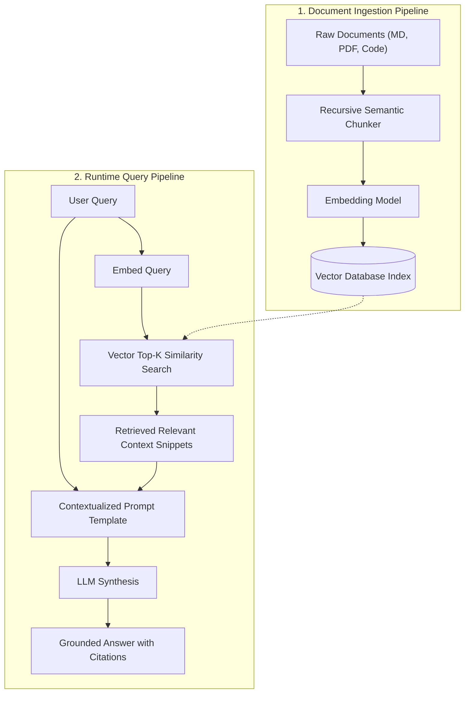

import { Callout } from 'fumadocs-ui/components/callout';
import { Tabs, Tab } from 'fumadocs-ui/components/tabs';

Language models suffer from two major limitations:
1. **Knowledge Cutoffs**: They do not know about proprietary internal data or recent world events.
2. **Hallucinations**: When uncertain, they generate convincing but factually incorrect assertions.

**Retrieval-Augmented Generation (RAG)** solves both by retrieving relevant document snippets from a knowledge base and injecting them as verified context into the model's prompt.



---

## 1. Chunking Strategies: The Foundation of RAG

If you chunk text naively (e.g. splitting every 500 characters), you will split sentences in half and sever context.

A production chunker uses **recursive boundary splitting**:
1. Try splitting on major section breaks (`\n\n# `, `\n\n`).
2. If a chunk exceeds the maximum size, split on newlines (`\n`).
3. If still too large, split on sentence ends (`. `, `? `, `! `).
4. Maintain an **overlap window** so thoughts spanning borders are preserved.

### Implementing a Recursive Text Chunker in Python

```python
import re
from typing import List

class RecursiveTextChunker:
    def __init__(self, chunk_size: int = 500, chunk_overlap: int = 100):
        self.chunk_size = chunk_size
        self.chunk_overlap = chunk_overlap
        self.separators = ["\n\n", "\n", ". ", " "]

    def split_text(self, text: str) -> List[str]:
        """Recursively splits text respecting natural punctuation boundaries."""
        return self._split_recursive(text, self.separators)

    def _split_recursive(self, text: str, separators: List[str]) -> List[str]:
        final_chunks = []
        if not separators:
            # Base case: split by character length if no separators left
            return [text[i:i + self.chunk_size] for i in range(0, len(text), self.chunk_size - self.chunk_overlap)]

        separator = separators[0]
        splits = text.split(separator)
        
        current_chunk = ""
        for split in splits:
            candidate = f"{current_chunk}{separator}{split}" if current_chunk else split
            
            if len(candidate) <= self.chunk_size:
                current_chunk = candidate
            else:
                if current_chunk:
                    final_chunks.append(current_chunk.strip())
                
                # If a single split is larger than chunk_size, recursively split with finer separator
                if len(split) > self.chunk_size:
                    sub_chunks = self._split_recursive(split, separators[1:])
                    final_chunks.extend(sub_chunks)
                    current_chunk = ""
                else:
                    current_chunk = split

        if current_chunk:
            final_chunks.append(current_chunk.strip())

        return [c for c in final_chunks if c]

# Demonstration
sample_article = """
Python 3.12 introduced major performance optimizations including specialized adaptive bytecode instructions.

In Python 3.13, free-threaded execution (PEP 703) provides experimental builds that disable the Global Interpreter Lock entirely. This allows multiple CPU threads to execute Python bytecode concurrently across separate cores without GIL contention.

Subinterpreters (PEP 734) offer another avenue for concurrency, providing independent interpreter states with isolated GILs in the same process.
"""

chunker = RecursiveTextChunker(chunk_size=150, chunk_overlap=30)
chunks = chunker.split_text(sample_article)

for i, ch in enumerate(chunks, 1):
    print(f"--- Chunk {i} ({len(ch)} chars) ---\n{ch}\n")
```

---

## 2. Hybrid Retrieval: Combining Dense & Sparse Search

While dense vector embeddings excel at semantic conceptual matching, they sometimes miss exact keyword matches like error codes (`ERR_401_AUTH`), product serial numbers, or function identifiers.

Production RAG systems use **Hybrid Search**:
- **Dense Vector Search**: Captures synonyms and semantic meaning.
- **Sparse BM25 Search**: Matches exact keywords and rare alphanumeric identifiers.
- **Reciprocal Rank Fusion (RRF)**: Merges the ranked lists:

$$\text{RRF Score}(d) = \sum_{m \in \{\text{dense}, \text{sparse}\}} \frac{1}{60 + \text{rank}_m(d)}$$

---

## 3. Building an End-to-End RAG Pipeline in Python

Here is a functional, runnable Python RAG pipeline assembling chunking, vector indexing, context injection, and citation generation:

```python
from dataclasses import dataclass
from typing import List
import numpy as np

@dataclass
class RetrievedChunk:
    doc_id: str
    chunk_id: int
    content: str
    score: float

class SimpleRAGPipeline:
    def __init__(self):
        self.chunk_store: List[tuple[str, int, str, np.ndarray]] = []

    def mock_embed(self, text: str) -> np.ndarray:
        """
        Deterministic mock embedding generator for demonstration.
        In production, replace with: openai.embeddings.create() or sentence-transformers
        """
        np.random.seed(abs(hash(text)) % (2**32))
        vec = np.random.randn(128).astype(np.float32)
        return vec / np.linalg.norm(vec)

    def ingest_document(self, doc_id: str, raw_text: str) -> None:
        chunker = RecursiveTextChunker(chunk_size=300, chunk_overlap=50)
        chunks = chunker.split_text(raw_text)
        
        for idx, chunk_text in enumerate(chunks):
            embedding = self.mock_embed(chunk_text)
            self.chunk_store.append((doc_id, idx, chunk_text, embedding))
            
        print(f"Ingested document '{doc_id}' into {len(chunks)} chunks.")

    def retrieve(self, query: str, top_k: int = 3) -> List[RetrievedChunk]:
        query_vec = self.mock_embed(query)
        scored = []
        
        for doc_id, chunk_id, content, emb in self.chunk_store:
            # Cosine similarity
            score = float(np.dot(query_vec, emb))
            scored.append(RetrievedChunk(doc_id=doc_id, chunk_id=chunk_id, content=content, score=score))
            
        scored.sort(key=lambda x: x.score, reverse=True)
        return scored[:top_k]

    def build_augmented_prompt(self, query: str, top_k: int = 3) -> str:
        matches = self.retrieve(query, top_k=top_k)
        
        context_blocks = []
        for i, match in enumerate(matches, 1):
            context_blocks.append(f"[{i}] Document: {match.doc_id} (Chunk {match.chunk_id})\n{match.content}")

        context_str = "\n\n".join(context_blocks)
        
        prompt = f"""You are a specialized AI assistant. Answer the user's question strictly using the provided context snippets below. If the information is not present, respond that you do not know based on the provided documents. Always cite references using [1], [2], etc.

CONTEXT SNIPPETS:
{context_str}

USER QUESTION:
{query}

ANSWER:"""
        return prompt

# Demonstration
rag = SimpleRAGPipeline()
rag.ingest_document("pep-703", "PEP 703 makes the Global Interpreter Lock optional in CPython 3.13 builds. This enables multi-threaded scaling on multicore CPUs.")
rag.ingest_document("uv-guide", "uv is an ultra-fast Python package and project manager written in Rust, designed as a drop-in replacement for pip and virtualenv.")

prompt = rag.build_augmented_prompt("What is the benefit of PEP 703 for multithreading?")
print(prompt)
```
