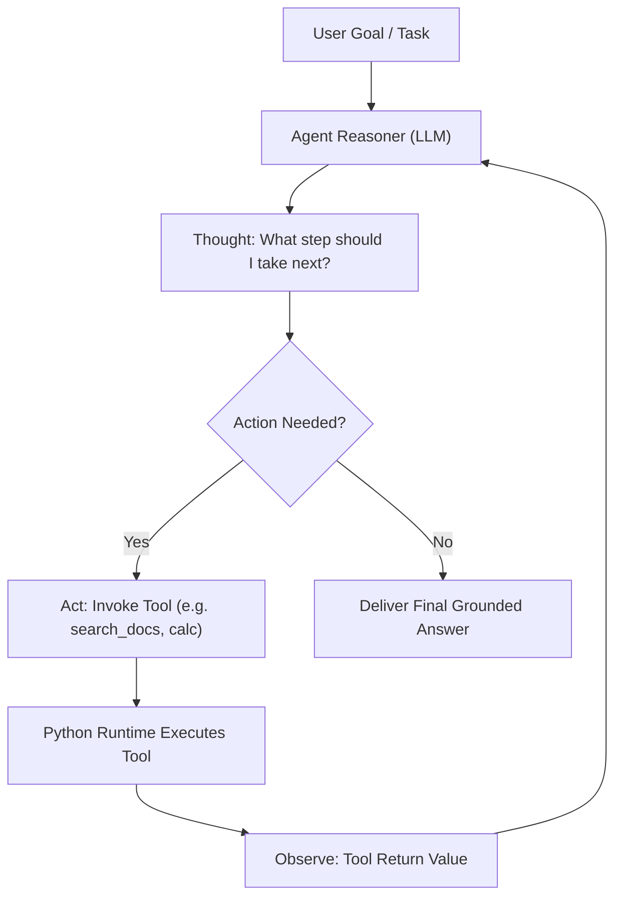

import { Callout } from 'fumadocs-ui/components/callout';
import { Tabs, Tab } from 'fumadocs-ui/components/tabs';

While RAG gives language models access to passive knowledge, **AI Agents** grant them agency: the ability to take actions, interact with external systems (APIs, databases, bash commands), inspect the results, and dynamically adjust their strategy.

---

## 1. The ReAct Architecture: Reason $\rightarrow$ Act $\rightarrow$ Observe

The foundational framework behind modern agents is **ReAct (Reasoning and Acting)**:



At each turn, the agent:
1. **Reasons** about its current state and what missing information it needs.
2. **Acts** by emitting a structured tool call.
3. **Observes** the output produced by the host Python runtime.
4. Repeats until the task is complete.

---

## 2. Converting Python Functions into Tool Schemas

To allow an LLM to call a Python function, the model needs to know:
- The function name.
- What it does (description).
- The parameter names, types, and descriptions.

In Python, we can generate this schema automatically using type hints and docstrings:

```python
import inspect
from typing import Any, Callable, Dict, get_type_hints

def get_tool_schema(func: Callable) -> Dict[str, Any]:
    """Generates an OpenAI/Gemini compatible tool definition from a Python function."""
    sig = inspect.signature(func)
    type_hints = get_type_hints(func)
    
    properties = {}
    required = []

    type_mapping = {
        str: "string",
        int: "integer",
        float: "number",
        bool: "boolean",
        list: "array",
        dict: "object"
    }

    for param_name, param in sig.parameters.items():
        param_type = type_hints.get(param_name, str)
        json_type = type_mapping.get(param_type, "string")
        
        properties[param_name] = {
            "type": json_type,
            "description": f"Parameter: {param_name}"
        }
        
        if param.default == inspect.Parameter.empty:
            required.append(param_name)

    return {
        "type": "function",
        "function": {
            "name": func.__name__,
            "description": func.__doc__.strip() if func.__doc__ else "",
            "parameters": {
                "type": "object",
                "properties": properties,
                "required": required
            }
        }
    }
```

---

## 3. Defining Real Python Tools

```python
import math

def calculate_expression(expression: str) -> str:
    """Evaluates a safe mathematical expression in Python."""
    allowed_names = {"sqrt": math.sqrt, "pi": math.pi, "sin": math.sin, "cos": math.cos}
    try:
        # Evaluates safely without builtins
        result = eval(expression, {"__builtins__": {}}, allowed_names)
        return str(result)
    except Exception as e:
        return f"Calculation error: {e}"

def search_weather(city: str) -> str:
    """Retrieves current simulated weather conditions for a given city."""
    weather_data = {
        "london": "14°C, Overcast with light drizzle",
        "tokyo": "22°C, Clear skies and sunny",
        "san francisco": "17°C, Morning coastal fog"
    }
    return weather_data.get(city.lower(), f"Weather data unavailable for '{city}'.")
```

---

## 4. Building the Agent Execution Loop

Here is a pure Python implementation of an agent execution controller:

```python
import json
from dataclasses import dataclass, field
from typing import Any, Callable, Dict, List

@dataclass
class AgentState:
    messages: List[Dict[str, Any]] = field(default_factory=list)
    max_steps: int = 6
    step_count: int = 0

class ToolRegistry:
    def __init__(self):
        self.tools: Dict[str, Callable] = {}
        self.schemas: List[Dict[str, Any]] = []

    def register(self, func: Callable):
        self.tools[func.__name__] = func
        self.schemas.append(get_tool_schema(func))

    def execute(self, name: str, arguments: Dict[str, Any]) -> str:
        if name not in self.tools:
            return f"Error: Tool '{name}' does not exist."
        try:
            result = self.tools[name](**arguments)
            return str(result)
        except Exception as e:
            return f"Error executing tool '{name}': {e}"

class AutonomousAgent:
    def __init__(self, registry: ToolRegistry):
        self.registry = registry

    def mock_llm_step(self, messages: List[Dict[str, Any]]) -> Dict[str, Any]:
        """
        Simulates an LLM step. In production, this calls:
        client.chat.completions.create(messages=messages, tools=self.registry.schemas)
        """
        last_message = messages[-1]
        
        # Simulated agent reasoning based on conversation state
        if "weather in Tokyo" in last_message.get("content", ""):
            return {
                "role": "assistant",
                "content": None,
                "tool_calls": [{
                    "id": "call_001",
                    "function": {"name": "search_weather", "arguments": json.dumps({"city": "Tokyo"})}
                }]
            }
        elif last_message.get("role") == "tool":
            return {
                "role": "assistant",
                "content": f"Based on the tool report: {last_message['content']}. Let me know if you need more details!",
                "tool_calls": None
            }
        else:
            return {
                "role": "assistant",
                "content": "I am ready to help you with research and calculations.",
                "tool_calls": None
            }

    def run(self, user_goal: str) -> str:
        state = AgentState()
        state.messages.append({"role": "user", "content": user_goal})
        
        print(f"\n[Agent Initialized] Goal: '{user_goal}'")

        while state.step_count < state.max_steps:
            state.step_count += 1
            print(f"\n--- Step {state.step_count} ---")
            
            # 1. Reason: Consult LLM
            response = self.mock_llm_step(state.messages)
            state.messages.append(response)

            # Check if LLM requested tool execution
            tool_calls = response.get("tool_calls")
            if not tool_calls:
                # LLM finished and produced final answer
                print(f"[Agent Final Answer]: {response['content']}")
                return response["content"]

            # 2. Act: Execute each requested tool
            for call in tool_calls:
                fn_name = call["function"]["name"]
                args = json.loads(call["function"]["arguments"])
                print(f"[Agent Action] Executing: {fn_name}({args})")
                
                # 3. Observe: Tool execution
                observation = self.registry.execute(fn_name, args)
                print(f"[Observation] -> {observation}")
                
                # Feed observation back into conversation state
                state.messages.append({
                    "role": "tool",
                    "tool_call_id": call["id"],
                    "name": fn_name,
                    "content": observation
                })

        return "Agent stopped: Reached maximum step limit without concluding."

# Demonstration
registry = ToolRegistry()
registry.register(search_weather)
registry.register(calculate_expression)

agent = AutonomousAgent(registry)
final_result = agent.run("What is the current weather in Tokyo?")
```

<Callout type="info" title="Safety & Guardrails">
Always configure `max_steps` to protect against infinite loops, and sandbox tools that execute shell commands or code evaluation.
</Callout>
