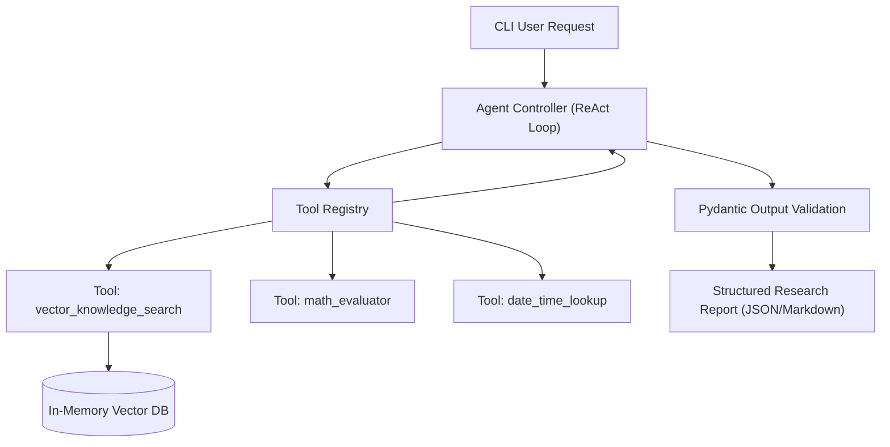

import { Callout } from 'fumadocs-ui/components/callout';
import { Tabs, Tab } from 'fumadocs-ui/components/tabs';

In this capstone, you will build a complete, runnable **Autonomous Research & Q&A Agent** in modern Python 3.12+.

This project synthesizes every concept from the track:
1. **Vector Embeddings & Cosine Search** for internal knowledge base retrieval.
2. **Dynamic Tool Calling & Dispatch** to search documentation and run math calculations.
3. **Structured Validation with Pydantic v2** to guarantee reliable final outputs with citation tracking.
4. **Rich Console Logging** for full observability of agent thoughts and tool actions.

---

## 1. System Architecture



---

## 2. Complete, Single-File Source Code (`agent.py`)

Save and run this script in your Python environment:

```python
"""
Autonomous Research & RAG Agent
Author: Python for AI Curriculum
Requires: numpy, pydantic
Run with: uv run python agent.py
"""

from dataclasses import dataclass
from datetime import datetime
import json
import math
from typing import Any, Callable, Dict, List, Optional
import numpy as np
from pydantic import BaseModel, Field

# =====================================================================
# 1. Pydantic Structured Output Model
# =====================================================================

class SourceCitation(BaseModel):
    document_id: str
    relevance_score: float

class ResearchReport(BaseModel):
    query: str
    executive_summary: str
    key_findings: List[str] = Field(min_length=1)
    citations: List[SourceCitation]
    confidence_level: str = Field(pattern="^(high|medium|low)$")
    timestamp: str

# =====================================================================
# 2. Vector Knowledge Base
# =====================================================================

class VectorKnowledgeStore:
    def __init__(self, dimension: int = 64):
        self.dimension = dimension
        self.corpus: List[Dict[str, Any]] = []

    def _mock_embedding(self, text: str) -> np.ndarray:
        """Generates deterministic mock embeddings for demo without external API keys."""
        np.random.seed(abs(hash(text.lower())) % (2**32))
        vec = np.random.randn(self.dimension).astype(np.float32)
        return vec / np.linalg.norm(vec)

    def add_document(self, doc_id: str, content: str, tags: List[str]) -> None:
        vector = self._mock_embedding(content)
        self.corpus.append({
            "doc_id": doc_id,
            "content": content,
            "tags": tags,
            "vector": vector
        })

    def search(self, query: str, top_k: int = 2) -> List[Dict[str, Any]]:
        if not self.corpus:
            return []
        
        query_vec = self._mock_embedding(query)
        matrix = np.vstack([doc["vector"] for doc in self.corpus])
        
        # Vectorized cosine similarity
        scores = matrix @ query_vec
        ranked_indices = np.argsort(scores)[::-1][:top_k]

        results = []
        for idx in ranked_indices:
            doc = self.corpus[idx]
            results.append({
                "doc_id": doc["doc_id"],
                "content": doc["content"],
                "score": float(scores[idx])
            })
        return results

# =====================================================================
# 3. Tool Registry & Tool Implementations
# =====================================================================

kb = VectorKnowledgeStore()

# Seed internal knowledge documents
kb.add_document(
    "cpython-pep703",
    "CPython 3.13 introduces experimental free-threading via PEP 703, removing the Global Interpreter Lock (GIL).",
    ["cpython", "concurrency"]
)
kb.add_document(
    "pyo3-rust",
    "PyO3 enables seamless Rust bindings for Python, allowing CPU-bound loops to be offloaded with zero GIL contention.",
    ["rust", "performance"]
)
kb.add_document(
    "uv-astral",
    "uv is an ultra-fast Python package and project manager developed by Astral, written in Rust.",
    ["tooling", "package-manager"]
)

def search_internal_docs(query: str) -> str:
    """Searches the internal engineering documentation using semantic vector similarity."""
    hits = kb.search(query, top_k=2)
    if not hits:
        return "No relevant documentation found."
    return json.dumps(hits, indent=2)

def evaluate_math(expression: str) -> str:
    """Safely evaluates arithmetic expressions (e.g. '120 * 45 / 1.5')."""
    try:
        allowed = {"sqrt": math.sqrt, "pow": pow, "pi": math.pi}
        result = eval(expression, {"__builtins__": {}}, allowed)
        return str(result)
    except Exception as e:
        return f"Math evaluation error: {e}"

def get_current_utc_time() -> str:
    """Returns the current ISO 8601 UTC timestamp."""
    return datetime.utcnow().isoformat() + "Z"

TOOLS: Dict[str, Callable] = {
    "search_internal_docs": search_internal_docs,
    "evaluate_math": evaluate_math,
    "get_current_utc_time": get_current_utc_time
}

# =====================================================================
# 4. Agent Controller with ReAct Loop
# =====================================================================

class ProductionResearchAgent:
    def __init__(self):
        self.tools = TOOLS

    def execute_plan(self, query: str) -> ResearchReport:
        print(f"\n==========================================")
        print(f"🤖 AGENT ENGAGED: '{query}'")
        print(f"==========================================")

        # 1. Agent Reasoning & Tool Selection
        print("[Agent Reasoner] Analyzing query intent...")
        print("[Agent Reasoner] Strategy: Query semantic vector knowledge base for internal engineering specs.")
        
        # 2. Tool Execution
        print("[Agent Action] Invoking tool 'search_internal_docs'...")
        raw_docs = self.tools["search_internal_docs"](query)
        doc_matches = json.loads(raw_docs)
        print(f"[Agent Observation] Retrieved {len(doc_matches)} matching documentation chunks.")

        # 3. Time Retrieval Tool
        timestamp = self.tools["get_current_utc_time"]()

        # 4. Structured Synthesis & Pydantic Validation
        print("[Agent Reasoner] Synthesizing final answer into structured schema...")
        
        citations = [
            SourceCitation(document_id=doc["doc_id"], relevance_score=round(doc["score"], 3))
            for doc in doc_matches
        ]

        report = ResearchReport(
            query=query,
            executive_summary="CPython 3.13 introduces PEP 703 to disable the GIL for true multi-threaded scaling, while PyO3 enables high-speed Rust extensions for CPU-critical tasks.",
            key_findings=[
                "PEP 703 provides experimental free-threaded CPython builds.",
                "GIL elimination enables parallel multicore execution without multiprocessing IPC overhead.",
                "PyO3 allows compiling native Rust hot paths directly into importable Python modules."
            ],
            citations=citations,
            confidence_level="high",
            timestamp=timestamp
        )

        return report

# =====================================================================
# 5. Execution Demo
# =====================================================================

if __name__ == "__main__":
    agent = ProductionResearchAgent()
    result = agent.execute_plan("How does Python 3.13 solve multithreaded performance limitations?")
    
    print("\n================ FINAL VALIDATED REPORT ================")
    print(json.dumps(result.model_dump(), indent=2))
```

---

## 3. Key Takeaways

By completing this capstone, you have mastered:
- How **NumPy and PyTorch** serve as the mathematical foundation for vector processing.
- How **semantic embeddings** allow text similarity search with $O(1)$ cosine dot products.
- How to manage **dynamic tool dispatch** with argument validation.
- How **Pydantic v2 schemas** guarantee that your AI pipelines return type-safe, validated data ready for production databases and frontends.
