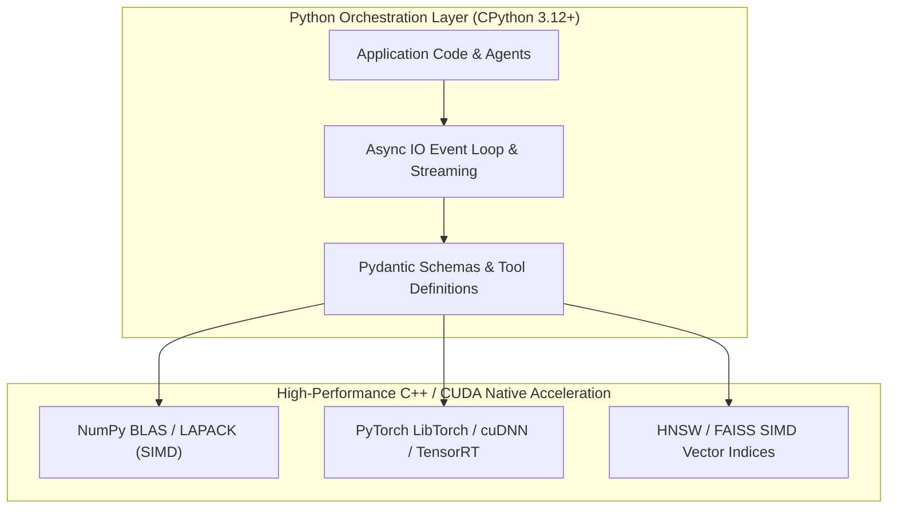

import { Callout } from 'fumadocs-ui/components/callout';
import { Tabs, Tab } from 'fumadocs-ui/components/tabs';
import { Steps, Step } from 'fumadocs-ui/components/steps';

Python is the undisputed lingua franca of artificial intelligence, deep learning, and modern language model engineering. From low-level C/CUDA accelerated tensor operations to high-level multi-agent workflows, Python serves as the universal orchestration plane.

This specialized track bridges core Python software engineering with modern AI systems engineering. Rather than treating AI as a magical black box, you will build core components from first principles: vectorized arrays, computational graphs, vector search indices, semantic chunkers, and autonomous tool-calling loops.

---

## Why Python Rules Modern AI

Many developers wonder why a dynamically typed, interpreted language with a Global Interpreter Lock (GIL) powers the most compute-intensive workloads in human history. The secret lies in Python's role as a **control plane**:



1. **Python as Glue Code**: Python defines high-level logic, interfaces, schemas, and pipelines, while heavy linear algebra is executed in compiled C, C++, and CUDA kernels running directly on the GPU/TPU.
2. **Buffer Protocol & Memory Sharing**: Python's native Buffer Protocol (`Py_buffer`) enables zero-copy sharing of memory buffers across C extensions and tensor runtimes.
3. **Ecosystem Velocity**: Every major AI breakthrough (Transformers, Diffusion, LoRA, FlashAttention, LangGraph, vLLM) releases first as a Python package.

---

## Track Structure & Learning Roadmap

This applied track is organized into focused architectural units:

<Steps>
<Step>
### 1. Vectorized Computing with NumPy
Master contiguous array layouts, strided memory representations, SIMD broadcasting, matrix multiplication (`@`), and cosine similarity calculations without slow Python loops.
</Step>

<Step>
### 2. Tensors & Automatic Differentiation (PyTorch)
Understand tensor memory layouts across devices (CPU, CUDA, MPS), dynamic computation graphs, reverse-mode automatic differentiation (`autograd`), and backpropagation from scratch.
</Step>

<Step>
### 3. Embeddings, Tokenization & Vector Search
Explore Byte-Pair Encoding (BPE), semantic high-dimensional vector spaces, distance metrics (Cosine, Euclidean L2, Inner Product), and implement a fast in-memory vector database with indexing.
</Step>

<Step>
### 4. LLM APIs, Async Streaming & Structured Outputs
Integrate with state-of-the-art model APIs using async generators, handle token rate limits with jittered exponential backoff, and enforce type-safe JSON extraction using Pydantic v2 schemas.
</Step>

<Step>
### 5. Retrieval-Augmented Generation (RAG) Architecture
Design document ingestion, recursive semantic chunking, embedding generation, dense vs lexical (BM25) hybrid retrieval, and prompt context synthesis.
</Step>

<Step>
### 6. AI Agents, Function Calling & Tool Execution
Build the ReAct loop (Reason $\rightarrow$ Act $\rightarrow$ Observe), translate Python functions into standard tool schemas, execute tool calls with parameter validation, and maintain multi-turn agent memory.
</Step>

<Step>
### 7. Applied Capstone: Production Research & RAG Agent
Assemble all concepts into a complete, standalone CLI agent that ingests documents, queries knowledge bases, invokes external web tools, and streams grounded analytical answers.
</Step>
</Steps>

---

## Toolchain & Environment Setup

To follow along with all code examples and projects in this track, initialize an isolated environment using **`uv`**:

<Tabs items={['uv (Recommended)', 'Standard venv']}>
<Tab value="uv (Recommended)">
```bash
# Initialize a new AI workspace
uv init python-ai-lab
cd python-ai-lab

# Pin Python 3.12
uv python pin 3.12

# Add foundational AI packages
uv add numpy pydantic httpx rich

# Add PyTorch (CPU-compatible by default, or with CUDA)
uv add torch --index-url https://download.pytorch.org/whl/cpu
```
</Tab>

<Tab value="Standard venv">
```bash
python -m venv .venv
source .venv/bin/activate  # On Windows: .venv\Scripts\activate

pip install numpy pydantic httpx rich torch
```
</Tab>
</Tabs>

<Callout type="info" title="Prerequisites">
Before diving into this track, you should be familiar with core Python syntax (functions, classes, dictionaries, and list comprehensions) covered in the Fundamentals and Intermediate sections.
</Callout>
