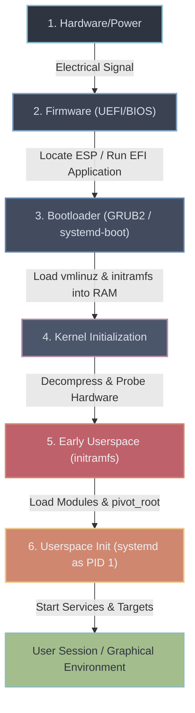
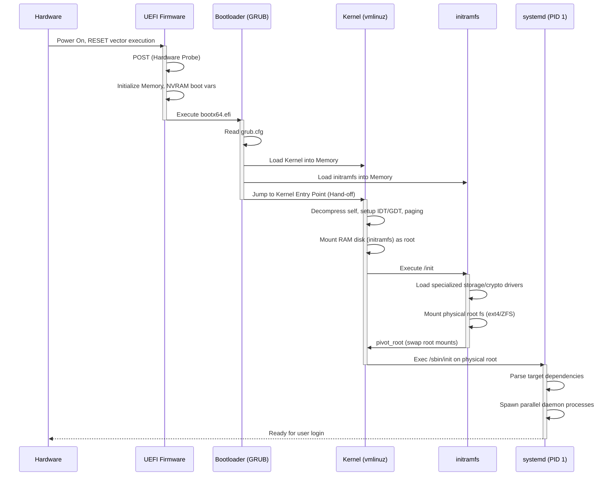

## The Silent Awakening: What Happens in the First 5 Seconds

Pressing the power button sets off one of the most complex, orchestrated, and universally misunderstood sequences in computing. At the moment power flows, the CPU is in an incredibly primitive state. It knows nothing about operating systems, filesystems, users, or applications. Silicon is effectively dead matter, a vast array of dormant logic gates awaiting instruction. The primary challenge of the boot process is bootstrapping: pulling a complex system up by its own bootstraps, transitioning from a completely uninitialized hardware state to a fully featured modern operating system capable of executing millions of tasks concurrently.

The real-world problem this abstraction solves is hardware heterogeneity and the "chicken-and-egg" storage problem. How does a CPU, which can only execute code from memory, load an operating system from a hard drive formatted with a complex filesystem (like ext4 or ZFS) when it doesn't yet have the drivers to understand that filesystem, nor the disk controller drivers to talk to the hardware? The answer lies in a staged hand-off, a relay race where each stage is slightly smarter than the last, tasked only with setting up the environment to load the next runner.

In this lesson, we will trace the exact path from the electrical signal of a power switch to the execution of `systemd` (PID 1), tearing down the layers of firmware, bootloaders, kernel decompression, and initial RAM filesystems that make a modern Linux environment possible.

---

## 1. The Six Stages of the Boot Chain

The journey from a cold CPU to a running user session can be divided into six distinct stages. Each stage has a single purpose: locate, load, and execute the next stage in the chain.



To understand the timing and interaction, let's look at the sequence of execution. Notice how control is permanently handed off at each stage until `init` takes over permanently.



---

## 2. Firmware Stage: Legacy BIOS vs Modern UEFI

When the CPU receives power, its instruction pointer (`RIP`) is hardwired to a specific physical address (the reset vector, typically `0xFFFFFFF0` on x86 architectures). This address maps to flash ROM containing the motherboard's firmware.

Historically, this firmware was the **BIOS (Basic Input/Output System)**. Today, it is almost universally **UEFI (Unified Extensible Firmware Interface)**.

### The Legacy BIOS Constraints
BIOS was designed in the IBM PC era and is deeply antiquated:
- **16-bit Real Mode:** The CPU starts in an unprotected 16-bit mode, capable of addressing only 1MB of memory.
- **MBR (Master Boot Record):** BIOS looks for the first sector (512 bytes) of a bootable drive. It executes whatever machine code is there.
- **Size Limits:** 512 bytes is too small for a modern bootloader. Thus, the MBR code is just a tiny jump instruction to slightly larger code tucked in the empty space between the MBR and the first partition.
- **Storage Limits:** MBR partition tables use 32-bit logical block addressing (LBA), capping maximum disk size at 2TB.

### The UEFI Revolution
UEFI is a complete overhaul of the boot process. Instead of blindly executing code from a disk sector, UEFI is a mini-operating system itself.
- **64-bit Protected Execution:** UEFI runs in 32-bit or 64-bit protected mode, capable of utilizing all system RAM.
- **GPT (GUID Partition Table):** Replaces MBR, supporting up to 128 partitions natively and theoretical disk sizes up to 9.4 Zettabytes.
- **ESP (EFI System Partition):** Instead of hiding boot code in unallocated sectors, UEFI mandates a standard FAT32 partition called the ESP. Bootloaders are just normal files (e.g., `\EFI\BOOT\BOOTX64.EFI`) residing on this filesystem, which the firmware natively knows how to read.
- **Secure Boot:** UEFI can verify cryptographic signatures of bootloader binaries against keys stored in motherboard NVRAM, preventing rootkits from hijacking the boot chain.

### POST (Power-On Self-Test)
Regardless of BIOS or UEFI, the firmware performs a POST. It probes the hardware bus (PCIe, USB) to detect RAM, CPU presence, keyboards, and disks. If a critical component like memory is missing, it halts and emits a sequence of beep codes. Once hardware is verified, the firmware queries its boot order variables and executes the configured EFI application (the bootloader).

---

## 3. The Bootloader: GRUB2 & systemd-boot

The operating system kernel is a massive binary (often >10MB) stored on a complex filesystem like ext4, Btrfs, or encrypted LVM. The motherboard firmware does not have drivers to read these filesystems. We need an intermediary: the bootloader.

### GRUB2 (Grand Unified Bootloader)
GRUB is the most ubiquitous Linux bootloader. Because of the legacy BIOS limitations, GRUB's architecture is historically multi-staged:
1. **Stage 1 (`boot.img`):** Fits in the 512-byte MBR or ESP. Its only job is to load Stage 1.5.
2. **Stage 1.5 (`core.img`):** Contains just enough filesystem drivers to read the partition where the rest of GRUB lives (e.g., `/boot`).
3. **Stage 2:** The full GRUB environment. It presents a graphical menu, reads the `/boot/grub/grub.cfg` configuration file, and loads the kernel.

In modern UEFI systems, Stage 1 and 1.5 are often combined into a single `.efi` application that the firmware launches directly, greatly simplifying the process.

### What the Bootloader Actually Does
The bootloader's ultimate job is three-fold:
1. Parse configuration to find the kernel file (`vmlinuz`) and the initial RAM disk (`initramfs.img` or `initrd`).
2. Load both files from disk into contiguous blocks of system RAM.
3. Pass a command-line string to the kernel and jump the CPU instruction pointer to the kernel's entry point in memory.

A typical kernel command-line parameter string looks like this:
```text
root=UUID=f4a3c2e1-... ro quiet splash console=tty1 init=/bin/systemd
```
- `root=`: Tells the kernel which physical disk partition contains the actual OS.
- `ro`: Mount it read-only initially (to allow `fsck` filesystem checks).
- `quiet splash`: Suppress verbose text output in favor of a loading screen.

---

## 4. Kernel Initialization & Early Userspace

When GRUB hands execution over to the kernel, the kernel takes control of the bare metal.

### Decompression and Architecture Setup
The kernel binary (`vmlinuz`, where `z` stands for compressed) is self-extracting. A tiny uncompressed header executes first, decompresses the rest of the kernel payload in memory, and jumps into it.
The kernel immediately performs low-level architecture initialization:
- **Page Tables:** Switches from physical memory addressing to virtual memory paging.
- **Interrupt Descriptor Table (IDT):** Sets up handlers for hardware interrupts and CPU exceptions.
- **Hardware Probing:** Reads ACPI (Advanced Configuration and Power Interface) tables and device trees provided by the firmware to discover physical hardware components.

### The initramfs: Solving the Chicken-and-Egg Problem
At this stage, the kernel is running, but it has a massive problem. To finish booting, it needs to mount the root filesystem (specified by `root=UUID=...`). However, the root filesystem might be:
- Formatted as XFS, requiring the `xfs.ko` kernel module.
- Living on an LVM (Logical Volume Manager) pool.
- Sitting on an NVMe drive requiring an advanced PCIe controller driver.
- Encrypted with LUKS (Linux Unified Key Setup), requiring a passphrase and crypto modules.

The kernel is designed to be modular. It doesn't compile every possible filesystem and disk driver into the core `vmlinuz` binary, as that would be monstrously huge. The modules are on the disk. But to read the disk, it needs the modules. Chicken, meet egg.

The solution is the **initramfs (Initial RAM File System)**. 

The bootloader loaded the `initramfs` archive into RAM alongside the kernel. The kernel mounts this RAM block as a temporary, volatile root filesystem (`/`). 

The initramfs is essentially a tiny, bare-bones Linux distribution living entirely in memory. It contains:
- Crucial kernel modules (disk controllers, filesystems, cryptography).
- Cryptsetup tools to prompt the user for a decryption password.
- LVM binaries to assemble logical volumes.

The kernel executes an `init` script located inside the initramfs. This script loads the necessary drivers, prompts for passwords if needed, and finally mounts the *real* physical root filesystem to a directory like `/new_root`.

### The Pivot
Once the real filesystem is mounted, the initramfs executes a crucial system call: `pivot_root`. This command atomically swaps the mount points. `/new_root` becomes the new `/`, and the temporary RAM filesystem is moved aside and unmounted, freeing the memory. The kernel is now running on the actual disk.

---

## 5. The Birth of Userspace: Launching PID 1

With the root filesystem mounted, the kernel's boot job is done. It now creates the very first user-space process. By convention, this process is assigned Process ID (PID) 1.

The kernel looks for an executable specified by the `init=` boot parameter (defaulting to `/sbin/init`). On modern Linux distributions, `/sbin/init` is a symlink to `/lib/systemd/systemd`.

### Why PID 1 is Special
PID 1 is the ancestor of all other processes on the system. It has unique privileges and responsibilities enforced by the kernel:
- **Signal Immunity:** It ignores signals it hasn't explicitly registered handlers for. You cannot accidentally `kill -9 1`.
- **The Reaper:** If a parent process dies before its child, the child becomes "orphaned." The kernel reparents orphaned processes to PID 1. PID 1 is responsible for calling `wait()` on these processes when they exit to reap their zombie states and free their PID numbers.

### Systemd Architecture
Before systemd, Linux used `SysVinit`, a system that ran bash scripts sequentially (start network, wait... start SSH, wait... start web server). This was incredibly slow.

Systemd modernized this by modeling the boot process as a dependency graph (DAG - Directed Acyclic Graph) of "units" and aggressively parallelizing them.

Systemd unit types include:
- **`.service`**: A daemon or process (e.g., `sshd.service`).
- **`.socket`**: An IPC or network socket.
- **`.target`**: A logical grouping of units, acting as synchronization milestones.

**Parallel Socket Activation:** 
Systemd achieves extreme boot speeds through socket activation. Instead of waiting for the network daemon and the database daemon to fully start before starting a web server, systemd immediately creates the listening sockets for all of them. It can spawn the web server process right away. When the web server tries to talk to the database socket, systemd buffers the request in the kernel until the database process actually wakes up and takes over the socket.

### Boot Targets
Systemd boots by attempting to reach a default target (defined by a symlink at `/etc/systemd/system/default.target`). The boot process flows through milestone targets:
1. `sysinit.target`: Early system initialization (mounting API filesystems like `/proc`, `/sys`).
2. `basic.target`: Basic system environment setup.
3. `multi-user.target`: Text-mode, multi-user environment (equivalent to runlevel 3). All network services, SSH, and databases are up.
4. `graphical.target`: Starts the display manager (GDM, LightDM) for GUI login.

---

## 6. Practical Investigation & Boot Optimization

As a systems engineer, you must know how to dissect and profile the boot process. Systemd provides built-in profiling tools.

### Analyzing Boot Time
To see exactly how long your system took to boot, run:
```bash
$ systemd-analyze
Startup finished in 3.421s (firmware) + 2.100s (loader) + 1.833s (kernel) + 4.901s (userspace) = 12.256s 
graphical.target reached after 4.888s in userspace
```
This breaks down the latency introduced by the firmware, bootloader, kernel, and userspace initialization.

### Finding the Bottlenecks
To find which specific services took the longest to start:
```bash
$ systemd-analyze blame
     3.120s NetworkManager-wait-online.service
     1.433s fwupd.service
      800ms systemd-logind.service
      450ms sshd.service
```
*Note: `NetworkManager-wait-online` is a classic boot-delay culprit in modern Linux.*

However, a service taking 3 seconds doesn't mean it delayed the boot by 3 seconds if it was running in parallel with other things. To see the critical path (the longest continuous chain of dependencies that actually delayed the final target):
```bash
$ systemd-analyze critical-chain
graphical.target @4.888s
└─multi-user.target @4.888s
  └─docker.service @3.200s +1.688s
    └─network-online.target @3.190s
      └─NetworkManager-wait-online.service @70ms +3.120s
```
Here, we can mathematically prove that Docker had to wait for the network to be online, which was the primary bottleneck delaying the graphical target.

### Inspecting Kernel Boot Logs
To view the kernel ring buffer logs for the current boot, which contains all the hardware probing and driver loading messages:
```bash
$ journalctl -k -b 0
# Or using the legacy command:
$ dmesg | head -n 20
```

### Checking Boot Parameters
To see the exact command-line arguments passed by GRUB to the currently running kernel:
```bash
$ cat /proc/cmdline
BOOT_IMAGE=/boot/vmlinuz-5.15.0-generic root=UUID=1234-5678 ro quiet splash
```

---

## 7. Real-World Mental Anchors

### The Obvious Case: Standard Server Boot
In a standard AWS EC2 instance, the bootloader uses standard ext4 drivers, loads a small initramfs, mounts the root disk, and systemd rapidly spawns `sshd` and `nginx`. The whole process takes milliseconds to a few seconds, relying on heavily optimized, stripped-down images.

### The Counter-Intuitive Case: Initramfs is a Whole OS
When you drop into an "emergency shell" because your system failed to boot (e.g., you mistyped a UUID in `/etc/fstab`), you are not running your installed OS. You are interacting with the tiny, busybox-powered Linux distribution living inside the `initramfs` loaded in RAM. It feels like a real system, but it's just the temporary scaffolding. 

### The Failure Mode: Kernel Panic - VFS: Unable to mount root fs
This is the most infamous boot error. It means stages 1 through 4 worked perfectly. The kernel loaded, and it decompressed. But it couldn't find or read the physical root disk. 
**Common causes:**
- You compiled a custom kernel but forgot to build in the NVMe storage driver, and didn't include it in the initramfs.
- The `root=UUID=...` parameter in GRUB points to a partition that was formatted or deleted.
- You didn't enter the LUKS decryption password in time.

---

## 8. ✕ What People Get Wrong

- **Myth:** *BIOS and UEFI are just different interfaces for the same thing.*
  **Reality:** They are fundamentally different execution environments. BIOS is a 16-bit real-mode blind jump. UEFI is a 64-bit pseudo-OS that understands FAT32 filesystems natively and enforces cryptographic trust chains.
- **Myth:** *The kernel mounts the hard drive directly upon booting.*
  **Reality:** Almost never. The kernel mounts a RAM disk (`initramfs`) first to load the specific dynamic modules required to understand how to read the complex physical hard drive.
- **Myth:** *Killing PID 1 will shut down the system cleanly.*
  **Reality:** A kernel panic ensues. If PID 1 dies unexpectedly, the kernel immediately halts the entire system, as the fundamental reaper and state-manager of the OS has collapsed.

---

## 9. Why This Matters

Understanding the boot process separates senior engineers from juniors when things go catastrophically wrong. 
- **Cloud Reliability:** When an autoscaling group spins up a new instance, boot latency directly impacts time-to-recovery (MTTR) during a spike. Engineers optimize the initramfs and systemd critical chains to achieve sub-second boot times for microVMs (like AWS Firecracker).
- **Security Engineering:** Secure Boot, TPM (Trusted Platform Module) PCR measurements, and LUKS encryption all intersect critically at the bootloader and initramfs stages. You cannot secure a system if you do not control its bootstrap sequence.
- **Bare Metal Debugging:** When a physical server in a datacenter won't come online, diagnosing whether it's failing at POST (hardware), GRUB (corrupted partition), or init (failing service dependency) dictates your entire incident response.

---

## Key Takeaways

1. **The Boot Chain is a Handoff:** Power triggers firmware, firmware loads the bootloader from the ESP, the bootloader loads the kernel and RAM disk into memory, the kernel mounts the real disk, and systemd spawns userspace.
2. **Initramfs solves the Chicken-and-Egg problem:** It provides a temporary RAM-based root filesystem containing the storage and crypto drivers necessary to read the actual physical disks.
3. **systemd parallelizes initialization:** By using socket activation and a dependency graph, PID 1 can spawn hundreds of services concurrently, drastically reducing boot times compared to legacy sequential scripts.

---

**Links to:** `[OS Architectures — Monolithic, Microkernel & Beyond](/docs/operating-system/01-foundations-and-architecture/02-os-architectures)`
