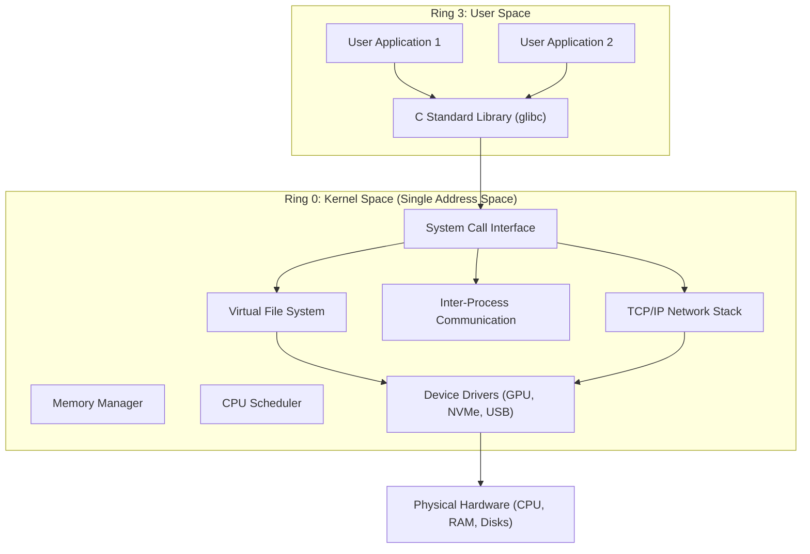
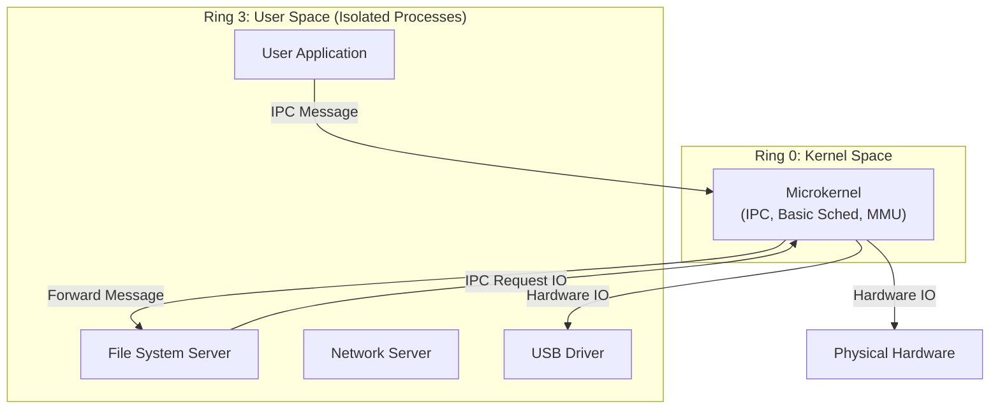

At the heart of every operating system lies a fundamental architectural question: **Where do we draw the line between privileged mode and user space?** When a system boots, the CPU switches into a privileged execution state (often called Ring 0), giving the code complete, unrestricted control over the hardware. The software running in this state is the kernel.

But what actually belongs in the kernel? Should the kernel handle only the absolute minimum required to keep the system running (CPU scheduling and memory management)? Or should it include everything needed for a complete system, including device drivers, network protocols, and file systems? This decision defines the operating system's architecture, dictating its performance, security, and resilience. 

In this masterclass, we will dissect the internal structures of modern operating systems, from the monolithic giants that power the internet to the hyper-secure microkernels that drive autonomous vehicles and spacecraft.

---

## 1. The Tanenbaum-Torvalds Debate (1992)

Before diving into the technical architectures, it's crucial to understand the historical fault line that defined them. In 1992, Andrew Tanenbaum (creator of the Minix microkernel and renowned computer scientist) and Linus Torvalds (creator of Linux) engaged in a famous Usenet debate.

Tanenbaum claimed that Linux's monolithic design was fundamentally obsolete, comparing it to a step backward into the 1970s. He argued that future operating systems must be microkernels to remain modular and reliable. Linus Torvalds defended his pragmatic monolithic approach, arguing that microkernels were too complex and theoretically elegant but practically slow.

The fundamental tradeoff they debated remains exactly the same today: **Raw performance and simplicity (Monolithic) vs. Modularity, isolation, and crash resilience (Microkernel).**

---

## 2. Monolithic Kernels (Linux, FreeBSD, Traditional Unix)

In a monolithic architecture, the entire operating system runs as a single large process in a single address space at Ring 0 (kernel mode).

### Architecture
Every major OS subsystem—the Virtual File System (VFS), the TCP/IP network stack, the CPU scheduler, memory management, and all device drivers—resides in this massive privileged blob. When user-space application code needs to open a file, it executes a system call, trapping into the kernel. The kernel handles the request entirely within its own address space and returns the result.

### The Good: Unbeatable Performance
Because all components share the same memory space, they can communicate via direct C function calls. There is **zero IPC (Inter-Process Communication) overhead** between kernel subsystems. If the network stack needs to write a packet to disk, it just passes a pointer to the VFS. This provides massive throughput, making monolithic kernels the undisputed champions of server workloads.

### The Bad: Catastrophic Failure Modes
The Achilles' heel of a monolith is its shared address space. Linux consists of over 30 million lines of C code. If a single pointer is dereferenced incorrectly in an obscure USB driver, the entire kernel memory is corrupted. The kernel has no choice but to halt the system immediately to prevent data loss—this is the dreaded **Kernel Panic**.

### Modern Mitigations
To maintain performance while mitigating rigidity and danger, modern monolithic kernels use:
1. **Loadable Kernel Modules (LKMs):** Drivers can be dynamically loaded/unloaded at runtime (e.g., `modprobe`), rather than requiring a kernel recompile, though they still run in Ring 0.
2. **eBPF (Extended Berkeley Packet Filter):** Allows running sandboxed user-defined programs directly in kernel space with mathematical proof of safety.
3. **Rust in Linux:** Introducing memory-safe languages into the Ring 0 codebase to eliminate buffer overflows and null pointer dereferences at compile time.

---

## 3. Microkernels (QNX, seL4, Minix 3, GNU Mach)

A microkernel takes the opposite approach: put the absolute minimum amount of code in Ring 0.

### Architecture
The microkernel handles only basic thread scheduling, minimal memory management (mapping physical pages), and a highly optimized IPC mechanism. Everything else—file systems, network stacks, and all device drivers—runs as standard, unprivileged user-space processes called "servers" or "daemons."

### The Good: Isolation and Verification
If the USB driver in a microkernel crashes, it does not take down the system. The kernel simply restarts the USB user-space process. This fault isolation is incredible. 
Furthermore, because the microkernel is so small (often under 10,000 lines of code), it can be **formally verified**. The `seL4` microkernel has mathematical proofs guaranteeing that it is immune to buffer overflows and execution of malicious code.

### The Bad: The IPC Penalty
To read a file in a microkernel:
1. App sends an IPC message to the VFS server (context switch).
2. VFS server processes it, sends IPC to the disk driver (context switch).
3. Disk driver talks to hardware, replies to VFS (context switch).
4. VFS replies to App (context switch).

This heavy reliance on message passing and context switching incurs a severe performance penalty compared to the single function call in a monolithic kernel.

### Real-World Dominance
While Linux won the datacenter, microkernels dominate mission-critical embedded systems. **QNX** runs the infotainment, ADAS, and engine control units in millions of modern cars. It also powers medical ventilators and industrial robotics. When human lives are on the line, isolation beats raw throughput.

---

## 4. Hybrid Kernels (Windows NT, macOS XNU)

Most commercial desktop operating systems are pragmatic compromises. They are designed with the elegant modularity of a microkernel but execute mostly in kernel space for performance.

### Architecture
- **macOS XNU:** At its core is a Mach microkernel, which handles IPC and scheduling. But bolted directly into the same Ring 0 address space is a monolithic BSD layer (for POSIX compliance and file systems) and the I/O Kit driver framework.
- **Windows NT:** Designed originally with microkernel principles, but to achieve acceptable UI performance in the 1990s, Microsoft moved the graphics subsystem (`win32k.sys`) and other critical components into Ring 0.

They are monolithic in execution (they can crash the whole system if a driver fails) but modular in design.

---

## 5. Radical Alternatives: Exokernels & Unikernels

As cloud computing scales, researchers push beyond traditional boundaries.

### Exokernels (Kernel Bypass)
Traditional OSes hide hardware behind abstractions (files, sockets). Exokernels argue this is too slow. An exokernel merely safely multiplexes hardware, forcing applications to link against customized "Library OSes" that talk directly to hardware. 
**Modern Impact:** While pure exokernels (like MIT Aegis) are academic, the *philosophy* is mainstream. **DPDK** (Data Plane Development Kit) allows user-space applications to bypass the Linux network stack and talk directly to NIC hardware, achieving microsecond latency for high-frequency trading.

### Unikernels (MirageOS, OSv)
In the cloud, we run one application per VM. Why run a massive Linux kernel that can support multiple users and GUIs? Unikernels compile a specific application (e.g., a Go web server) together with only the necessary OS libraries into a single, minimal, bootable machine image. 
They run in a single address space (Ring 0), dropping all internal security barriers because the hypervisor handles isolation. The result: images smaller than 10MB that boot in under 10 milliseconds. Perfect for serverless computing.

---

## 6. Master Comparison Matrix

| Architecture | Ring 0 Footprint | Fault Isolation | IPC Overhead | Driver Crash Impact | Prime Examples |
| :--- | :--- | :--- | :--- | :--- | :--- |
| **Monolithic** | Massive (All OS + Drivers) | Poor | Zero (direct calls) | System Panic / Reboot | Linux, FreeBSD |
| **Microkernel** | Minimal (< 10k lines) | Excellent | High (context switches) | Restarts driver process | QNX, seL4, Minix |
| **Hybrid** | Large (Core + Many subsystems) | Moderate | Low | System Panic (usually) | Windows NT, macOS XNU |
| **Unikernel** | Single App + Minimal Libs | N/A (Hypervisor isolation) | None | Instance Dies | MirageOS, OSv |

---

## 7. Real-World Mental Anchors

### The Obvious Case: Database Servers on Linux
PostgreSQL running on Linux leverages the monolithic kernel's fast VFS and direct shared memory. The lack of IPC overhead allows the database to process millions of transactions per second.

### The Counter-Intuitive Case: Why your car's brakes use QNX
You might assume a modern Tesla uses Linux for everything. While Linux often handles the non-critical infotainment screen, the actual driving systems (brakes, steering) run on QNX (a microkernel). If the bluetooth stack crashes, you do not want your anti-lock braking system to halt. QNX ensures that the braking process is entirely isolated from the rest of the OS.

### The Failure Mode: The 2024 CrowdStrike Outage
In July 2024, a faulty update to the CrowdStrike Falcon sensor (a `.sys` kernel driver on Windows) caused millions of Windows machines to blue-screen (BSOD). Because Windows is a hybrid/monolithic kernel where third-party security drivers must run in Ring 0 to monitor the system, a single null-pointer dereference in that driver took down entire airline and hospital IT infrastructures globally. This is the ultimate danger of non-microkernel designs.

---

## 8. ✕ What People Get Wrong

- **"Microkernels are dead because Linux won."** False. Microkernels run the world's most critical infrastructure (cars, routers, defense systems, smartcards). They just didn't win the generic server/desktop market.
- **"macOS is a purely monolithic Unix system."** False. It is heavily hybrid, built on the Mach microkernel core combined with FreeBSD code.
- **"Ring 0 means the OS is completely safe."** False. Ring 0 protects the OS from *user applications*. It does not protect the OS from *itself*. A bug in Ring 0 brings everything down.

---

## 9. Why This Matters

Systems engineers must understand OS architectures to debug deep performance anomalies and design resilient systems. When you configure DPDK for a high-frequency trading firm, you are applying exokernel principles to bypass the monolithic Linux network stack. When you architect a hyper-secure enclave for a defense contractor, you will reach for seL4. 

## Key Takeaways

1. **Monolithic kernels** prioritize raw performance by running everything in a shared kernel address space, risking total system failure if any component faults.
2. **Microkernels** prioritize isolation and reliability by running services in user space, trading performance (IPC overhead) for extreme fault tolerance.
3. **The line is blurring:** Modern monolithic kernels adopt microkernel traits (eBPF sandboxing), and microkernel ideas live on in kernel-bypass (DPDK/io_uring) and serverless unikernels.

---

**Next:** [The OS as a Layer of Abstraction](/docs/operating-system/01-foundations-and-architecture/03-os-abstraction)
