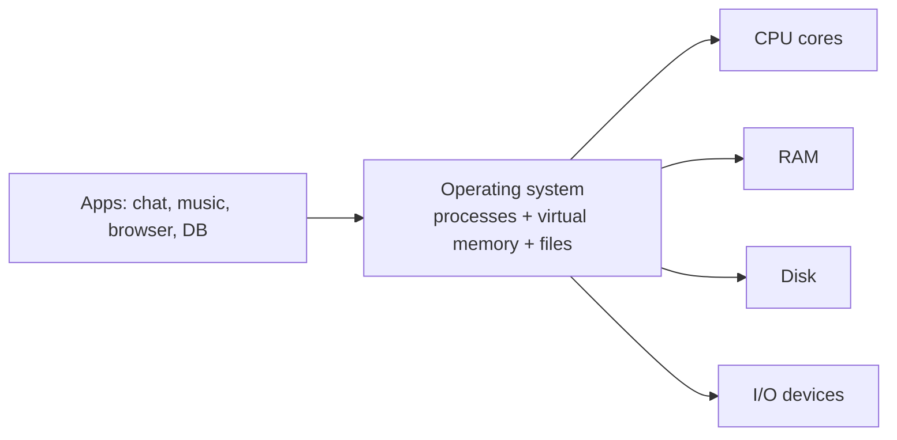
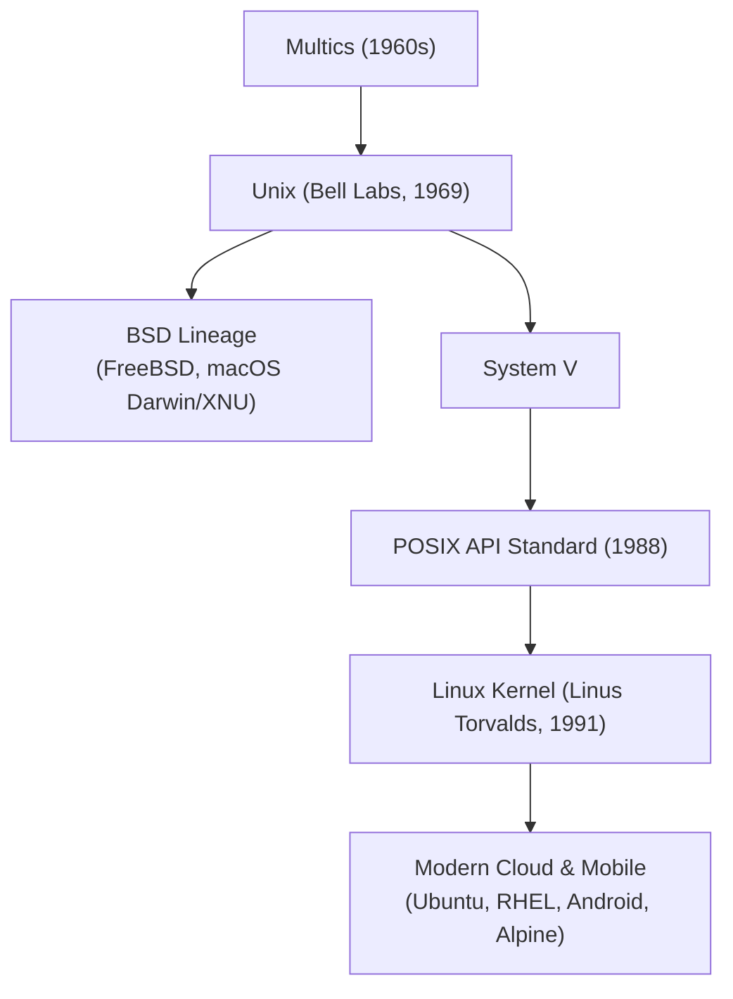

## The operating system sits between apps and hardware

An **operating system** is software that sits between your applications and physical hardware. Its job is to provide **abstractions** — clean, simplified models of reality — so application engineers don't worry about the messy details of sharing physical resources.

On your motherboard: a **CPU** (with multiple cores), **RAM** (working memory), and a **disk** (storage). You want to run a chat app, music player, database, browser, terminal, and video editor — all at once, on this one set of hardware.

Without an OS, every app would need to coordinate: "Hey music app, I'm using RAM 0–1000, you use 1001–2000." A malicious app could overwrite another's memory. The OS solves this with **processes** (each app thinks it has its own CPU and memory), **virtual memory** (each app thinks it owns all RAM), and **file systems** (clean data persistence).

Why not let programs talk to hardware directly? Three reasons: **(1) Isolation** — without abstractions, a buggy app could read passwords from another's memory or crash the system. **(2) Coordination** — if programs negotiated RAM manually, every program would need to know about every other. **(3) Portability** — abstractions let the same program run on different hardware.

## The hardware reality

1. **The CPU** — A chip with multiple cores. Each core executes one instruction stream at a time. The OS scheduler decides which process gets which core and for how long.
2. **The RAM** — A big pool of bytes. CPU reads/writes constantly. Fast but volatile. All running processes share physical RAM, but virtual memory makes each think it has private space.
3. **The Disk** — Slower than RAM, but persistent. Data is loaded into RAM before use. The OS provides file system abstractions to organize data into files and directories.
4. **I/O Devices** — Network cards, GPUs, keyboards, displays. All reached through the kernel via system calls, which abstract away device specifics.

*Figure 1.1 — One set of hardware, many apps. The OS virtualizes each resource so every app feels alone on the machine.*

## Types of operating systems

Over seven decades of computing, operating systems have evolved into distinct categories optimized for radically different operational constraints:

1. **Batch Operating Systems**: Common in early mainframes (IBM OS/360). Jobs with similar requirements were grouped into batches and processed sequentially without interactive human intervention. Optimized for maximizing CPU hardware utilization on massive batch computations.
2. **Time-Sharing (Multitasking) Systems**: Introduced by CTSS and Multics, then popularized by Unix. The CPU switches rapidly between multiple interactive users and processes via time-slicing, creating the illusion of dedicated simultaneous access. Modern desktop and server OSes (Linux, macOS, Windows) are direct descendants.
3. **Distributed Operating Systems**: Manage a collection of independent networked computers, presenting them to users as a single coherent system. The OS coordinates transparent task migration, distributed file systems, and remote memory sharing.
4. **Real-Time Operating Systems (RTOS)**: Systems with strict deterministic latency bounds (e.g. FreeRTOS, VxWorks, QNX). Divided into *Hard Real-Time* (missing a deadline is catastrophic, such as anti-lock brakes) and *Soft Real-Time* (missing a deadline degrades quality, such as audio playback).
5. **Embedded & Mobile Systems**: Constrained by battery life, limited RAM, and specialized touch/sensor peripherals (Android, iOS, Zephyr). Prioritize aggressive power management, background task throttling, and memory compression.

---

## The Unix philosophy and lineage

Modern software infrastructure runs overwhelmingly on descendants of the **Unix operating system**, designed at Bell Labs in 1969 by Ken Thompson and Dennis Ritchie:

The core Unix tenets remain the foundation of cloud computing:
- **Write programs that do one thing and do it well.**
- **Write programs to work together.**
- **Write programs to handle text streams, because that is a universal interface.**
- **Everything is a file (or file descriptor).**

---

## Examples

- **Obvious** — You're on Zoom, listening to Spotify, with 20 browser tabs, running Postgres. None knows the others exist. Each thinks it has its own CPU and RAM.
- **Counter-intuitive** — Real-time operating systems (pacemakers, spacecraft) sometimes *throw out* standard abstractions. Predictability matters more than fairness. A pacemaker can't wait 10ms for the scheduler.
- **Edge case** — Abstractions are not free. Process creation takes time. Context switching wastes CPU cycles. Virtual memory translation adds latency. The art of performance is knowing when these costs matter.

Visual analogy — A hotel. One building (hardware), private rooms (processes), shared services managed by staff (the kernel). Guests feel like they own the place; staff coordinate everything behind the scenes.

**✕ What people get wrong:** "Abstractions are free — they don't cost anything." Every abstraction has a cost. Process creation, context switches, and address translation all consume time.

**✕ What people get wrong:** "Since AI writes most code, engineers don't need OS internals." The biggest AI companies aggressively hire infrastructure experts. To build the systems AI runs on, you need humans who deeply understand the OS.

**Why this matters:** Every performance problem — slow app, high latency, memory leak, CPU spike — traces back to how your program interacts with OS abstractions. Skip this foundation and you'll guess forever.

Links to: **[The Process — Anatomy and Lifecycle](/docs/operating-system/01-foundations-and-architecture/04-process-anatomy)** (how the kernel represents a running program in memory).

