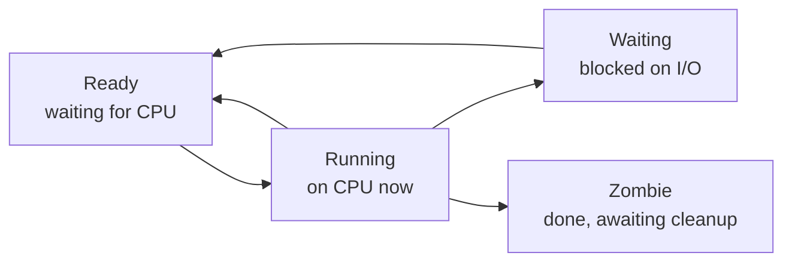

## One running program

A **process** is the OS abstraction for "one running program." When you launch your browser, the OS creates a process. When you run a Python script, that's a process. Nearly everything running on your computer is a process.

The genius: each program **pretends it has the entire computer to itself**. Your browser doesn't know Spotify is running. It doesn't know which RAM addresses are "safe." The process gives a clean illusion: "You have a CPU. You have memory. Go wild."

Behind the scenes, the OS decides which process runs on which core and for how long (**scheduler**), maps each process's "fake" addresses to real RAM (**virtual memory**), and tracks open files (**file descriptors**).

A **program** is a static file on disk. A **process** is a running instance. One program can have many processes. A program is the recipe; a process is the cake being baked.

## User address space

The private virtual memory where the program lives:

- **Executable (Code / Text Segment)** — The compiled program instructions loaded into memory. The actual machine code being executed — add, move, jump, load, store. Typically read-only.
- **Libraries** — Shared code libraries (like libc) loaded into the process address space. Multiple processes can share the same physical library pages to save memory.
- **Heap** — Dynamic memory allocations — objects, arrays, anything created with `malloc` / `new`. Grows upward. Can become fragmented. Programmer-managed lifetime.
- **User Stack** — Function call frames — local variables, return addresses, arguments. Grows downward. Auto-managed: grows when functions are called, shrinks when they return.

## Kernel context

The metadata the OS tracks for each process, kept in kernel memory:

- **PID, UID, and Metadata** — Process ID (unique identifier), User ID (who owns this process), timing info, resource usage, priority.
- **Kernel Stack** — A separate stack used when the process executes kernel code (during a system call). Each process has its own kernel stack.
- **File Descriptors** — Integer handles (`0`=stdin, `1`=stdout, `2`=stderr, then `3+`) for open files, sockets, pipes. The kernel tracks which fds each process has open.
- **Registers and CPU State** — Snapshot of CPU registers saved when the process isn't running. Required to resume execution via context switch.

## Stack vs heap

- **The Stack** — Function call frames. Grows/shrinks automatically as functions are called and return. Fast, structured, LIFO.
- **The Heap** — Dynamic allocations. Created with `malloc` or `new`. Can fragment. Slower, more flexible.

## Creating a process: fork() + exec()

1. **fork()** — Creates an *identical copy* of the calling process. The child gets a new PID but is otherwise a clone: same code, same memory, same open files.
2. **exec()** — Replaces the current process's program with a new one. Keeps PID and file descriptors, but replaces code, data, and heap.
3. **The pattern:** To launch a new program: `fork()` to clone yourself, then in the child call `exec()` to transform into the new program.

Like mitosis: one cell splits into two identical cells, then one differentiates into a new type. Modern OSes use **copy-on-write** — parent and child share physical pages until one writes. Only then is a copy made. `fork()` is extremely fast even for gigabyte processes.

## Process lifecycle

- **Ready** — Ready to run but waiting in the ready queue. When the scheduler picks it, it becomes Running.
- **Running** — Currently executing on a CPU core. Can be preempted back to Ready after its time slice, or block on I/O and go to Waiting.
- **Waiting (Blocked)** — Paused on disk read, network packet, lock, or timer. Cannot run until that event fires, then goes to Ready.
- **Zombie** — Finished via `exit()` but not yet reaped. The parent must call `wait()` to collect its exit status. Until then it retains its PID.

*Figure 2.1 — The four states a process cycles through under the scheduler.*

## Examples

- **Obvious** — Type `ls` in terminal: shell calls `fork()`, child calls `exec("ls")`. Shell waits, then shows the prompt again.
- **Counter-intuitive** — At boot the kernel creates a single **init process** (PID 1). *Every other process* descends from it via `fork()`. Killing PID 1 kills the system.
- **Edge case** — `fork()` does not duplicate all RAM byte-by-byte. Copy-on-write keeps the clone cheap until either side writes.

Visual analogy — A cell dividing. `fork()` + `exec()`: make a perfect clone, then the clone puts on a different uniform and becomes a different worker — but keeps your access badge.

**✕ What people get wrong:** "`Program` and `process` are interchangeable." A program is static on disk; a process is alive in memory.

**✕ What people get wrong:** "`fork()` copies all memory byte-by-byte." Copy-on-write shares pages until a write forces a copy.

**Why this matters:** Understanding process anatomy is the difference between "my app is slow" and "my heap is fragmented, causing allocator overhead, and I can prove it."

Links to: **[Processes vs Threads](/docs/operating-system/01-foundations-and-architecture/05-processes-vs-threads)** (can a process do multiple things at once? That's what threads are for).
