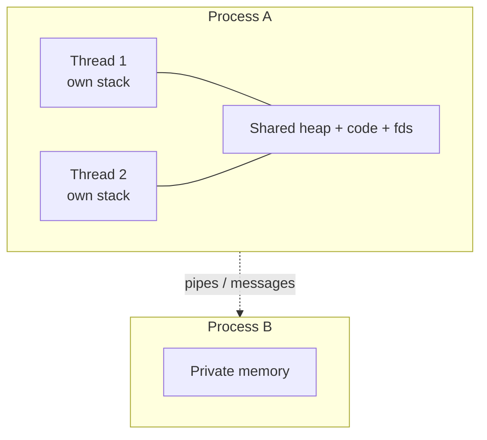

## Threads live inside processes

A **thread** is a unit of execution that lives *inside* a process. A process can have one thread (simple case) or many — two, ten, hundreds. Each thread has its own **program stack** (different point in code), but all threads share the same **virtual memory space** — same heap, same code, same open files.

Create a new process (`fork`), you get isolated copies of everything. Create a new thread, you get a new execution stream that shares memory. Threads are **lighter weight** — faster to create, faster to switch, less memory. But sharing memory means threads can step on each other's toes.

The choice is one of the most consequential architectural decisions. **Multi-process** (Chrome, one process per tab) prioritizes isolation. **Multi-threaded** (most web servers) prioritizes performance and easy data sharing, but requires careful synchronization.

Why are threads "lighter"? Switching between **processes** means swapping page tables, invalidating TLBs, swapping file descriptor tables. Expensive. Switching between **threads in the same process** — none of that changes. The OS only swaps the stack pointer, program counter, and registers. Much less work, much faster.

## The trade-off

**Multiprocess — Isolation:**

- Private memory per process
- Crash in one doesn't kill others
- Higher memory overhead
- Slower to create/switch
- Communication via pipes/messages

**Multi-threaded — Shared:**

- Threads share one memory space
- Crash in one kills whole process
- Low memory overhead
- Fast to create/switch
- Communication via shared variables (with locks!)

*Figure 3.1 — Threads share; processes isolate. Pick the failure domain you can afford.*

## Examples

- **Obvious** — Chrome uses **multiprocess**: each tab is its own process. If one tab crashes, others survive. Cost? More memory. Chrome accepts this trade because stability matters.
- **Counter-intuitive** — Redis is famously **single-threaded** for commands. You'd think this makes it slow — it's blazingly fast. Avoiding locks, cache misses, and context switches often beats naive parallelism.
- **Edge case** — Beyond the number of CPU cores, more threads often means *slower*. The OS wastes time context-switching, caches get thrashed, lock contention increases. Sweet spot: 1–2 threads per core for CPU-bound work.

Visual analogy — Workers in an office. Processes are separate companies — they communicate by mail. Threads are coworkers — they share the whiteboard and coffee machine, but each has their own desk. A process is a house; a thread is a roommate with a private bedroom and shared kitchen.

**✕ What people get wrong:** "More threads always means faster. If 4 threads are good, 40 are 10x better." Past core count, extra threads add switching, thrashing, and contention.

**Why this matters:** This decision shapes your entire system's reliability, performance, and complexity. Get it wrong: memory bloat (too many processes) or race-condition hell (too many threads).

Links to: **[User Mode, Kernel Mode and System Calls](/docs/operating-system/01-foundations-and-architecture/06-user-kernel-mode)** (both processes and threads reach hardware by crossing the **user/kernel boundary** via system calls).
