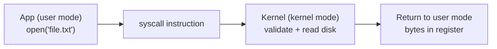
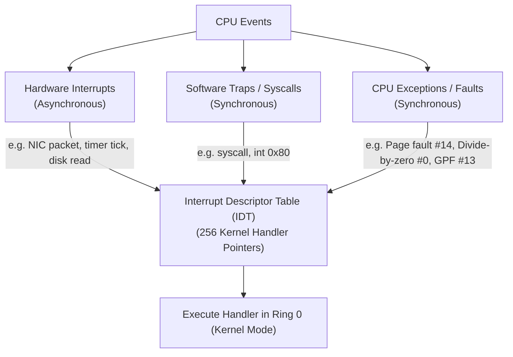

## Two privilege levels

Modern CPUs run code at different **privilege levels**. The key distinction: **user mode** (where apps run) and **kernel mode** (where the OS kernel runs). In user mode, code is restricted — can't directly access hardware, can't read arbitrary memory. In kernel mode, code can do anything.

This separation makes systems secure and stable. If your browser tries to read the password file, the CPU refuses. If your game crashes, it takes down only itself.

But apps *do* need privileged things: read files, send packets, allocate memory. They do this through **system calls** — controlled entry points into the kernel. The CPU switches to kernel mode, executes kernel code, switches back.

User code can't just pretend to be the kernel. The CPU enforces this in hardware. Special instructions (like `syscall` on x86) transition to kernel mode, but only jump to *kernel-defined entry points*. User code can't jump to arbitrary kernel addresses. The kernel registers handlers at boot; the CPU's privilege architecture enforces that only those specific entry points can escalate.

## How a system call works

1. **Application calls a wrapper** — e.g., `open("file.txt", O_RDONLY)` in your C library.
2. **Wrapper loads syscall number and args** into specific CPU registers.
3. **Wrapper executes `syscall` instruction** — triggers transition to kernel mode.
4. **CPU jumps to kernel's syscall handler** — a predefined entry point.
5. **Kernel executes the handler** with full privileges.
6. **Kernel writes result** to a register.
7. **CPU returns to user mode**, wrapper returns result to app.

*Figure 4.1 — Every file read, packet send, and allocation crosses this boundary and back.*

## Important system calls

**Process management:**

- `fork()` — create child process
- `exec()` — replace program
- `exit()` — terminate
- `wait()` — wait for child
- `kill()` — send signal

**File and I/O:**

- `open()` — open file, get fd
- `read()` — read from fd
- `write()` — write to fd
- `close()` — close fd
- `mmap()` — map file into memory

## Interrupts, traps & the Interrupt Descriptor Table (IDT)

How does the CPU actually switch from unprivileged Ring 3 to privileged Ring 0? The transition is driven by three distinct mechanisms:

1. **Hardware Interrupts (Asynchronous)**: Generated by physical devices (network card received a packet, timer tick expired, keyboard key pressed). The device asserts an interrupt line on the interrupt controller (APIC). The CPU halts the current user thread, saves execution state on the kernel stack, looks up the interrupt vector in the **Interrupt Descriptor Table (IDT)**, and runs the kernel's registered Interrupt Service Routine (ISR).
2. **Software Traps (Synchronous System Calls)**: Intentionally triggered by user code when requesting kernel services. On legacy 32-bit x86, programs executed `int 0x80`. Modern 64-bit x86-64 CPUs use dedicated, highly optimized silicon instructions: `syscall` and `sysret` (or `sysenter`/`sysexit` on Intel). These instructions bypass full IDT gate overhead by storing the kernel entry point directly in a Model-Specific Register (`MSR_LSTAR`).
3. **CPU Exceptions / Faults (Synchronous Errors)**: Raised directly by the CPU execution unit when an instruction violates architectural rules:
   - **Faults**: Recoverable exceptions (e.g. Page Fault #14 when accessing unmapped virtual memory). The kernel repairs the state (allocates RAM frame) and re-executes the exact same instruction.
   - **Traps**: Reported immediately after instruction execution (e.g. debugger breakpoint).
   - **Aborts**: Unrecoverable hardware errors (e.g. machine check, double fault #8). The kernel panics or terminates the offending process with `SIGSEGV`.

---

## Examples

- **Obvious — Reading a file:** When Python calls `open("data.csv").read()`, that's a syscall to the kernel, which reads from disk and returns bytes. Your code never touches the disk directly.
- **Counter-intuitive — Time:** Even getting the current time was a syscall. Modern systems use `vDSO` — a kernel-provided code page mapped into user space — so time can be read without a context switch. This optimization exists because reading time happens *so often*.
- **Edge case —** A function call takes nanoseconds. A syscall takes 1–10 microseconds — 1000x slower — because of the privilege switch, kernel-side validation, cache pollution, and return trip. High-performance code batches syscalls.

Visual analogy — A restaurant. You sit in the dining room (user mode) and can't enter the kitchen. When you want food, you ask the waiter (syscall). The waiter goes to the kitchen, gets food, brings it back.

**✕ What people get wrong:** "System calls are just regular function calls." Syscalls are *much* more expensive: privilege switch, validation, cache pollution, return trip.

**Why this matters:** Every file read, every network packet, every memory allocation crosses this boundary. If your hot loop makes thousands of syscalls, that's likely your bottleneck. Tools like `strace` exist to show you what syscalls your program makes.

Links to: **[CPU Scheduling — From MLFQ to EEVDF](/docs/operating-system/02-scheduling-and-concurrency/01-cpu-scheduling)** (how the kernel arbitrates the CPU among processes and threads).

