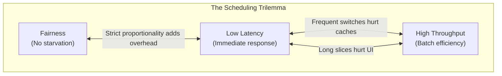
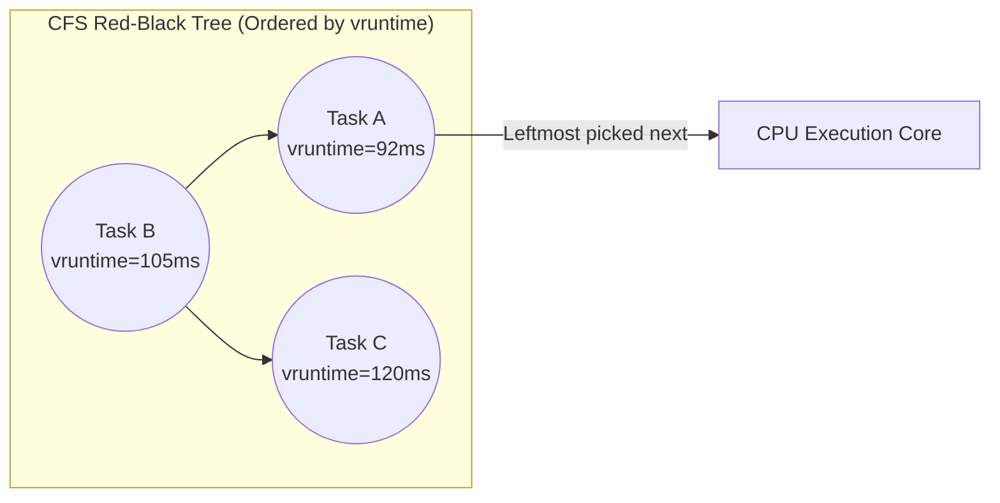
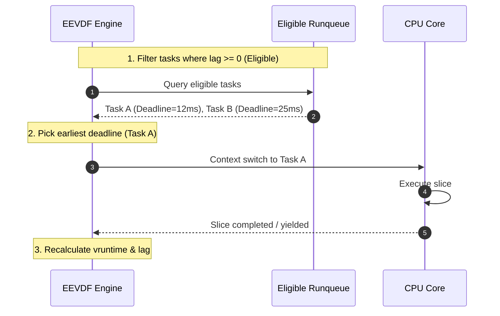

## The scheduler decides who gets the silicon

On a modern server or laptop, hundreds of processes and thousands of threads compete for a limited number of physical CPU cores. The **CPU scheduler** is the kernel component that decides which thread runs on which core, for how long, and when it must yield.

The scheduler balances three fundamentally competing objectives:
1. **Interactive Latency (Responsiveness)** — When you type in a terminal or move your mouse, the responsible thread must run immediately without noticeable delay.
2. **Throughput** — When compiling a large binary or running batch data pipelines, the CPU should spend maximum cycles executing user code rather than context-switching between tasks.
3. **Fairness** — No runnable process should starve, and resources should be distributed proportionally based on process priority (niceness).



---

## 1. Classical Foundations: From Round Robin to MLFQ

Early operating systems used naive approaches:
- **First-Come, First-Served (FIFO)**: Run tasks in order of arrival. Simple, but suffers from the *convoy effect* — a 10-second compute task blocks a 1-millisecond interactive task behind it.
- **Shortest Job First (SJF)**: Minimizes average waiting time, but requires knowing the future (how long a program will run), which is impossible for arbitrary programs (the Halting Problem).
- **Round-Robin (RR)**: Slices time into fixed quanta (e.g., 10ms). Every runnable task gets a turn. Fair, but poor for latency-sensitive tasks if the queue is long.

### The Multi-Level Feedback Queue (MLFQ)

To approximate Shortest Job First without knowing runtimes in advance, modern systems evolved the **Multi-Level Feedback Queue (MLFQ)**:
1. Multiple priority queues exist (Priority 1 = highest, Priority N = lowest).
2. When a job enters the system, it starts at the highest priority.
3. If a job uses up its entire time slice without yielding (CPU-bound), its priority is reduced by one level.
4. If a job voluntarily gives up the CPU before its slice expires (e.g., waiting for user keyboard input or disk I/O), it stays at the same high priority.
5. **Priority Boost**: Periodically, all jobs are moved back to the top queue to prevent starvation of low-priority tasks.

MLFQ learns a program's behavior dynamically: interactive I/O-bound tasks stay at high priority; background compute jobs sink to lower priority.

---

## 2. Linux CFS: The Completely Fair Scheduler

For over 15 years (Linux 2.6.23 to 6.5), the default Linux CPU scheduler was **CFS (Completely Fair Scheduler)**.

Instead of discrete priority queues, CFS models an "ideal multi-tasking CPU" where $N$ tasks run concurrently on $1/N$ of the CPU speed.

### Virtual Runtime (`vruntime`)
- Each task tracks its `vruntime` — the amount of execution time it has received, scaled inversely by its nice level (priority).
- High-priority tasks accumulate `vruntime` slowly; low-priority tasks accumulate `vruntime` quickly.
- CFS stores runnable tasks in a **Red-Black Tree** ordered by `vruntime`.
- The scheduler always picks the leftmost node (the task with the smallest `vruntime` — the one that has had the least CPU service).



### The CFS Latency Limitation
CFS guarantees long-term fairness, but it struggled with short-term latency. If an interactive thread woke up from sleeping, CFS had to use heuristics (`latency_target`, `min_granularity`) to estimate whether it could preempt a running batch thread without thrashing CPU caches.

---

## 3. The Modern Era: Linux 6.6+ EEVDF Scheduler

In Linux 6.6 (October 2023), the Linux kernel replaced CFS with **EEVDF (Earliest Eligible Virtual Deadline First)**, created by Peter Zijlstra based on Peter Hoon's 1995 theoretical paper.

EEVDF separates **fairness** from **latency** through two mathematical metrics:

### 1. Eligibility (Fairness)
A task is *eligible* to run if its accumulated runtime does not exceed what it was theoretically owed:

```
lag_i = V - vruntime_i
```

Where `V` is the average virtual time across the system. If `lag_i >= 0`, the task has had less than its fair share and is eligible to run. If `lag_i < 0`, it has consumed more than its share and must wait.

### 2. Virtual Deadline (Latency)
Each eligible task has a virtual deadline calculated from its requested time slice (`q`):

```
d_i = vruntime_i + (q_i / w_i)
```

Where `w_i` is the task's weight (nice level).

Tasks that declare small time slices (e.g., UI threads, audio threads, web servers handling fast requests) receive **earlier deadlines** and preempt tasks with longer deadlines — with mathematical guarantees rather than ad-hoc heuristics!



---

## 4. Real-Time Scheduling Classes

Standard general-purpose scheduling (EEVDF) is non-deterministic. When predictable timing is required (e.g., audio synthesis, robotic control, robotics, financial HFT), the kernel provides **POSIX Real-Time Policies**:

- **`SCHED_FIFO` (First In, First Out)**: Preempts any normal process immediately. Runs until it blocks on I/O or explicitly yields. Can monopolize the CPU.
- **`SCHED_RR` (Round Robin)**: Like `SCHED_FIFO`, but tasks of equal real-time priority share time via fixed time quanta.
- **`SCHED_DEADLINE`**: Implements Earliest Deadline First (EDF) with Constant Bandwidth Server (CBS). Each task specifies runtime, deadline, and period $(E, D, P)$. Guaranteed CPU time reservation.

---

## 5. Practical Investigation & Performance Tools

How to inspect and debug scheduling behavior in production:

### Inspect Process Scheduling Class & Priority
```bash
# View scheduling policy (SCHED_OTHER, SCHED_FIFO, etc.) and nice level
chrt -p <pid>

# Change process nice value (-20 highest priority, 19 lowest)
renice -n -5 -p <pid>

# Launch a process with real-time FIFO priority 50
chrt -f 50 ./low-latency-engine
```

### Profile Scheduling Latency with `perf`
```bash
# Record scheduling events for 5 seconds
perf sched record -- sleep 5

# Display scheduling latency report (time spent waiting on runqueue)
perf sched latency
```

### Inspect CFS / EEVDF Tunables
```bash
# Base scheduling slice in nanoseconds (Linux 6.6+)
cat /proc/sys/kernel/sched_base_slice_ns

# Per-process scheduling statistics (run time, wait time, switches)
cat /proc/<pid>/sched
```

---

## Examples & Mental Anchors

- **The Obvious Case**: A video encoder (100% CPU on 8 cores) and a code editor run simultaneously. The scheduler ensures keystrokes in the editor render instantly by granting it high eligibility and an immediate virtual deadline whenever input arrives.
- **The Counter-Intuitive Case**: Setting 100 threads on an 8-core CPU to "maximize throughput" actually *slows down* total processing. Each thread slice incurs cache misses, runqueue lock contention, and register save/restore cycles.
- **The Failure Mode — Priority Inversion**: A low-priority thread holds a lock. A high-priority thread needs the lock and blocks. A medium-priority thread preempts the low-priority thread because it has higher priority! Result: the high-priority task is indefinitely stalled. Solution: **Priority Inheritance** (the low-priority thread temporarily inherits the high priority until it releases the lock).

---

## Key Takeaways

1. **Scheduling is resource arbitration under constraints**: latency, throughput, and fairness always trade off against each other.
2. **CFS tracked past service** (`vruntime`), while modern **EEVDF schedules based on eligibility and virtual deadlines**, solving interactive latency lag.
3. **Know your tooling**: Use `perf sched latency` and `chrt` to diagnose threads starved of CPU execution.

---

Links to: **[Concurrency Primitives & Futexes](/docs/operating-system/02-scheduling-and-concurrency/02-concurrency-synchronization)** (how threads synchronize parallel execution with atomic CAS and futexes).

